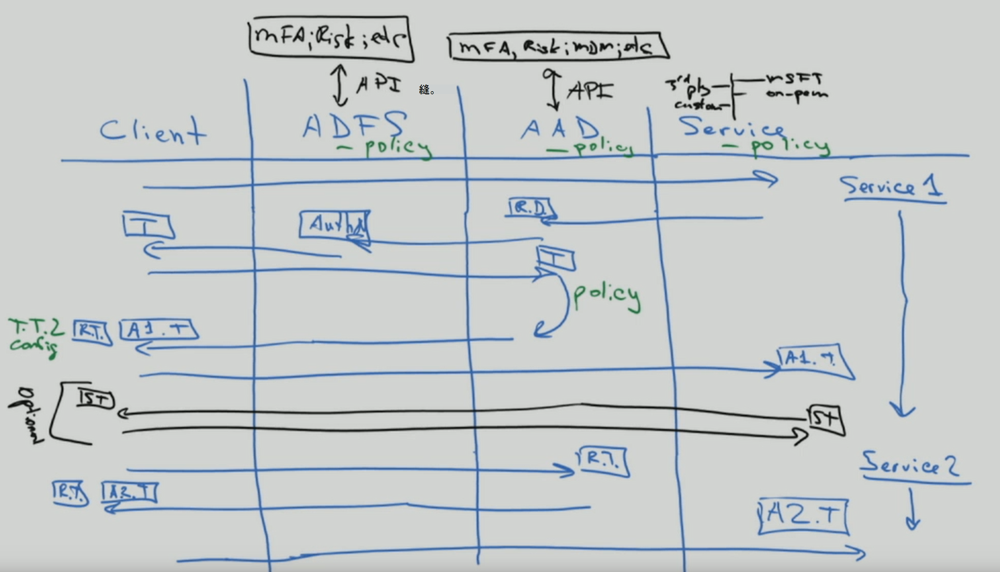

# 至身分識別和超過-一種架構師的視點

在本文中， [Alex Shteynberg](https://www.linkedin.com/in/alex-shteynberg/)，主要技術架構師 microsoft，討論採用 Microsoft 365 和其他 Microsoft 雲端服務之企業組織的熱門設計策略。

## 關於作者

我是位於紐約 [Microsoft 技術中心](https://www.microsoft.com/mtc?rtc=1)的主要技術架構師。 我主要使用大量的客戶和複雜的需求。 我的視點和觀點是以這些互動為基礎，而且可能不適用於每一種情況。 不過，在我的經驗中，如果我們可以協助客戶應對最複雜的難題，我們可以協助所有客戶。 

我一般每年可與100個以上的客戶合作。 雖然每個組織都有獨特的特性，但若要看到趨勢和 commonalities，會很有意義。 例如，一個趨勢是對許多客戶進行跨行業的興趣。 畢竟，銀行分公司也可以是咖啡店和社區中心。 

在我的角色中，我的重點是協助客戶取得最佳的技術解決方案，以解決其獨特的業務目標。 官方，我會專注于身分識別、安全性、隱私權和規範。 我喜歡這一事實，這是我們所做的一切。 這可讓我有機會與大多數專案相關聯。 這可讓我很忙碌，而且喜歡這種角色。 

我居住在紐約的城市 (最佳！ ) ，而且真的喜歡其文化、食物和人員的多樣性， (流量) 。 我喜歡在我的生命週期中看到大多數世界時，我會喜歡旅行。 我目前正在研究向非洲的旅行，以瞭解 wildlife。

## 指導原則 

- **簡單越好** ，您幾乎可以 (任何技術) 。 這並不表示您應該這樣做。 特別是在安全性空間中，許多客戶 overengineer 解決方案。 我喜歡從 Google 的 Stripe 會議到這一點的底線的 [影片](https://www.youtube.com/watch?v=SOQgABDSYZE) 。
- **人員、程式、技術** -- [設計人員](https://en.wikipedia.org/wiki/Human-centered_design) 可強化程式，而不是技術優先。 沒有「完美」解決方案。 我們需要權衡不同的風險因素和決策，對每個業務都是不同的。 太多客戶設計了使用者稍後可避免使用的方法。
- **重點是「為什麼 ' 第一筆和 ' 如何** 」是令人討厭的7年舊小孩，但有百萬個問題。 如果不知道所要求的問題，我們無法抵達正確答案。 許多客戶都對如何運作，而不是定義業務問題做一些假設。 永遠可以採取多個路徑。
- **過去的最佳作法的長結尾** ，可辨識最佳作法的變化速度很輕。 如果您已于3個月之前查看過 Azure AD，您很可能會過期。 每個專案在發佈後可能會變更。 目前的「最佳」選項可能不是從現在開始的六個月。

## 基準概念

請勿略過本節。 我經常會發現我必須逐步回復這些主題，即便是過去已使用雲端服務的客戶也是一樣的。
哎呀，語言不是準確的工具。 我們經常會使用相同的單字表示不同概念或不同的文字，表示相同的概念。 我經常使用下列圖表來建立某些基準術語和「階層模型」。
  

  

 

當您學習效能時，最好從集區中開始，而不是在海洋的中間。 我在此圖表中並未嘗試以技術方式精確。 這是一種可討論某些基本概念的模型。 

在此圖表中：
- 承租人 = Azure AD 的實例。 它位於階層的「最上層」，或是圖表中的層級1。 我們可以將此部分視為「[界限](https://docs.microsoft.com/azure/active-directory/users-groups-roles/licensing-directory-independence)」，以在 ([Azure AD B2B](https://docs.microsoft.com/azure/active-directory/b2b/what-is-b2b) 旁) 的其他專案。 所有 Microsoft enterprise 雲端服務都屬於其中一個承租人。 消費者服務是分開的。 "租使用者" 在檔中顯示為 Office 365 租使用者、Azure 租使用者、WVD 租使用者等等。我經常發現這些變化是對客戶造成混淆。
- 服務/訂閱、圖表中的層級2屬於一個且只有一個承租人。 大多數的 SaaS 服務都是1:1，而且不能移動而不進行遷移。 Azure 不同，您可以 [將帳單](https://docs.microsoft.com/azure/cost-management-billing/manage/billing-subscription-transfer) 和/或 [訂閱](https://docs.microsoft.com/azure/active-directory/fundamentals/active-directory-how-subscriptions-associated-directory) 移至其他租使用者。 有許多客戶需要移動 Azure 訂閱。 這具有各種暗示。 位於訂閱之外的物件 (例如，RBAC 和 Azure AD 物件（包括群組、應用程式、原則等等） ) 請勿移動。 此外，某些服務 (Azure 金鑰保存庫、資料磚塊等 ) 會以非正常運作的狀態進行移動。 若沒有良好的業務需求，請不要遷移服務。 有些可用於遷移的腳本 [在 GitHub 上](https://github.com/lwajswaj/azure-tenant-migration)都有共用。 
- 指定的服務通常具有一些「子層級」界限，或「層級 3 (L3) 。 這有助於瞭解安全性、原則、控管等方面的隔離。不幸的是，我知道沒有統一的名稱。 L3 的某些範例名稱包括： Azure 訂閱 = [resource](https://docs.microsoft.com/azure/azure-resource-manager/management/manage-resources-portal);Dynamics 365 CE = [instance](https://docs.microsoft.com/dynamics365/admin/new-instance-management);Power BI = [workspace](https://docs.microsoft.com/power-bi/service-create-the-new-workspaces);Power Apps = [環境](https://docs.microsoft.com/power-platform/admin/environments-overview);等。
- 層級4位於實際資料的所在位置。 這 ' 資料平面 ' 是一個複雜主題。 有些服務正在使用 Azure AD 進行 RBAC，有些則不是。 當我們取得委派主題時，我將討論這一點。

我發現許多客戶 (的其他一些概念，以及 Microsoft 員工) 不會混淆或有相關問題，包括下列各項：

- 任何人都可以免費[建立](https://docs.microsoft.com/azure/active-directory/fundamentals/active-directory-access-create-new-tenant)許多[承租人。](https://azure.microsoft.com/pricing/details/active-directory/) 您不需要在其中布建服務。 我有數十個。 每個租使用者名稱在 Microsoft 全球雲端服務中是獨一無二的 (也就是說，任何兩個承租人都不能有相同的名稱) 。 它們全都是 TenantName.onmicrosoft.com 的格式。 此外，還有一些程式會自動 ([未受管理的承租人](https://docs.microsoft.com/azure/active-directory/users-groups-roles/directory-self-service-signup)) 建立承租人。 例如，當使用者使用不存在於任何其他租使用者的電子郵件網域註冊企業服務時，就會發生這種情況。 
- 在受管理的承租人中，您可以在其中註冊許多 [DNS 網域](https://docs.microsoft.com/azure/active-directory/fundamentals/add-custom-domain) 。 這不會變更原始租使用者名稱。 目前沒有任何簡單的方法來重新命名租使用者 (，而不是遷移) 。 雖然租使用者名稱在技術上並不重要，但部分可能會發現這項限制。
- 您應為組織保留租使用者名稱，即使您尚未規劃部署任何服務也是一樣。 否則，任何人都可以從您取得它，而且沒有任何簡單的程式可讓它回到 (與 DNS 名稱) 相同的問題。 我經常聽到這種方式是由客戶聽到。 您的租使用者名稱應該也是辯論主題。
- 如果您擁有 DNS 命名空間 (s) ，您應該將這些 (全部新增至您的承租人 s) 。 否則，您可以使用此名稱建立 [未受](https://docs.microsoft.com/azure/active-directory/users-groups-roles/directory-self-service-signup) 管理的租使用者，這會導致中斷 [管理](https://docs.microsoft.com/azure/active-directory/users-groups-roles/domains-admin-takeover)。
- DNS 命名空間 (例如，contoso.com) 可以隸屬于一個且只有一個承租人。 這會對各種案例產生暗示 (例如，在合併或收購時共用電子郵件網域等 ) 有一種方式可以在不同的承租人中登錄 DNS 子 (，例如 div.contoso.com) ，但應避免這樣做。 在註冊最上層的功能變數名稱後，所有子域都會被視為屬於同一個承租人。 在多承租人案例中 (請參閱下列) 我一般會建議使用另一個頂層功能變數名稱 (例如，contoso.ch 或 ch-contoso.com) 。
- 誰應該「擁有」承租人？ 我經常會看到不知道誰目前擁有其租使用者的客戶。 這是一個紅色大旗標。 儘快撥打 Microsoft 支援服務。 當服務擁有者 (經常會指派 Exchange 管理員) 來管理租使用者時，就會發生問題。 租使用者將會包含您未來可能需要的所有服務。 租使用者擁有者應該是群組，可決定是否要啟用組織中的所有雲端服務。 另一個問題是當租使用者擁有者群組要求管理所有服務時。 這不是大型組織的規模。
- Sub/super 租使用者沒有任何概念。 由於某些原因，此 myth 會自行繼續重複。 這也適用于 [AZURE AD B2C](https://docs.microsoft.com/azure/active-directory-b2c/) 承租人。 我聽說過許多次：「我的 B2C 環境在我的 XYZ 租使用者中」或「如何將我的 Azure 租使用者移至我的 Office 365 租使用者？」
- 本檔主要側重于商業全球雲端，因為這是大多數客戶使用的情形。 在 [以及主權雲彩](https://docs.microsoft.com/azure/active-directory/develop/authentication-national-cloud)時，它有時候很有用。 以及主權雲彩有其他的意義，可討論這項討論的範圍以外的內容。

## 基準身分識別主題

有許多有關 Microsoft 身分識別平臺的檔– Azure Active Directory (Azure AD) 。 如果是剛開始的使用者，它通常會感覺很複雜。 在深入瞭解後，您就可以挑戰不斷的創新和變更。 在我的客戶互動中，我常常會發現自己在商業目標與「良好、更好」的 (處理方式之間，都是以「翻譯」為 cliff 的方式，以及這些主題所) 的人類「記事」。 您很少會有完美的答案，「正確」決定是各種風險因素的平衡。 以下是我往往與客戶討論的一些常見問題及混亂區域。

### Provisioning
Azure AD 無法解決身分識別世界中缺乏的控管！ 身分[識別](https://docs.microsoft.com/azure/active-directory/governance/identity-governance-overview)控管應該是與任何雲端決策無關的重要元素。 控管需求會隨著時間而變更，原因是它是一種程式，而不是工具。 

[AZURE AD Connect](https://docs.microsoft.com/azure/active-directory/hybrid/whatis-azure-ad-connect) 與 [Microsoft IDENTITY Manager](https://docs.microsoft.com/microsoft-identity-manager/microsoft-identity-manager-2016) (MIM) 與其他 (協力廠商或自訂) 的情況相同？ 將您的工作保留在現在和未來的許多麻煩，然後使用 Azure AD Connect。 此工具中的所有類型的 smarts 都是用來解決 peculiar 客戶設定和不斷創新的情況。 

有些 edge 案例可能會轉向更複雜的架構：
- 我有多個 AD 樹系，但兩者之間沒有網路連線。 有一個稱為 [Cloud](https://docs.microsoft.com/azure/active-directory/cloud-provisioning/what-is-cloud-provisioning)布建的新選項。
- 我沒有 Active Directory，也不需要安裝它。 Azure AD Connect 可以設定為從 LDAP (可能需要) [中的](https://docs.microsoft.com/azure/active-directory/hybrid/plan-hybrid-identity-design-considerations-tools-comparison) 夥伴進行同步處理。
- 我需要將相同物件布建至多個承租人。 這不是技術支援，但是取決於「相同」的定義。

我應該自訂預設同步處理規則 ([篩選物件](https://docs.microsoft.com/azure/active-directory/hybrid/how-to-connect-sync-configure-filtering)、 [變更屬性](https://docs.microsoft.com/azure/active-directory/hybrid/reference-connect-sync-attributes-synchronized)、 [替代登入識別碼](https://docs.microsoft.com/azure/active-directory/hybrid/plan-connect-userprincipalname)等 ) ？ 避免！ Identity 平臺的價值只是使用它的服務。 雖然您可以執行各種類型的 nutty 設定，但若要回答這個問題，您必須查看對應用程式的影響。 如果您篩選具有郵件功能的物件，則線上服務的 GAL 將不會完成;如果應用程式依賴特定屬性，篩選這些屬性將會產生不可預測的影響;等。不是身分識別小組決策。

XYZ SaaS 支援即時 (JIT) 布建，為何您需要同步處理？ 請參閱上述內容。 許多應用程式都需要 "profile" 資訊以取得功能。 若所有具有郵件功能的物件都無法使用，您就不能有 GAL。 同樣適用于與 Azure AD 整合的應用程式中的 [使用者](https://docs.microsoft.com/azure/active-directory/app-provisioning/user-provisioning) 布建。

### 驗證

[密碼雜湊同步](https://docs.microsoft.com/azure/active-directory/hybrid/how-to-connect-password-hash-synchronization) 處理 (PHS) 與 [透過驗證](https://docs.microsoft.com/azure/active-directory/hybrid/how-to-connect-pta-how-it-works) (PTA) 與 [同盟](https://docs.microsoft.com/azure/active-directory/hybrid/how-to-connect-fed-compatibility)。

通常會在同盟周圍 passionate [辯論](https://docs.microsoft.com/azure/active-directory/hybrid/choose-ad-authn) 。 更簡單通常會更好，因此請使用 PHS，除非您有很好的理由不這麼做。 您也可以為相同承租人中的不同 DNS 網域設定不同的驗證方法。 

有些客戶可以啟用同盟 + PHS，主要用於：
- 當同盟服務無法使用時，會 [切換回](https://docs.microsoft.com/azure/active-directory/hybrid/plan-migrate-adfs-password-hash-sync) (以進行嚴重損壞修復) 。
- 其他功能 (ex： [AZURE AD DS](https://docs.microsoft.com/azure/active-directory-domain-services/tutorial-configure-password-hash-sync)) 和安全性服務 (ex 的 [憑證](https://docs.microsoft.com/azure/active-directory/reports-monitoring/concept-risk-events#leaked-credentials)) 
- 支援 Azure 中的服務，但不了解同盟驗證 (ex： [Azure Files](https://docs.microsoft.com/azure/storage/files/storage-files-active-directory-overview)) 。

我經常透過用戶端驗證流程指導客戶，以澄清某些 misconceptions。 結果看起來就像下圖，這並不像是取得此目標的互動程式一樣好。

這種白板繪圖類型說明在驗證要求流程中套用安全性原則的位置。 在此範例中，會將透過 Active Directory Federation)  (Service 強制執行的原則套用至第一個服務要求，但不會套用到後續的服務要求。 這至少是盡可能將安全性控制移至雲端的一個原因。

只要我記得，我們就會追蹤 [單一登入](https://docs.microsoft.com/azure/active-directory/manage-apps/what-is-single-sign-on) (SSO) 的夢想。 有些客戶可以選擇「向右」同盟 (STS) 提供者來達成此目的。 Azure AD 可協助大幅 [啟用 SSO](https://docs.microsoft.com/azure/active-directory/manage-apps/plan-sso-deployment) 功能，但不會 magical STS。 許多 "舊版" 驗證方法仍用於重要的應用程式。 使用 [合作夥伴解決方案](https://docs.microsoft.com/azure/active-directory/saas-apps/tutorial-list) 擴充 Azure AD 可以處理許多案例。 SSO 是一種策略和旅程。 您無法取得，也不需要移至 [應用程式的標準](https://docs.microsoft.com/azure/active-directory/develop/v2-app-types)。 與本主題相關的是 [passwordless](https://docs.microsoft.com/azure/active-directory/authentication/concept-authentication-passwordless) 驗證的旅程，也沒有 magical 答案。 

現在有[多重要素驗證](https://docs.microsoft.com/azure/active-directory/authentication/concept-mfa-howitworks) (MFA)  ([這裡](https://techcommunity.microsoft.com/t5/azure-active-directory-identity/your-pa-word-doesn-t-matter/ba-p/731984)以取得更多) 。 新增至 it [使用者行為分析](https://docs.microsoft.com/azure/active-directory/authentication/tutorial-risk-based-sspr-mfa) ，而且您有一個解決方案，可防止大部分常見網路攻擊。 即便是消費者服務也會移至 [要求 MFA]。 不過，我仍然會與許多不想要移至 [新式驗證](https://docs.microsoft.com/microsoft-365/enterprise/hybrid-modern-auth-overview) 方法的客戶開會。 我聽到的最大引數是它會影響使用者和繼承應用程式。 有時候，良好的開端可能會協助客戶在 Exchange Online 中移動 [所宣告的變更](https://techcommunity.microsoft.com/t5/exchange-team-blog/basic-auth-and-exchange-online-february-2020-update/ba-p/1191282)。 現在有許多 Azure AD [報告](https://docs.microsoft.com/azure/active-directory/fundamentals/concept-fundamentals-block-legacy-authentication) 可協助客戶進行這項轉換。

### 授權

針對每個 [維琪百科](https://en.wikipedia.org/wiki/Authorization)，"to an" 是定義訪問原則。 許多人會將其看作是用來定義物件 (檔案、服務等 ) 的存取控制的功能。 在目前的網路威脅世界中，此概念會快速演變為動態原則，此原則會回應各種威脅，並快速調整存取控制，以回應這些威脅。 例如，如果我從不尋常的位置存取我的銀行帳戶，我會得到其他確認步驟。 若要解決此種情況，我們需要考慮原則本身，但不只是威脅偵測和信號關聯方法的體系。

Azure AD 的原則引擎是使用條件式 [存取原則](https://docs.microsoft.com/azure/active-directory/conditional-access/overview)來執行。 此系統依存于各種其他威脅偵測系統中的資訊，以進行動態決策。 簡單的視圖如下圖所示。

將所有這些信號結合在一起，可對類似下列的動態原則進行：
- 如果在您的裝置上偵測到威脅，您的資料存取權只會在沒有下載能力的情況下降至網頁。
- 如果您下載的是非常大量的資料，您下載的任何東西都會受到加密且受到限制。
- 如果您從未受管理的裝置存取服務，將會封鎖高機密資料，但允許存取未限制的資料，而不需要將它複製到另一個位置。

如果您同意此授權的已展開定義，則需要執行其他解決方案。 您所要執行的解決方案取決於您想要原則的動態程度，以及您想要設定優先順序的威脅。 這類系統的部分範例如下：
- [Azure AD Identity Protection](https://docs.microsoft.com/azure/active-directory/identity-protection/) 
- [適用於身分識別的 Microsoft Defender ](https://docs.microsoft.com/azure-advanced-threat-protection/)
- [適用於端點的 Microsoft Defender](https://docs.microsoft.com/windows/security/threat-protection/microsoft-defender-atp/microsoft-defender-advanced-threat-protection)
- [Microsoft Defender for Office 365](https://docs.microsoft.com/microsoft-365/security/office-365-security/office-365-atp?view=o365-worldwide)
- [Microsoft Cloud App Security](https://docs.microsoft.com/cloud-app-security/) (MCAS) 
- [Microsoft 365 Defender](https://docs.microsoft.com/microsoft-365/security/mtp/microsoft-threat-protection?view=o365-worldwide)
- [Microsoft Intune](https://docs.microsoft.com/mem/intune/)
- [Microsoft 資訊保護](https://docs.microsoft.com/microsoft-365/compliance/protect-information?view=o365-worldwide) (MIP) 
- [Azure Sentinel](https://docs.microsoft.com/azure/sentinel/) 

當然，除了 Azure AD 之外，各種服務和應用程式都有自己的特定授權模型。 這些將在稍後的「委派」區段中討論。

### 審計
Azure AD 具有詳細的 [審計及報告](https://docs.microsoft.com/azure/active-directory/reports-monitoring/) 功能。 不過，這通常不是作出安全性決定所需的唯一資訊來源。 請參閱「委派」區段中的更多討論。

## 沒有 Exchange

不要驚慌！ 這並不表示 Exchange 已被取代 (或 SharePoint 等，) 仍然是核心服務。 我的意思是，在目前的情況下，技術提供者已將使用者體驗轉變 (UX) 以包含多項服務的元件。 在 Microsoft 365 中，簡單的範例是「[新式附件](https://support.office.com/article/Attach-files-or-insert-pictures-in-Outlook-email-messages-BDFAFEF5-792A-42B1-9A7B-84512D7DE7FC)」，在這裡，電子郵件附件會儲存在 SharePoint 線上或商務 OneDrive 中。 

查看 Outlook 用戶端您可以在此體驗中看到許多「連線」的服務，而不只是 Exchange。 這包括 Azure AD、Microsoft 搜尋、應用程式、設定檔、合規性和 Office 365 群組。 

請閱讀 [Microsoft 流體架構](https://techcommunity.microsoft.com/t5/microsoft-365-blog/microsoft-ignite-blog-microsoft-fluid-framework-preview/ba-p/978268) ，以供預覽即將推出的功能。 在 [預覽] 中，我可以直接閱讀和回復 Outlook 中的團隊交談。 實際上， [小組用戶端](https://products.office.com/microsoft-teams/download-app) 是此策略的更明顯範例之一。 

總而言之，在 Office 365 與 Microsoft 雲端中的其他服務之間繪製清楚的線條變得越來越困難。 我將其視為對客戶而言非常重要，因為他們可以從總體創新受益于所有的創新，甚至是在使用一個元件時。 非常酷，對許多客戶的意義非常深遠。

今天，我發現許多客戶 IT 群組都是以「產品」為結構。 這是內部部署世界的邏輯，因為您需要每個特定產品的專家。 不過，當這些服務移至雲端時，我完全不需要再次調試 Active Directory 或 Exchange 資料庫。  () 雲端類型的自動化會移除某些重複的手動作業 (查看工廠) 所發生的情況。 不過，這些都是以更複雜的需求取代，以瞭解跨服務互動、影響、業務需求等等。如果您願意 [學習](https://docs.microsoft.com/learn/)，雲端轉換會有很大的機遇會啟用。 在您將技術轉入技術之前，我經常與客戶討論如何管理 IT 技能和小組結構的變更。

若要讓所有的 SharePoint 風扇-人員和開發人員，請停止詢問「如何在線上 SharePoint 中執行 XYZ？」。 使用 [Power](https://docs.microsoft.com/power-automate/) (（亦即工作流程的流程) ）是一種功能更為強大的平臺。 使用 [Azure Bot Framework](https://docs.microsoft.com/azure/bot-service/?view=azure-bot-service-4.0) 為您的有500000位專案清單建立更佳的 UX。 開始使用 [Microsoft Graph](https://developer.microsoft.com/graph/) ，而不是 CSOM。 [Microsoft 小組](https://docs.microsoft.com/MicrosoftTeams/Teams-overview) 的 SharePoint，也包含更多。 我可以列出許多其他的範例。 這裡有一個極具魅力的宇宙。 開啟門後 [開始探索](https://docs.microsoft.com)。

其他常見影響是在 [規範] 區域中。 這種跨服務方式似乎完全混淆許多法規遵從性原則。 我持續看到組織，「我需要將所有電子郵件通訊記錄到 eDiscovery 系統。」 當電子郵件不再只是電子郵件，而是另一個服務的視窗時，這會是什麼意思？ Office 365 具有綜合的 [相容性](https://docs.microsoft.com/microsoft-365/compliance/)方法，但變更人員和程式通常會比技術困難許多。

還有許多其他人員和流程暗示。 在我的觀點中，這是一個重要且下方討論的區域。 在另一篇文章中可能會有更多。

## 租使用者結構選項

### 單一租使用者與多租使用者

一般說來，大多數客戶只應有一個實際執行租使用者。 有許多租使用者挑戰性的原因 (讓其可 [Bing 搜尋](https://www.bing.com/search?q=office%20365%20multiple%20tenants)) 或是閱讀本 [白皮書](https://aka.ms/multi-tenant-user)。 在同一時間，我使用的許多企業客戶都有另一個 (小型) 租使用者，供 IT 教學、測試及實驗之用。 使用 [Azure Lighthouse](https://azure.microsoft.com/services/azure-lighthouse/)進行跨承租人 azure 存取變得更簡單。 Office 365 和許多其他的 SaaS 服務對跨承租人案例有限制。 [AZURE AD B2B](https://docs.microsoft.com/azure/active-directory/b2b/what-is-b2b)案例中有許多考慮。

許多客戶會在合併和收購 (M&) 後，以多個生產承租人為結束，並想要進行整合。 目前不是簡單的，需要 Microsoft 諮詢服務 (MCS) 或是協力廠商軟體的合作夥伴。 在未來的多承租人客戶處理各種案例時，都有進行中的工程工作。 

有些客戶選擇使用一個以上的承租人。 這應該是一種非常小心的決策，而且幾乎不一定會有業務原因。 一些範例包含下列專案：
- 一種控股類型的公司結構，不需要在不同實體間輕鬆合作，也有強大的管理和其他隔離需求。
- 購買後，會進行商務決策，讓兩個實體彼此分開。
- 類比客戶的環境，而不會變更客戶的實際執行環境。 
- 開發客戶的軟體。

在這些多承租人案例中，客戶常常想要讓某些承租人的設定保持不變，或報告設定變更和 drifts。 這通常表示從手動變更變更為程式碼。 Microsoft Premiere 支援為以此公用 IP 為基礎的這些需求類型提供研討會： [https://Microsoft365dsc.com](https://Microsoft365dsc.com) 。

### 多地理位置 

若要 [多地理](https://docs.microsoft.com/microsoft-365/enterprise/microsoft-365-multi-geo) 位置或非多地理位置，這是問題。 使用 Office 365 多地理位置，您可以在您選擇符合 [資料派駐](https://docs.microsoft.com/microsoft-365/enterprise/o365-data-locations) 需求的地理位置中布建和儲存資料。 這項功能有許多 misconceptions。 請記住下列事項： 
- 它不會提供效能優點。 如果 [網路設計](https://aka.ms/office365networking) 不正確，它會使效能更糟。 讓裝置「關閉」至 Microsoft 網路，而不一定是您的資料。
- 這不是 [GDPR 規範](https://www.microsoft.com/trust-center/privacy/gdpr-overview)的解決方案。 GDPR 不會專注于資料主權或儲存位置。 另外還有其他的規範框架。
- 它不會解決管理委派 (請參閱下列) 或 [資訊障礙](https://docs.microsoft.com/microsoft-365/compliance/information-barriers)。
- 它與多租使用者不同，需要額外的 [使用者](https:/docs.microsoft.com/azure/active-directory/hybrid/how-to-connect-sync-feature-preferreddatalocation) 布建工作流程。
- 它不會 [將您的租使用者](https://docs.microsoft.com/microsoft-365/enterprise/moving-data-to-new-datacenter-geos) (Azure AD) 移至其他地理位置。 

## 委派管理

在大多數大型組織中，職責劃分和角色型存取控制 (RBAC) 是必要的現實。 我會在一段時間內繼續深表歉意。 這不只是一些客戶想要的。 客戶、法律、法規遵從性及其他需求有所不同，而且有時候是世界各地的衝突。 簡潔性和彈性通常是對方彼此相反的兩側。 別誤，我們可以在此進行更好的工作。 已 (，且會在一段時間後) 重大改進。 請造訪您當地的 [Microsoft 技術中心](https://www.microsoft.com/mtc) ，以使用符合您業務需求的模型，而不需閱讀379230檔！ 在這裡，我將重點放在您應考慮的專案，而不是這麼做的原因。 以下是五個不同的領域，可供您規劃，以及我遇到的一些常見問題。

### Azure AD 和 Microsoft 365 系統管理中心

[內建角色](https://docs.microsoft.com/azure/active-directory/users-groups-roles/directory-assign-admin-roles)的清單很長及不斷增加。 每個角色都是由群組在一起的角色許可權清單所組成，以允許執行特定動作。 您可以在每個角色內的「描述」索引標籤中查看這些許可權。 此外，您也可以在 Microsoft 365 系統管理中心中看到更多的人工可讀取版本。 無法修改內建角色的定義。 一般會將這些分為三個類別：

- **全域管理員** -這種「所有功能」角色應 [嚴格受到高度保護](https://docs.microsoft.com/microsoft-365/enterprise/protect-your-global-administrator-accounts) ，就像在其他系統中那樣。 一般建議包括：「沒有永久指派」和使用 Azure AD 特權身分識別管理 (PIM) ;強驗證;等。值得有意思的是，此角色不會讓您預設可以存取所有專案。 一般來說，我會發現對相容性存取和 Azure 存取的混淆，稍後會加以討論。 不過，此角色可永遠指派對租使用者中其他服務的存取權。 
- **特定服務管理員** -部分服務 (Exchange、SharePoint、Power BI 等等，) 使用 Azure AD 中的高層級管理角色。 這在所有服務上都不一致，以後還會討論更多服務特定角色。
- **運作** -針對特定作業 (來賓 inviter 等等 ) ，有一個長 (和不斷增加的角色) 清單。 根據客戶的需求，會定期新增更多內容。

您無法委派所有的專案 (雖然差距逐漸降低) ，也就是需要使用全域系統管理員角色的可能性。 應該考慮改為程式碼和自動化，而不是此角色的人員成員資格。

**附注** ： Microsoft 365 系統管理中心具有方便使用介面，但具有與 Azure AD 系統管理經驗相較之功能的子集。 這兩個入口網站都使用相同的 Azure AD 角色，因此變更也會在相同的位置發生。 提示：如果您想要讓身分識別管理具有焦點的系統管理員 UI 沒有所有 Azure 雜亂，請使用 [https://aad.portal.azure.com](https://aad.portal.azure.com) 。 

名稱中的內容為何？ 請勿從角色名稱進行假設。 語言不是非常精確的工具。 目標應該是定義在查看所需的角色之前必須委派的作業。 將其他人新增至「Security Reader」角色並不會讓他們看到各項安全性設定。 

建立 [自訂角色](https://docs.microsoft.com/azure/active-directory/users-groups-roles/roles-custom-overview) 的功能是常見的問題。 目前在 Azure AD 中的限制如下 () 但是會隨著時間而成長。 我認為這些功能適用于 Azure AD 中的函數，而且可能不會跨越) 以上所述階層模型 (。 當我處理「自訂」時，我趨向使用「簡單」的「我的主體」好。

另一個常見的問題是可將角色範圍限定為目錄子集的功能。 其中一個範例是「僅限歐盟使用者的「服務台管理員」。」 [管理單位](https://docs.microsoft.com/azure/active-directory/users-groups-roles/directory-administrative-units) (AU) 是用來解決此。 就像以上的，我認為這些功能適用于 Azure AD 中的函數，而且可能不會跨越「下」。 當然，某些角色對 (全域管理員、服務系統管理員等範圍沒有意義。 ) 

如今，如果您使用 [AZURE AD PIM](https://docs.microsoft.com/azure/active-directory/privileged-identity-management/)) ，所有這些角色都需要直接成員資格 (或動態指派。 這表示客戶必須直接在 Azure AD 中管理這些，而且無法以安全性群組成員資格為基礎。 我不是建立腳本來管理這些腳本，因為這需要使用較高的權限執行。 我一般會建議 API 與 Saviynt ServiceNow 等處理常式系統整合，或使用像是的夥伴管理工具。 這一段時間的工程設計工作可以繼續處理。

我已提及 [AZURE AD PIM](https://docs.microsoft.com/azure/active-directory/privileged-identity-management/) 一些時間。 有對應的 Microsoft Identity Manager (MIM) 特殊許可權 [存取管理](https://docs.microsoft.com/microsoft-identity-manager/pam/privileged-identity-management-for-active-directory-domain-services) (PAM) 解決方案，供內部部署控制項使用。 您也可能想要查看特殊的 [Access 工作站](https://docs.microsoft.com/windows-server/identity/securing-privileged-access/privileged-access-workstations) (PAWs) 和 [Azure AD 身分識別管理](https://docs.microsoft.com/azure/active-directory/governance/identity-governance-overview)。 此外，還有許多協力廠商工具可以啟用即時、充足且動態角色提升。 這通常是較大討論區的保護環境的一部分。 

[有時候案例] 若要將外部使用者新增至角色 (請參閱) 上的 [多承租人] 區段。 這只是正常運作。 [AZURE AD B2B](https://docs.microsoft.com/azure/active-directory/b2b/) 是另一個很有趣的主題，也就是在另一篇文章中向客戶尋求指導。

###  (SCC) 的安全性與合規性中心

[Office 365 Security & 合規性中心的許可權](https://docs.microsoft.com/microsoft-365/security/office-365-security/permissions-in-the-security-and-compliance-center) 是「角色群組」的集合，其中的「角色群組」和 Azure AD role 各不相同。 這可能會令人困惑，因為某些角色群組的名稱與 Azure AD role 相同 (例如，安全性讀取器) ，但它們可以具有不同的成員資格。 我喜歡使用 Azure AD 角色。 每個角色群組都是由一或多個「角色」所組成 (請參閱關於重複使用同一個單字的含義為何？ ) 和具有來自 Azure AD （即已啟用電子郵件的物件）的成員。 此外，您可以建立與角色同名的角色群組，該角色群組可能也可能不包含該角色 (避免) 混淆。

在某種意義上，這是 Exchange 角色群組模型的演變。 不過，Exchange Online 有其自己的 [角色群組管理](https://docs.microsoft.com/exchange/permissions-exo) 介面。 Exchange Online 中的某些角色群組會從 Azure AD 或安全性 & 合規性中心進行鎖定和管理，但其他使用者可能會有相同或類似的名稱，並在 Exchange Online 中管理 (新增至混淆) 。 建議您避免使用 Exchange Online 使用者介面，除非您需要 Exchange 管理的範圍。

您無法建立自訂角色。 角色是由 Microsoft 所建立的服務所定義，而且會隨著新服務引進而成長。 這在概念上與 Azure AD 中 [的應用程式所定義的角色](https://docs.microsoft.com/azure/active-directory/develop/howto-add-app-roles-in-azure-ad-apps) 類似。 啟用新的服務時，通常需要建立新的角色群組，以授與或委派對這些 (的存取權，例如，「 [內幕人員風險管理](https://docs.microsoft.com/microsoft-365/compliance/insider-risk-management-configure?view=o365-worldwide#step-1-required-enable-permissions-for-insider-risk-management) 」) 。

這些角色群組也需要直接成員資格，而且不能包含 Azure AD 群組。 不幸的是，目前 Azure AD PIM 不支援這些角色群組。 就像 Azure AD 角色一樣，我一般是透過 APIs 或像 Saviynt 或其他合作夥伴的控管產品來推薦這些內容。

安全性 & 合規性中心角色跨越 Microsoft 365，您無法將這些角色群組的範圍限定為環境的子集 (如您可以在 Azure AD) 中使用管理單位。 許多客戶會詢問其子委派的方式。 例如，「只為歐盟使用者建立 DLP 原則」。 現在，如果您在安全性 & 規範中心中有特定功能的許可權，您就具有承租人中此函數所涵蓋之所有專案的許可權。 不過，許多原則都具有將環境的子集作為目標的功能 (例如，「只有這些使用者才能使用這些 [標籤](https://docs.microsoft.com/microsoft-365/compliance/create-sensitivity-labels#publish-sensitivity-labels-by-creating-a-label-policy) 」 ) 。 適當的控管和通訊是一個重要的元件，以避免衝突。 有些客戶選擇以「設定為程式碼」的方式，來處理安全性 & 規範中心內的子委派。 某些特定服務支援子委派 (請參閱下列) 。 

值得注意的是，目前是透過安全性 & 合規性中心管理的控制項 (protection.office.com) 正在遷移至兩個不同的系統管理員入口網站： security.microsoft.com 和 compliance.microsoft.com。 變更是唯一的常數！

### 服務特有

如先前所述，許多客戶都想要取得更細微的委派模型。 常見範例：「管理僅限除法 X 使用者和位置的 XYZ 服務」 (或其他維度) 。 執行這項作業的能力取決於每個服務，且不會在服務和功能上保持一致。 此外，每個服務都可以有個別且唯一的 RBAC 模型。 除了討論上述所有 (都會完全) ，我會為每個服務新增相關的連結。 這不是完整清單，但會立即開始。

- **Exchange Online** - [https://docs.microsoft.com/exchange/permissions-exo/permissions-exo](https://docs.microsoft.com/exchange/permissions-exo/permissions-exo) 
- **線上 SharePoint** - [https://docs.microsoft.com/sharepoint/manage-site-collection-administrators](https://docs.microsoft.com/sharepoint/manage-site-collection-administrators) 
- **Microsoft 團隊**  - [https://docs.microsoft.com/microsoftteams/itadmin-readiness](https://docs.microsoft.com/microsoftteams/itadmin-readiness )
- **eDiscovery** - [https://docs.microsoft.com/microsoft-365/compliance/assign-ediscovery-permissions](https://docs.microsoft.com/microsoft-365/compliance/) 
  + **許可權篩選**  - [https://docs.microsoft.com/microsoft-365/compliance/permissions-filtering-for-content-search](https://docs.microsoft.com/microsoft-365/compliance/)
  + **規範界限**  - [https://docs.microsoft.com/microsoft-365/compliance/set-up-compliance-boundaries](https://docs.microsoft.com/microsoft-365/compliance/set-up-compliance-boundaries )
  + **Advanced eDiscovery**  - [https://docs.microsoft.com/microsoft-365/compliance/overview-ediscovery-20](https://docs.microsoft.com/microsoft-365/compliance/overview-ediscovery-20 )
- **Yammer** - [https://docs.microsoft.com/yammer/manage-yammer-users/manage-yammer-admins](https://docs.microsoft.com/yammer/manage-yammer-users/manage-yammer-admins) 
- **多地理位置** - [https://docs.microsoft.com/microsoft-365/enterprise/add-a-sharepoint-geo-admin](https://docs.microsoft.com/microsoft-365/enterprise/add-a-sharepoint-geo-admin) 
- **Dynamics 365** – [https://docs.microsoft.com/dynamics365/](https://docs.microsoft.com/dynamics365/)  
  附注：此連結是檔的根。 有多種服務類型與系統管理/委派模式中的變化。
- **電源平臺**  - [https://docs.microsoft.com/power-platform/admin/admin-documentation](https://docs.microsoft.com/power-platform/admin/admin-documentation )
  + **電源應用程式**  - [https://docs.microsoft.com/power-platform/admin/wp-security](https://docs.microsoft.com/power-platform/admin/wp-security )  
    附注：系統管理員/委派模式中有多種類型具有變化。
  + **自動功耗**  - [https://docs.microsoft.com/power-automate/environments-overview-admin](https://docs.microsoft.com/power-automate/environments-overview-admin )
  + **PowerBI**  - [https://docs.microsoft.com/power-bi/service-admin-governance](https://docs.microsoft.com/power-bi/service-admin-governance )  
附注：資料平臺安全性及委派 (Power BI 是元件) 是複雜區域。
- **MEM/Intune**  - [https://docs.microsoft.com/mem/intune/fundamentals/role-based-access-control](https://docs.microsoft.com/mem/intune/fundamentals/role-based-access-control )
- **Microsoft Defender For Endpoint**  - [https://docs.microsoft.com/windows/security/threat-protection/microsoft-defender-atp/user-roles](https://docs.microsoft.com/windows/security/threat-protection/microsoft-defender-atp/user-roles )
- **Microsoft 365 Defender** - [https://docs.microsoft.com/microsoft-365/security/mtp/mtp-permissions](https://docs.microsoft.com/microsoft-365/security/mtp/mtp-permissions)
- **Microsoft Cloud App Security** - [https://docs.microsoft.com/cloud-app-security/manage-admins](https://docs.microsoft.com/cloud-app-security/manage-admins)
- **資料流程**  - [https://docs.microsoft.com/stream/assign-administrator-user-role](https://docs.microsoft.com/stream/assign-administrator-user-role )
- **資訊障礙**  - [https://docs.microsoft.com/microsoft-365/compliance/information-barriers](https://docs.microsoft.com/microsoft-365/compliance/information-barriers )

針對 rest，在檔中搜尋是最近的工作 [https://docs.microsoft.com/](https://docs.microsoft.com/microsoft-365/compliance/information-barriers) 。 

### 活動記錄
Office 365 具有 [統一的審計記錄](https://docs.microsoft.com/microsoft-365/compliance/search-the-audit-log-in-security-and-compliance)。 這是非常 [詳細的記錄](https://docs.microsoft.com/office/office-365-management-api/office-365-management-activity-api-schema)，但不會在名稱中讀取太多。 您可能不會包含您需要的安全性和合規性需求的任何專案。 此外，有些客戶實際上對 [高級審計](https://docs.microsoft.com/microsoft-365/compliance/advanced-audit)非常感興趣。 

透過其他 API 所存取的 Microsoft 365 記錄範例包含下列專案：
- 與 Office 365 相關的[AZURE AD](https://docs.microsoft.com/azure/azure-monitor/platform/diagnostic-settings) (活動) 
- [Exchange 郵件追蹤](https://docs.microsoft.com/powershell/module/exchange/get-messagetrace)
- 上述威脅/UEBA 系統 (例如，Azure AD Identity Protection、Microsoft Cloud App Security、Microsoft Defender for Endpoint 等 ) 
- [Microsoft 資訊保護](https://docs.microsoft.com/microsoft-365/compliance/data-classification-activity-explorer?view=o365-worldwide)
- [適用於端點的 Microsoft Defender](https://docs.microsoft.com/windows/security/threat-protection/microsoft-defender-atp/api-power-bi)
- [Microsoft Graph](https://graph.microsoft.com)

請務必先識別安全性與合規性計畫所需的所有記錄來源。 另外請注意，不同的記錄會有不同的線上保留限制。 

從系統管理委派的角度來看，大部分 Microsoft 365 活動記錄檔都沒有內建的 RBAC 模型。 如果您有查看記錄的許可權，則可以查看其中的所有內容。 客戶需求的常見範例是：「我想要只查詢歐盟使用者的活動」 (或其他維度) 。 若要達到此需求，我們需要將記錄傳送至另一個服務。 在 Microsoft 雲端中，我們建議您將其轉移到 [Azure Sentinel](https://docs.microsoft.com/azure/sentinel/overview) 或 [記錄分析](https://docs.microsoft.com/azure/azure-monitor/learn/quick-create-workspace)。 

高層級圖表：

  

上圖代表將記錄傳送至事件 Hub 和/或 azure 存放區和/或 Azure 記錄分析的內建功能。 並非所有系統都包含此現成功能。 但是還有其他方法可將這些記錄傳送至相同的存放庫。 例如，請參閱 [使用 Azure Sentinel 保護您的小組](https://techcommunity.microsoft.com/t5/azure-sentinel/protecting-your-teams-with-azure-sentinel/ba-p/1265761)。

將所有記錄整合到一個儲存位置，包含額外的優點，例如跨相互關聯、自訂保留時間，以及支援 RBAC 模型等所需的資料擴充。一旦資料在此儲存系統中，您可以使用適當的 RBAC 模型，建立 PowerBI 的儀表板 (或其他類型的視覺化效果) 。

記錄檔不必僅導向一個位置。 將 Office 365 記錄整合至[POWER BI](https://docs.microsoft.com/microsoft-365/admin/usage-analytics/usage-analytics?view=o365-worldwide)中的[Microsoft Cloud App Security](https://docs.microsoft.com/cloud-app-security/connect-office-365-to-microsoft-cloud-app-security)或自訂 RBAC 模型可能也是有益的。 不同的存放庫具有不同的優點和受眾。

值得一提的是，在名為 [Microsoft 365 Defender](https://docs.microsoft.com/microsoft-365/security/mtp/microsoft-threat-protection?view=o365-worldwide)的服務中，有非常豐富的內建分析系統可供安全性、威脅、弱點等之用。

許多大型客戶想要將此記錄資料傳送至協力廠商系統 (例如，SIEM) 。 這種方式有不同的方法，但一般 [Azure 事件中樞](https://docs.microsoft.com/azure/azure-monitor/platform/stream-monitoring-data-event-hubs) 及 [圖形](https://docs.microsoft.com/graph/security-integration) 都是良好的起點。

### Azure 
我經常會詢問您是否有方式分隔 Azure AD、Azure 和 SaaS 之間的高許可權角色 (ex：全域管理員 for Office 365，但不是 Azure) 。  沒有。  如果需要完成管理分隔，則需要多承租人架構，但會增加大量的 [複雜性](https://aka.ms/multi-tenant-user) (請參閱上述) 。 所有這些服務都屬於相同的安全性/身分識別界限 (請參閱上述階層模型) 。  

務必要瞭解相同承租人中各項服務之間的關係。 我正在處理許多客戶，其使用 Azure、Office 365 和電源平臺 (，通常也是內部部署和協力廠商雲端服務) 。 一個常見的範例： 
-   我想要共同作業一組檔/影像/etc (Office 365) 
-   透過「 (電源平臺」的核准程式傳送每一個檔案) 
-   所有元件一經核准，請將它們組合成「統一可傳送作業」 (s)  (Azure) [Microsoft GRAPH API](https://docs.microsoft.com/azure/active-directory/develop/microsoft-graph-intro) 是您的最佳朋友。  不可能，但是設計跨越 [多個承租人](https://docs.microsoft.com/azure/active-directory/develop/single-and-multi-tenant-apps)的解決方案會變得很複雜。

Azure Role-Based 存取控制 (RBAC) 啟用 Azure 的微調存取管理。 使用 RBAC，您可以為使用者授予執行其工作所需的最少許可權，以管理對資源的存取。 此檔的詳細資訊超出範圍，但如需 RBAC 的詳細資訊，請參閱在 [Azure 中什麼是角色型存取控制 (RBAC) ？](https://docs.microsoft.com/azure/role-based-access-control/overview) RBAC 很重要，但只是 Azure 的控管考慮部分。 [雲端採用架構](https://docs.microsoft.com/azure/cloud-adoption-framework/govern/) 是一個極好的起點，可深入瞭解。 我喜歡我的朋友，Andres Ravinet 會逐步指導客戶決定方法的各個元件。 各種元素的高層級視圖 (，不像是取得實際客戶模型的程式) 類似如下：

如您在上圖看到的，許多其他服務應視為設計 (ex： [Azure 原則](https://docs.microsoft.com/azure/governance/policy/overview)、 [azure 藍圖](https://docs.microsoft.com/azure/governance/blueprints/overview)、 [管理群組](https://docs.microsoft.com/azure/governance/management-groups/)等 ) 

## 總結
以簡短摘要開始，結束時間超過預期。  我希望您現在可以深入瞭解如何為您的組織建立委派模型。  這種交談對客戶而言非常常見。 沒有任何一種可供每個人運作的模型。 在記錄我們跨客戶看到的常見模式之前，請先等待 Microsoft 工程的一些計畫改進專案。 同時，您可以與您的 Microsoft 帳戶小組合作，安排訪問最接近的 [Microsoft 技術中心](https://www.microsoft.com/mtc)。  請參閱！

