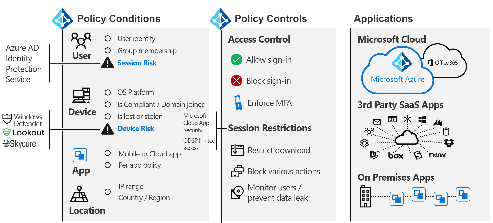

# 至身分識別和超過-一種架構師的視點To identity and beyond—One architect's viewpoint

在本文中， [Alex Shteynberg](https://www.linkedin.com/in/alex-shteynberg/)，主要技術架構師 microsoft，討論採用 Microsoft 365 和其他 Microsoft 雲端服務之企業組織的熱門設計策略。In this article, [Alex Shteynberg](https://www.linkedin.com/in/alex-shteynberg/), Principal Technical Architect at Microsoft, discusses top design strategies for enterprise organizations adopting Microsoft 365 and other Microsoft cloud services.

## 關於作者About the author

我是位於紐約 [Microsoft 技術中心](https://www.microsoft.com/mtc?rtc=1)的主要技術架構師。I'm a Principal Technical Architect at the New York [Microsoft Technology Center](https://www.microsoft.com/mtc?rtc=1). 我主要使用大量的客戶和複雜的需求。I mostly work with large customers and complex requirements. 我的視點和觀點是以這些互動為基礎，而且可能不適用於每一種情況。My viewpoint and opinions are based on these interactions and may not apply to every situation. 不過，在我的經驗中，如果我們可以協助客戶應對最複雜的難題，我們可以協助所有客戶。However, in my experience, if we can help customers with the most complex challenges, we can help all customers.

我一般每年可與100個以上的客戶合作。I typically work with 100+ customers each year. 雖然每個組織都有獨特的特性，但若要看到趨勢和 commonalities，會很有意義。While every organization has unique characteristics, it's interesting to see trends and commonalities. 例如，一個趨勢是對許多客戶的跨行業感興趣。For example, one trend is cross-industry interest for many customers. 畢竟，銀行分公司也可以是咖啡店和社區中心。After all, a bank branch can also be a coffee shop and a community center.

在我的角色中，我的重點是協助客戶取得最佳的技術解決方案，以解決其獨特的業務目標。In my role, I focus on helping customers arrive at the best technical solution to address their unique set of business goals. 官方，我會專注于身分識別、安全性、隱私權和規範。Officially, I focus on Identity, Security, Privacy, and Compliance. 我喜歡這一事實，這是我們所做的一切。I love the fact that these touch everything we do. 這可讓我有機會與大多數專案相關聯。It gives me an opportunity to be involved with most projects. 這可讓我很忙碌，而且喜歡這種角色。This keeps me quite busy and enjoying this role.

我居住在紐約的城市 (最佳！ ) ，而且真的喜歡其文化、食物和人員的多樣性， (流量) 。I live in New York City (the best!) and really enjoy the diversity of its culture, food, and people (not traffic). 我喜歡在我的生命週期中看到大多數世界時，我會喜歡旅行。I love to travel when I can and hope to see most of the world in my lifetime. 我目前正在研究向非洲的旅行，以瞭解 wildlife。I'm currently researching a trip to Africa to learn about wildlife.

## 指導原則Guiding principles

- **簡單的做法通常較好**：您可以 (幾乎) 任何技術的任何東西，但並不表示您應該這麼做。**Simple is often better**: You can do (almost) anything with technology, but it doesn't mean you should. 特別是在安全性空間中，許多客戶 overengineer 解決方案。Especially in the security space, many customers overengineer solutions. 我喜歡從 Google 的 Stripe 會議到這一點的底線的 [影片](https://www.youtube.com/watch?v=SOQgABDSYZE) 。I like [this video](https://www.youtube.com/watch?v=SOQgABDSYZE) from Google’s Stripe conference to underscore this point.
- **人員、程式、技術**： [設計人員](https://en.wikipedia.org/wiki/Human-centered_design) 可強化程式，而不是技術優先。**People, process, technology**: [Design for people](https://en.wikipedia.org/wiki/Human-centered_design) to enhance process, not tech first. 沒有「完美」解決方案。There are no "perfect" solutions. 我們需要權衡不同的風險因素和決策，對每個業務都是不同的。We need to balance various risk factors and decisions will be different for each business. 太多客戶設計了使用者稍後可避免使用的方法。Too many customers design an approach that their users later avoid.
- **重點是「為什麼 ' 第一及 ' 如何**」：是令人討厭的年舊孩子，但有百萬個問題。**Focus on 'why' first and 'how' later**: Be the annoying 7-yr old kid with a million questions. 如果不知道所要求的問題，我們無法抵達正確答案。We can't arrive at the right answer if we don't know the right questions to ask. 許多客戶都對如何運作，而不是定義業務問題做一些假設。Lots of customers make assumptions on how things need to work instead of defining the business problem. 永遠可以採取多個路徑。There are always multiple paths that can be taken.
- **過去的最佳作法的長結尾**：請承認最佳作法的變更速度很輕。**Long tail of past best practices**: Recognize that best practices are changing at light speed. 如果您已在超過3個月之前查看過 Azure AD，您很可能會過期。If you've looked at Azure AD more than three month ago, you are likely out of date. 每個專案在發佈後可能會變更。Everything here is subject to change after publication. 目前的「最佳」選項可能並非六個月。“Best” option today may not be the same six months from now.

## 基準概念Baseline concepts

請勿略過本節。Don't skip this section. 我經常會發現我必須逐步回復這些主題，即便是過去已使用雲端服務的客戶也是一樣的。I often find that I must step-back to these topics, even for customers who have been using cloud services for years.
唉，語言不是精確的工具。Alas, language isn't a precise tool. 我們經常會使用相同的單字表示不同概念或不同的文字，表示相同的概念。We quite often use the same word to mean different concepts or different words to mean the same concept. 我經常使用下列圖表來建立某些基準術語和「階層模型」。I often use this diagram below to establish some baseline terminology and "hierarchy model."
  

  

 

當您學習效能時，最好從集區中開始，而不是在海洋的中間。When you learn to swim it's better to start in the pool and not in the middle of the ocean. 我在此圖表中並未嘗試以技術方式精確。I'm not trying to be technically accurate with this diagram. 這是一種可討論某些基本概念的模型。It's a model to discuss some basic concepts.

在此圖表中：In the diagram:

- 承租人 = Azure AD 的實例。Tenant = an instance of Azure AD. 它位於階層的「最上層」，或是圖表中的層級1。It is at the "top" of a hierarchy, or Level 1 in the diagram. 我們可以將此部分視為「[界限](/azure/active-directory/users-groups-roles/licensing-directory-independence)」，以在 ([Azure AD B2B](/azure/active-directory/b2b/what-is-b2b) 旁) 的其他專案。We can consider this to be the "[boundary](/azure/active-directory/users-groups-roles/licensing-directory-independence)" where everything else occurs ([Azure AD B2B](/azure/active-directory/b2b/what-is-b2b) aside). 所有 Microsoft enterprise 雲端服務都屬於其中一個承租人。All Microsoft enterprise cloud services are part of one of these tenants. 消費者服務是分開的。Consumer services are separate. "租使用者" 在檔中顯示為 Office 365 租使用者、Azure 租使用者、WVD 租使用者等等。"Tenant" appears in documentation as Office 365 tenant, Azure tenant, WVD tenant, and so on. 我經常發現這些變化是對客戶造成混淆。I often find these variations cause confusion for customers.
- 服務/訂閱、圖表中的層級2屬於一個且只有一個承租人。Services/subscriptions, Level 2 in the diagram, belong to one and only one tenant. 大多數的 SaaS 服務都是1:1，而且不能移動而不進行遷移。Most SaaS services are 1:1 and can't move without migration. Azure 不同，您可以 [將帳單](/azure/cost-management-billing/manage/billing-subscription-transfer) 和/或 [訂閱](/azure/active-directory/fundamentals/active-directory-how-subscriptions-associated-directory) 移至其他租使用者。Azure is different, you can [move billing](/azure/cost-management-billing/manage/billing-subscription-transfer) and/or a [subscription](/azure/active-directory/fundamentals/active-directory-how-subscriptions-associated-directory) to another tenant. 有許多客戶需要移動 Azure 訂閱。There are many customers that need to move Azure subscriptions. 這具有各種意義。This has various implications. 位於訂閱以外的物件不會移動 (例如，以角色為基礎的存取控制或 Azure RBAC，以及 Azure AD 物件（包括群組、app、原則等等）) 。Objects that exist outside of the subscription do not move (for example, role-based access control, or Azure RBAC, and Azure AD objects including groups, apps, policies, and so on). 此外，有些服務 (例如 Azure 金鑰 Vault、資料磚塊等等) 。Also, some services  (such as Azure Key Vault, Data Bricks, and so on). 若沒有良好的業務需求，請不要遷移服務。Don't migrate services without a good business need. 有些可用於遷移的腳本 [在 GitHub 上](https://github.com/lwajswaj/azure-tenant-migration)都有共用。Some scripts that can be helpful for migration are [shared on GitHub](https://github.com/lwajswaj/azure-tenant-migration).
- 指定的服務通常具有一些「子層」界限，或「層級 3 (L3) 。A given service usually has some sort of "sublevel" boundary, or Level 3 (L3). 這有助於瞭解安全性、原則、控管等方面的隔離。This is useful to understand for segregation of security, policies, governance, and so on. 不幸的是，我知道沒有統一的名稱。Unfortunately, there is no uniform name that I know of. L3 的某些範例名稱包括： Azure 訂閱 = [resource](/azure/azure-resource-manager/management/manage-resources-portal);Dynamics 365 CE = [instance](/dynamics365/admin/new-instance-management);Power BI = [workspace](/power-bi/service-create-the-new-workspaces);Power Apps = [環境](/power-platform/admin/environments-overview);等等。Some examples names for L3 are: Azure Subscription = [resource](/azure/azure-resource-manager/management/manage-resources-portal); Dynamics 365 CE = [instance](/dynamics365/admin/new-instance-management); Power BI = [workspace](/power-bi/service-create-the-new-workspaces); Power Apps = [environment](/power-platform/admin/environments-overview); and so on.
- 層級4位於實際資料的所在位置。Level 4 is where the actual data lives. 這 ' 資料平面 ' 是一個複雜主題。This 'data plane' is a complex topic. 有些服務正在使用 Azure AD 進行 RBAC，有些則不是。Some services are using Azure AD for RBAC, others are not. 當我們取得委派主題時，我將討論這一點。I'll discuss it a bit when we get to delegation topics.

我發現許多客戶 (的其他一些概念，以及 Microsoft 員工) 不會混淆或有相關問題，包括下列各項：Some additional concepts that I find many customers (and Microsoft employees) are confused about or have questions about include the following:

- 任何人都可以免費[建立](/azure/active-directory/fundamentals/active-directory-access-create-new-tenant)許多[承租人。](https://azure.microsoft.com/pricing/details/active-directory/)Anyone can [create](/azure/active-directory/fundamentals/active-directory-access-create-new-tenant) many tenants at [no cost](https://azure.microsoft.com/pricing/details/active-directory/). 您不需要在其中布建服務。You do not need a service provisioned within it. 我有數十個。I have dozens. 每個租使用者名稱在 Microsoft 全球雲端服務中是唯一的 (換句話說，任何兩個承租人都不能有相同的名稱) 。Each Tenant name is unique in Microsoft's worldwide cloud service (in other words, no two tenants can have the same name). 它們全都是 TenantName.onmicrosoft.com 的格式。They all are in the format of TenantName.onmicrosoft.com. 此外，還有一些程式會自動 ([未受管理的承租人](/azure/active-directory/users-groups-roles/directory-self-service-signup)) 建立承租人。There are also processes that create Tenants automatically ([unmanaged tenants](/azure/active-directory/users-groups-roles/directory-self-service-signup)). 例如，當使用者使用不存在於任何其他租使用者的電子郵件網域註冊企業服務時，就會發生這種情況。For example, this can occur when a user signs up for an enterprise service with an email domain that does not exist in any other tenant.
- 在受管理的承租人中，您可以在其中註冊許多 [DNS 網域](/azure/active-directory/fundamentals/add-custom-domain) 。In a managed tenant, many [DNS domains](/azure/active-directory/fundamentals/add-custom-domain) can be registered in it. 這不會變更原始租使用者名稱。This doesn't change the original tenant name. 目前沒有任何簡單的方法來重新命名租使用者 (，而不是遷移) 。There is currently no easy way to rename a tenant (other than migration). 雖然租使用者名稱在技術上並不重要，但部分可能會發現這項限制。Although the tenant name is technically not critical these days, some may find this to be limiting.
- 您應為組織保留租使用者名稱，即使您尚未規劃部署任何服務也是一樣。You should reserve a tenant name for your organization even if you are not yet planning to deploy any services. 否則，任何人都可以從您取得它，而且沒有任何簡單的程式可讓它回到 (與 DNS 名稱) 相同的問題。Otherwise somebody can take it from you and there is no simple process to take it back (same problem as DNS names). 我經常聽到這種方式是由客戶聽到。I hear this way too often from customers. 您的租使用者名稱應該也是辯論主題。What your tenant name should be is a debate topic as well.
- 如果您擁有 DNS 命名空間 (s) ，您應該將這些 (全部新增至您的承租人 s) 。If you own DNS namespace(s), you should add all of these to your tenant(s). 否則，可以使用此名稱建立 [未受](/azure/active-directory/users-groups-roles/directory-self-service-signup) 管理的租使用者，這樣會導致中斷 [管理](/azure/active-directory/users-groups-roles/domains-admin-takeover)。Otherwise one could create an [unmanaged tenant](/azure/active-directory/users-groups-roles/directory-self-service-signup) with this name, which then causes disruption to [make it managed](/azure/active-directory/users-groups-roles/domains-admin-takeover).
- DNS 命名空間 (例如 contoso.com) 可以隸屬于一個且只有一個承租人。DNS namespace (such as contoso.com) can belong to one and only one Tenant. 這對各種案例有意義 (例如，在合併或收購期間共用電子郵件網域等等) 。This has implications for various scenarios (for example, sharing an email domain during a merger or acquisition, and so on). 有一種方式可以在不同的承租人中登錄 DNS sub (，例如 div.contoso.com) ，但應避免這樣做。There is a way to register a DNS sub (such as div.contoso.com) in a different tenant, but that should be avoided. 在註冊最上層的功能變數名稱後，所有子域都會被視為屬於同一個承租人。By registering a top-level domain name, all subdomains are assumed to belong to the same tenant. 在多承租人案例中 (請參閱下列) 我一般會建議使用另一個最上層的功能變數名稱 (例如 contoso.ch 或 ch-contoso.com) 。In multi-tenant scenarios (see below) I would normally recommend using another top-level domain name (such as contoso.ch or ch-contoso.com).
- 誰應該「擁有」承租人？Who should "own" a tenant? 我經常會看到不知道誰目前擁有其租使用者的客戶。I often see customers that do not know who currently owns their tenant. 這是一個紅色大旗標。This is a big red flag. 儘快撥打 Microsoft 支援服務。Call Microsoft support ASAP. 當服務擁有者 (經常會指派 Exchange 管理員) 來管理租使用者時，就會發生問題。Just as problematic is when a service owner (often an Exchange administrator) is designated to manage a tenant. 租使用者將會包含您未來可能需要的所有服務。The tenant will contain all services that you may want in the future. 承租人擁有者應該是群組，可決定是否要啟用組織中的所有雲端服務。The tenant owner should be a group that can make decision for enablement of all cloud services in an organization. 另一個問題是當租使用者擁有者群組要求管理所有服務時。Another problem is when a tenant owner group is asked to manage all services. 這並不是大型組織的規模。This doesn't scale for large organizations.
- Sub/super 租使用者沒有任何概念。There is no concept of a sub/super tenant. 由於某些原因，此 myth 會自行繼續重複。For some reason, this myth keeps repeating itself. 這也適用于 [AZURE AD B2C](/azure/active-directory-b2c/) 承租人。This applies to [Azure AD B2C](/azure/active-directory-b2c/) tenants as well. 我聽說過許多次：「我的 B2C 環境在我的 XYZ 租使用者中」或「如何將我的 Azure 租使用者移至我的 Office 365 租使用者？」I hear too many times, "My B2C environment is in my XYZ Tenant," or "How do I move my Azure tenant into my Office 365 tenant?"
- 本檔主要側重于商業全球雲端，因為這是大多數客戶使用的情形。This document mostly focuses on the commercial worldwide cloud as this is what most customers are using. 在 [以及主權雲彩](/azure/active-directory/develop/authentication-national-cloud)時，它有時候很有用。It sometimes useful to know about [sovereign clouds](/azure/active-directory/develop/authentication-national-cloud). 以及主權雲彩有其他的意義，可討論這項討論的範圍以外的內容。Sovereign clouds have additional implications to discuss which are out of scope for this discussion.

## 基準身分識別主題Baseline identity topics

Microsoft 的身分識別平臺（Azure Active Directory (Azure AD) 有許多相關檔。There is much documentation about Microsoft's identity platform – Azure Active Directory (Azure AD). 如果是剛開始的使用者，它通常會感覺很複雜。For those who are just starting, it often feels overwhelming. 在深入瞭解後，您就可以挑戰不斷的創新和變更。Even after you learn about it, keeping up with constant innovation and change can be challenging. 在我的客戶互動中，我常常會發現自己在商業目標與「良好、更好」的服務之間，都能做為「翻譯」，以解決這些 (及人類的「cliff 記事」這些主題) 。In my customer interactions I often find myself serving as "translator" between business goals and "Good, Better, Best" approaches to address these (and human "cliff notes" for these topics). 您很少會有完美的答案，「正確」決定是各項風險因素的平衡。There's rarely a perfect answer and the "right" decision is a balance of various risk factors. 以下是我往往與客戶討論的一些常見問題及混亂區域。Below are some of the common questions and confusion areas I tend to discuss with customers.

### ProvisioningProvisioning

Azure AD 無法解決身分識別世界中缺乏的控管！Azure AD does not solve for lack of governance in your identity world! 身分[識別](/azure/active-directory/governance/identity-governance-overview)控管應該是與任何雲端決策無關的重要元素。[Identity governance](/azure/active-directory/governance/identity-governance-overview) should be a critical element independent of any cloud decisions. 控管需求會隨著時間而變更，也就是為什麼它是一種程式，而不是工具。Governance requirements change over time, which is why it is a program and not a tool.

[AZURE AD Connect](/azure/active-directory/hybrid/whatis-azure-ad-connect) 與 [Microsoft IDENTITY Manager](/microsoft-identity-manager/microsoft-identity-manager-2016) (MIM) 與其他 (協力廠商或自訂) 的功能相同？[Azure AD Connect](/azure/active-directory/hybrid/whatis-azure-ad-connect) vs. [Microsoft Identity Manager](/microsoft-identity-manager/microsoft-identity-manager-2016) (MIM) vs. something else (third party or custom)? 將您的工作保留在現在和未來的許多麻煩，然後使用 Azure AD Connect。Save yourself a lot of headache now and in the future and go with Azure AD Connect. 此工具中的所有類型的 smarts 都是用來解決 peculiar 客戶設定和不斷創新的情況。There are all kinds of smarts in this tool to address peculiar customer configurations and ongoing innovations.

有些 edge 案例可能會轉向更複雜的架構：Some edge cases that may drive towards a more complex architecture:

- 我有多個 AD 樹系，但兩者之間沒有網路連線。I have multiple AD forests without network connectivity between these. 有一個稱為 [Cloud](/azure/active-directory/cloud-provisioning/what-is-cloud-provisioning)布建的新選項。There is a new option called [Cloud Provisioning](/azure/active-directory/cloud-provisioning/what-is-cloud-provisioning).
- 我沒有 Active Directory，也不需要安裝它。I don't have Active Directory, nor do I want to install it. Azure AD Connect 可以設定為從 LDAP (可能需要) [中的](/azure/active-directory/hybrid/plan-hybrid-identity-design-considerations-tools-comparison) 夥伴進行同步處理。Azure AD Connect can be configures to [sync from LDAP](/azure/active-directory/hybrid/plan-hybrid-identity-design-considerations-tools-comparison) (partner may be required).
- 我需要將相同物件布建至多個承租人。I need to provision the same objects to multiple tenants. 這不是技術支援，但是取決於「相同」的定義。This isn't technically supported but depends on definition of "same."

我應該自訂預設同步處理規則 ([篩選物件](/azure/active-directory/hybrid/how-to-connect-sync-configure-filtering)、 [變更屬性](/azure/active-directory/hybrid/reference-connect-sync-attributes-synchronized)、 [替代登入識別碼](/azure/active-directory/hybrid/plan-connect-userprincipalname)等等) ？Should I customize default synchronization rules ([filter objects](/azure/active-directory/hybrid/how-to-connect-sync-configure-filtering), [change attributes](/azure/active-directory/hybrid/reference-connect-sync-attributes-synchronized), [alternate login ID](/azure/active-directory/hybrid/plan-connect-userprincipalname), and so on)? 避免！Avoid it! Identity 平臺的價值只是使用它的服務。An identity platform is only as valuable as the services that use it. 雖然您可以執行各種類型的 nutty 設定，但若要回答這個問題，您必須查看對應用程式的影響。While you can do all kinds of nutty configurations, to answer this question you need to look at the impact on applications. 如果您篩選具有郵件功能的物件，則線上服務的 GAL 將不會完成;如果應用程式依賴特定屬性，篩選這些屬性將會產生不可預測的影響;等等。If you filter mail-enabled objects, then the GAL for online services will be incomplete; if the application relies on specific attributes, filtering these will have unpredictable impact; and so on. 這不是身分識別小組決策。It's not an identity team decision.

XYZ SaaS 支援即時 (JIT) 布建，為何您需要同步處理？XYZ SaaS supports Just-in-Time (JIT) provisioning, why are you requiring me to synchronize? 請參閱上述內容。See above. 許多應用程式都需要 "profile" 資訊以取得功能。Many applications need "profile" information for functionality. 若所有具有郵件功能的物件都無法使用，則您不能有 GAL。You can't have a GAL if all mail-enabled objects aren't available. 同樣適用于與 Azure AD 整合的應用程式中的 [使用者](/azure/active-directory/app-provisioning/user-provisioning) 布建。Same applies to [user provisioning](/azure/active-directory/app-provisioning/user-provisioning) in applications integrated with Azure AD.

### 驗證Authentication

[密碼雜湊同步](/azure/active-directory/hybrid/how-to-connect-password-hash-synchronization) 處理 (PHS) 與 [透過驗證](/azure/active-directory/hybrid/how-to-connect-pta-how-it-works) (PTA) 與 [同盟](/azure/active-directory/hybrid/how-to-connect-fed-compatibility)。[Password hash sync](/azure/active-directory/hybrid/how-to-connect-password-hash-synchronization) (PHS) vs. [pass-through authentication](/azure/active-directory/hybrid/how-to-connect-pta-how-it-works) (PTA) vs. [federation](/azure/active-directory/hybrid/how-to-connect-fed-compatibility).

通常會在同盟周圍 passionate [辯論](/azure/active-directory/hybrid/choose-ad-authn) 。Usually there is a passionate [debate](/azure/active-directory/hybrid/choose-ad-authn) around federation. 更簡單通常會更好，因此請使用 PHS，除非您有很好的理由不這麼做。Simpler is usually better and therefore use PHS unless you have a good reason not to. 您也可以為相同承租人中的不同 DNS 網域設定不同的驗證方法。It is also possible to configure different authentication methods for different DNS domains in the same tenant. 

有些客戶可以啟用同盟 + PHS，主要用於：Some customers enable federation + PHS mainly for:

- 當同盟服務無法使用時，會 [切換回](/azure/active-directory/hybrid/plan-migrate-adfs-password-hash-sync) (以進行嚴重損壞修復) 的選項。An option to [fall back](/azure/active-directory/hybrid/plan-migrate-adfs-password-hash-sync) to (for disaster recovery) if the federation service isn't available.
- 其他功能 (ex： [AZURE AD DS](/azure/active-directory-domain-services/tutorial-configure-password-hash-sync)) 和安全性服務 (ex 的 [憑證](/azure/active-directory/reports-monitoring/concept-risk-events#leaked-credentials)) Additional capabilities (ex.: [Azure AD DS](/azure/active-directory-domain-services/tutorial-configure-password-hash-sync)) and security services (ex.: [leaked credentials](/azure/active-directory/reports-monitoring/concept-risk-events#leaked-credentials))
- 支援 Azure 中不了解同盟驗證 (的服務，例如 [Azure](/azure/storage/files/storage-files-active-directory-overview) 檔案) 。Support for services in Azure that do not understand federated authentication (for example, [Azure Files](/azure/storage/files/storage-files-active-directory-overview)).

我經常透過用戶端驗證流程指導客戶，以澄清某些 misconceptions。I often walk customers through client authentication flow to clarify some misconceptions. 結果看起來像下圖，這並不像是透過互動的方式取得。The result looks like the picture below, which isn't as good as the interactive process of getting there.

這種白板繪圖類型說明在驗證要求流程中套用安全性原則的位置。This type of whiteboard drawing illustrates where security policies are applied within the flow of an authentication request. 在此範例中，會將透過 Active Directory Federation)  (Service 強制執行的原則套用至第一個服務要求，但不會套用到後續的服務要求。In this example, policies enforced through Active Directory Federation Service (AD FS) are applied to the first service request, but not subsequent service requests. 這至少是盡可能將安全性控制移至雲端的一個原因。This is at least one reason to move security controls to the cloud as much as possible.

只要我記得，我們就會追蹤 [單一登入](/azure/active-directory/manage-apps/what-is-single-sign-on) (SSO) 的夢想。We've been chasing the dream of [single sign-on](/azure/active-directory/manage-apps/what-is-single-sign-on) (SSO) for as long as I can remember. 有些客戶可以選擇「向右」同盟 (STS) 提供者來達成此目的。Some customers believe they can achieve this by choosing the "right" federation (STS) provider. Azure AD 可協助大幅 [啟用 SSO](/azure/active-directory/manage-apps/plan-sso-deployment) 功能，但不會 magical STS。Azure AD can help significantly to [enable SSO](/azure/active-directory/manage-apps/plan-sso-deployment) capabilities, but no STS is magical. 許多 "舊版" 驗證方法仍用於重要的應用程式。There are too many "legacy" authentication methods that are still used for critical applications. 使用 [合作夥伴解決方案](/azure/active-directory/saas-apps/tutorial-list) 擴充 Azure AD 可以處理許多案例。Extending Azure AD with [partner solutions](/azure/active-directory/saas-apps/tutorial-list) can address many of these scenarios. SSO 是一種策略和旅程。SSO is a strategy and a journey. 您無法取得，也不需要移至 [應用程式的標準](/azure/active-directory/develop/v2-app-types)。You can't get there without moving towards [standards for applications](/azure/active-directory/develop/v2-app-types). 與本主題相關的是 [passwordless](/azure/active-directory/authentication/concept-authentication-passwordless) 驗證的旅程，也就是沒有 magical 答案。Related to this topic is a journey to [passwordless](/azure/active-directory/authentication/concept-authentication-passwordless) authentication, which also doesn't have a magical answer.

現在有[多重要素驗證](/azure/active-directory/authentication/concept-mfa-howitworks) (MFA)  ([這裡](https://techcommunity.microsoft.com/t5/azure-active-directory-identity/your-pa-word-doesn-t-matter/ba-p/731984)以取得更多) 。[Multi-factor authentication](/azure/active-directory/authentication/concept-mfa-howitworks) (MFA) is essential today ([here](https://techcommunity.microsoft.com/t5/azure-active-directory-identity/your-pa-word-doesn-t-matter/ba-p/731984) for more). 新增至 it [使用者行為分析](/azure/active-directory/authentication/tutorial-risk-based-sspr-mfa) ，而且您有可防止大多數常見網路攻擊的解決方案。Add to it [user behavior analytics](/azure/active-directory/authentication/tutorial-risk-based-sspr-mfa) and you have a solution that prevents most common cyber-attacks. 即便是消費者服務也會移至 [要求 MFA]。Even consumer services are moving to require MFA. 不過，我仍然會與許多不想要移至 [新式驗證](../enterprise/hybrid-modern-auth-overview.md) 方法的客戶開會。Yet, I still meet with many customers who don't want to move to [modern authentication](../enterprise/hybrid-modern-auth-overview.md) approaches. 我聽到的最大引數是它會影響使用者和繼承應用程式。The biggest argument I hear is that it will impact users and legacy applications. 有時候，良好的開端可能會協助客戶在 Exchange Online 中移動 [所宣告的變更](https://techcommunity.microsoft.com/t5/exchange-team-blog/basic-auth-and-exchange-online-february-2020-update/ba-p/1191282)。Sometimes a good kick might help customers move along - Exchange Online [announced changes](https://techcommunity.microsoft.com/t5/exchange-team-blog/basic-auth-and-exchange-online-february-2020-update/ba-p/1191282). 現在有許多 Azure AD [報告](/azure/active-directory/fundamentals/concept-fundamentals-block-legacy-authentication) 可協助客戶進行這項轉換。Lots of Azure AD [reports](/azure/active-directory/fundamentals/concept-fundamentals-block-legacy-authentication) are now available to help customers with this transition.

### 授權Authorization

針對每個 [維琪百科](https://en.wikipedia.org/wiki/Authorization)，"to an" 是定義訪問原則。Per [Wikipedia](https://en.wikipedia.org/wiki/Authorization), "to authorize" is to define an access policy. 許多人會將其看作是定義物件的存取控制 (檔案、服務等) 的功能。Many people look at it as the ability to define access controls to an object (file, service, and so on). 在目前的網路威脅世界中，此概念會快速演變為動態原則，以回應各種威脅，並快速調整存取控制，以回應這些威脅。In the current world of cyber threats, this concept is rapidly evolving to a dynamic policy that can react to various threat vectors and quickly adjust access controls in response to these. 例如，如果我從不尋常的位置存取我的銀行帳戶，我會得到其他確認步驟。For example, if I access my bank account from an unusual location, I get additional confirmation steps. 若要解決此種情況，我們需要考慮原則本身，但不只是威脅偵測和信號關聯方法的體系。To approach this, we need to consider not just the policy itself but the ecosystem of threat detection and signal correlation methodologies.

Azure AD 的原則引擎是使用條件式 [存取原則](/azure/active-directory/conditional-access/overview)來執行。The policy engine of Azure AD is implemented using [Conditional Access policies](/azure/active-directory/conditional-access/overview). 此系統依存于各種其他威脅偵測系統中的資訊，以進行動態決策。This system depends on information from a variety of other threat detection systems to make dynamic decisions. 簡單的觀點如下圖所示：A simple view would be something like the following illustration:

將所有這些信號結合在一起，可對類似下列的動態原則進行：Combining all these signals together allows for dynamic policies like these:

- 如果在您的裝置上偵測到威脅，您的資料存取權只會在沒有下載能力的情況下降至網頁。If a threat is detected on your device, your access to data will be reduced to web only without the ability to download.
- 如果您下載的是非常大量的資料，您下載的任何東西都會受到加密且受到限制。If you are downloading an unusually high volume of data, anything you download will be encrypted and restricted.
- 如果您從未受管理的裝置存取服務，將會封鎖高機密資料，但允許存取未限制的資料，而不需要將它複製到另一個位置。If you access a service from an unmanaged device, you'll be blocked from highly sensitive data but allowed to access non-restricted data without the ability to copy it to another location.

如果您同意此授權的已展開定義，則需要執行其他解決方案。If you agree with this expanded definition of authorization, then you need to implement additional solutions. 您所要執行的解決方案取決於您想要原則的動態程度，以及您想要設定優先順序的威脅。Which solutions you implement will depend on how dynamic you want the policy to be and which threats you want to prioritize. 這類系統的部分範例如下：Some examples of such systems are:

- [Azure AD Identity ProtectionAzure AD Identity Protection](/azure/active-directory/identity-protection/) 
- [適用於身分識別的 Microsoft DefenderMicrosoft Defender for Identity](/azure-advanced-threat-protection/)
- [適用於端點的 Microsoft DefenderMicrosoft Defender for Endpoint](/windows/security/threat-protection/microsoft-defender-atp/microsoft-defender-advanced-threat-protection)
- [適用於 Office 365 的 Microsoft DefenderMicrosoft Defender for Office 365](../security/defender-365-security/defender-for-office-365.md?view=o365-worldwide)
- [Microsoft Cloud App Security](/cloud-app-security/) (MCAS) [Microsoft Cloud App Security](/cloud-app-security/) (MCAS)
- [Microsoft 365 DefenderMicrosoft 365 Defender](../security/defender/microsoft-365-defender.md?view=o365-worldwide)
- [Microsoft IntuneMicrosoft Intune](/mem/intune/)
- [Microsoft 資訊保護](../compliance/information-protection.md?view=o365-worldwide) (MIP) [Microsoft Information Protection](../compliance/information-protection.md?view=o365-worldwide) (MIP)
- [Azure SentinelAzure Sentinel](/azure/sentinel/)

當然，除了 Azure AD 之外，各種服務和應用程式都有自己的特定授權模型。Of course, in addition to Azure AD, various services and applications have their own specific authorization models. 這些將在稍後的「委派」區段中討論。Some of these are discussed later in the delegation section.

### 稽核Audit

Azure AD 具有詳細的 [審計及報告](/azure/active-directory/reports-monitoring/) 功能。Azure AD has detailed [audit and reporting](/azure/active-directory/reports-monitoring/) capabilities. 不過，這通常不是作出安全性決定所需的唯一資訊來源。However, this is usually not the only source of information needed to make security decisions. 請參閱「委派」區段中的更多討論。See more discussion on this in the delegation section.

## 沒有 ExchangeThere's no Exchange

不要驚慌！Don't Panic! 這不是指 Exchange 是否已被取代 (或 SharePoint，等等) 。This does not mean Exchange is being deprecated (or SharePoint, and so on). 它仍然是核心服務。It is still a core service. 我的意思是，在目前的情況下，技術提供者已將使用者體驗轉變 (UX) 以包含多項服務的元件。What I mean is, for quite some time now, technology providers have been transitioning user experiences (UX) to encompass components of multiple services. 在 Microsoft 365 中，簡單的範例是「[新式附件](https://support.office.com/article/Attach-files-or-insert-pictures-in-Outlook-email-messages-BDFAFEF5-792A-42B1-9A7B-84512D7DE7FC)」，在這裡，電子郵件附件會儲存在 SharePoint 線上或商務 OneDrive 中。In Microsoft 365, a simple example is "[modern attachments](https://support.office.com/article/Attach-files-or-insert-pictures-in-Outlook-email-messages-BDFAFEF5-792A-42B1-9A7B-84512D7DE7FC)" where attachments to email are stored in SharePoint Online or OneDrive for Business.

查看 Outlook 用戶端您可以在此體驗中看到許多「連線」的服務，而不只是 Exchange。Looking at the Outlook client you can see many services that are "connected" as part of this experience, not just Exchange. 這包括 Azure AD、Microsoft 搜尋、應用程式、設定檔、合規性和 Office 365 群組。This includes Azure AD, Microsoft Search, Apps, Profile, compliance, and Office 365 groups. 

請閱讀 [Microsoft 流體架構](https://techcommunity.microsoft.com/t5/microsoft-365-blog/microsoft-ignite-blog-microsoft-fluid-framework-preview/ba-p/978268) ，以供預覽即將推出的功能。Read about [Microsoft Fluid Framework](https://techcommunity.microsoft.com/t5/microsoft-365-blog/microsoft-ignite-blog-microsoft-fluid-framework-preview/ba-p/978268) for preview of upcoming capabilities. 在 [預覽] 中，我可以直接閱讀和回復 Outlook 中的團隊交談。In preview now, I can read and reply to Teams conversations directly in Outlook. 實際上， [小組用戶端](https://products.office.com/microsoft-teams/download-app) 是此策略的更明顯範例之一。In fact, the [Teams client](https://products.office.com/microsoft-teams/download-app) is one of the more prominent examples of this strategy. 

總而言之，在 Office 365 和 Microsoft 雲端中的其他服務之間繪製清楚的線條變得越來越困難。Overall, it's becoming harder to draw a clear line between Office 365 and other services in Microsoft clouds. 我將其視為對客戶而言非常重要，因為他們可以從總體創新受益于所有的創新，甚至是在使用一個元件時。I view it as a great benefit to customers since they can benefit from total innovation across everything we do even if they use one component. 非常酷，對許多客戶的意義非常深遠。Pretty cool and has far reaching implications for many customers.

今天，我發現許多客戶 IT 群組都是以「產品」為結構。Today, I find many customer IT groups are structured around "products." 這是內部部署世界的邏輯，因為您需要每個特定產品的專家。It's logical for an on-premises world since you need an expert for each specific product. 不過，當這些服務移至雲端時，我完全不需要再次調試 Active Directory 或 Exchange 資料庫。However, I am totally happy that I don't have to debug an Active Directory or Exchange database ever again as these services have moved to the cloud.  () 雲端類型的自動化會移除某些重複的手動作業 (查看工廠) 所發生的情況。Automation (which cloud kind of is) removes certain repetitive manual jobs (look what happened to factories). 不過，這些都是以更複雜的需求取代，以瞭解跨服務互動、影響、業務需求等等。However, these are replaced with more complex requirements to understand cross-services interaction, impact, business needs, and so on. 如果您願意 [學習](/learn/)，雲端轉換會有很大的機遇會啟用。If you are willing to [learn](/learn/), there are great opportunities enabled by cloud transformation. 在您將技術轉入技術之前，我經常與客戶討論如何管理 IT 技能和小組結構的變更。Before jumping into technology, I often talk to customers about managing change in IT skills and team structures.

若要讓所有的 SharePoint 風扇-人員和開發人員，請停止詢問「如何在線上 SharePoint 中執行 XYZ？」。To all SharePoint fan-people and developers, please stop asking "How can I do XYZ in SharePoint online?" 使用 [Power](/power-automate/) (或流程) 針對工作流程，它是功能更為強大的平臺。Use [Power Automate](/power-automate/) (or Flow) for workflow, it is a much more powerful platform. 使用 [Azure Bot Framework](/azure/bot-service/?view=azure-bot-service-4.0) 為您的 500-K 專案清單建立較佳的 UX。Use [Azure Bot Framework](/azure/bot-service/?view=azure-bot-service-4.0) to create a better UX for your 500-K item list. 開始使用 [Microsoft Graph](https://developer.microsoft.com/graph/) ，而不是 CSOM。Start using [Microsoft Graph](https://developer.microsoft.com/graph/) instead of CSOM. [Microsoft 小組](/MicrosoftTeams/Teams-overview) 的 SharePoint，也包含更多。[Microsoft Teams](/MicrosoftTeams/Teams-overview) includes SharePoint but also a world more. 我可以列出許多其他的範例。There are many other examples I can list. 這裡有一個極具魅力的宇宙。There's a vast and wonderful universe out there. 開啟門後 [開始探索]()。Open the door and [start exploring]().

其他常見影響是在 [規範] 區域中。The other common impact is in the compliance area. 這種跨服務方式似乎完全混淆許多法規遵從性原則。This cross-services approach seems to completely confuse many compliance policies. 我持續看到組織，「我需要將所有電子郵件通訊記錄到 eDiscovery 系統。」I keep seeing organizations that state, "I need to journal all email communications to an eDiscovery system." 當電子郵件不再只是電子郵件，而是另一個服務的視窗時，這會是什麼意思？What does this really mean when email is no longer just email but a window into other services? Office 365 具有綜合的 [相容性](../compliance/index.yml)方法，但變更人員和程式通常會比技術困難許多。Office 365 has a comprehensive approach for [compliance](../compliance/index.yml), but changing people and processes are often much more difficult than technology.

還有許多其他人員和流程暗示。There are many other people and process implications. 在我的觀點中，這是一個重要且下方討論的區域。In my opinion, this is a critical and under-discussed area. 在另一篇文章中可能會有更多。Perhaps more in another article.

## 租使用者結構選項Tenant structure options

### 單一租使用者與多租使用者Single tenant vs. multi-tenant

一般說來，大多數客戶只應有一個實際執行租使用者。In general, most customers should have only one production tenant. 有許多租使用者挑戰性的原因 (讓其可 [Bing 搜尋](https://www.bing.com/search?q=office%20365%20multiple%20tenants)) 或是閱讀本 [白皮書](https://aka.ms/multi-tenant-user)。There are many reasons why multiple tenants are challenging (give it a [Bing search](https://www.bing.com/search?q=office%20365%20multiple%20tenants)) or read this [whitepaper](https://aka.ms/multi-tenant-user). 在同一時間，我使用的許多企業客戶都有另一個 (小型) 租使用者，供 IT 教學、測試及實驗之用。At the same time, many enterprise customers I work with have another (small) tenant for IT learning, testing, and experimentation. 使用 [Azure Lighthouse](https://azure.microsoft.com/services/azure-lighthouse/)進行跨承租人 azure 存取變得更簡單。Cross-tenant Azure access is made easier with [Azure Lighthouse](https://azure.microsoft.com/services/azure-lighthouse/). Office 365 和許多其他的 SaaS 服務對跨承租人案例有限制。Office 365 and many other SaaS services have limits for cross-tenant scenarios. [AZURE AD B2B](/azure/active-directory/b2b/what-is-b2b)案例中有許多考慮。There's a lot to consider in [Azure AD B2B](/azure/active-directory/b2b/what-is-b2b) scenarios.

許多客戶會在合併和收購 (M&) 後，以多個生產承租人為結束，並想要進行整合。Many customers end-up with multiple production tenants after a merger and acquisition (M&A) and want to consolidate. 目前不是很簡單，需要 Microsoft 諮詢服務 (MCS) 或協力廠商軟體的合作夥伴。Today that's not simple and would require Microsoft Consulting Services (MCS) or a partner plus third-party software. 在未來的多承租人客戶處理各種案例時，都有進行中的工程工作。There's ongoing engineering work to address various scenarios with multi-tenant customers in the future.

有些客戶選擇使用一個以上的承租人。Some customers choose to go with more than one tenant. 這應該是一種非常小心的決策，而且幾乎不一定會有業務原因。This should be a very careful decision and almost always business reason driven! 一些範例包含下列專案：Some examples include the following:

- 一種控股類型的公司結構，不需要在不同實體間輕鬆合作，也有強大的管理和其他隔離需求。A holding type company structure where easy collaboration between different entities is not required and there is strong administrative and other isolation needs.
- 購買後，會進行商務決策，讓兩個實體彼此分開。After an acquisition, a business decision is made to keep two entities separate.
- 類比客戶的環境，而不會變更客戶的實際執行環境。Simulation of a customer's environment that does not change the customer's production environment. 
- 開發客戶的軟體。Development of software for customers.

在這些多承租人案例中，客戶常常想要讓某些承租人的設定保持不變，或報告設定變更和 drifts。In these multi-tenant scenarios, customers often want to keep some configuration the same across tenants, or report on configuration changes and drifts. 這通常表示從手動變更變更為程式碼。This often means moving from manual changes to configuration as code. Microsoft Premiere 支援為以此公用 IP 為基礎的這些需求類型提供研討會： [https://Microsoft365dsc.com](https://Microsoft365dsc.com) 。Microsoft Premiere support offers a workshop for these types of requirements based on this public IP: [https://Microsoft365dsc.com](https://Microsoft365dsc.com).

### 多地理位置Multi-Geo

若要 [多地理](../enterprise/microsoft-365-multi-geo.md) 位置或非多地理位置，這是問題。To [Multi-Geo](../enterprise/microsoft-365-multi-geo.md) or not to Multi-Geo, that is the question. 使用 Office 365 多地理位置，您可以在您選擇符合 [資料派駐](../enterprise/o365-data-locations.md) 需求的地理位置中布建和儲存資料。With Office 365 Multi-Geo, you can provision and store data at rest in the geo locations that you've chosen to meet [data residency](../enterprise/o365-data-locations.md) requirements. 這項功能有許多 misconceptions。There are many misconceptions about this capability. 請記住下列事項：Keep the following in mind:

- 它不會提供效能優點。It does not to provide performance benefits. 如果 [網路設計](https://aka.ms/office365networking) 不正確，它會使效能更糟。It could make performance worse if the [network design](https://aka.ms/office365networking) is not correct. 讓裝置「關閉」至 Microsoft 網路，而不一定是您的資料。Get devices "close" to the Microsoft network, not necessarily to your data.
- 這不是 [GDPR 規範](https://www.microsoft.com/trust-center/privacy/gdpr-overview)的解決方案。It is not a solution for [GDPR compliance](https://www.microsoft.com/trust-center/privacy/gdpr-overview). GDPR 不會專注于資料主權或儲存位置。GDPR does not focus on data sovereignty or storage locations. 另外還有其他的規範框架。There are other compliance frameworks for that.
- 它不會解決管理委派 (請參閱下列) 或 [資訊障礙](../compliance/information-barriers.md)。It does not solve delegation of administration (see below) or [information barriers](../compliance/information-barriers.md).
- 它與多租使用者不同，需要額外的 [使用者](https://github.com/MicrosoftDocs/azure-docs-pr/blob/master/articles/active-directory/hybrid/how-to-connect-sync-feature-preferreddatalocation.md) 布建工作流程。It is not the same as multi-tenant and requires additional [user provisioning](https://github.com/MicrosoftDocs/azure-docs-pr/blob/master/articles/active-directory/hybrid/how-to-connect-sync-feature-preferreddatalocation.md) workflows.
- 它不會 [將您的租使用者](../enterprise/moving-data-to-new-datacenter-geos.md) (Azure AD) 移至其他地理位置。It does not [move your tenant](../enterprise/moving-data-to-new-datacenter-geos.md) (your Azure AD) to another geography. 

## 委派管理Delegation of administration

在大多數大型組織中，職責劃分和角色型存取控制 (RBAC) 是必要的現實。In most large organizations, separation of duties and role-based access control (RBAC) is a necessary reality. 我會在一段時間內繼續深表歉意。I am going to apologize ahead of time. 這不只是一些客戶想要的。This is not as simple as some customers want it to be. 客戶、法律、法規遵從性及其他需求有所不同，而且有時候是世界各地的衝突。Customer, legal, compliance, and other requirements are different and sometimes conflicting around the world. 簡潔性和彈性通常是對方彼此相反的兩側。Simplicity and flexibility are often on opposite sides of each other. 別誤，我們可以在此進行更好的工作。Don't get me wrong, we can do a better job at this. 已 (，且會在一段時間後) 重大改進。There have been (and will be) significant improvements over time. 請造訪您當地的 [Microsoft 技術中心](https://www.microsoft.com/mtc) ，以使用符合您業務需求的模型，而不需閱讀379230檔！Visit your local [Microsoft Technology Center](https://www.microsoft.com/mtc) to work out the model that fits your business requirements without reading 379230 docs! 在這裡，我將重點放在您應考慮的專案，而不是這麼做的原因。Here, I'll focus on what you should think about and not why it is this way. 以下是五個不同的領域，可供您規劃，以及我遇到的一些常見問題。Below are five different areas to plan for and some of the common questions I've encountered.

### Azure AD 和 Microsoft 365 系統管理中心Azure AD and Microsoft 365 admin centers

[內建角色](/azure/active-directory/users-groups-roles/directory-assign-admin-roles)的清單很長及不斷增加。There's a long and growing list of [built-in roles](/azure/active-directory/users-groups-roles/directory-assign-admin-roles). 每個角色都是由群組在一起的角色許可權清單所組成，以允許執行特定動作。Each role consists of a list of role permissions grouped together to allow specific actions to be performed. 您可以在每個角色內的「描述」索引標籤中查看這些許可權。You can see these permissions in the "Description" tab inside each role. 此外，您也可以在 Microsoft 365 系統管理中心中看到更多的人工可讀取版本。Alternatively you can see a more human readable version of these in the Microsoft 365 Admin Center. 無法修改內建角色的定義。The definitions for built-in roles cannot be modified. 一般會將這些分為三個類別：I generally, group these into three categories:

- **全域管理員**：「所有功能強大」角色應 [嚴格受到高度保護](../enterprise/protect-your-global-administrator-accounts.md) ，就像在其他系統中那樣。**Global administrator**: This "all powerful" role should be [highly protected](../enterprise/protect-your-global-administrator-accounts.md) just like you would in other systems. 一般建議包括：「沒有永久指派」和使用 Azure AD 特權身分識別管理 (PIM) ;強驗證;等等。Typical recommendations include: no permanent assignment and use Azure AD Privileged Identity Management (PIM); strong authentication; and so on. 有趣的是，此角色不會讓您預設可以存取所有專案。Interestingly, this role doesn't give you access to everything by default. 一般來說，我會發現對相容性存取和 Azure 存取的混淆，稍後會加以討論。Typically, I see confusion about compliance access and Azure access, discussed later. 不過，此角色可永遠指派對租使用者中其他服務的存取權。However, this role can always assign access to other services in the tenant. 
- **特定服務管理員**：部分服務 (Exchange、SharePoint、Power BI 等等，) 使用 Azure AD 中的高層級管理角色。**Specific service admins**: Some services (Exchange, SharePoint, Power BI, and so on) consume high-level administration roles from Azure AD. 這在所有服務上都不一致，以後還會討論更多服務特有的角色。This isn't consistent across all services and there are more service-specific roles discussed later.
- **運作**：有一個長 (和不斷增加的角色) 清單，側重于特定作業 (來賓 inviter，等等) 。**Functional**: There is a long (and growing) list of roles focused on specific operations (guest inviter, and so on). 根據客戶的需求，會定期新增更多內容。Periodically, more of these are added based on customer needs.

您無法委派所有的專案 (雖然差距逐漸降低) ，也就是需要使用全域系統管理員角色的可能性。It is not possible to delegate everything (although the gap is decreasing), which means the Global admin role would need to be used sometimes. 應該考慮改為程式碼和自動化，而不是此角色的人員成員資格。Configuration-as-code and automation should be considered instead of people membership of this role.

**附注**： Microsoft 365 系統管理中心具有方便使用介面，但具有與 Azure AD 系統管理經驗相較之功能的子集。**Note**: The Microsoft 365 admin center has a more user-friendly interface but has subset of capabilities compared to the Azure AD admin experience. 這兩個入口網站都使用相同的 Azure AD 角色，因此變更也會在相同的位置發生。Both portals use the same Azure AD roles, so changes are occurring in the same place. 提示：如果您想要讓身分識別管理具有焦點的系統管理員 UI 沒有所有 Azure 雜亂，請使用 [https://aad.portal.azure.com](https://aad.portal.azure.com) 。Tip: if you want an identity-management focused admin UI without all the Azure clutter, use [https://aad.portal.azure.com](https://aad.portal.azure.com). 

名稱中的內容為何？What's in the name? 請勿從角色名稱進行假設。Don't make assumptions from the name of the role. 語言不是非常精確的工具。Language is not a very precise tool. 目標應該是定義在查看所需的角色之前必須委派的作業。The goal should be to define operations that need to be delegated before looking at what roles are needed. 將其他人新增至「Security Reader」角色並不會讓他們看到各項安全性設定。Adding somebody to the "Security Reader" role does not make them see security settings across everything.

建立 [自訂角色](/azure/active-directory/users-groups-roles/roles-custom-overview) 的功能是常見的問題。The ability to create [custom roles](/azure/active-directory/users-groups-roles/roles-custom-overview) is a common question. 目前在 Azure AD 中的限制如下 () 但是會隨著時間而成長。This is limited in Azure AD today (see below) but will grow in capabilities over time. 我認為這些功能適用于 Azure AD 中的函數，而且可能不會跨越) 以上所述階層模型 (。I think of these as applicable to functions in Azure AD and may not span "down" the hierarchy model (discussed above). 當我處理「自訂」時，我趨向使用「簡單」的「我的主體」好。Whenever I deal with "custom," I tend to go back to my principal of "simple is better."

另一個常見的問題是可將角色範圍限定為目錄子集的功能。Another common question is ability to scope roles to a subset of a directory. 其中一個範例是「僅限歐盟使用者的「服務台管理員」。」One example is something like "Helpdesk Administrator for users in EU only." [管理單位](/azure/active-directory/users-groups-roles/directory-administrative-units) (AU) 是用來解決此。[Administrative Units](/azure/active-directory/users-groups-roles/directory-administrative-units) (AU) are intended to address this. 就像以上的，我認為這些功能適用于 Azure AD 中的函數，而且可能不會跨越「下」。Like above, I think of these as applicable to functions in Azure AD and may not span "down." 當然，某些角色對 (全域系統管理員、服務系統管理員等) 的範圍並無意義。Of course, certain roles don't make sense to scope (global admins, service admins, and so on).

如今，如果您使用 [AZURE AD PIM](/azure/active-directory/privileged-identity-management/)) ，所有這些角色都需要直接成員資格 (或動態指派。Today, all these roles require direct membership (or dynamic assignment if you use [Azure AD PIM](/azure/active-directory/privileged-identity-management/)). 這表示客戶必須直接在 Azure AD 中管理這些，而且無法以安全性群組成員資格為基礎。This means customers must manage these directly in Azure AD and these cannot be based on a security group membership. 我不是建立腳本來管理這些腳本，因為它需要提升許可權才能執行。I'm not a fan of creating scripts to manage these as it would need to run with elevated rights. 我一般會建議 API 與 Saviynt ServiceNow 等處理常式系統整合，或使用像是的夥伴管理工具。I generally recommend API integration with process systems like ServiceNow or using partner governance tools like Saviynt. 這一段時間的工程設計工作會繼續處理。There's engineering work going on to address this over time.

我已提及 [AZURE AD PIM](/azure/active-directory/privileged-identity-management/) 一些時間。I mentioned [Azure AD PIM](/azure/active-directory/privileged-identity-management/) a few times. 有對應的 Microsoft Identity Manager (MIM) 特殊許可權 [存取管理](/microsoft-identity-manager/pam/privileged-identity-management-for-active-directory-domain-services) (PAM) 解決方案，供內部部署控制項使用。There is a corresponding Microsoft Identity Manager (MIM) [Privileged Access Management](/microsoft-identity-manager/pam/privileged-identity-management-for-active-directory-domain-services) (PAM) solution for on-premises controls. 您也可能想要查看特殊的 [Access 工作站](/windows-server/identity/securing-privileged-access/privileged-access-workstations) (PAWs) 和 [Azure AD 身分識別管理](/azure/active-directory/governance/identity-governance-overview)。You might also want to look at [Privileged Access Workstations](/windows-server/identity/securing-privileged-access/privileged-access-workstations) (PAWs) and [Azure AD Identity Governance](/azure/active-directory/governance/identity-governance-overview). 此外，還有許多協力廠商工具，可讓您隨時即時、順利和動態角色提升。There are various third-party tools as well, which can enable just-in-time, just-enough, and dynamic role elevation. 這通常是較大討論區的保護環境的一部分。This is usually part of a larger discussion for securing an environment. 

[有時候案例] 若要將外部使用者新增至角色 (請參閱) 上的 [多承租人] 區段。Sometimes scenarios call for adding an external user to a role (see the multi-tenant section, above). 這只是正常運作。This works just fine. [AZURE AD B2B](/azure/active-directory/b2b/) 是另一個很有趣的主題，也就是在另一篇文章中向客戶尋求指導。[Azure AD B2B](/azure/active-directory/b2b/) is another large and fun topic to walk customers through, perhaps in another article.

###  (SCC) 的安全性與合規性中心Security and Compliance Center (SCC)

[Office 365 Security & 合規性中心的許可權](../security/defender-365-security/permissions-in-the-security-and-compliance-center.md) 是「角色群組」的集合，這些群組與 Azure AD role 是分開和不同的。[Permissions in the Office 365 Security & Compliance Center](../security/defender-365-security/permissions-in-the-security-and-compliance-center.md) are a collection of "role groups", which are separate and distinct from Azure AD roles. 這可能會令人困惑，因為某些角色群組的名稱與 Azure AD role 相同 (例如，安全性讀取器) ，但它們可以具有不同的成員資格。This can be confusing because some of these role groups have the same name as Azure AD roles (for example, Security Reader), yet they can have different membership. 我喜歡使用 Azure AD 角色。I prefer the use of Azure AD roles. 每個角色群組都是由一或多個「角色」所組成 (請參閱關於重複使用相同字的含義為何？ ) 和具有來自 Azure AD 的成員，也就是具有電子郵件功能的物件。Each role group consists of one or more "roles" (see what I mean about reusing the same word?) and have members from Azure AD, which are email enabled objects. 此外，您可以建立與角色具有相同名稱的角色群組，這可能會包含該角色， (避免) 混淆。Also, you can create a role group with the same name as a role, which may or may not contain that role (avoid this confusion).

在某種意義上，這是 Exchange 角色群組模型的演變。In a sense, these are an evolution of the Exchange role groups model. 不過，Exchange Online 有其自己的 [角色群組管理](/exchange/permissions-exo) 介面。However, Exchange Online has its own [role group management](/exchange/permissions-exo) interface. Exchange Online 中的某些角色群組會從 Azure AD 或安全性 & 合規性中心進行鎖定和管理，但其他使用者可能會有相同或類似的名稱，並在 Exchange Online 中管理 (新增至混淆) 。Some role groups in Exchange Online are locked and managed from Azure AD or the Security & Compliance Center, but others might have the same or similar names and are managed in Exchange Online (adding to the confusion). 建議您避免使用 Exchange Online 使用者介面，除非您需要 Exchange 管理的範圍。I recommend you avoid using the Exchange Online user interface unless you need scopes for Exchange management.

您無法建立自訂角色。You can't create custom roles. 角色是由 Microsoft 所建立的服務所定義，而且會隨著新服務引進而成長。Roles are defined by services created by Microsoft and will grow as new services are introduced. 這在概念上與 Azure AD 中 [的應用程式所定義的角色](/azure/active-directory/develop/howto-add-app-roles-in-azure-ad-apps) 類似。This is similar in concept to [roles defined by applications](/azure/active-directory/develop/howto-add-app-roles-in-azure-ad-apps) in Azure AD. 啟用新的服務時，通常需要建立新的角色群組，以授與或委派對這些 (的存取權，例如，「 [內幕人員風險管理](../compliance/insider-risk-management-configure.md?view=o365-worldwide#step-1-required-enable-permissions-for-insider-risk-management) 」) 。When new services are enabled, often new role groups need to be created in order to grant or delegate access to these (for example, [insider risk management](../compliance/insider-risk-management-configure.md?view=o365-worldwide#step-1-required-enable-permissions-for-insider-risk-management)).

這些角色群組也需要直接成員資格，而且不能包含 Azure AD 群組。These role groups also require direct membership and cannot contain Azure AD groups. 不幸的是，目前 Azure AD PIM 不支援這些角色群組。Unfortunately, today these role groups are not supported by Azure AD PIM. 就像 Azure AD 角色一樣，我一般是透過 APIs 或像 Saviynt 或其他合作夥伴的控管產品來推薦這些內容。Like Azure AD roles, I tend to recommend management of these through APIs or a partner governance product like Saviynt, or others.

安全性 & 合規性中心角色跨越 Microsoft 365，您無法將這些角色群組的範圍限定為環境的子集 (如您可以在 Azure AD) 中使用管理單位。Security & Compliance Center roles span Microsoft 365 and you can't scope these role groups to a subset of the environment (like you can with administrative units in Azure AD). 許多客戶會詢問他們如何 subdelegate。Many customers ask how they can subdelegate. 例如，「只為歐盟使用者建立 DLP 原則」。For example, "create a DLP policy only for EU users." 現在，如果您在安全性 & 規範中心中有特定功能的許可權，您就具有承租人中此函數所涵蓋之所有專案的許可權。Today, if you have rights to a specific function in the Security & Compliance Center, you have rights to everything covered by this function in the tenant. 不過，許多原則都具有將環境的子集作為目標的功能 (例如，「只有這些使用者才能使用這些 [標籤](../compliance/create-sensitivity-labels.md#publish-sensitivity-labels-by-creating-a-label-policy) 」 ) 。However, many policies have capabilities to target a subset of the environment (for example, "make these [labels](../compliance/create-sensitivity-labels.md#publish-sensitivity-labels-by-creating-a-label-policy) available only to these users"). 適當的控管和通訊是一個重要的元件，以避免衝突。Proper governance and communication are a key component to avoid conflicts. 有些客戶選擇在安全性 & 規範中心內實施「設定為程式碼」的方法來處理 subdelegation。Some customers choose to implement a "configuration as code" approach to address subdelegation in the Security & Compliance Center. 某些特定服務支援 subdelegation (請參閱下列) 。Some specific services support subdelegation (see below).

值得注意的是，目前是透過安全性 & 合規性中心管理的控制項 (protection.office.com) 正在遷移至兩個不同的系統管理員入口網站： security.microsoft.com 和 compliance.microsoft.com。It's worth noting that controls currently managed through the Security & Compliance Center (protection.office.com) are in the process of being migrated to two separate admin portals: security.microsoft.com and compliance.microsoft.com. 變更是唯一的常數！Change is the only constant!

### 服務特有Service Specific

如先前所述，許多客戶都想要取得更細微的委派模型。As stated earlier, many customers are looking to achieve a more granular delegation model. 常見範例：「管理僅限除法 X 使用者和位置的 XYZ 服務」 (或其他維度) 。A common example: “Manage XYZ service only for Division X users and locations” (or some other dimension). 執行這項作業的能力取決於每個服務，且不會在服務和功能上保持一致。The ability to do this depends on each service and is not consistent across services and capabilities. 此外，每個服務都可以有個別且唯一的 RBAC 模型。In-addition, each service may have a separate and unique RBAC model. 除了討論上述所有 (都會完全) ，我會為每個服務新增相關的連結。Instead of discussing all of these (it will take forever), I am adding relevant links for each service. 這不是完整清單，但會立即開始。This is not a complete list, but it will get you started.

- **Exchange Online** - [https://docs.microsoft.com/exchange/permissions-exo/permissions-exo](/exchange/permissions-exo/permissions-exo)**Exchange Online** - [https://docs.microsoft.com/exchange/permissions-exo/permissions-exo](/exchange/permissions-exo/permissions-exo) 
- **線上 SharePoint** - [https://docs.microsoft.com/sharepoint/manage-site-collection-administrators](/sharepoint/manage-site-collection-administrators)**SharePoint Online** - [https://docs.microsoft.com/sharepoint/manage-site-collection-administrators](/sharepoint/manage-site-collection-administrators) 
- **Microsoft 團隊**  - [https://docs.microsoft.com/microsoftteams/itadmin-readiness](/microsoftteams/itadmin-readiness)**Microsoft Teams** - [https://docs.microsoft.com/microsoftteams/itadmin-readiness ](/microsoftteams/itadmin-readiness)
- **eDiscovery** - [https://docs.microsoft.com/microsoft-365/compliance/assign-ediscovery-permissions](../compliance/index.yml)**eDiscovery** - [https://docs.microsoft.com/microsoft-365/compliance/assign-ediscovery-permissions](../compliance/index.yml) 
  + **許可權篩選**  - [https://docs.microsoft.com/microsoft-365/compliance/permissions-filtering-for-content-search](../compliance/index.yml)**Permission Filtering** - [https://docs.microsoft.com/microsoft-365/compliance/permissions-filtering-for-content-search ](../compliance/index.yml)
  + **規範界限**  - [https://docs.microsoft.com/microsoft-365/compliance/set-up-compliance-boundaries](../compliance/set-up-compliance-boundaries.md)**Compliance Boundaries** - [https://docs.microsoft.com/microsoft-365/compliance/set-up-compliance-boundaries ](../compliance/set-up-compliance-boundaries.md)
  + **Advanced eDiscovery**  - [https://docs.microsoft.com/microsoft-365/compliance/overview-ediscovery-20](../compliance/overview-ediscovery-20.md)**Advanced eDiscovery** - [https://docs.microsoft.com/microsoft-365/compliance/overview-ediscovery-20 ](../compliance/overview-ediscovery-20.md)
- **Yammer** - [https://docs.microsoft.com/yammer/manage-yammer-users/manage-yammer-admins](/yammer/manage-yammer-users/manage-yammer-admins)**Yammer** - [https://docs.microsoft.com/yammer/manage-yammer-users/manage-yammer-admins](/yammer/manage-yammer-users/manage-yammer-admins) 
- **多地理位置** - [https://docs.microsoft.com/microsoft-365/enterprise/add-a-sharepoint-geo-admin](../enterprise/add-a-sharepoint-geo-admin.md)**Multi-geo** - [https://docs.microsoft.com/microsoft-365/enterprise/add-a-sharepoint-geo-admin](../enterprise/add-a-sharepoint-geo-admin.md) 
- **Dynamics 365** – [https://docs.microsoft.com/dynamics365/](/dynamics365/)**Dynamics 365** – [https://docs.microsoft.com/dynamics365/](/dynamics365/)  
  附注：此連結是檔的根。Note: this link is to the root of documentation. 有多種服務類型與系統管理/委派模式中的變化。There are multiple types of services with variations in the admin/delegation model.
- **電源平臺**  - [https://docs.microsoft.com/power-platform/admin/admin-documentation](/power-platform/admin/admin-documentation)**Power Platform** - [https://docs.microsoft.com/power-platform/admin/admin-documentation ](/power-platform/admin/admin-documentation)
  + **電源應用程式**  - [https://docs.microsoft.com/power-platform/admin/wp-security](/power-platform/admin/wp-security)**Power Apps** - [https://docs.microsoft.com/power-platform/admin/wp-security ](/power-platform/admin/wp-security)  
    附注：系統管理員/委派模式中有多種類型具有變化。Note: there are multiple types with variations in the admin/delegation models.
  + **自動功耗**  - [https://docs.microsoft.com/power-automate/environments-overview-admin](/power-automate/environments-overview-admin)**Power Automate** - [https://docs.microsoft.com/power-automate/environments-overview-admin ](/power-automate/environments-overview-admin)
  + **POWER BI**  - [https://docs.microsoft.com/power-bi/service-admin-governance](/power-bi/service-admin-governance)**Power BI** - [https://docs.microsoft.com/power-bi/service-admin-governance ](/power-bi/service-admin-governance)  
附注：資料平臺安全性及委派 (Power BI 是元件) 是複雜區域。Note: data platform security and delegation (which Power BI is a component) is a complex area.
- **MEM/Intune**  - [https://docs.microsoft.com/mem/intune/fundamentals/role-based-access-control](/mem/intune/fundamentals/role-based-access-control)**MEM/Intune** - [https://docs.microsoft.com/mem/intune/fundamentals/role-based-access-control ](/mem/intune/fundamentals/role-based-access-control)
- **Microsoft Defender For Endpoint**  - [https://docs.microsoft.com/windows/security/threat-protection/microsoft-defender-atp/user-roles](/windows/security/threat-protection/microsoft-defender-atp/user-roles)**Microsoft Defender for Endpoint** - [https://docs.microsoft.com/windows/security/threat-protection/microsoft-defender-atp/user-roles ](/windows/security/threat-protection/microsoft-defender-atp/user-roles)
- **Microsoft 365 Defender** - [https://docs.microsoft.com/microsoft-365/security/mtp/mtp-permissions](../security/defender/m365d-permissions.md)**Microsoft 365 Defender** - [https://docs.microsoft.com/microsoft-365/security/mtp/mtp-permissions](../security/defender/m365d-permissions.md)
- **Microsoft Cloud App Security** - [https://docs.microsoft.com/cloud-app-security/manage-admins](/cloud-app-security/manage-admins)**Microsoft Cloud App Security** - [https://docs.microsoft.com/cloud-app-security/manage-admins](/cloud-app-security/manage-admins)
- **資料流程**  - [https://docs.microsoft.com/stream/assign-administrator-user-role](/stream/assign-administrator-user-role)**Stream** - [https://docs.microsoft.com/stream/assign-administrator-user-role ](/stream/assign-administrator-user-role)
- **資訊障礙**  - [https://docs.microsoft.com/microsoft-365/compliance/information-barriers](../compliance/information-barriers.md)**Information barriers** - [https://docs.microsoft.com/microsoft-365/compliance/information-barriers ](../compliance/information-barriers.md)

針對 rest，在檔中搜尋是最近的工作 [https://docs.microsoft.com/](../compliance/information-barriers.md) 。For the rest, search in Docs has been really good lately - [https://docs.microsoft.com/](../compliance/information-barriers.md). 

### 活動記錄Activity Logs

Office 365 具有 [統一的審計記錄](../compliance/search-the-audit-log-in-security-and-compliance.md)。Office 365 has a [unified audit log](../compliance/search-the-audit-log-in-security-and-compliance.md). 這是非常 [詳細的記錄](/office/office-365-management-api/office-365-management-activity-api-schema)，但不會在名稱中讀取太多。It’s a very [detailed log](/office/office-365-management-api/office-365-management-activity-api-schema), but don’t read too much into the name. 您可能不會包含您需要的安全性和合規性需求的任何專案。It may not contain everything you want or need for your security and compliance needs. 此外，有些客戶實際上對 [高級審計](../compliance/advanced-audit.md)非常感興趣。Also, some customers are really interested in [Advanced Audit](../compliance/advanced-audit.md).

透過其他 APIs 所存取的 Microsoft 365 記錄範例包含下列專案：Examples of Microsoft 365 logs that are accessed through other APIs include the following:

- 與 Office 365 相關的[AZURE AD](/azure/azure-monitor/platform/diagnostic-settings) (活動) [Azure AD](/azure/azure-monitor/platform/diagnostic-settings) (activities not related to Office 365)
- [Exchange 郵件追蹤Exchange Message Tracking](/powershell/module/exchange/get-messagetrace)
- 以上所討論的威脅/UEBA 系統 (例如，Azure AD Identity Protection、Microsoft Cloud App Security、Microsoft Defender for Endpoint 等等) Threat/UEBA Systems discussed above (for example, Azure AD Identity Protection, Microsoft Cloud App Security, Microsoft Defender for Endpoint, and so on)
- [Microsoft 資訊保護Microsoft information protection](../compliance/data-classification-activity-explorer.md?view=o365-worldwide)
- [適用於端點的 Microsoft DefenderMicrosoft Defender for Endpoint](/windows/security/threat-protection/microsoft-defender-atp/api-power-bi)
- [Microsoft GraphMicrosoft Graph](https://graph.microsoft.com)

請務必先識別安全性與合規性計畫所需的所有記錄來源。It is important to first identify all log sources needed for a security and compliance program. 另外請注意，不同的記錄會有不同的線上保留限制。Also note that different logs have different on-line retention limits. 

從系統管理委派的角度來看，大部分 Microsoft 365 活動記錄檔都沒有內建的 RBAC 模型。From the admin delegation perspective, most Microsoft 365 activity logs do not have a built-in RBAC model. 如果您有查看記錄的許可權，則可以查看其中的所有內容。If you have permission to see a log, then you can see everything in it. 客戶需求的常見範例是：「我想要只查詢歐盟使用者的活動」 (或其他維度) 。A common example of a customer requirement is: “I want to be able to query activity only for EU users” (or some other dimension). 若要達到此需求，我們需要將記錄傳送至另一個服務。To achieve this requirement, we need to transfer logs to another service. 在 Microsoft 雲端中，我們建議您將其轉移到 [Azure Sentinel](/azure/sentinel/overview) 或 [記錄分析](/azure/azure-monitor/learn/quick-create-workspace)。In the Microsoft cloud, we recommend transferring it to either [Azure Sentinel](/azure/sentinel/overview) or [Log Analytics](/azure/azure-monitor/learn/quick-create-workspace). 

高層級圖表：High level diagram:

  

上圖代表將記錄傳送至事件 Hub 和/或 azure 存放區和/或 Azure 記錄分析的內建功能。The diagram above represents built-in capabilities to send logs to Event Hub and/or Azure Storage and/or Azure Log Analytics. 並非所有系統都包含此現成功能。Not all systems include this out-of-the-box yet. 但是還有其他方法可將這些記錄傳送至相同的存放庫。But there are other approaches to send these logs to the same repository. 例如，請參閱 [使用 Azure Sentinel 保護您的小組](https://techcommunity.microsoft.com/t5/azure-sentinel/protecting-your-teams-with-azure-sentinel/ba-p/1265761)。For example, see [Protecting your Teams with Azure Sentinel](https://techcommunity.microsoft.com/t5/azure-sentinel/protecting-your-teams-with-azure-sentinel/ba-p/1265761).

將所有記錄整合到一個儲存位置，包含額外的優點，例如跨相互關聯、自訂保留時間、擴充支援 RBAC 模型所需的資料等等。Combining all the logs into one storage location includes added benefit, such as cross-correlations, custom retention times, augmenting with data needed to support RBAC model, and so on. 一旦資料在此儲存系統中，您可以使用適當的 RBAC 模型，建立 Power BI 儀表板 (或其他類型的視覺化) 。Once data is in this storage system, you can create a Power BI dashboard (or another type of visualization) with an appropriate RBAC model.

記錄檔不必僅導向一個位置。Logs do not have to be directed to one place only. 將 Office 365 記錄整合至[POWER BI](../admin/usage-analytics/usage-analytics.md?view=o365-worldwide)中的[Microsoft Cloud App Security](/cloud-app-security/connect-office-365-to-microsoft-cloud-app-security)或自訂 RBAC 模型可能也是有益的。It might also be beneficial to integrate [Office 365 Logs with Microsoft Cloud App Security](/cloud-app-security/connect-office-365-to-microsoft-cloud-app-security) or a custom RBAC model in [Power BI](../admin/usage-analytics/usage-analytics.md?view=o365-worldwide). 不同的存放庫具有不同的優點和受眾。Different repositories have different benefits and audiences.

值得一提的是，在名為 [Microsoft 365 Defender](../security/defender/microsoft-365-defender.md?view=o365-worldwide)的服務中，有非常豐富的內建分析系統可提供安全性、威脅、弱點等等。It's worth mentioning that there is a very rich built-in analytics system for security, threats, vulnerabilities, and so on in a service called [Microsoft 365 Defender](../security/defender/microsoft-365-defender.md?view=o365-worldwide).

許多大型客戶想要將此記錄資料傳送至協力廠商系統 (例如，SIEM) 。Many large customers want to transfer this log data to a third-party system (for example, SIEM). 這種方式有不同的方法，但一般 [Azure 事件中樞](/azure/azure-monitor/platform/stream-monitoring-data-event-hubs) 及 [圖形](/graph/security-integration) 都是良好的起點。There are different approaches for this, but in-general [Azure Event Hub](/azure/azure-monitor/platform/stream-monitoring-data-event-hubs) and [Graph](/graph/security-integration) are good starting points.

### AzureAzure

我經常會詢問您是否有方式分隔 Azure AD、Azure 和 SaaS 之間的高許可權角色 (ex：全域管理員 for Office 365，但不是 Azure) 。I am often asked if there is a way to separate high-privilege roles between Azure AD, Azure, and SaaS (ex.: Global Administrator for Office 365 but not Azure).  沒有。Not really.  如果需要完成管理分隔，則需要多承租人架構，但會增加大量的 [複雜性](https://aka.ms/multi-tenant-user) (請參閱上述) 。Multi-tenant architecture is needed if complete administrative separation is required, but that adds significant [complexity](https://aka.ms/multi-tenant-user) (see above). 所有這些服務都屬於相同的安全性/身分識別界限 (請參閱上述階層模型) 。All these services are part of the same security/identity boundary (look at the hierarchy model above).  

務必要瞭解相同承租人中各項服務之間的關係。It is important to understand relationships between various services in the same tenant. 我正在與許多客戶合作，以建立跨 Azure、Office 365 和電源平臺 (的商務解決方案，而且通常也是內部部署和協力廠商雲端服務) 。I am working with many customers that are building business solutions that span Azure, Office 365, and Power Platform (and often also on-premises and third-party cloud services). 一個常見的範例：One common example:

1. 我想要共同作業一組檔/影像/etc (Office 365) I want to collaborate on a set of documents/images/etc (Office 365)
2. 透過「 (電源平臺」的核准程式傳送每一個檔案) Send each one of them through an approval process (Power Platform)
3.  在核准所有元件之後，將這些元件組合到統一的可傳送作業 (s 中)  (Azure) [Microsoft GRAPH API](/azure/active-directory/develop/microsoft-graph-intro) 是您的最佳朋友。After all components are approved, assemble these into a unified deliverable(s) (Azure) [Microsoft Graph API](/azure/active-directory/develop/microsoft-graph-intro) is your best friend for these.  不可能，但是設計跨越 [多個承租人](/azure/active-directory/develop/single-and-multi-tenant-apps)的解決方案會變得很複雜。Not impossible, but significantly more complex to design a solution spanning [multiple tenants](/azure/active-directory/develop/single-and-multi-tenant-apps).

Azure Role-Based 存取控制 (RBAC) 啟用 Azure 的微調存取管理。Azure Role-Based Access Control (RBAC) enables fine-grained access management for Azure. 使用 RBAC，您可以為使用者授予執行其工作所需的最少許可權，以管理對資源的存取。Using RBAC, you can manage access to resources by granting users the fewest permissions needed to perform their jobs. 此檔的詳細資訊超出範圍，但如需 RBAC 的詳細資訊，請參閱在 [Azure 中什麼是角色型存取控制 (RBAC) ？](/azure/role-based-access-control/overview)Details are out of scope for this document, but for more information on RBAC, see [What is role-based access control (RBAC) in Azure?](/azure/role-based-access-control/overview) RBAC 很重要，但只是 Azure 的控管考慮部分。RBAC is important but only part of the governance considerations for Azure. [雲端採用架構](/azure/cloud-adoption-framework/govern/) 是一個極好的起點，可深入瞭解。[Cloud Adoption Framework](/azure/cloud-adoption-framework/govern/) is a great starting point to learn more. 我喜歡我的朋友，Andres Ravinet 會逐步指導客戶逐步決定方法的各種元件。I like how my friend, Andres Ravinet walks customers step by step though various components to decide on the approach. 各種元素的高層級視圖 (，不像是取得實際客戶模型的程式) 類似如下：High-level view for various elements (not as good as the process to get to actual customer model) is something like this:

如您在上圖看到的，許多其他服務應視為設計 (ex： [Azure 原則](/azure/governance/policy/overview)、 [azure 藍圖](/azure/governance/blueprints/overview)、 [管理群組](/azure/governance/management-groups/)等等) 。As you can see from above picture, many other services should be considered as part of the design (ex.: [Azure Policies](/azure/governance/policy/overview), [Azure Blueprints](/azure/governance/blueprints/overview), [Management Groups](/azure/governance/management-groups/), and so on).

## 總結Conclusion

以簡短摘要開始，結束時間超過預期。Started as a short summary, ended-up longer than I expected.  我希望您現在可以深入瞭解如何為您的組織建立委派模型。I hope you are now ready to venture into a deep see of creating delegation model for your organization.  這種交談對客戶而言非常常見。This conversation is very common with customers. 沒有任何一種可供每個人運作的模型。There is no one model that works for everyone. 在記錄我們跨客戶看到的常見模式之前，請先等待 Microsoft 工程的一些計畫改進專案。Waiting for a few planned improvements from Microsoft engineering before documenting common patterns we see across customers. 同時，您可以與您的 Microsoft 帳戶小組合作，安排訪問最接近的 [Microsoft 技術中心](https://www.microsoft.com/mtc)。In the meantime, you can work with your Microsoft account team to arrange a visit to the nearest [Microsoft Technology Center](https://www.microsoft.com/mtc).  請參閱！See you there!