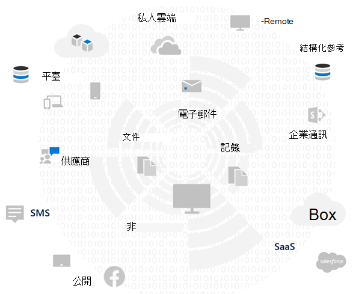
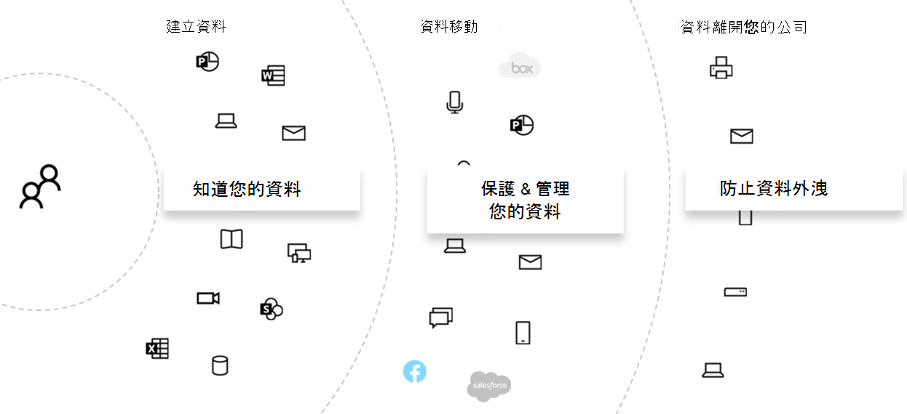
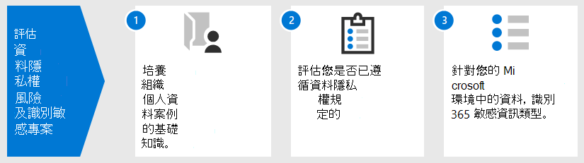
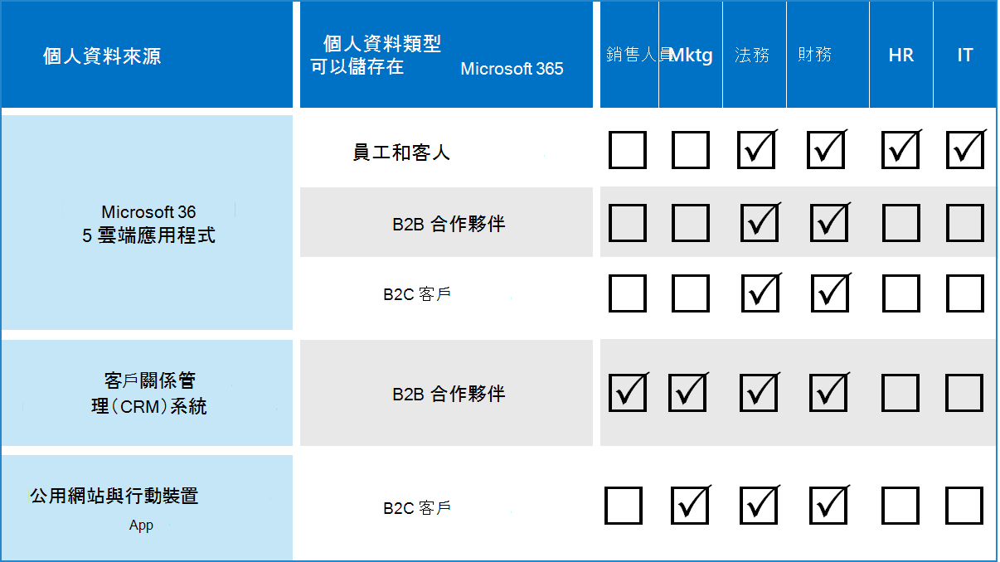

# 評估資料隱私權風險，並使用 Microsoft 365 識別敏感專案

在實施任何相關的改進動作（包括可使用 Microsoft 365 功能和服務時）之前，評估貴組織所遵循的資料隱私權規定和風險是一個重要的步驟。 

## 可能適用的資料隱私權法規

如需針對資料隱私權法規之廣泛規章架構的良好參考，請參閱 [Microsoft 服務信任入口網站](https://servicetrust.microsoft.com/) 和 [一般資料保護法規 (GDPR) 法規](/compliance/regulatory/gdpr)，以及您的行業或地區中所述的其他規章上的其他材料。

### GDPR

GDPR 是資料隱私權規定中最著名且所提及的，它會調節收集、儲存、處理及共用任何個人資料的相關資訊，這些資料與是歐盟 (歐盟) 居民的識別或可辨識的自然人員有關。 

根據 GDPR 文章4： 

- 「個人資料」是指與識別或辨識的自然人員 ( ' 資料主體 ' ) 相關的任何資訊。可辨識的自然人員是指以直接或間接的方式，識別識別碼（例如名稱、識別號碼、位置資料、線上識別碼，或該自然人員之實體、physiological、遺傳、精神、經濟效益或社交身分識別特有的一或多個因素）。

### ISO 27001

依照 ISO 27001 的其他標準，也可由數個歐洲的監察性機關所辨識，成為跨人員、程式和技術頻譜的有效 proxy。 在某些情況下，它所指定的標準會重迭和遵循 ISO-27001 驅動的保護機制，以符合某些隱私權義務的 proxy。

### 其他資料隱私權法規

其他明顯的資料隱私權規定也會指定處理個人資料的需求。

在美國，這些包括加州消費者防護法案 ([CCPA](/compliance/regulatory/ccpa-faq)) 、HIPAA-高科技 (美國衛生保健隱私權法案) 和 Graham Gramm-leach-bliley 現代化 ACT (GLBA) 。 其他狀態特有的法規也是就地或開發中的。 

在世界各地，其他範例包含德國國家標準 GDPR 實施法案 (BDSG) ，巴西資料保護法案 (LGPD) 及許多其他。

## 規章對應至 Microsoft 365 的技術控制項類別

許多資料隱私權相關的規章都有重疊的需求，因此在開發任何技術控制架構之前，您應該瞭解他們所遵循的規章。 

為了供日後參考此整體解決方案中的文章，此表格提供資料隱私權規定的抽樣的摘錄。 

| 調節 | 文章/區段 | 節錄 | 適用的技術控制項類別 |
|:-------|:-----|:-------|:-------|
| GDPR | 第5篇 (1)  (f)  | 個人資料的處理方式是為了確保個人資料的適當安全性，包括防止未經授權或非法處理的保護，以及防止意外損毀、損毀或損毀，使用適當的技術或組織量值 ( ' 誠信和機密性」。  |   (全部)    身分識別   裝置   威脅防護   保護資訊   監管資訊   探索和回應 |
|  |  (32)  (1)  () 的文章 | 考慮美工的狀態、實施成本和性質、範圍、內容及處理目的，以及自然人員的權力和嚴重性變化可能性和嚴重性的風險，控制者及處理器應執行適當的技術和組織量值，以確保符合風險的安全性層級，包括適當的 alia： () 假名和加密的個人資料。 | 保護資訊 |
|  | 專案 (13)  (2)  ()  | "...審計員會在取得個人資料的時間，提供下列進一步資訊的資料，以確保一般和透明的處理： () 儲存個人資料的期間，或是不可能的情況，用來判斷該期間的準則。 | 監管資訊 |
|  | 本文 (15)  (1)  (e)  | 資料主體應具備從控制器確認取得的權利，如是否正在處理其相關的個人資料。在此情況下，您可以存取個人資料及下列資訊： (e) 是否有權利可以要求從控制者修正或擦除個人資料，或將有關資料主旨或物件處理的個人資料的處理限制在處理中。 | 探索和回應 |
| LGPD | 文章46 | 處理代理程式應採用安全性、技術和管理措施，以保護個人資料免受未授權的存取和意外或非法的銷毀狀況、遺失、篡改、通訊或任何類型的錯誤或非法處理的情況。 | 保護資訊   監管資訊   探索和回應|
|  | 文章48 | 控制器必須與全國授權機構和資料主體進行通訊。可能會對資料主體產生風險或相關損毀的安全性事件發生。 | 探索和回應 |
| HIPPA-高科技 | 45 CFR 164.312 (e)  (1)  | 執行技術安全性措施，以防止未經授權的存取透過電子通訊網路傳輸的電子受保護健康情況資訊。 | 保護資訊 |
|  | 45 C.F.R。 164.312 (e)  (2)  (ii)  | 實施一種機制，在適當時，加密電子保護的健康情況資訊。 | 保護資訊 |
|  | 45 CFR 164.312 (c)  (2)  | 實施電子方式，corroborate 未以授權方式變更或銷毀的電子受保護健康情況資訊。 | 監管資訊 |
|  | 45 CFR 164.316 (b)  (1)  (i)  | 若要記錄此 subpart 所需的動作、活動或評估，請維護書面 (，該書面可能是) 的動作、活動或評估的電子化記錄。 | 監管資訊 |
|  | 45 CFR 164.316 (b)  (1)  (ii)  | 將本節 (b)  (1) 本節的必要檔，保留從其建立日期的6年開始，或其最後一個生效的日期。 | 監管資訊 |
|  | 45 C.F.R。 164.308 ()  (1)  (ii)  (D)  | 實施定期檢查資訊系統活動記錄的程式，例如審計記錄檔、存取報告及安全性事件追蹤報告 | 探索和回應 |
|  | 45 C.F.R。 164.308 ()  (6)  (ii)  | 識別及回應可疑或已知的安全性事件;降低範圍盡可能，對被涵蓋之實體或業務關聯的安全性事件造成有害影響;及記錄安全性事件及其結果。 | 探索和回應 |
|  | 45 C.F.R。 164.312 (b)  | 在包含或使用以電子保護健康情況資訊的資訊系統中，執行可記錄及檢查活動的硬體、軟體和程式性機制。 | 探索和回應 |
| CCPA | 1798.105 (c)  | 接收方的可驗證要求以刪除使用者的個人資訊的商務用，依照 (本節) 的細分，應從其記錄中刪除消費者的個人資訊，並將任何服務提供者從其記錄中刪除。 | 探索和回應 |
|  | 1798.105 (d)  | 1798.105 (c) 的 (例外狀況   若業務或服務提供者必須維護使用者的個人資訊，而不需要使用公司或服務提供者的要求來刪除使用者的個人資訊，則不需要使用該公司或服務提供者，以： (參照目前的規章以取得其他資訊) 。 | 探索和回應 |
|||||

>[!Important]
>這不是一個詳盡的清單。 如需詳細資訊，請參閱 [合規性管理員](../compliance/compliance-manager.md) 或您的法律或規範顧問，以取得所列的技術控制項類別之適用性的部分。
>

## 知道您的資料

不論您受制的規章為何，在組織內部和外部的不同使用者資料類型與您的系統進行互動的所有重要因素，都可能會影響整體個人資料保護原則，其受限於適用于您組織的行業和政府法規。 這包括儲存個人資料的位置、類型是什麼，以及有多少情況，以及其收集的情況下。
 

### 資料可攜性 

在處理、精緻及其他版本的情況下，資料也會隨著時間來回移動。 初始快照絕對不會足夠。 需要有一個持續的處理常式來瞭解您的資料。 這代表大型組織處理大量個人資料的最大難題之一。 未解決「知道資料」問題的組織，可能會有極高的風險，而且可能會從法規代理商取得罰款。

 
### 個人資料的位置

若要解決資料隱私權法規，您無法依賴您認為個人資料可能存在的一般概念，不論是現在或以後的地方。 資料隱私權法規要求組織必須證明他們知道個人資料的持續性。 這使您很重要的方式是取得所有資料來源的初始快照，以儲存個人資訊（包括 Microsoft 365 環境），並建立持續監控和偵測的機制。

若尚未評估與資料隱私權規定相關的整體準備工作和風險，請使用下列3步驟架構開始著手。 

>[!Note]
>本文及其內容並不是為了取代法律顧問服務。 它只提供一些基本指導方針，以及一些工具的連結，在評估的早期階段可能會有協助。
>
 
## 步驟1：培養組織個人資料案例的基礎知識 

您必須根據目前所管理的個人資料類型、其儲存位置、哪些保護性控制措施、生命週期的管理方式，以及哪些人員可以存取，來評估資料隱私權風險的危險性。 

作為起點，請務必清查您的 Microsoft 365 環境中存在哪些類型的個人資料。 使用下列類別：

- 執行日常商務功能所需的員工資料
- 組織在企業對企業 (B2B) 案例中的商務客戶、合作夥伴及其他關聯性的資料
- 組織在企業對客戶 (B2C) 案例中，提供資訊給組織所管理之線上服務之消費者的相關資料。

以下是組織一般部門的不同資料類型的範例。

許多受資料隱私權法規制約的個人資料通常會收集並儲存在 Microsoft 365 之外。 任何來自使用者對向的 web 或行動應用程式的個人資料，都必須從這類應用程式匯出至 Microsoft 365，才會受到 Microsoft 365 中的資料隱私權審查。 

您在 Microsoft 365 中的資料隱私權洩密，對您的 web 應用程式和 CRM 系統的限制，可能會比這種解決方案不具位址。

在評估風險設定檔時，請務必考慮下列常見的資料隱私權法規遵從性挑戰：

 - **個人資料散佈。** 分散的資訊與特定主旨的資訊的方式如何？ 它是否有足夠的功能，可以相信適當的控制措施是否正確？ 如有需要，是否可以進行調查和修正？
- **針對 exfiltration 進行防護。** 如何保護特定類型或來源的個人資料以免遭到破壞，以及如何回應它？
- **保護與風險。** 與風險相關的資訊保護機制，以及如何維護業務持續性和生產力，並在需要使用者干涉時，將影響降至最低使用者的影響？ 例如，是否應使用手動分類或加密？
- **個人資料保留。** 出於有效的商業原因，包含個人資料資訊的資訊必須保留多久，以及如何避免過去保持不停的做法，與業務持續性的保留需求平衡？
- **處理資料主體要求。** 處理資料主體要求 (Dsr) 和任何補救措施（如匿名、密文和刪除）時，所需的機制為何？
- **持續監控與報告。** 哪一天的監控、調查和報告技巧可用於不同的資料類型和來源？
- **資料處理的限制。** 使用這些方法收集或儲存的資訊是否有限制，因為組織必須在隱私權控制中反映這些方法？ 例如，銷售人員不會使用個人資料的承諾，可能需要您的組織將這些資訊轉移或儲存在與銷售組織相關聯的系統中。

### 執行日常商務功能所需的員工資料

依性質，組織必須針對電子身分識別及 HR 目的，收集員工的資料，視其在員工合約中的同意而定。 只要人員可用於公司，這通常不會有問題。 組織可能會想要將機制放在適當的地方，以防止惡意參與者 exfiltration 或洩漏員工個人資料。 

若某人離職，組織通常會有移除使用者帳戶、解除委任信箱和個人磁片磁碟機，以及變更員工在諸如人力資源系統等方面的狀態的程式、程式及保留與刪除排程。 在涉及訴訟的情況下，法律調查的員工或其他團體可能會有合理的理由，以取得組織系統中儲存的個人資料資訊。 在某些情況下，該團體可能要求移除或匿名這類資料。 

為了滿足這類需求，組織應具備處理預防性、偵探和補救措施的程式與程式，以協助這類要求，請注意，有關員工的部分資訊可能會被視為商務持續性的重要因素。 例如，個人撰寫的檔案或執行函數的資訊。 

>[!Note]
>如需 Microsoft 365 中個人資料的調查和修正技巧，請參閱[監視和回應文章](information-protection-deploy-monitor-respond.md)。 您也可能會想要使用自動化的分類及保護架構，以確保個人資料在組織內部加以控制，以及避免該組織在惡意的主角情況下遭到離開。 如需詳細資訊，請參閱 [保護資訊文章](information-protection-deploy-protect-information.md) 。
>
 
### 組織對 B2B 案例中公司客戶的相關資料

B2B 資訊集合也是一項挑戰，因為您的組織可能需要將客戶名稱和交易記錄存放在其各種系統中，以進行商務持續性目的，但保護該資訊不會遭到無意或惡意的 exfiltration。 與員工資料類似的是，組織必須有適當的原則、程式和技術控制措施來保護這類資料，並根據定義的保留和刪除排程，將其老化。 

一般來說，與外部客戶、合作夥伴和組織經營的其他實體的合約，將會有語言來處理這類資料的處理，包括在該實體與組織的關係期間和之後，都有保護、保留和刪除。 

### 組織有關為組織在 B2C 案例中管理之線上服務提供資訊的消費者所擁有的資料

這種類別是由於客戶資料洩漏的許多公用實例而對資料隱私權所做的最大人們考慮。 這可能是有意的，例如向提供者合約的協力廠商，或無意中（例如由惡意的主角 exfiltration）。 使用者資料保護是歐盟及其他政府規定這些法規的主要原因之一。 資料隱私權法規（如 GDPR 和 CCPA）會要求您規劃下列各項：

- [行動方案](/compliance/regulatory/gdpr-action-plan)和[責任準備狀況檢查](/compliance/regulatory/gdpr-arc-Office365)清單
- [資料保護影響評估](/compliance/regulatory/gdpr-data-protection-impact-assessments)
- [破壞通知](/compliance/regulatory/gdpr-breach-Office365)
- [資料主體要求](/compliance/regulatory/gdpr-dsr-Office365)

如果您的組織未進行許多直接來自消費者的資料收集，此類別可能會不是問題。 不過，您可能仍然需要執行這些文章中所述的程式，以達成符合性。

### 步驟1摘要

瞭解風險和資料隱私權法規的危險性是一項重要的第一步，以基礎瞭解貴組織的個人資料案例為基礎。

如果您的 Microsoft 365 環境中沒有使用者的個人資料，或其局限于環境中的特定部分，而且需要在使用者類型的資料暴露方面 predicated 技術控制權，則該技術控制可能只需要在環境的高風險部分（而非到處）使用。

雖然外部組織或標準控制項設定建議，例如從 Microsoft 365 中的合規性管理員，但可協助告知您的控制策略，您的實施選擇應該是由資料清單認知所驅動，以量化實際風險的危險性。

大多數的組織都會對上述其中一個案例產生一些風險。 採取整體的評估方法很重要。

## 步驟2：評估您是否已遵循資料隱私權法規的準備工作

雖然 GDPR 的特別問題，但在免費的 [MICROSOFT GDPR 評估工具](https://www.microsoft.com/cyberassessment/en/gdpr/uso365) 中所提出的問題，可讓您瞭解整體的資料隱私權準備。 

受限於其他資料隱私權法規（如美國或巴西的 LGPD 中的 CCPA）的組織可能也會受益于此工具因 GDPR 的重迭條款而產生的準備就緒清單。

GDPR 評估包含下列各節：

| 區段 | 描述 |
|:-------|:-----|
| 治理 | <ol><li>您的隱私權原則會明確指出正在處理的資料資訊為何？ </li><li>您是否要定期 (PIAs) 執行隱私權影響評估？ </li><li> 您是否使用工具來管理個人資訊 (PI) ？ </li><li> 您是否有合法的授權，可在任何指定的個人上使用 PI 資料進行商務用？ 您是否追蹤資料的同意？ </li><li> 您是否需要追蹤、實施及管理審計控制措施？ 您是否監視資料洩漏？ </li></ol>|
| 刪除和通知 | <ol><li>您會提供如何存取使用者資料的明確指示。 </li><li> 您是否已記錄處理自願同意的處理常式？ </li><li> 您是否有資料的自動刪除處理常式？ </li><li>   在與客戶接洽時，是否有驗證身分識別的處理常式？ </li></ol>|
| 風險降低和資訊安全性 | <ol><li>您使用工具來掃描非結構化資料嗎？ </li><li>所有伺服器都是最新的，您是否要利用防火牆加以保護？ </li><li>您是否執行伺服器的定期備份？ </li><li>您是否積極監控資料洩漏？ </li><li>您是否要加密靜態和傳輸中的資料？ </li></ol>|
| 原則管理 | <ol><li>如何管理系結公司規則 (BCRs) ？ </li><li>您是否追蹤資料的同意？ </li><li> 您的合約是否涵蓋資料分類和處理需求，以1到5的比例從1到5、5。 </li><li>您是否有並定期測試事件回應計畫？ </li><li>您用來管理存取的原則為何？ </li></ol>|
|||
 
## 步驟3：識別在 Microsoft 365 環境中發生的敏感資訊類型。 

此步驟包括識別特定的敏感資訊類型，這些類型受制于特定的規章控制，以及它們在 Microsoft 365 環境中的出現。 

在您的環境中尋找包含個人的內容可能是一項艱巨的工作，先前會結合使用符合性搜尋、eDiscovery、Advanced eDiscovery、DLP 及審計。 

透過 Microsoft 合規性系統管理中心的新 **資料分類** 方案，使用 [內容瀏覽器](../compliance/data-classification-content-explorer.md) 功能，可搭配內建或自訂的機密資訊類型（包括與個人資料相關的資訊類型）使用。
 
### 敏感性資訊類型

Microsoft 規範系統管理中心預先載入了100以上的敏感資訊類型，這些類型大多都與識別及尋找個人資料有關。 這些內建的敏感資訊類型可根據正則運算式所定義的模式，協助識別及保護信用卡號碼、銀行帳戶號碼、護照號碼等等，其方式 (RegEx) 或函數。 若要深入了解，請參閱[機密資訊類型尋找的目標為何](../compliance/sensitive-information-type-entity-definitions.md)。

如果您需要識別及保護組織特有或區欄位型別的敏感專案（例如員工 IDs 的自訂格式）或內建機密資訊類型所涵蓋的其他個人資訊，您可以使用下列方法來建立自訂的敏感資訊類型： 

- PowerShell
- 具有精確資料符合的自訂規則 (EDM) 
- 透過規範中心管理 UI，如[使用合規性分數和合規性管理員文章](information-protection-deploy-compliance.md)中所述

您也可以自訂現有的內建機密資訊類型。

如需詳細資訊，請參閱下列文章：

- [自訂內建的敏感性資訊類型](../compliance/customize-a-built-in-sensitive-information-type.md)
- [了解敏感性資訊類型](../compliance/sensitive-information-type-learn-about.md)
- [在安全性與合規性中心建立自訂敏感性資訊類型](../compliance/create-a-custom-sensitive-information-type.md)
- [在安全性與合規性中心 PowerShell 中建立自訂敏感性資訊類型](../compliance/create-a-custom-sensitive-information-type-in-scc-powershell.md)
- [使用以精確資料比對為基礎的分類建立自訂敏感性資訊類型](../compliance/create-custom-sensitive-information-types-with-exact-data-match-based-classification.md)

### 內容瀏覽器

在您的環境中，判斷敏感專案發生的重要工具，是 Microsoft 365 合規性系統管理中心內的新[內容瀏覽器](../compliance/data-classification-content-explorer.md)。 這是一種自動化的工具，可讓您整個 Microsoft 365 訂閱進行，針對敏感資訊類型和顯示結果的顯示，進行完整及日常掃描。
 
新的內容瀏覽器工具可讓您使用內建的敏感資訊類型或自訂的資訊類型，快速識別環境中敏感專案的位置。 這可能會讓您建立程式並指派責任定期調查敏感專案的目前狀態和位置。

在本文中所述的其他步驟中，這會提供一個起點，用以識別敏感專案的整體風險、準備工作和位置，以透過規劃的 Microsoft 365 設定和監控加以保護。 

### 在您的環境中識別個人資料的其他方法

除了內容瀏覽器之外，組織還可以存取內容搜尋功能，以利用高級搜尋準則及自訂篩選，在環境中進行自訂搜尋，以尋找個人資料。

[本文](/compliance/regulatory/gdpr)提供如何使用內容搜尋來搜尋個人資料的詳細指南。 內容搜尋及其他探索技巧也會在 Dsr 中探索， [以供 GDPR 和 CCPA](/compliance/regulatory/gdpr-dsr-Office365#introduction-to-dsrs)。

有關 Microsoft 365 中個人資料之調查和修正技術的其他深入資訊，請在 [[監視器] 和 [回應] 文章](information-protection-deploy-monitor-respond.md)中提供。

> [!NOTE]
> 若要尋找儲存在內部部署檔案中的敏感資訊，請參閱 [Azure 資訊保護](/azure/information-protection/quickstart-findsensitiveinfo)。