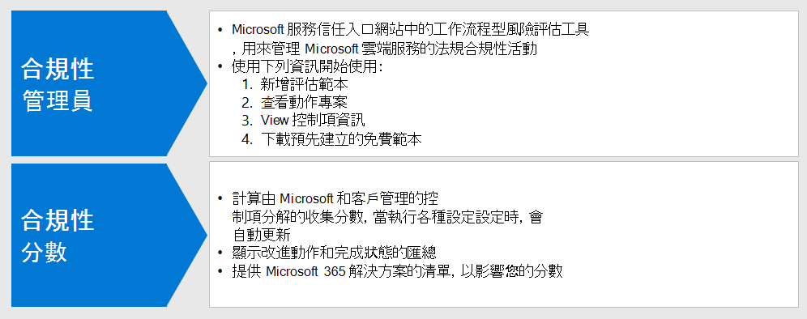

# 使用合規性分數和合規性管理員管理改進動作Use Compliance Score and Compliance Manager to manage improvement actions

Microsoft 合規性分數和合規性管理員可以搭配使用，以管理與資料隱私權法規相關的增強功能，例如：歐盟[一般資料保護規定（GDPR）](../compliance/gdpr.md)、[加州消費者 Protection 法案 CCPA）](../compliance/ccpa-faq.md)、HIPAA-高科技（美國衛生保健隱私權法案）和巴西資料保護法案（LGPD）。Microsoft Compliance Score and Compliance Manager can be used together to manage improvements related to data privacy regulations such as the European Union [General Data Protection Regulation (GDPR)](../compliance/gdpr.md), [California Consumer Protection Act CCPA)](../compliance/ccpa-faq.md), HIPAA-HITECH (US health care privacy act), and the Brazil Data Protection Act (LGPD). 

本文提供如何使用這些工具來進行資料隱私權的指導。This article provides guidance on the use of these tools for data privacy purposes.

>[!Note]
>合規性管理員中提供的客戶動作為建議。The customer actions provided in Compliance Manager are recommendations. 在實施之前，您需要評估法規環境中這些建議的效能。It is up to you to evaluate the effectiveness of these recommendations in your regulatory environments prior to implementation. 合規性管理員建議不得加以轉譯，以保證法規遵從性。Compliance Manager recommendations should not be interpreted as a guarantee of compliance.
>

## 已計畫的相容性分數和合規性管理員更新Planned updates for Compliance Score and Compliance Manager

[合規性分數](../compliance/compliance-score.md)（目前在預覽中）需要從[合規性管理員](../compliance/compliance-manager-overview.md)為法規（如 GDPR）新增目標評估。[Compliance Score](../compliance/compliance-score.md) (currently in preview) requires adding your target assessments for a regulation (such as GDPR) from the [Compliance Manager](../compliance/compliance-manager-overview.md). 在未來的版本中，合規性管理員中的許多功能都會合並成統一的合規性分數體驗，以減少對多項工具的需求。In a future release, much of the functionality in Compliance Manager will be merged into a unified Compliance Score experience, reducing the need for multiple tools.

以下是您訂閱的工具，需要您登入：Here are the tools for your subscription, which require you to sign-in:

- [Microsoft 規範系統管理中心中的合規性分數Compliance Score in the Microsoft Compliance admin center](https://compliance.microsoft.com/compliancescore)
- [Microsoft 服務信任入口網站中的合規性管理員Compliance Manager in the Microsoft Services Trust Portal](https://servicetrust.microsoft.com/ComplianceManager/V3)

## 合規性管理員快速入門Getting started with Compliance Manager 

[合規性管理員](../compliance/working-with-compliance-manager.md)（目前在預覽中）是 Microsoft 服務信任入口網站中的免費工作流程型風險評估工具，以管理與 Microsoft 雲端服務相關的規章遵循活動。[Compliance Manager](../compliance/working-with-compliance-manager.md) (currently in preview) is a free workflow-based risk assessment tool in the Microsoft Service Trust Portal for managing regulatory compliance activities related to Microsoft cloud services. 在您的 Microsoft 365 或 Azure Active Directory （Azure AD）訂閱中，合規性管理員可協助您管理 Microsoft 雲端服務共用責任模型內的法規遵從性。As part of your Microsoft 365 or Azure Active Directory (Azure AD) subscription, Compliance Manager helps you manage regulatory compliance within the shared responsibility model for Microsoft cloud services.

雖然您可以在「規範中心」的 [**合規性分數**] 頁面中查看整體合規性分數和執行許多其他功能，但您必須透過服務信任入口網站使用合規性管理員，才能先設定資料隱私權法規的評估。While you can view your overall compliance score and perform a number of other functions in the Compliance center's **Compliance Score** page, you need to use Compliance Manager through the Services Trust Portal to first configure assessments for your data privacy regulations. 這些評估中的資料會顯示在合規性分數中，以便進一步查看和篩選。Data from these assessments will then show up in Compliance Score for further viewing and filtering. 

您可以使用 [合規性管理員] 介面，選取一或多個資料隱私權相關的規章範本，並加以群組，以評估並追蹤整個集所需的改善動作。Using the Compliance Manager interface, you can select one or more data privacy-related regulation templates and group them to assess and track required improvement actions across the set. 您也可以查看有關特定于目標服務之每個規章要求的資訊，並由 Microsoft 與客戶管理的控制項分隔。You can also view information about the controls each regulation calls for specific to the target service, separated by Microsoft vs. customer-managed controls.

在這裡選取的評估與改進狀態也會出現在 Microsoft 規範中心的相容性分數中，以強調合規性管理員中初始安裝的重要性。Assessments and improvement status selected here also appear in Compliance Score in the Microsoft Compliance Center, which emphasize the importance of your initial setup in Compliance Manager. 此圖顯示這些關聯性。These relationships are shown in this figure.
 

以下是協助您開始的主要步驟。Here are the key steps to help you get started.

### 1. 評估範本1. Assessment templates

在「合規性管理員」中，第一步是針對利益的資料隱私權規定新增評估，並將其包含在定義的「資料隱私權法規」群組中。From the Compliance Manager, the first step is to add assessments specific to the data privacy regulations of interest and include them in a defined "Data Privacy Regulations" group.

[群組](../compliance/working-with-compliance-manager.md#groups)是容器，可讓您組織評估，並在具有相同或相關客戶管理控制措施的評估之間共用一般資訊和工作流程工作。[Groups](../compliance/working-with-compliance-manager.md#groups) are containers that allow you to organize Assessments and share common information and workflow tasks between Assessments that have the same or related customer-managed controls. 當同一個群組中的兩個不同評估共用客戶管理控制項時，控制項的執行詳細資料、測試及狀態會自動同步處理至群組中任何其他評估中的相同控制項。When two different Assessments in the same group share customer-managed control, the completion of implementation details, testing, and status for the control automatically synchronize to the same control in any other Assessment in the Group. 這會為群組中的每個控制項統一所指派的動作專案，並減少重複的工作。This unifies the assigned Action Items for each control across the group and reduces duplicating work. 

您也可以選擇使用群組進行組織。You can also choose to use groups to organize. 依年、區域、規範標準或其他群組進行評估，以協助組織符合性工作。Assessments by year, area, compliance standard, or other groupings to help organize your compliance work.

### 2. 動作專案2. Action items

在新增評估之後，您可以查看每個群組或個別規定特有的動作專案：Once the assessments have been added, you can view Action Items specific to each group or individual regulation:

- **改進動作清單。****Improvement action list.** 流覽至 [動作專案] 清單，並查看群組中所包含的各法規相關的改進動作。Navigate to the Action Items list and view the improvement actions associated across the regulations included in the group. 許多動作都涵蓋法規，所以單一清單專案可能代表多種規章。Many actions span regulations so a single list item may represent multiple regulations. 
 
- **改進動作篩選。****Improvement action filtering.** 針對許多資料隱私權法規和規定的群組，改善動作清單可能相當大，所以請考慮使用 [篩選] 下拉式清單篩選清單。For many data privacy regulations and groups of regulations, the list of improvement actions can be quite large, so consider filtering the list using the filter drop down. 例如，如果您選取「技術控制項」，該清單會縮小為只具有組織中的技術實施，因為許多的動作都與其他公司的管理作業相關，也就是合規性管理員中所記錄的不同部分。For example, if you select "technical controls", the list will be reduced to just those which have a technical implementation in the organization, as many of the actions are related to administrative operations in various aspects of the business which are also documented in Compliance Manager. 在本文中，我們將重點放在技術控制項上，因此建議使用此篩選方法。In this article, we will focus on technical controls, so this filtering approach is recommended.
 
- **其他資訊和評論。****Additional information and review.** 針對每個動作，您可以按一下 [連結] 以**閱讀詳細**資訊，這會告訴您建議的活動或**審閱**，它會開啟表單，讓您執行下列作業：For each action, you can click on the link to **Read More**, which tells you more about the recommended activity, or **Review**, which opens a form allowing you to do the following:
 
   - 指派動作給組織中的某人進行管理Assign the action to a someone in your organization to manage
   - 管理與解決動作相關的檔Manage documents related to addressing the action
   - 指定專案的狀態Specify status for the item
   - 指定執行和測試日期Specify implementation and test dates
   - 記錄主旨動作的其他資訊、執行附注及測試方案附注Record additional information, implementation notes, and test plan notes for the subject action
  
- **不適用的專案會超出範圍。****Non-applicable items as out-of-scope.** [動作專案] 清單中包含的一些改進動作可能不適用於您計畫的執行。Some improvement actions included in the Action Items list might not apply to your planned implementation. 您可以指定它們在合規性管理員中的範圍以外，並從規範分數值的計算中移除該動作及其證據。You can specify that they are out of scope in Compliance Manager and remove the action and its evidence from the calculation of the compliance score value. 

例如，如果您的組織已選擇使用 Microsoft Managed Key "，建議使用客戶金鑰不會適用于您的部署。For example, if your organization has elected to use Microsoft Managed Key", a recommendation to Use Customer Key is not applicable to your deployment. 在此情況下，您的組織會將其標記為 [**不在**適用的規章範本的**控制動作**] 範圍內。In this case, your organization would mark it as **Not in scope** in the **Control Actions** for the applicable regulatory template.
 
### 3. 控制項資訊3. Controls info

針對評估特有的視圖，請查看每個評估群組的 [[控制項] 資訊](../compliance/compliance-manager-overview.md#controls)。For an assessment-specific view, view the [Controls Info](../compliance/compliance-manager-overview.md#controls) for each assessment group. 這會提供評估特有的視圖，其與 [動作專案] 清單不同，其提供特定于技術控制項的視圖。This provides an assessment-specific view, which is difference than the Action Items list, which provides a technical control-specific view.
 

流覽至 [**控制項資訊**] 清單，並針對所述的規章，查看範圍內服務的清單。Navigate to the **Controls Info** list and view the list of in-scope services for the regulation in question. 
 
規章特有的控制項群組清單：每個服務區域的控制項區域所提供的動作。Regulation-specific control groupings list the actions provided by control area for each service area. 針對每一組動作，合規性管理員會提供更多有關動作的資訊，並建議或提供複查選項，以協助組織選擇控制方法。For each set of actions, the Compliance Manager provides more information on the action and may suggest or provide review options to assist the organization in choosing a control approach.
 
請注意，此介面可讓您查看技術動作特有的詳細資料，以及與該動作相關的動作狀態，以及該動作相關之規章的補充性內容。Note that this interface provides the capability to view details specific to the technical action, together with the status of actions related to the control, and supplemental context about the regulations to which the action is related.

### 4. 範本下載4. Template download

針對以試算表為基礎的規章分析，另一種方法是使用範本清單下載每個個別評估的範本。For those more familiar with spreadsheet-based regulatory analysis, another approach is to download the template for each respective assessment using the Templates listing. 已下載的範本會列出每個範本的規章和技術控制資訊，而且某些角色若要流覽/篩選並產生業務特有的觀點可能會比較容易。The downloaded templates list both the regulatory as well as technical control information for each template and may be easier for certain roles to navigate/filter and to generate business-specific views.
 
您也可以使用 [新增**範本**]，為您的組織新增根據現有範本所自訂的新範本。You can also add a new template customized for your organization based on an existing template, using **Add Template**. 這需要您下載選擇的範本（例如 HIPAA/高科技）），然後針對您的目的加以修改，並上傳回合規性管理員工具，在此程式中，它現在會以整體合規性管理員和合規性分數工具組的一部分，促進評估與其他範本與評估的評分。This requires that you download a template of choice (such as HIPAA/HITECH)), then modify it for your purposes and upload back into the Compliance Manager tool, where it will now drive assessments and scoring similar to other templates and assessments as part of the overall Compliance Manager and Compliance Score toolset.
 
>[!Tip]
>若要處理大量的管理法規或重疊的改進動作，請考慮下載每個個別的範本並結合資料集、移除不適用於您組織的「改進」動作或控制項類型，然後重新上傳。if dealing with a large number of regulations or overlapping improvement actions, consider downloading each respective template and combining the data sets, removing improvement actions or control types that do not apply to your organization, and re-uploading. 這可能比流覽每個控制項的 info 區段更輕鬆，並將每個控制項的標記為超出範圍。This may be easier than navigating every control info section and marking each as out of scope.
>

## 合規性分數Compliance Score

在合規性管理員中執行「評估與複查」規格之後，您現在可以移至 [[規範分數](../compliance/compliance-score.md)] 工具，並進一步查看分數及切片，並進一步切向資料（包括透過控制區域）。Once the assessments and review specifications are performed in Compliance Manager, you can now go to the [Compliance Score](../compliance/compliance-score.md) tool and review the score and slice and dice the data further, including by control area.

Microsoft 365 合規性系統管理中心中的合規性分數工具提供數種方法，可檢查及篩選從合規性管理員和各種 Microsoft 365 服務取得的規範資料。The Compliance Score tool in the Microsoft 365 Compliance admin center provides several approaches to review and filter compliance data obtained from Compliance Manager and various Microsoft 365 services. 這項工具會在實施各種設定設定時會自動更新，並與 Microsoft 安全分數共用信號，這樣許多改進動作都會以這兩個分數顯示。This tool is automatically updated when various configuration settings are implemented and shares signals with the Microsoft Secure Score so that many improvement actions will show up in both scores. 
 
合規性分數提供：The Compliance Score provides:

- 收集的分數，由 Microsoft 和客戶管理的控制項細分A collected score, broken down by Microsoft and customer-managed controls
- 改進動作和完成狀態的匯總A rollup of improvement actions and completion status
- 影響您分數的 Microsoft 365 解決方案清單A listing of Microsoft 365 solutions impacting your score

### 合規性分數的計算方式How the compliance score gets calculated

簡而言之，分數是以 Microsoft 與客戶管理的控制項實施的組合計算，如[Microsoft 規範分數計算文章](../compliance/compliance-score-methodology.md)中更詳細的說明。In short, the score is calculated based on a combination of Microsoft and customer-managed control implementations, as explained in more detail in the [Microsoft Compliance Score calculation article](../compliance/compliance-score-methodology.md).

控制項會根據其是否為強制性或自由的，以及是否為預防性、偵探或糾正，指派分數值。Controls are assigned a score value based on whether they're mandatory or discretionary, and whether they're preventative, detective, or corrective. 兩者共同代表其相對於其他控制項的實施風險。These collectively represent the risk of not implementing it relative to other controls.

如 Microsoft 規範分數計算文章中所示，預防控制措施取得的分數高於偵探和修正，而強制控制措施取得的分數高於自由。As presented in the Microsoft Compliance Score calculation article, preventative controls get a higher score than detective and corrective ones, and mandatory controls get a higher score than discretionary ones.
 
請注意，「合規性分數管理」 UI 不會列出這些參數，也不會提供加以篩選的功能。Note that the Compliance Score admin UI does not list these parameters, nor does it provide the ability to filter by them. 不過，如果您從合規性管理員工具下載相關聯的範本，則產生的資料集會為大多數規定列出這些參數。However, if you download the associated template from the Compliance Manager tool, the resulting data set does list these parameters for most regulations.

針對技術控制，啟用相關的功能之後，相容性分數會自動更新改進動作分數。For technical controls, Compliance Score will automatically update the improvement action score once the related feature is activated. 在服務信任入口網站上，其他非技術控制動作 &mdash; （如操作或與檔相關的動作）必須 &mdash; 手動記錄在合規性管理員工具中。Other, non-technical control actions&mdash;such as those that are operational or related to documentation&mdash;need to be recorded manually in the Compliance Manager tool on the Services Trust Portal. 

此外，您還可以針對其他用途執行某些改進動作，例如， &mdash; 使用保留標籤的原因並非資料隱私權法規合規性 &mdash; ，因此，即使是用於其他用途，也不是故意執行法規遵從性動作的一部分，您也可以取得使用此類功能的信用。You many also be implementing certain improvement actions for other purposes&mdash;for example using retention labels for reasons other than data privacy regulation compliance&mdash;so you would get credit for using such a feature even if it is being used for other purposes, and not part of a deliberate compliance action.

您的合規性分數應視為追蹤廣泛規模改進的相對量。Your Compliance Score should be considered a relative measure to track improvement on a broad scale. 您不應採用完美的分數。You should not pursue a perfect score. 

### 其他指引Additional guidance

以下是一些重要的秘訣，可讓您使用合規性分數和合規性管理員以達成資料隱私權法規合規性：Here are a few important tips for the use of Compliance Score and Compliance Manager for you to achieve data privacy regulation compliance:

- 每個資料隱私權規定都結合了技術控制、檔規格，以及作業、程式和報表需求。Each data privacy regulation has a combination of technical controls, documentation specifications, and operational, process, and reporting requirements. 所有這些動作都會顯示在改進動作中。All of these show up in the improvement actions. 

- 本文著重于針對合規性管理員和合規性分數中所指定之資料隱私權的技術控制項子集。This article focuses on a subset of the technical controls specified for data privacy in Compliance Manager and Compliance Score. 如需非技術管理控制的詳細資訊，請參閱合規性管理員工具及[檔](../compliance/compliance-score.md)。Refer to the Compliance Manager tool and [documentation](../compliance/compliance-score.md) for more information on non-technical administrative controls.

- 若要將改進動作的查看重點放在您感興趣的區域中，您可以在合規性分數管理員的 [**解決方案**] 索引標籤中篩選動作類型。To focus the view of improvement actions to your area of interest, you can filter by action type in the **Solutions** tab in the Compliance Score admin.

- 在合規性分數中識別之改進動作的相對重要性和優先順序，應視為廣泛風險審查的一部分，以及您已判斷您的組織需要管理的資料隱私權風險。The relative importance and priority of improvement actions identified in Compliance Score should be considered as part of a broader risk review along with the data privacy risk you've determined your organization needs to manage. 

- 如果您是全球組織，且您將多個資料隱私權法規範本新增到合規性管理員中做為評估，則符合性分數會將每個適用于每個改進動作的欄位清單中的每個適用項結合If you are a global organization and you add multiple data privacy regulation templates into Compliance Manager as Assessments, Compliance Score will combine each applicable one in a field listing for each improvement action.
 
- 即使已選取 GDPR、LGPD、CCPA 及 HIPAA-高科技的法規評估範本，也會針對多種法規需求進行改進的動作匯總，例如，在合規性分數中會列出幾乎400改進動作。Even with improvement action aggregation across multiple regulatory requirements, if the regulation assessment templates for GDPR, LGPD, CCPA, and HIPAA-HITECH are selected, for example, almost 400 improvement actions will be listed in Compliance Score. 若要更好地處理這個長清單，請使用 [改進動作篩選]，將結果集縮小為更易於管理的清單。To better tackle this long list, use the improvement action filter to reduce the result set to a more manageable list.

- [類別] 篩選提供一種方法，可透過邏輯群組篩選改進動作，以追蹤、避免、保護、保留及調查此整體解決方案中的文章對齊。The Categories filter provides a means to filter improvement actions by logical grouping, which the Track, Prevent, Protect, Retain, and Investigate articles in this overall solution align to. 

- [！注意事項] 中所列的某些控制項，可能會被視為更直接與特定的規章相關的專案，而其他控制項可能更直接與法規精神產生關聯，而且在許多情況下，您應該考慮做的是。Some of the controls listed in the improvement actions may be considered more directly tied to a specific regulatory article, while other controls may be more indirectly associated with the spirit of a regulation and are many times just things you should consider doing anyway.

