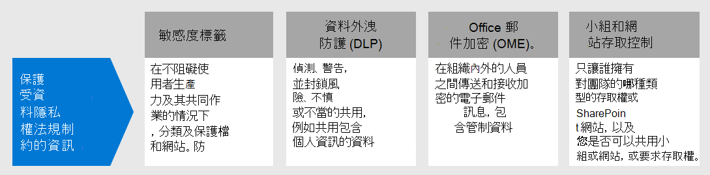
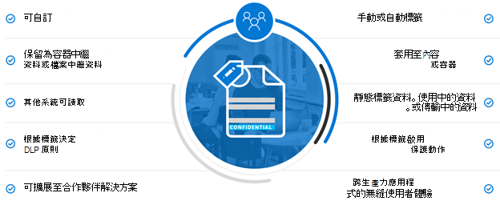
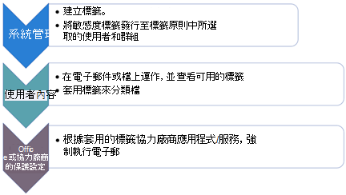
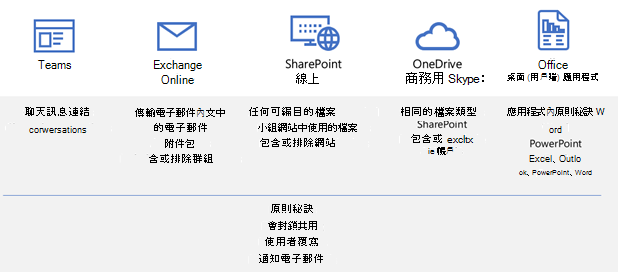
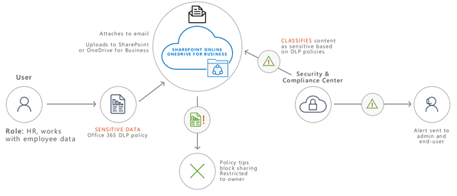
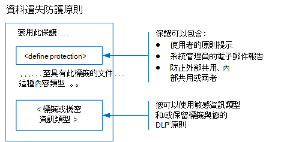
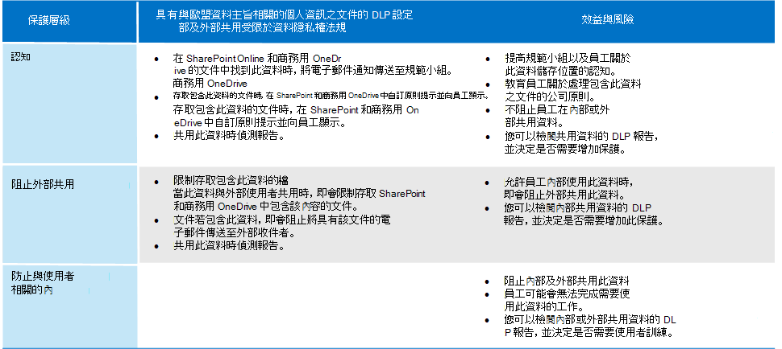
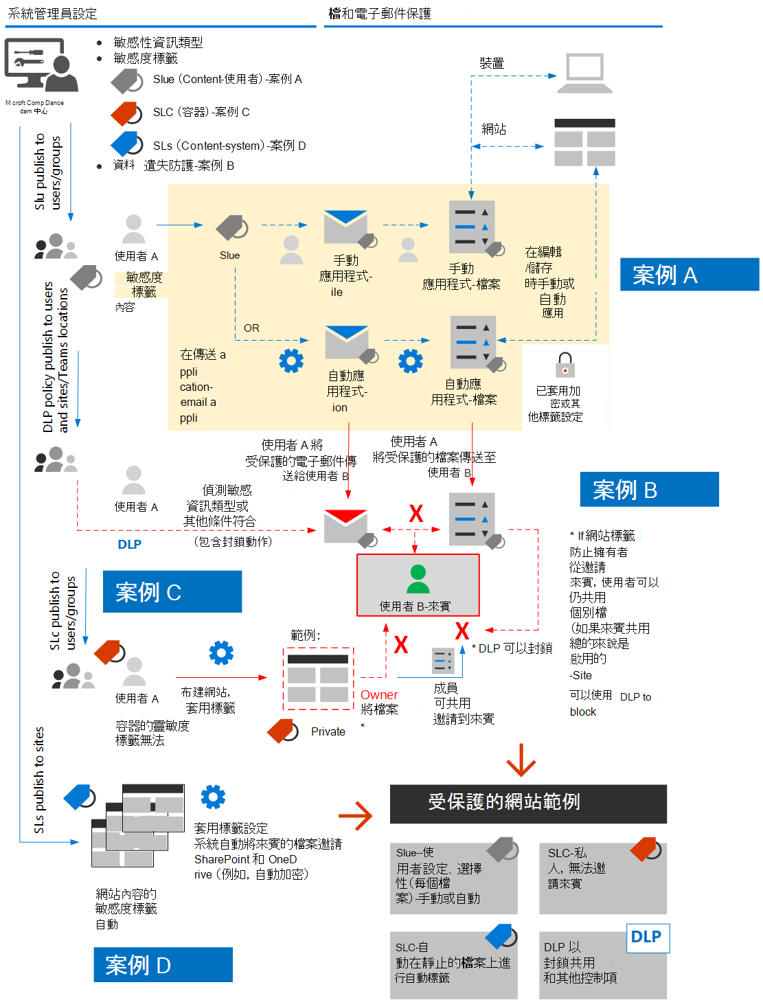

# 保護受資料隱私權法規制約的資訊Protect information subject to data privacy regulation

您的訂閱可使用許多資訊保護控制，以協助解決資料隱私權合規性需求和規定。A number of information protection controls can be employed in your subscription to help address data privacy compliance needs and regulations. 其中包括一般資料保護法規 (GDPR) ，HIPAA-高科技 (美國衛生保健隱私權法案) ，加州消費者 Protection 法案 (CCPA) ，以及巴西資料保護法案 (LGPD) 。These include General Data Protection Regulation (GDPR), HIPAA-HITECH (the United States health care privacy act), California Consumer Protection Act (CCPA), and the Brazil Data Protection Act (LGPD).

這些控制項位於下列解決方案範圍內：These controls are within following solution areas:

- 敏感度標籤Sensitivity labels
- 資料外洩防護 (DLP)Data loss prevention (DLP)
- Office 郵件加密 (OME)Office message encryption (OME)
- Teams 和網站存取控制Teams and sites access controls

>[!Note]
>此解決方案說明安全性和合規性功能，以保護受資料隱私權法規制約的資訊。This solution describes security and compliance features to protect information subject to data privacy regulations. 如需 Microsoft 365 的安全性功能的完整清單，請參閱[Microsoft 365 安全性檔案](../security/index.yml)。For a complete list of security features in Microsoft 365, see [Microsoft 365 security documentation](../security/index.yml). 如需 Microsoft 365 中相容性功能的完整清單，請參閱[Microsoft 365 規範檔](../compliance/index.yml)。For a complete list of compliance features in Microsoft 365, see [Microsoft 365 compliance documentation](../compliance/index.yml).
>

## 影響資訊保護控制的資料隱私權法規Data privacy regulations that impact information protection controls

以下是可能與資訊保護控制相關之資料隱私權法規的範例清單：Here is a sample list of data privacy regulations that may relate to information protection controls:

- GDPR 第5篇 (1)  (f) ) GDPR Article 5(1)(f))
- GDPR 文章 (32)  (1)  () GDPR Article (32)(1)(a)
- LGPD 文章46LGPD Article 46
- HIPAA-高科技 (45 CFR 164.312 (e)  (1) ) HIPAA-HITECH (45 CFR 164.312(e)(1))
- HIPAA-高科技 (45 C.F.R。HIPAA-HITECH (45 C.F.R. 164.312 (e)  (2)  (ii) ) 164.312(e)(2)(ii))

請參閱 [評估資料隱私權風險及識別敏感專案文章](information-protection-deploy-assess.md) ，以取得上述各項的詳細資訊。See the [assess data privacy risks and identify sensitive items article](information-protection-deploy-assess.md) for more information on each of the above.

資訊保護的資料隱私權法規建議：Data privacy regulations for information protection recommend:

- 保護避免遺失或未經授權的存取、使用方式和/或傳輸。Protection against loss or unauthorized access, usage and/or transmission.
- 以風險為基礎的保護機制應用程式。Risk-based application of protective mechanisms.
- 適當時使用加密。Use of encryption where appropriate.

您的組織可能也想要保護 Microsoft 365 內容，以供其他用途，例如其他法規遵從性需求或商務原因。Your organization may also want to protect Microsoft 365 content for other purposes, such as other compliance needs or for business reasons. 在整體資訊保護規劃、實施和管理的過程中，建立您的資訊保護架構以進行資料隱私權。Establishing your information protection scheme for data privacy should be done as part of overall information protection planning, implementation, and management.

為了協助您開始使用 Microsoft 365 中的資訊保護架構，下列各節包含 Microsoft 365 相關功能和改善動作的簡短清單。To help you get started with an information protection scheme in Microsoft 365, the following section includes a short list of related capabilities and improvement actions for Microsoft 365. 此清單包含適用于資料隱私權規定的功能和改進動作。The list includes capabilities and improvement actions that are applicable to data privacy regulations. 不過，如果目前的功能主要取代舊的功能，此清單並不包含舊版技術。However, the list doesn't include older technologies if there's a newer capability that largely supersedes the older one. 例如，SharePoint 和 OneDrive 的資訊版權管理 (IRM) 不會包含在清單中，但會包含敏感度標籤。For example, Information Rights Management (IRM) for SharePoint and OneDrive is not included in the list but sensitivity labels are included.

## 在 Microsoft 365 中管理資訊保護Managing information protection in Microsoft 365

microsoft[資訊保護解決方案](../compliance/information-protection.md)包含許多 Microsoft 365、Microsoft Azure 和 Microsoft Windows 的整合式功能。Microsoft [information protection solutions](../compliance/information-protection.md) include a number of integrated capabilities across Microsoft 365, Microsoft Azure, and Microsoft Windows. 在 Microsoft 365 中，資訊保護解決方案包括：In Microsoft 365, information protection solutions include:

- [客戶金鑰服務加密Service encryption with Customer Key](../compliance/customer-key-overview.md)
- [敏感資訊類型](../compliance/sensitive-information-type-entity-definitions.md) (會在 [評估資料隱私權風險及識別敏感專案文章](information-protection-deploy-assess.md) 中所述) [Sensitive information types](../compliance/sensitive-information-type-entity-definitions.md) (described in the [assess data privacy risks and identify sensitive items article](information-protection-deploy-assess.md))
- [敏感度標籤Sensitivity labels](../compliance/sensitivity-labels.md) 
  - 服務/容器層級Service/container-level
  - 用戶端/內容層級Client-side/content-level
  - 在 SharePoint 和 OneDrive 中的靜止資料自動化Automated for data-at-rest in SharePoint and OneDrive
- 資料外洩防護 (DLP)Data Loss Prevention (DLP)
- [Microsoft 365端點資料遺失防護Microsoft 365 Endpoint data loss prevention](../compliance/endpoint-dlp-learn-about.md)
- [Office 365 郵件加密新功能 (OME) ](../compliance/ome.md)和 OME 的[高級郵件加密](../compliance/ome-advanced-message-encryption.md)[Office 365 Message Encryption new capabilities (OME)](../compliance/ome.md) and OME [Advanced Message Encryption](../compliance/ome-advanced-message-encryption.md)

此外，網站和文件庫層級保護是在任何保護架構中包含的重要機制。In addition, site and library level protection are important mechanisms to include in any protection scheme.

如需 Microsoft 365 以外其他資訊保護功能的詳細資訊，請參閱：For information on other information protection capabilities outside of Microsoft 365, see:

- [Microsoft Cloud Application Security (MCAS) Microsoft Cloud Application Security (MCAS)](/cloud-app-security/)
- [Azure 資訊保護Azure Information Protection](/azure/information-protection/what-is-information-protection)
- [Microsoft 端點管理員Microsoft Endpoint Manager](https://www.microsoft.com/microsoft-365/microsoft-endpoint-manager)
- [Windows 資訊保護Windows Information Protection](/windows/security/information-protection/windows-information-protection/protect-enterprise-data-using-wip)

## 敏感度標籤Sensitivity labels

Microsoft 資訊保護架構中的靈敏度標籤可讓您分類及保護組織的資料，而不會阻礙使用者的生產力和其共同作業的能力。Sensitivity labels from the Microsoft Information Protection framework let you classify and protect your organization's data without hindering the productivity of users and their ability to collaborate.

> [!div class="mx-imgBorder"]
> 

### 敏感度標籤的必要條件Prerequisites for sensitivity labels

在執行下列的任何敏感度標籤型功能之前，請先完成這些活動：Complete these activities prior to implementing any of the sensitivity label-based capabilities highlighted below:

1. 瞭解下列各項：Understand the following:
   - **商務需求。****Business requirements.** 建立在您的企業中套用敏感度標籤的業務原因。Establish the business reasons for applying sensitivity labels in your enterprise. 例如，您的資訊保護的資料隱私權需求。For example, your data privacy requirements for information protection.
   - **敏感度標籤功能。****Sensitivity label capabilities.** 敏感度標籤會變得很複雜，因此請務必先閱讀 [靈敏度標籤檔](../compliance/sensitivity-labels.md) ，然後再開始著手。Sensitivity labeling can get complex, so make sure to read the [sensitivity labels documentation](../compliance/sensitivity-labels.md) before getting started.
   - **需要記住的重要事項** 敏感度標籤會在 Microsoft 合規性系統管理中心中管理，但目標和應用程式選項會有很大的差異。**Key things to remember** Sensitivity labels are managed in the Microsoft Compliance admin center but the targeting and application options vary significantly.
      - 容器層級的網站、群組和 Teams 都有敏感性標籤 (設定不適用於容器) 中的內容。There are sensitivity labels for sites, groups, and Teams at the container level (the settings do not apply to content inside the container). 當您布建網站、群組或小組時，會將這些專案發佈給使用者和群組。These are published to users and groups who apply them when a site, group or Team is provisioned.
      - 使用中內容有敏感性標籤。There are sensitivity labels for active content. 這些也會發佈給使用者或群組，使用者或群組是手動套用的，或會在下列情況下自動套用：These are also published to user or groups, who either manually apply them, or they get applied automatically when:
        - 檔案會開啟/編輯/儲存至使用者的桌面或 SharePoint 網站。The file is opened/edited/saved, either to the user’s desktop or a SharePoint site.
        - 電子郵件會進行起草及傳送。An email is drafted and sent.
      - 除了透過 Exchange 傳輸電子郵件之外，還會在靜止的檔案中，將自動應用程式的 SharePoint 和 OneDrive 具有敏感性標籤。There are sensitivity labels for automatic application to files at rest in SharePoint and OneDrive in addition to emails in transit through Exchange. 這兩個網站都是針對所有網站或特定專案，並自動套用到這些環境中的 rest 檔案。These are targeted to either all sites or specific ones and automatically apply to the files at rest in these environments.

2. 合理使用過去或替代方法來標出目前敏感度Rationalize current sensitivity labeling with past or alternative methods

   - Azure 資訊保護Azure Information Protection

      目前的靈敏度標籤配置可能需要與任何現有的 [Azure 資訊保護](../compliance/sensitivity-labels.md#sensitivity-labels-and-azure-information-protection) 標記實施協調。The current sensitivity labeling scheme may need to be reconciled with any existing [Azure Information Protection](../compliance/sensitivity-labels.md#sensitivity-labels-and-azure-information-protection) labeling implementation.
   - OMEOME

      如果您打算使用新式敏感度標籤來進行電子郵件保護，且現有的電子郵件加密方法（如 OME）已存在，便可共存，但您應該瞭解應該套用的情況。If you are planning to use modern sensitivity labeling for email protection and existing email encryption methods like OME are in place, they can co-exist, but you should understand the scenarios in which either should be applied. 請參閱[Office 365 郵件加密新功能 (OME) ](#office-365-message-encryption-ome-new-capabilities)，其中包含比較新式敏感度標籤類型保護與以 OME 為基礎的保護的表格。See [Office 365 Message Encryption new capabilities (OME)](#office-365-message-encryption-ome-new-capabilities), which includes a table comparing modern sensitivity label-type protection with OME-based protection.

3. 規劃整合到更廣泛的資訊保護架構。Plan for integration into a broader information protection scheme. 在與 OME 共存的位置上，敏感度標籤可以像 Microsoft 365 資料遺失防護 (DLP) 和 Microsoft Cloud App Security 那樣使用。On top of coexistence with OME, sensitivity labels can be used along-side capabilities like Microsoft 365 data loss prevention (DLP) and Microsoft Cloud App Security. 請參閱[Microsoft Microsoft 365 中的資訊保護](../compliance/information-protection.md)，以達成您資料隱私權相關的資訊保護目標。See [Microsoft Information Protection in Microsoft 365](../compliance/information-protection.md) to achieve your data privacy-related information protection goals.

4. 開發靈敏度標籤分類和控制配置。Develop a sensitivity label classification and control scheme. 請參閱 [資料分類和敏感度標籤分類法](https://aka.ms/dataclassificationwhitepaper)。See [Data Classification and Sensitivity Label Taxonomy](https://aka.ms/dataclassificationwhitepaper).

### 一般指導方針General guidance

1. **架構定義。****Schema definition.** 使用技術功能來套用標籤和保護之前，請在您的組織中工作以定義分類架構。Before using technical capabilities to apply labels and protection, work across your organization to define a classification schema. 您可能已經有分類架構，可讓您更輕鬆地新增個人資料。You might already have a classification schema, which makes it easier to add personal data. 
2. **開始。****Getting started.** 請先決定要執行的標籤數量和名稱。Begin by deciding on the number and names of labels to implement. 執行這項活動，不需擔心使用哪種技術及標籤的套用方式。Do this activity without worrying about which technology to use and how labels will be applied. 請全域套用整個組織中的架構，包括位於內部部署和其他雲端服務中的資料。Apply this schema universally throughout your organization, including data that resides on premises and in other cloud services.
3. **其他建議** 設計及實施原則、標籤和條件時，請考慮遵循下列建議：**Additional recommendations** When designing and implementing policies, labels, and conditions, consider following these recommendations:

   - **如果有任何) ，請使用現有的分類架構 (。****Use existing classification schema (if any).** 許多組織已使用某種形式的資料分類。Many organizations already are using data classification in some form. 請仔細評估現有的標籤架構，如果可能的話，請使用它。Carefully evaluate the existing label schema and if possible, use it as is. 使用您的使用者可以辨識的熟悉標籤，將會促進採用。Using familiar labels that are recognizable to your end-users will drive adoption.
   - **從小開始。****Start small.** 實際上沒有限制您可以建立的標籤數目。There is virtually no limit to the number of labels that you can create. 不過，大量的標籤與子標籤會導致採用速度變慢。However, large numbers of labels and sub-labels can slow adoption.
   - **使用案例和使用案例。****Use scenarios and use cases.** 識別組織內常見的使用案例，並使用衍生自您所使用之資料隱私權法規的案例。Identify common use cases within your organization and use scenarios derived from the data privacy regulations to which you are subject. 確認預想的標籤和分類設定在實踐中是否可以運作。Verify if the envisioned label and classification configuration will work in practice.
   - **針對新標籤提出每個要求。****Question every request for a new label.** 每個案例或使用案例實際上都需要新標籤，還是可以使用您已有的功能？Does every scenario or use case really need a new label or can you use what you already have? 保留標籤的最小值可提升採用。Keeping the number of labels to a minimum improves adoption.
   - **使用主要部門的子標籤。****Use sub-labels for key departments.** 有些部門需要特定標籤的特定需求。Some departments will have specific needs that require specific labels. 將這些標籤定義為現有標籤的子標籤，並考慮使用指派給使用者群組的範圍式原則，而不是全域性。Define these labels as sub-labels to an existing label and consider using scoped policies that are assigned to user groups instead of globally.
   - **考慮範圍原則。****Consider scoped policies.** 以使用者子集為目標的原則，會使標籤超載。Policies targeted at subsets of users will prevent label overload. 限定範圍的原則可讓您指派角色或部門特定標籤或子標籤，只供員工在該特定部門工作。A scoped policy enables assigning role or department specific labels or sub-labels to just employees that work for that specific department. 
   - **使用有意義的標籤名稱。****Use meaningful label names.** 請不要使用行話、標準或縮寫做為標籤名稱。Try not to use jargon, standards, or acronyms as label names. 嘗試使用與使用者 resonate 的名稱，以提升採用。Try to use names that resonate with the end user to improve adoption. 請不要使用像 PII、PCI、HIPAA、LBI、MBI 和 HBI 的標籤，考慮諸如非企業、公開、一般、機密和高度機密的名稱。Instead of using labels like PII, PCI, HIPAA, LBI, MBI and HBI, consider names like Non-Business, Public, General, Confidential and Highly Confidential.

### 建立及部署網站、群組及小組的敏感度標籤Create and deploy sensitivity labels for sites, groups, and teams

當您在 Microsoft 365 規範中心建立[靈敏度標籤](../compliance/sensitivity-labels-teams-groups-sites.md)時，您現在可以將其套用至這些容器：When you create [sensitivity labels](../compliance/sensitivity-labels-teams-groups-sites.md) in the Microsoft 365 compliance center, you can now apply them to these containers:

- Microsoft Teams 網站Microsoft Teams sites
-  (先前 Office 365 群組的 Microsoft 365 群組) Microsoft 365 groups (formerly Office 365 groups)
- SharePoint 網站SharePoint sites

使用下列標籤設定來協助保護這些容器中的內容：Use the following label settings to help protect the content in those containers:

- Microsoft 365 群組連線 Teams 網站的隱私權 (公開或私人) Privacy (public or private) of Microsoft 365 group-connected Teams sites
- 外部使用者存取External user access
- 從未受管理的裝置存取Access from unmanaged devices

針對資料隱私權，若要避免將用來儲存具有敏感個人資料之內容的容器的外部共用，請將包含資料的檔案標記為私密，並需要受管理的裝置。For data privacy, to prevent external sharing for containers that will be used for storing content with sensitive personal data, mark the files containing the data as private, and require managed devices.

### 建立及部署內容的敏感度標籤Create and deploy sensitivity labels for content

套用至檔案的敏感度標籤可讓您加密其內容、為內容加上浮水印，以及為 Office 應用程式內容（包括 Outlook 和 Office 網頁版）定義其他控制項。Sensitivity labels applied to files allow you to encrypt their content, watermark the content, and define other controls for Office applications content, including Outlook and Office on the web.

當您準備好使用敏感度標籤來開始保護組織的資料時：When you're ready to start protecting your organization's data with sensitivity labels:

1. **建立標籤。****Create the labels.** 根據貴組織用於不同內容敏感度層級的分類法，建立您的敏感度標籤並加以命名。Create and name your sensitivity labels according to your organization's classification taxonomy for different sensitivity levels of content. 如需開發分類分類法的詳細資訊，請參閱 [資料分類和敏感度標籤分類白皮書](https://aka.ms/dataclassificationwhitepaper)。For more information on developing a classification taxonomy, see the [Data Classification and Sensitivity Label Taxonomy white paper](https://aka.ms/dataclassificationwhitepaper).
2. **定義每個標籤的功能。****Define what each label can do.** 設定您想要與每個標籤相關聯的保護設定。Configure the protection settings you want associated with each label. 例如，您可能想要使用低敏感度內容 (例如「一般」標籤) 套用標頭或頁尾，而較高的靈敏度內容 (（如「機密」標籤），) 應該會有浮水印並啟用加密。For example, you might want lower sensitivity content (such as a "General" label) to have just a header or footer applied, while higher sensitivity content (such as a "Confidential" label) should have a watermark and have encryption enabled.
3. **發佈標籤。****Publish the labels.** 設定好敏感度標籤之後，請使用標籤原則加以發佈。After your sensitivity labels are configured, publish them by using a label policy. 決定哪些使用者和群組應具有標籤，以及所要使用的原則設定。Decide which users and groups should have the labels and what policy settings to use. 單一標籤可重複使用。A single label is reusable. 您可以定義一次，然後將其包含在指派給不同使用者的數個標籤原則中。You define it once and then you can include it in several label policies assigned to different users.

一旦您從 Microsoft 365 規範中心發行敏感度標籤，他們就會開始出現在[Office 應用程式](../compliance/sensitivity-labels-office-apps.md)中，讓使用者在建立或編輯內容時進行分類及保護。Once you publish sensitivity labels from the Microsoft 365 compliance center, they start to appear in [Office apps](../compliance/sensitivity-labels-office-apps.md) for users to classify and protect content as it's created or edited.

針對資料隱私權，您可以手動將敏感度標籤與加密及其他規則套用至包含機密個人資訊的電子郵件或內容。For data privacy, you manually apply a sensitivity label with encryption and other rules to email or content containing sensitive personal information.

>[!Note]
>套用啟用加密功能的敏感度標籤會對電子郵件套用一些與 OME 的重疊功能。Sensitivity labels with encryption enabled applied to email have some overlapping functionality with OME. 請參閱 [安全電子郵件案例與 OME 和敏感度標籤的比較](#secure-email-scenarios-comparison-with-ome-and-sensitivity-labels)。See [Secure email scenarios comparison with OME and sensitivity labels](#secure-email-scenarios-comparison-with-ome-and-sensitivity-labels).

### 使用者編輯檔或撰寫電子郵件時的用戶端自動標籤Client-side auto-labeling when users edit documents or compose emails

當您建立靈敏度標籤時，當內容符合您指定的條件時，可 [自動將該標籤指派](../compliance/apply-sensitivity-label-automatically.md) 給內容（包括電子郵件）。When you create a sensitivity label, you can [automatically assign that label](../compliance/apply-sensitivity-label-automatically.md) to content including email when it matches conditions that you specify.

自動將敏感度標籤套用到內容很重要，因為：The ability to apply sensitivity labels to content automatically is important because:

- 您不需要訓練您的使用者使用各個分類的時機。You don't need to train your users when to use each of your classifications.
- 您不需要仰賴使用者正確地將所有內容分類。You don't need to rely on users to classify all content correctly.
- 使用者不再需要了解原則，而是可以專心於工作。Users no longer need to know about your policies—they can instead focus on their work.

自動標籤可支援向使用者推薦標籤，以及自動套用標籤。Auto-labeling supports recommending a label to users, as well as automatically applying a label. 但是在這兩種情況下，使用者都會決定接受或拒絕標籤，以協助確保正確為內容套用標籤。But in both cases, the user decides whether to accept or reject the label, to help ensure the correct labeling of content.

此用戶端加標籤對於文件有最小延遲，因為您甚至可以在儲存文件之前套用標籤。This client-side labeling has minimal delay for documents because the label can be applied even before the document is saved. 不過，並非所有用戶端應用程式都支援自動套用標籤。However, not all client apps support auto-labeling. Azure 資訊保護統一的標籤用戶端和[某些版本的 Office 應用程式](../compliance/sensitivity-labels-office-apps.md#support-for-sensitivity-label-capabilities-in-apps)都支援這項功能。This capability is supported by the Azure Information Protection unified labeling client, and [some versions of Office apps](../compliance/sensitivity-labels-office-apps.md#support-for-sensitivity-label-capabilities-in-apps).

如需設定指示，請參閱 how [to configure Office app 的自動標記](../compliance/sensitivity-labels-office-apps.md#support-for-sensitivity-label-capabilities-in-apps)。For configuration instructions, see [How to configure auto-labeling for Office apps](../compliance/sensitivity-labels-office-apps.md#support-for-sensitivity-label-capabilities-in-apps).

針對資料隱私權，您可以自動套用敏感度標籤，以包含機密個人資訊的內容。For data privacy, you auto-apply sensitivity labels for content containing sensitive personal information.

### 內容已儲存時服務端自動標籤Service-side auto-labeling when content is already saved

此方法稱為使用敏感度標籤自動分類。This method is referred to as auto classification with sensitivity labels. 您也可能會聽到這種情況，稱為自動貼上 SharePoint 中的資料 (針對中的檔和 OneDrive) 中的資料，以及 (Exchange 所傳送或接收的電子郵件的傳輸) 中的資料。You might also hear it referred to as auto-labeling for data at rest (for documents in SharePoint and OneDrive) and data in transit (for email that is sent or received by Exchange). 若為 Exchange，它不會在靜止信箱中包含電子郵件。For Exchange, it doesn't include emails in mailboxes at rest.
 
因為此標籤是由服務本身所套用，而不是由使用者應用程式來套用，所以您不需要擔心使用者有哪些應用程式，以及哪些版本。Because this labeling is applied by the service itself rather than by user application, you don't need to worry about what apps users have and what version. 如此一來，您就能立即在整個組織中使用這項功能，並且適用於大規模套用標籤。As a result, this capability is immediately available throughout your organization and suitable for labeling at scale. 自動套用標籤原則不支援建議的標籤，因為使用者不會與套用標籤程序進行互動。Auto-labeling policies don't support recommended labeling because the user doesn't interact with the labeling process. 相反地，系統管理員會在模擬模式中執行原則，以協助確保在實際套用標籤之前，內容正確套用標籤。Instead, the administrator runs the policies in simulation mode to help ensure the correct labeling of content before actually applying the label.

如需設定指示，請參閱 how [to configure SharePoint、OneDrive 及 Exchange 的自動標記原則](../compliance/apply-sensitivity-label-automatically.md#how-to-configure-auto-labeling-policies-for-sharepoint-onedrive-and-exchange)。For configuration instructions, see [How to configure auto-labeling policies for SharePoint, OneDrive, and Exchange](../compliance/apply-sensitivity-label-automatically.md#how-to-configure-auto-labeling-policies-for-sharepoint-onedrive-and-exchange).

針對關注網站中的資料隱私權，將敏感度標籤用於包含機密個人資訊的自動加密內容。For data privacy within sites of concern, push sensitivity labels for automatic encryption of content containing sensitive personal information.

## 資料外洩防護Data loss prevention 

您可以使用 Microsoft 365 中的[資料遺失防護 (DLP) ](../compliance/dlp-learn-about-dlp.md)偵測、警告和封鎖危險、無意間或不適當的共用，例如在內部和外部包含個人資訊的共用資料。You can use [data loss prevention (DLP)](../compliance/dlp-learn-about-dlp.md) in Microsoft 365 to detect, warn, and block risky, inadvertent, or inappropriate sharing, such as sharing of data containing personal information, both internally and externally.

DLP 可讓您：DLP allows you to:

- 識別及監視危險的共用活動。Identify and monitor risky sharing activities.
- 以上下文相關的指導方針教育使用者作出正確的決策。Educate users with in-context guidance to make the right decisions.
- 強制執行沒有 inhibiting 生產力之內容的資料使用原則。Enforce data use policies upon content without inhibiting productivity.
- 與分類及標籤整合，以在共用時偵測及保護資料。Integrate with classification and labeling to detect and protect data when it is shared.

### DLP 支援的工作量Supported workloads for DLP

在 Microsoft 365 規範中心的 DLP 原則中，您可以識別、監視和自動保護 Microsoft 365 中許多位置的敏感專案，例如 Exchange Online、SharePoint、OneDrive 和 Microsoft Teams。With a DLP policy in the Microsoft 365 compliance center, you can identify, monitor, and automatically protect sensitive items across many locations in Microsoft 365, such as Exchange Online, SharePoint, OneDrive, and Microsoft Teams.

例如，您可以識別任何含有儲存在任何 OneDrive 網站中的信用卡號碼的檔，也可以只監視特定人員的 OneDrive 網站。For example, you can identify any document containing a credit card number that's stored in any OneDrive site, or you can monitor just the OneDrive sites of specific people.

您也可以在本機安裝的 Excel、PowerPoint 和 Word 版本中監視和保護機密專案，這包括識別敏感專案及套用 DLP 原則的功能。You can also monitor and protect sensitive items in the locally-installed versions of Excel, PowerPoint, and Word, which include the ability to identify sensitive items and apply DLP policies. 當人員分享這些 Office 應用程式的內容時，DLP 會提供連續監控。DLP provides continuous monitoring when people share content from these Office apps.

> [!div class="mx-imgBorder"]
> 

下圖顯示保護個人資料之 DLP 的範例。This figure shows an example of DLP protecting personal data.

> [!div class="mx-imgBorder"]
> 

DLP 是用來識別包含狀況記錄的檔或電子郵件，然後自動封鎖該檔的存取權，或封鎖電子郵件的傳送。DLP is used to identify a document or email containing a health record and then automatically blocks access to that document or blocks the email from being sent. DLP 接著會以原則提示通知收件者，並將警示傳送給使用者和系統管理員。DLP then notifies the recipient with a policy tip and sends an alert to the end-user and admin.

### 規劃 DLPPlanning for DLP

規劃 DLP 原則：Plan your DLP policies for: 

- 您的業務需求。Your business requirements.

- 組織的風險評估 [，如評估資料隱私權風險及識別敏感專案文章](information-protection-deploy-assess.md)所述。A risk-based assessment of the organization as described in the [assess data privacy risks and identify sensitive items article](information-protection-deploy-assess.md).

- 其他資訊保護和控管機制，或為數據隱私權進行規劃。Other information protection and governance mechanisms in place or in planning for data privacy.

- 根據評估 [資料隱私權風險及識別敏感專案文章](information-protection-deploy-assess.md)中所述，您已根據評估運作識別個人資料的機密資訊類型。The sensitive information types that you’ve identified for personal data based on your assessment work as described in the [assess data privacy risks and identify sensitive items article](information-protection-deploy-assess.md). DLP 原則條件可以以機密資訊類型和保留標籤為基礎。DLP policy conditions can be based on both sensitive information types and retention labels.

- 保留標籤您將需要指定 DLP 條件。The retention labels you'll need to specify DLP conditions. 如需詳細資訊，請參閱 [管理組織中資料隱私權規定](information-protection-deploy-govern.md) 的相關資訊。See the [govern information subject to data privacy regulation in your organization](information-protection-deploy-govern.md) article for more information.

- 持續性的 DLP 原則管理，需要組織中的某人針對敏感資訊類型、保留標籤、法規及符合性原則中的變更，運作及調整原則。Ongoing DLP policy management, which requires someone in the organization to operate and tune policies for changes in sensitive information types, retention labels, regulations, and compliance policies.

雖然在 DLP 原則條件中無法使用敏感度標籤，但根據敏感資訊類型，您可以根據敏感資訊類型自動套用的機密標籤，防止存取的某些保護案例可以得以實現。Although sensitivity labels can’t be used in DLP policy conditions, certain protection scenarios to prevent access may be achievable with just sensitivity labels that can be auto-applied based on sensitive information types. 如果已具備強健的靈敏度標記，請考慮是否應該使用 DLP 來增加保護，因為：If robust sensitivity labeling is in place, consider whether DLP should be used to augment protection because:

  - DLP 可以防止共用檔案。DLP can prevent sharing of files. 敏感度標籤只會阻止存取。Sensitivity labels can just prevent access.

  - DLP 在規則、條件及動作方面具有更細微的控制層級。DLP has more granular levels of control in terms of rules, conditions, and actions.

  - DLP 原則可以套用到 Teams 聊天及通道郵件。DLP policies can be applied to Teams chat and channel messages. 敏感度標籤只適用于檔和電子郵件。Sensitivity labels can only be applied to documents and email.

### DLP 原則DLP policies

DLP 原則是在 Microsoft 合規性系統管理中心中設定，並指定保護的層級、原則所要尋找的敏感資訊類型，以及目標工作負載。DLP policies are configured in the Microsoft Compliance admin center and specify the level of protection, the sensitive information type the policy is looking for, and the target workloads. 其基本元件是由識別保護和資料類型所組成。Their basic components consist of identifying the protection and the types of data.

> [!div class="mx-imgBorder"]
> 

以下是 GDPR 知曉的 DLP 原則範例。Here is an example DLP policy for awareness of GDPR.

如需建立及套用 DLP 原則的詳細資訊，請參閱 [本文](../compliance/create-test-tune-dlp-policy.md) 。See [this article](../compliance/create-test-tune-dlp-policy.md) for more information about creating and applying DLP policies.

### 資料隱私權的保護層級Protection levels for data privacy

下表列出使用 DLP 增強保護的三種設定。The following table lists three configurations of increasing protection using DLP.

第一個設定、意識，可以做為滿足資料隱私權規定之法規遵從性需求的起點和最低的保護層級。The first configuration, Awareness, can be used as a starting point and minimum level of protection to address compliance needs for data privacy regulations.

>[!Note]
>隨著保護層級的增加，在某些情況下，使用者共用和存取訊號的能力將會降低，而且可能會影響其生產力或完成日常工作的能力。As the levels of protection increase, the ability of users to share and access information will decrease in some cases and could potentially impact their productivity or ability to complete daily tasks.

為了協助您的員工在提高保護層級時，維持在更安全的環境中，您可以花時間訓練及教育其新的安全性原則及程式。To help your employees continue to be productive in a more secure environment when increasing protection levels, take the time to train and educate them on new security policies and procedures.

### 使用敏感度標籤與 DLP 的範例Example of using sensitivity labels with DLP

敏感度標籤可以搭配 DLP 一起使用，以在高度管制的環境中提供資料隱私權。Sensitivity labels can work together with DLP to provide data privacy in a highly regulated environment. 以下是整合部署的主要步驟：Here are the key steps of the integrated deployment:

1. 會記錄資料隱私權的規章和業務需求。Regulatory and otherwise business requirements for data privacy are documented.
2. 根據資料隱私權的考慮，目標資料來源、類型及擁有權都有其相關的特徵。Target data sources, types, and ownership are characterized relative to data privacy concerns.
3. 已建立的整體策略，可滿足需求和保護及控制資料隱私權的熱點。An overall strategy to address requirements and protect and govern data privacy hotspots is established.
4. 解決資料隱私權控制策略的分階段行動計畫即會放入到位。A phased action plan to address the data privacy control strategy is put into place.

決定這些元素之後，您可以使用敏感資訊類型、敏感度標籤分類法和 DLP 原則一起使用。Once these elements are determined, you can use sensitive information types, your sensitivity labeling taxonomy, and DLP policies together. 下圖顯示範例。This figure shows an example.

> [!div class="mx-imgBorder"]
> 

[查看較大版本的此影像See a larger version of this image](https://github.com/MicrosoftDocs/microsoft-365-docs/raw/public/microsoft-365/media/information-protection-deploy-protect-information/information-protection-deploy-protect-information-sensitivity-lables-dlp.png)

以下是一些使用 DLP 和敏感度標籤的資料保護案例，如圖所示。Here are some data protection scenarios using DLP and sensitivity labels together as shown in the figure.

| 案例Scenario | 流程Process |
|:-------|:-----|
| AA | <ol><li>內容的敏感度標籤是由系統管理員發佈給使用者和群組，以供手動或自動向內容和電子郵件應用程式使用。Sensitivity labels for content are published by an administrator to users and groups for manual or automatic application to content and email. </li><li>使用者 A 會以手動方式或自動方式套用標籤與內容互動時，已套用加密或其他設定。User A applies the labels manually or automatically when interacting with content, with encryption or other settings applied. </li><li>使用者 A 會將受保護的電子郵件或檔案傳送給使用者 B （來賓使用者）。User A sends a protected email or file to User B, a guest user. </li></ol> |
| BB | 由系統管理員發佈給使用者 A 封鎖的 DLP 原則，可將電子郵件和/或檔案傳送給使用者 B。DLP policy published by an administrator to User A blocks User A from sending the email and/or file to User B. |
| CC |  「擁有者無法邀請來賓」設定的敏感度標籤會發佈給使用者 A，該使用者配有 Teams 小組或 SharePoint 網站。Sensitivity label with “owner can’t invite guests” setting is published to User A, who provisions a Teams team or SharePoint site. 網站的另一個使用者會選擇性地嘗試與使用者 B 共用檔案，但 DLP 會封鎖該檔案。Another user of the site selectively tries sharing a file with User B, but DLP blocks it. |
| DD | 自動應用程式網站內容的敏感度標籤會發佈到一或多個網站，提供另一層保護，進而產生受保護的網站。Sensitivity label for auto-application to site content is published to one or more sites, providing another layer of protection, resulting in a protected site. |
|||

## Office 365 郵件加密 (OME) 新功能Office 365 Message Encryption (OME) new capabilities

人們經常會使用電子郵件來交換器密專案，例如患者健康資訊或客戶和員工資訊。People often use email to exchange sensitive items, such as patient health information or customer and employee information. 電子郵件加密可協助確保只有預定的收件者可以查看郵件內容。Email message encryption helps ensure that only intended recipients can view message content.

透過 [OME](../compliance/ome.md)，您可以在組織內部和外部的人員之間傳送和接收加密的郵件。With [OME](../compliance/ome.md), you can send and receive encrypted messages between people inside and outside your organization. OME 與 Outlook .com、yahoo！、Gmail 及其他電子郵件服務搭配運作。OME works with Outlook.com, Yahoo!, Gmail, and other email services. OME 可協助確保只有預定的收件者可以查看郵件內容。OME helps ensure that only intended recipients can view message content.

針對資料隱私權，您可以使用 OME 來保護包含敏感專案的內部郵件。For data privacy, you use OME to protect internal messages containing sensitive items. Office 365 郵件加密是一項線上服務，其基礎是 Microsoft Azure Rights Management (azure RMS) ，這是 azure 資訊保護的一部分。Office 365 Message Encryption is an online service that's built on Microsoft Azure Rights Management (Azure RMS) which is part of Azure Information Protection. 這包括加密、身分識別和授權原則，以協助保護您的電子郵件。This includes encryption, identity, and authorization policies to help secure your email. 您可以使用 rights management 範本、[不要轉寄] 選項及 [僅限加密] 選項來加密郵件。You can encrypt messages by using rights management templates, the Do Not Forward option, and the encrypt-only option.

您也可以定義郵件流程規則，以套用這種保護。You can also define mail flow rules to apply this protection. 例如，您可以建立規則，要求所有傳送給特定收件者的郵件，或在主旨行中包含特定關鍵字的郵件，也指定收件者無法複製或列印郵件的內容。For example, you can create a rule that requires the encryption of all messages addressed to a specific recipient, or that contains specific keywords words in the subject line, and also specify that recipients can't copy or print the contents of the message.

此外，OME [Advanced Message Encryption](../compliance/ome-advanced-message-encryption.md) 可協助您符合法規遵從性義務，需要更多彈性控制外部收件者，以及其對加密電子郵件的存取權。In addition, OME [Advanced Message Encryption](../compliance/ome-advanced-message-encryption.md) helps you meet compliance obligations that require more flexible controls over external recipients and their access to encrypted emails. 在 Microsoft 365 中使用 OME Advanced Message Encryption，您可以控制在組織外共用的敏感電子郵件，其自動原則會偵測敏感資訊類型。With OME Advanced Message Encryption in Microsoft 365, you can control sensitive emails shared outside the organization with automatic policies that detect sensitive information types. 

針對資料隱私權，如果您需要與外部一方共用電子郵件，您可以指定到期日和吊銷郵件。For data privacy, if you need to share email with an external party, you can specify an expiration date and revoke messages. 您只能撤銷及設定傳送給外部收件者之郵件的到期日。You can only revoke and set an expiration date for messages sent to external recipients.

### 保護電子郵件案例與 OME 和敏感度標籤的比較Secure email scenarios comparison with OME and sensitivity labels

套用至使用加密的電子郵件的 OME 和敏感度標籤有一些交疊，所以請務必瞭解可能適用的案例，如下表所示。OME and sensitivity labels applied to email with encryption have some overlap, so it’s important to understand which scenarios that either might apply to, as shown in this table.

| 案例Scenario | 敏感度標籤Sensitivity Labels | OMEOME |
|:-------|:-----|:-------|
| 內部 + 合作夥伴Internal + partners   安全地在內部使用者與信任的合作夥伴之間進行通訊及共同作業Securely communicate and collaborate between internal users and trusted partners | 建議–具有完整自訂分類和保護的標籤Recommend – labels with fully customized classification and protection | Yes –只對無分類的加密或不轉寄保護Yes – Encrypt only or Do Not Forward protection with no classification |
| 外部團體External parties   與任何外部/消費者使用者安全地進行通訊及共同作業Securely communicate and collaborate with any external/consumer users | 是–標籤中的預先定義收件者Yes – predefine recipients in label | 建議–根據收件者的即時保護Recommend – just-in-time protection based on recipients |
| 內部 + 協力廠商，具有到期/撤銷Internal + partners, with expiration/revocation   使用到期及撤銷的內部使用者和信任的合作夥伴來控制郵件和內容的存取Control access of mail and content with internal users and trusted partners with expiration and revocation | 建議使用存取時間進行完整的自訂保護，使用者可以手動追蹤和撤銷檔Recommend - fully customized protection with access duration, user can manually track and revoke files | 否–內部郵件沒有撤銷或到期No – no revocation or expiration for internal mail |
| 具有到期/撤銷的外部方External parties with expiration/revocation   使用已到期及撤銷的外部/消費者使用者來控制郵件和內容的存取Control access of mail and content with external/consumer users with expiration and revocation | Yes –使用者可以手動追蹤檔Yes – user can manually track files | 建議 (E5) –系統管理員可以撤銷來自安全性 & 規範中心的郵件Recommend (E5) – admin can revoke mail from Security & Compliance Center |
| 自動標籤Auto-labeling   組織想要自動保護具有特定機密內容和/或特定收件者的郵件/附件Organization wants to automatically protect mail/attachments with specific sensitive content and/or specific recipients | 建議 (E5) Exchange 和 Outlook 用戶端中的自動標籤，擴充郵件流程規則和 DLP 原則Recommend (E5) - Auto-labeling in Exchange and Outlook clients, augments mail flow rules and DLP policy | Yes-郵件流程規則和 DLP 原則，只含加密或不轉寄保護Yes - mail flow rules and DLP policy with Encrypt only or Do Not Forward protection |
||||

在這兩種方法之間，使用者與系統管理員的經驗也會有差異。There will also be differences in end-user and admin experiences between these two methods.

## Teams 高敏感度資料的保護Teams with protection for highly sensitive data

若要將個人資料儲存在 Teams 的資料隱私權規定中的組織，請參閱[Configure a team with security 隔離](secure-teams-security-isolation.md)，其可提供下列各項的詳細指引及設定步驟：For organizations that plan to store personal data subject to data privacy regulations in Teams, see [Configure a team with security isolation](secure-teams-security-isolation.md), which provides detailed guidance and configuration steps for:

- 身分識別與裝置存取Identity and device access
- 建立私人團隊Creation of a private team
- 鎖定基礎小組網站許可權Lockdown of underlying team site permissions
- 使用加密的群組型敏感度標籤A group-based sensitivity label with encryption