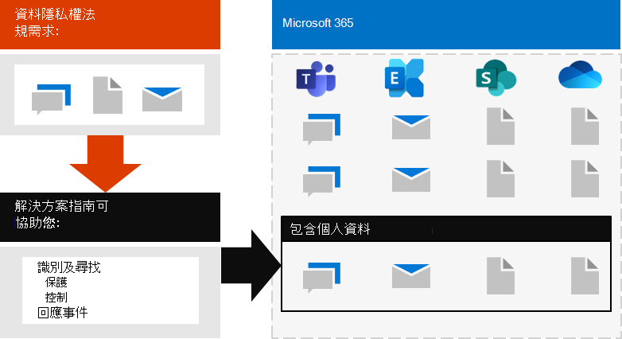

# 使用 Microsoft 365 部署資料隱私權法規的資訊保護Deploy information protection for data privacy regulations with Microsoft 365

您的組織可能會受到區域資料隱私權法規的制約，需要您保護、管理及提供對您的 IT 基礎結構（包括內部部署和雲端）中儲存的個人資訊的權利及控制。Your organization may be subject to regional data privacy regulations that require you to protect, manage, and provide rights and control over personal information stored in your IT infrastructure, including both on-premises and in the cloud. 資料隱私權規定的最佳範例是歐盟的一般資料保護規定（GDPR）。The best example of a data privacy regulation is the European Union's General Data Protection Regulation (GDPR). 無法遵守資料隱私權規定可能會造成大量罰款。Failure to comply with data privacy regulations can result in substantial fines.

365 Microsoft 團隊中的資料類型範例包括 Microsoft 團隊、Exchange 中的電子郵件，以及 SharePoint 和 OneDrive 中的檔案。Examples of the types of data in Microsoft 365 include chat sessions in Microsoft Teams, emails in Exchange, and files in SharePoint and OneDrive. 此解決方案提供有關如何針對 Microsoft 365 服務中儲存的個人資料（受限於資料隱私權法規）識別、尋找、保護、管理及回應資料隱私權事件的指導方針。This solution provides guidance on how to identify, locate, protect, govern, and respond to data privacy incidents for personal data stored in Microsoft 365 services that is subject to data privacy regulations.

其他資訊也會提供使用 Microsoft 365 身分識別、裝置和威脅防護控制的資料隱私權需求。Additional information is also provided on the use of Microsoft 365 identity, device, and threat protection controls for your data privacy needs. 

若要符合保護資訊以符合資料隱私權規定的準則，請使用下列 Microsoft 365 功能。To meet the criteria for protecting information for compliance with data privacy regulations, use these Microsoft 365 capabilities and features.

| 功能Capability or feature | 描述Description | 授權Licensing |
|:-------|:-----|:-------|
| 合規性管理員Compliance Manager | 使用 Microsoft 服務信任入口網站中的工作流程型風險評估工具，管理與 Microsoft cloud services 相關的規章遵循活動。Manage regulatory compliance activities related to Microsoft cloud services with this workflow-based risk assessment tool in the Microsoft Service Trust Portal. | Microsoft 365 E3 和 E5Microsoft 365 E3 and E5 |
| 合規性分數 (預覽)Compliance Score (preview) | 請參閱您目前規範設定的整體分數和建議，以在 Microsoft 365 規範中心內改進。See an overall score of your current compliance configuration and recommendations for improving it in the Microsoft 365 Compliance Center. | Microsoft 365 E3 和 E5Microsoft 365 E3 and E5 |
| Office 高級威脅防護（ATP）Office Advanced Threat Protection (ATP) | 保護您的 Microsoft 365 應用程式和資料（例如電子郵件、Office 檔和共同作業工具）免受攻擊。Protect your Microsoft 365 apps and data—such as email messages, Office documents, and collaboration tools—from attack. | Microsoft 365 E3 和 E5Microsoft 365 E3 and E5 | 
| 敏感度標籤Sensitivity labels | 分類及保護您組織的資料，而不會因在電子郵件、檔案或網站上放置具有不同保護層級的標籤，而阻礙使用者的生產力和其共同作業的能力。Classify and protect your organization's data without hindering the productivity of users and their ability to collaborate by placing labels with various levels of protection on email, files, or sites. | Microsoft 365 E3 和 E5Microsoft 365 E3 and E5 |
| 資料遺失防護（DLP）Data Loss Protection (DLP) | 偵測、警告和封鎖危險、不慎或不適當的共用，例如內部及外部包含個人資訊的資料共用。Detect, warn, and block risky, inadvertent, or inappropriate sharing, such as sharing of data containing personal information, both internally and externally. | Microsoft 365 E3 和 E5Microsoft 365 E3 and E5 | 
| 資料保留標籤和原則Data retention labels and policies | 實施資訊控管控制措施，例如，將個人資料的資料和需求保留多久，以符合組織的原則或資料法規。Implement information governance controls, such as how long to keep data and requirements on the storage of personal data on customers, to comply with your organization's policies or data regulations. | Microsoft 365 E3 和 E5Microsoft 365 E3 and E5 |
| 電子郵件加密Email encryption | 在組織內部和外部的人員之間傳送和接收已加密的電子郵件，包含管制資料，例如客戶上的個人資料。Send and receive encrypted email messages between people inside and outside your organization that contains regulated data, such as personal data on customers. | Microsoft 365 E3 和 E5Microsoft 365 E3 and E5 |
||||

## 此解決方案中指導方針的組織Organization of the guidance in this solution

為了協助您瞭解可供您識別、管理、控制及監視個人資料是否受一或多項隱私權相關的法規制約的 Microsoft 365 工具，本指南會組織成幾節。To help you understand the Microsoft 365 tools available to identify, manage, control, and monitor personal data subject to one or more privacy-related regulations, this guidance is organized into sections.
 

每個章節都對應此方案中的個別文章。Each of these sections correspond to a separate article in this solution.

>[!Note]
>如果您已熟悉資料隱私權的義務，並正針對現有的計畫執行，您可能想要將重點放在預防、保護、保留及調查指導方針上。If you are already familiar with your data privacy obligations and are executing against an existing plan, you may want to focus on the Prevent, Protect, Retain, and Investigate guidance.

>[!Important]
>遵循此指導方針不一定會使您符合任何資料隱私權規定，尤其是考慮功能環境以外的必要步驟數目。Following this guidance will not necessarily make you compliant with any data privacy regulation, especially considering the number of steps required that are outside the context of the features. 您負責確定法規遵從性，並向您的法律和合規性小組請教，或從協力廠商尋求規範的指導方針和建議。You are responsible for ensuring your compliance and to consult your legal and compliance teams or to seek guidance and advice from third parties that specialize in compliance.
>

## 規劃：評估資料隱私權風險及識別敏感專案Plan: Assess data privacy risks and identify sensitive items 

評估貴組織所需的資料隱私權規定和風險，是開始實施增強功能（包括透過 Microsoft 365 設定可實現）的重要第一步。Assessing data privacy regulations and risks that your organization is subject to is a key first step to take before starting to implement improvements, including those achievable through Microsoft 365 configuration. 這可能包括您的組織需要遵守之監管控制的整體準備工作或特定機密資訊類型的識別，以及在 Microsoft 365 環境中的出現。This may include an overall readiness assessment or identification of particular sensitive information types that are subject to regulatory controls your organization needs to comply with, as well as the occurrence of them in your Microsoft 365 environment.

如需詳細資訊，請參閱[評估資料隱私權風險及識別敏感專案](information-protection-deploy-assess.md)。For more information, see [Assess data privacy risks and identify sensitive items](information-protection-deploy-assess.md).

## 追蹤：使用合規性分數和合規性管理員Track: Use Compliance Score and Compliance Manager 

合規性分數和合規性管理員提供一組整合的工具，可在 Microsoft 365 合規性系統管理中心和服務信任入口網站中使用。Compliance Score and Compliance Manager provide an integrated set of tools available in the Microsoft 365 Compliance admin center and Services Trust Portal. 這些工具共同為您提供內建的功能，可以追蹤和管理整體的整體功能，以及與您所進行的多個資料隱私權法規相關的功能。Together, these tools provide you with a built-in ability to track and manage improvement actions overall as well as those related to multiple data privacy regulations to which you are subjected.

這些工具也可讓您利用各項法規特有的內建評估範本，您可以在其中追蹤選取的每個評估範本的動作專案，以及查看特定的規章控制項，並將它們與特定動作相關聯。The tools also allow you to leverage built in assessment templates specific to each regulation, where you can track action items for each assessment template selected, as well as view specific regulatory controls, and relate them to specific actions.

如需詳細資訊，請參閱[使用合規性分數和合規性管理員管理改進動作](information-protection-deploy-compliance.md)。For more information, see [Use Compliance Score and Compliance Manager to manage improvement actions](information-protection-deploy-compliance.md).

## 禁止：針對資料隱私權規定使用身分識別、裝置和威脅防護Prevent: Use identity, device, and threat protection for data privacy regulation

Microsoft 365 提供許多身分識別、裝置和威脅防護功能，可讓您用來協助遵守資料隱私權法規合規性。Microsoft 365 provides a number of identity, device, and threat protection capabilities that you can use to help comply with data privacy regulatory compliance. 

如需詳細資訊，請參閱[使用身分識別、裝置和威脅防護以取得資料隱私權規定](information-protection-deploy-identity-device-threat.md)。For more information, see [Use identity, device, and threat protection for data privacy regulation](information-protection-deploy-identity-device-threat.md).

本文簡短說明這些方面的資料隱私權法規一般會通話的內容，並提供相關 Microsoft 365 解決方案的清單，並提供詳細資訊的連結，可協助您處理任何執行需求。This article briefly describes what the data privacy regulations generally call for in these areas and provides a listing of related Microsoft 365 solutions, with links to more information to help you address any implementation requirements. 

## 保護受資料隱私權法規制約的資訊Protect information subject to data privacy regulation

資料隱私權規定是指可在您的環境中使用的許多個人資訊保護控制項，包含超過40保護 GDPR 的範例集合中的四個數據隱私權規定、加州消費者保護法（美國衛生保健隱私權法案）和巴西資料保護法案（LGPD）等各項的資訊控制。Data privacy regulations dictate a number of personal information protection controls that can be employed in your environment, including more than forty Protect Information controls across just the four data privacy regulations in our sample set of GDPR, California Consumer Protection Act (CCPA), HIPAA-HITECH (United States health care privacy act), and the Brazil Data Protection Act (LGPD).

如需詳細資訊，請參閱[保護您組織中的資料隱私權法規的資訊](information-protection-deploy-protect-information.md)。For more information, see [Protect information subject to data privacy regulation in your organization](information-protection-deploy-protect-information.md).

本文將說明可用於為組織中的資料保密的資訊保護需求提供主要控制項架構。This article lays out the main control schemes that can be used for addressing information protection needs for data privacy in your organization.

## 保留：管理受資料隱私權法規制約的資訊Retain: Govern information subject to data privacy regulation

針對您的環境可採用的個人資訊控管，資料隱私權法規的呼叫，包括 GDPR、CCPA、HIPAA-高科技的範例，以及 LGPD 的四個數據隱私權規定中的超過二十五個控制措施。Data privacy regulations call for personal information governance controls that can be employed in your environment, including more than twenty-four controls across the four data privacy regulations in our sample set of GDPR, CCPA, HIPAA-HITECH, and LGPD.

如需詳細資訊，請參閱[管理組織中的資料隱私權規定所遵循的資訊](information-protection-deploy-govern.md)。For more information, see [Govern information subject to data privacy regulation in your organization](information-protection-deploy-govern.md).

在資訊控管（如惡意保留、刪除及封存）上可能會有不明確的資料隱私權規定 &mdash; ， &mdash; 本文將展示主要控制項架構，您可以針對組織中的資料隱私權使用位址資訊管理需求。While the data privacy regulations can be vague regarding information governance&mdash;such as purposeful retention, deletion and archiving&mdash;this article lays out the primary control schemes that you can use address information governance needs for data privacy in your organization.

## 調查：監控並回應資料隱私權法規的使用Investigate: Monitor and respond subject to data privacy regulation

在您 operationalize 相關功能時，有一些 Microsoft 365 功能可協助您監視、調查組織中的資料隱私權事件，並加以回應。There are Microsoft 365 features available to help you monitor, investigate, and respond to data privacy incidents in your organization as you operationalize related capabilities. 

針對上述各項，具有程式、程式及其他檔，都很重要，都是示範規章主體的合規性。Having processes, procedures, and other documentation for each of these can be important to demonstrate compliance to regulatory bodies.

如需詳細資訊，請參閱[監視並回應組織中的資料隱私權事件](information-protection-deploy-monitor-respond.md)。For more information, see [Monitor and respond to data privacy incidents in your organization](information-protection-deploy-monitor-respond.md).
