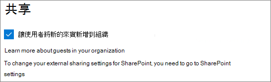
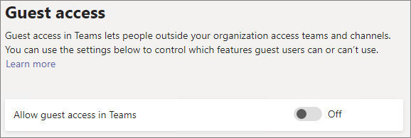
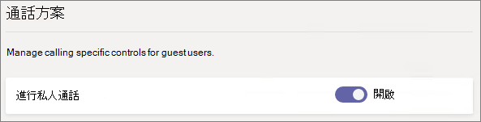
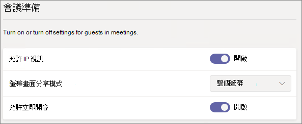
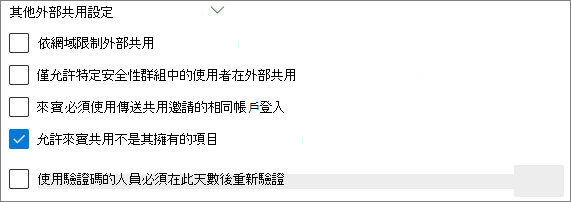
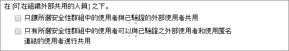

# Microsoft 365 來賓共用設定參考Microsoft 365 guest sharing settings reference

本文提供了可能影響與組織外的部人員共用 Microsoft 365 工作負載的各種設定參考：Teams、Office 365 Groups、SharePoint 和 OneDrive。This article provides a reference for the various settings that can affect sharing with people outside your organization for the Microsoft 365 workloads: Teams, Office 365 Groups, SharePoint, and OneDrive. 這些設定位於 Azure Active Directory、Microsoft 365、Teams 和 SharePoint 系統管理中心。These settings are located in the Azure Active Directory, Microsoft 365, Teams, and SharePoint admin centers.

## Azure Active DirectoryAzure Active Directory

**系統管理員角色：** 全域系統管理員**Admin role:** Global administrator

Azure Active Directory 是 Microsoft 365 所使用的目錄服務。Azure Active Directory is the directory service used by  Microsoft 365. Azure Active Directory 組織關聯性設定會直接影響 Teams、Office 365 群組、SharePoint 和 OneDrive 中的共用。The Azure Active Directory Organizational relationships settings directly affect sharing in Teams, Office 365 Groups, SharePoint, and OneDrive.

> [!NOTE]
> 這些設定只有在已設定 [SharePoint 和 OneDrive 整合搭配 Azure AD B2B (預覽)](https://docs.microsoft.com/sharepoint/sharepoint-azureb2b-integration-preview) 時才會影響 SharePoint。These settings only affect SharePoint when [SharePoint and OneDrive integration with Azure AD B2B (Preview)](https://docs.microsoft.com/sharepoint/sharepoint-azureb2b-integration-preview) has been configured. 下表假設已進行此設定。The table below assumes that this has been configured.

### 組織關聯性設定Organizational relationships settings

**瀏覽：**[Azure Active Directory 系統管理中心](https://aad.portal.azure.com) > [Azure Active Directory] > [組織關聯性] > [設定]**Navigation:** [Azure Active Directory admin center](https://aad.portal.azure.com) > Azure Active Directory > Organizational relationships > Settings

|**設定****Setting**|**預設值****Default**|**描述****Description**|
|:-----|:-----|:-----|
|來賓使用者權限受限Guest users permissions are limited|是Yes|此設定會影響來賓可以執行的目錄工作。This setting affects the directory tasks that a guest can perform.|
|系統管理員與來賓邀請者角色中的使用者可以邀請Admins and users in the guest inviter role can invite|是Yes|設為 [是]\*\*\*\* 時，系統管理員可以透過 Azure AD 和透過 Microsoft 365 共用體驗 (例如 Teams 和 SharePoint) 邀請來賓；設為 [否]\*\*\*\* 時則無法。When set to **Yes**, admins can invite guests via Azure AD and via  Microsoft 365 sharing experiences such as Teams and SharePoint; when set to **No**, they cannot.|
|成員可以邀請Members can invite|是Yes|設為 [是]\*\*\*\* 時，Azure AD 成員可以透過 Azure AD 邀請來賓；設為 [否]\*\*\*\* 時，則無法邀請。When set to **Yes**, Azure AD members can invite guests via Azure AD; when set to **No**, they cannot. 設為 [是]\*\*\*\* 時，Office 365 群組成員可以邀請具有擁有者核准的來賓；設為 [否]\*\*\*\* 時，Office 365 群組成員可以邀請具有擁有者核准的來賓，但擁有者必須是全域系統管理員，才能進行核准。When set to **Yes**, Office 365 Group members can invite guests with owner approval; when set to **No**, Office 365 Group members can invite guests with owner approval but owners must be global administrators to approve.   請注意，**成員可以邀請**是指 Azure AD 中的成員 (相對於來賓)，而非 Microsoft 365 中的網站或群組成員。Note that **Members can invite** refers to members in Azure AD (as opposed to guests) and not to site or group members in  Microsoft 365.   這與 Microsoft 365 安全性與隱私權中的 [讓使用者將新的來賓新增到組織]\*\*\*\* 設定完全相同。This is identical to the **Let users add new guests to the organization** setting in Microsoft 365 Security & privacy.|
|來賓可以邀請Guests can invite|是Yes|設為 [是]\*\*\*\* 時，目錄中的來賓可以邀請其他來賓在 Azure AD 資源上以及在 SharePoint 和 OneDrive 中的檔案和資料夾上共同作業；設為 [否]\*\*\*\* 時則無法。When set to **Yes**, guests in the directory can invite other guests to collaborate on Azure AD resources and on files and folders in SharePoint and OneDrive; when set to **No**, they cannot.   請注意，必須在 SharePoint 系統管理中心開啟 [允許外部使用者輸入完全相符的電子郵件地址以尋找目錄中的使用者帳戶]\*\*\*\*，來賓才能與其他來賓共用檔案和資料夾。Note that **Allow external users to find user accounts in the directory by typing in exact email address matches** must be turned on in the SharePoint admin center for guests to share files and folders with other guests.|
|為來賓啟用電子郵件一次性密碼 (預覽)Enable Email One-Time Passcode for guests (Preview)|否No|設為 [是]\*\*\*\* 時，沒有 MSA 或公司或學校帳戶的來賓可以[使用一次性密碼向 Azure AD 進行驗證](https://docs.microsoft.com/azure/active-directory/b2b/one-time-passcode)；設為 [否]\*\*\*\* 時，使用者將必須建立 Microsoft 帳戶才能進行驗證。When set to **Yes**, guests without an MSA or a work or school account can [authenticate with Azure AD using a one-time passcode](https://docs.microsoft.com/azure/active-directory/b2b/one-time-passcode); when set to **No**, users will need to create a Microsoft account in order to authenticate. 此設定必須設為 [是]\*\*\*\*，[SharePoint 和 OneDrive 整合搭配 Azure AD B2B (預覽)](https://docs.microsoft.com/sharepoint/sharepoint-azureb2b-integration-preview) 才能運作。This setting must be set to **Yes** for [SharePoint and OneDrive integration with Azure AD B2B (Preview)](https://docs.microsoft.com/sharepoint/sharepoint-azureb2b-integration-preview) to work.|
|共同作業限制Collaboration restrictions|允許傳送邀請給任何網域Allow invitations to be sent to any domain|此設定可讓您針對共用指定允許或封鎖的網域清單。This setting allows you to specify a list of allowed or blocked domains for sharing. 指定允許的網域時，則只可以將共用邀請傳送至這些網域。When allowed domains are specified, then sharing invitations can only be sent to those domains. 指定拒絕的網域時，則無法將共用邀請傳送至這些網域。When denied domains are specified, then sharing invitations cannot be sent to those domains.   此設定會影響 Microsoft 365 共用體驗 (例如 Teams 和 SharePoint)。This setting affects  Microsoft 365 sharing experiences such as Teams and SharePoint. 您可以使用 SharePoint 或 Teams 中的網域篩選，以更細微的層級允許或封鎖網域。You can allow or block domains at a more granular level by using domain filtering in SharePoint or Teams.|

這些設定會影響使用者獲邀請加入目錄的方式。These settings affect how users are invited to the directory. 它們不會影響與已在目錄中的來賓共用。They do not affect sharing with guests who are already in the directory.

## Microsoft 365Microsoft 365

**系統管理員角色：** 全域系統管理員**Admin role:** Global administrator

Microsoft 365 系統管理中心有用於共用和用於 Office 365 群組的組織層級設定。The Microsoft 365 admin center has organization-level settings for sharing and for Office 365 Groups.

### 共用Sharing

**瀏覽：**[Microsoft 365 系統管理中心](https://admin.microsoft.com) > [設定] > [設定] > [安全性與隱私權] 索引標籤 > [共用]**Navigation:** [Microsoft 365 admin center](https://admin.microsoft.com) > Settings > Settings > Security & privacy tab > Sharing

|**設定****Setting**|**預設值****Default**|**描述****Description**|
|:-----|:-----|:-----|
|讓使用者將新的來賓新增到組織Let users add new guests to the organization|開啟On|設為 [是]\*\*\*\* 時，Azure AD 成員可以透過 Azure AD 邀請來賓；設為 [否]\*\*\*\* 時，則無法邀請。When set to **Yes**, Azure AD members can invite guests via Azure AD; when set to **No**, they cannot. 設為 [是]\*\*\*\* 時，Office 365 群組成員可以邀請具有擁有者核准的來賓；設為 [否]\*\*\*\* 時，Office 365 群組成員可以邀請具有擁有者核准的來賓，但擁有者必須是全域系統管理員，才能進行核准。When set to **Yes**, Office 365 Group members can invite guests with owner approval; when set to **No**, Office 365 Group members can invite guests with owner approval but owners must be global administrators to approve.   請注意，**成員可以邀請**是指 Azure AD 中的成員 (相對於來賓)，而非 Microsoft 365 中的網站或群組成員。Note that **Members can invite** refers to members in Azure AD (as opposed to guests) and not to site or group members in  Microsoft 365.   這與 Azure Active Directory 組織關聯性設定中的 [成員可以邀請]\*\*\*\* 設定完全相同。This is identical to the **Members can invite** setting in Azure Active Directory Organizational relationships settings.|

### Office 365 群組Office 365 Groups

**瀏覽：**[Microsoft 365 系統管理中心](https://admin.microsoft.com) > [設定] > [設定] > [Office 365 群組]**Navigation:** [Microsoft 365 admin center](https://admin.microsoft.com) > Settings > Settings > Office 365 Groups

|**設定****Setting**|**預設值****Default**|**描述****Description**|
|:-----|:-----|:-----|
|讓貴組織外部的群組成員存取群組內容Let group members outside your organization access group content|開啟On|設為 [開啟]\*\*\*\* 時，來賓可以存取群組內容；設為 [否]\*\*\*\* 時，則無法存取。When set to **On**, guests can access groups content; when set to **Off**, they can't. 針對來賓使用者會與 Office 365 群組或 Teams 互動的案例，此設定應該為 [開啟]\*\*\*\*。This setting should be **On** for any scenario where guest users are interacting with Office 365 Groups or Teams.|
|讓群組擁有者將貴組織外部的人員新增到群組Let group owners add people outside your organization to groups|開啟On|[開啟]\*\*\*\* 時，Office 365 群組或 Teams 的擁有者可以邀請新來賓加入群組。When **On**, Owners of Office 365 Groups or Teams can invite new guests to the group. [關閉]\*\*\*\* 時，擁有者只能邀請已在目錄中的來賓。When **Off**, owners can only invite guests who are already in the directory.|

這些設定是在組織層級。These settings are at the organization level. 如需如何使用 PowerShell 在群組層級變更這些設定的詳細資訊，請參閱[建立特定群組的設定](https://docs.microsoft.com/azure/active-directory/users-groups-roles/groups-settings-cmdlets#create-settings-for-a-specific-group)。See [Create settings for a specific group](https://docs.microsoft.com/azure/active-directory/users-groups-roles/groups-settings-cmdlets#create-settings-for-a-specific-group) for information about how to change these settings at the group level by using PowerShell.

## TeamsTeams

Teams 的主要來賓存取切換 [在 Teams 中允許來賓存取]\*\*\*\*，必須為 [開啟]\*\*\*\*，其他來賓設定才可供使用。The Teams master guest access switch, **Allow guest access in Teams**, must be **On** for the other guest settings to be available.

**系統管理員角色：** Teams 服務系統管理員**Admin role:** Teams service administrator

### 來賓存取Guest access

**瀏覽：**[Teams 系統管理中心](https://admin.teams.microsoft.com) > [整個組織的設定] > [來賓存取]**Navigation:** [Teams admin center](https://admin.teams.microsoft.com) > Org-wide settings > Guest access

|**設定****Setting**|**預設值****Default**|**描述****Description**|
|:-----|:-----|:-----|
|在 Teams 中允許來賓存取Allow guest access in Teams|關閉Off|為 Teams 整體開啟或關閉來賓存取。Turns guest access on or off for Teams overall. 一旦變更，此設定可能需要 24 小時才會生效。This setting can take 24 hours to take effect once changed.|

### 來賓呼叫Guest calling

**瀏覽：**[Teams 系統管理中心](https://admin.teams.microsoft.com) > [整個組織的設定] > [來賓存取]**Navigation:** [Teams admin center](https://admin.teams.microsoft.com) > Org-wide settings > Guest access

|**設定****Setting**|**預設值****Default**|**描述****Description**|
|:-----|:-----|:-----|
|進行私人通話Make private calls|開啟On|[開啟]\*\*\*\* 時，來賓可以在 Teams 中進行點對點呼叫；[關閉]\*\*\*\* 時則無法。When **On**, guests can make peer-to-peer calls in Teams; when **Off**, they can't.|

### 來賓會議Guest meeting

**瀏覽：**[Teams 系統管理中心](https://admin.teams.microsoft.com) > [整個組織的設定] > [來賓存取]**Navigation:** [Teams admin center](https://admin.teams.microsoft.com) > Org-wide settings > Guest access

|**設定****Setting**|**預設值****Default**|**描述****Description**|
|:-----|:-----|:-----|
|允許 IP 視訊Allow IP video|開啟On|[開啟]\*\*\*\* 時，來賓可以在通話與會議中使用影片；[關閉]\*\*\*\* 時則無法。When **On**, guests can use video in their calls and meetings; when **Off**, they can't.|
|螢幕畫面分享模式Screen sharing mode|整個螢幕Entire screen|[已停用]\*\*\*\* 時，來賓無法在 Teams 中共用螢幕畫面。When **Disabled**, guests can't share their screens in Teams. 設為 [單一應用程式]\*\*\*\* 時，來賓只可以在其螢幕上共用單一應用程式。When set to **Single application**, guests can only share a single application on their screen. 設為 [整個螢幕]\*\*\*\* 時，來賓可以選擇共用應用程式或其整個螢幕。When set to **Entire screen**, guests can choose to share an application or their entire screen.|
|允許立即開會Allow Meet Now|開啟On|[開啟]\*\*\*\* 時，來賓可以在 Teams 中使用立即開會功能；[關閉]\*\*\*\* 時則無法。When **On**, guests can use the Meet Now feature in Teams; when **Off**, they can't.|

### 來賓訊息Guest messaging

**瀏覽：**[Teams 系統管理中心](https://admin.teams.microsoft.com) > [整個組織的設定] > [來賓存取]**Navigation:** [Teams admin center](https://admin.teams.microsoft.com) > Org-wide settings > Guest access

|**設定****Setting**|**預設值****Default**|**描述****Description**|
|:-----|:-----|:-----|
|編輯已傳送的訊息Edit sent messages|開啟On|[開啟]\*\*\*\* 時，來賓可以編輯其之前傳送的郵件；[關閉]\*\*\*\* 時則無法。When **On**, guests can edit messages they previously sent; when **Off**, they can't.|
|刪除已傳送的訊息Delete sent messages|開啟On|[開啟]\*\*\*\* 時，來賓可以刪除其之前傳送的郵件；[關閉]\*\*\*\* 時則無法。When **On**, guests can delete messages they previously sent; when **Off**, they can't.|
|聊天Chat|開啟On|[開啟]\*\*\*\* 時，來賓可以在 Teams 中使用聊天；[關閉]\*\*\*\* 時則無法。When **On**, guests can use chat in Teams; when **Off**, they can't.|
|在交談中使用 GiphyUse Giphys in conversations|開啟On|[開啟]\*\*\*\* 時，來賓可以在交談中使用 Giphy；[關閉]\*\*\*\* 時則無法。When **On**, guests can use Giphys in conversations; when **Off**, they can't.|
|Giphy 內容分級Giphy content rating|中等Moderate|設為 [允許所有內容]\*\*\*\* 時，來賓可以在聊天中插入所有 Giphy，而無論內容分級為何。When set to **Allow all content**, guests will can insert all Giphys in chats, regardless of the content rating. 設為 [中等]\*\*\*\* 時，來賓可以在聊天中插入 Giphy，但會適當限制成人內容。When set to **Moderate** guests can insert Giphys in chats, but will be moderately restricted from adult content. 設為 [嚴格]\*\*\*\* 時，來賓可以在聊天中插入 Giphy，但會限制插入成人內容。When set to **Strict** guests can insert Giphys in chats, but will be restricted from inserting adult content.|
|在交談中使用 MemeUse Memes in conversations|開啟On|[開啟]\*\*\*\* 時，來賓可以在交談中使用 Meme；[關閉]\*\*\*\* 時則無法。When **On**, guests can use memes in conversations; when **Off**, they can't.|
|在交談中使用貼圖User stickers in conversations|開啟On|[開啟]\*\*\*\* 時，來賓可以在交談中使用貼圖；[關閉]\*\*\*\* 時則無法。When **On**, guests can use stickers in conversations; when **Off**, they can't.|
|允許用於檢視訊息的沈浸式閱讀程式Allow immersive reader for viewing messages|開啟On|[開啟]\*\*\*\* 時，來賓可以在沈浸式閱讀程式中檢視郵件；[關閉]\*\*\*\* 時則無法。When **On**, guests can view messages in Immersive Reader; when **Off**, they can't.|

## SharePoint 和 OneDrive (組織層級)SharePoint and OneDrive (organization-level)

**系統管理員角色：** SharePoint 系統管理員**Admin role:** SharePoint administrator

這些設定會影響組織中所有的網站。These settings affect all of the sites in the organization. 它們不會直接影響 Office 365 群組或 Teams，但我們建議您調整這些設定，以配合 Office 365 群組和 Teams 的設定，以避免使用者遇到問題。They do not affect Office 365 Groups or Teams directly, however we recommend that you align these settings with the settings for Office 365 Groups and Teams to avoid user experience issues. (比方說，如果在 Teams 允許來賓共用但未在 SharePoint 中允許，那麼，Teams 中的來賓將無法存取 [檔案] 索引標籤，因為 Teams 檔案是儲存在 SharePoint 中。)(For example, if guest sharing is allowed in Teams but not SharePoint, then guests in Teams will not have access to the Files tab because Teams files are stored in SharePoint.)

### SharePoint 和 OneDrive 共用設定SharePoint and OneDrive sharing settings

由於 OneDrive 是 SharePoint 內網站的階層，正如同其他 SharePoint 網站，組織層級共用設定會直接影響 OneDrive。Because OneDrive is a hierarchy of sites within SharePoint, the organization-level sharing settings directly affect OneDrive just as they do other SharePoint sites.

**瀏覽：** SharePoint 系統管理中心 > [共用]**Navigation:** SharePoint admin center > Sharing

|**設定****Setting**|**預設值****Default**|**描述****Description**|
|:-----|:-----|:-----|
|SharePointSharePoint|任何人Anyone|指定對 SharePoint 網站允許的最寬鬆共用權限。Specifies the most permissive sharing permissions allowed for SharePoint sites.|
|OneDriveOneDrive|任何人Anyone|指定對 OneDrive 網站允許的最寬鬆共用權限。Specifies the most permissive sharing permissions allowed for OneDrive sites. 此設定不能較 SharePoint 設定更寬鬆。This setting cannot be more permissive than the SharePoint setting.|

### SharePoint 和 OneDrive 進階共用設定SharePoint and OneDrive advanced sharing settings

**瀏覽：** SharePoint 系統管理中心 > [共用]**Navigation:** SharePoint admin center > Sharing

|**設定****Setting**|**預設值****Default**|**描述****Description**|
|:-----|:-----|:-----|
|依網域限制外部共用Limit external sharing by domain|關閉Off|此設定可讓您針對共用指定允許或封鎖的網域清單。This setting allows you to specify a list of allowed or blocked domains for sharing. 指定允許的網域時，則只可以將共用邀請傳送至這些網域。When allowed domains are specified, then sharing invitations can only be sent to those domains. 指定拒絕的網域時，則無法將共用邀請傳送至這些網域。When denied domains are specified, then sharing invitations cannot be sent to those domains.   此設定會影響組織中的所有 SharePoint 和 OneDrive 網站。This setting affects all SharePoint and OneDrive sites in the organization.|
|來賓必須使用傳送共用邀請的相同帳戶登入Guests must sign in using the same account to which sharing invitations are sent|關閉Off|防止來賓使用與邀請所傳送對象不同的電子郵件地址兌換網站共用邀請。Prevents guests from redeeming site sharing invitations using a different email address than the invitation was sent to.  [SharePoint 和 OneDrive 整合搭配 Azure AD B2B (預覽)](https://docs.microsoft.com/sharepoint/sharepoint-azureb2b-integration-preview) 不會使用此設定，因為所有來賓都會根據傳送邀請的目標電子郵件地址新增至目錄。[SharePoint and OneDrive integration with Azure AD B2B (Preview)](https://docs.microsoft.com/sharepoint/sharepoint-azureb2b-integration-preview) does not use this setting because all guests are added to the directory based on the email address that the invitation was sent to. 備用電子郵件地址無法用來存取網站。Alternate email addresses cannot be used to access the site.|
|允許來賓共用不是其擁有的項目Allow guests to share items they don't own|開啟On|[開啟]\*\*\*\* 時，來賓可以與其他使用者或來賓共用他們未擁有的項目；[關閉]\*\*\*\* 時則無法。When **On**, guests can share items that they don't own with other users or guests; when **Off** they cannot. 來賓一律可以共用其具有完全控制的項目。Guests can always share items for which they have full control.|

### SharePoint 和 OneDrive 檔案和資料夾連結設定SharePoint and OneDrive file and folder link settings

在 SharePoint 和 OneDrive 中共用檔案與資料夾時，系統會傳送帶有檔案或資料夾權限的連結給共用收件者，而非為他們授與檔案或資料夾的直接存取權。When files and folders are shared in SharePoint and OneDrive, sharing recipients are sent a link with permissions to the file or folder rather than being granted direct access to the file or folder themselves. 有數個類型的連結可供使用，並且您可以選擇使用者共用檔案或資料夾時要向使用者顯示的預設連結類型。Several types of links are available, and you can choose the default link type presented to users when they share a file or folder. 您也可以為 [任何人]\*\* 連結設定權限和到期選項。You can also set permissions and expiration options for *Anyone* links.

**瀏覽：** SharePoint 系統管理中心 > [共用]**Navigation:** SharePoint admin center > Sharing

|**設定****Setting**|**預設值****Default**|**描述****Description**|
|:-----|:-----|:-----|
|檔案與資料夾連結File and folder links|擁有連結的任何人Anyone with the link|指定當使用者共用檔案或資料夾時，預設要顯示的共用連結。Specifies which sharing link is shown by default when a user shares a file or folder. 使用者可以於共用之前變更選項 (如果想要)。Users can change the option before sharing if they want. 如果預設值設為 [擁有連結的任何人]\*\*\*\*，並且對特定網站不允許 [任何人]\*\* 共用，那麼，[只有貴組織中的人員]\*\*\*\* 將顯示為該網站的預設值。If the default is set to **Anyone with the link** and *Anyone* sharing is not allowed for a given site, then **Only people in your organization** will be shown as the default for that site.|
|這些連結必須在此天數內過期These links must expire within this many days|關閉 (無到期日)Off (no expiration)|指定建立 [任何人]\*\* 連結後，其到期的天數。Specifies the number of days after an *Anyone* link is created that it expires. 無法更新到期的連結。Expired links cannot be renewed. 若要在超過到期日時繼續共用，請建立新連結。Create a new link if you need to continue sharing past the expiration.|
|檔案權限File permissions|檢視及編輯View and edit|指定建立 [任何人]\*\* 連結時，使用者可以使用的檔案權限層級。Specifies the file permission levels available to users when creating an *Anyone* link. 如果已選取 [檢視]\*\*\*\*，使用者只能建立具有檢視權限的 [任何人]\*\* 檔案連結。If **View** is selected, then users can only create *Anyone* file links with view permissions. 如果已選取 [檢視及編輯]\*\*\*\*，使用者可以在建立連結時，於檢視和檢視及編輯權限之間選擇。If **View, and edit** is selected, then users can choose between view and view and edit permissions when they create the link.|
|資料夾權限Folder permissions|檢視、編輯及上傳View, edit, and upload|指定建立 [任何人]\*\* 連結時，使用者可以使用的資料夾權限層級。Specifies the folder permission levels available to users when creating an *Anyone* link. 如果已選取 [檢視]\*\*\*\*，使用者只能建立具有檢視權限的 [任何人]\*\* 資料夾連結。If **View** is selected, then users can only create *Anyone* folder links with view permissions. 如果已選取 [檢視、編輯及上傳]\*\*\*\*，使用者可以在建立連結時，於檢視和檢視、編輯及上傳權限之間選擇。If **View, edit, and upload** is selected, then users can choose between view and view, edit, and upload permissions when they creat the link.|

### SharePoint 和 OneDrive 安全性群組設定SharePoint and OneDrive security group settings

如果您想要限制可與 SharePoint 和 OneDrive 中的來賓共用的使用者，您可以將共用限制在特定安全性群組來完成此動作。If you want to limit who can share with guests in SharePoint and OneDrive, you can do so by limiting sharing to people in specified security groups. 這些設定不會影響透過 Office 365 群組或 Teams 共用。These settings do not affect sharing via Office 365 Groups or Teams. 透過群組或團隊邀請的來賓也會可存取相關聯的網站，不過文件和檔案共用只能由指定安全性群組中的人員完成。Guests invited via a group or team would also have access to the associated site, though document and folder sharing could only be done by people in the specified security groups.

**瀏覽：** SharePoint 系統管理中心 > [共用] > [限制特定安全性群組的外部共用]**Navigation:** SharePoint admin center > Sharing > Limit external sharing to specific security groups

|**設定****Setting**|**預設值****Default**|**描述****Description**|
|:-----|:-----|:-----|
|只讓所選安全性群組中的使用者與已驗證的外部使用者共用Let only users in selected security groups share with authenticated external users|關閉Off|[開啟]\*\*\*\* 時，只有在特定安全性群組中的人員可以與外部使用者共用。When **On**, only the people in the specified security groups can share with external users. 只有*特定人員*連結可供使用。Only *Specific people* links are available. 除非 [只有所選安全性群組中的使用者可以與已驗證之外部使用者和使用匿名連結的使用者進行共用]\*\*\*\* 也為 [開啟]\*\*\*\*，否則會停用 [任何人]\*\* 共用*Anyone* sharing is effectively disabled unless **Let only users in selected security groups share with authenticated external users and using anonymous links** is also **On**|
|只有所選安全性群組中的使用者可以與已驗證之外部使用者和使用匿名連結的使用者進行共用Let only users in selected security groups share with authenticated external users and using anonymous links|關閉Off|[開啟]\*\*\*\* 時，只有在特定安全性群組中的人員可以與來賓共用。When **On**, only the people in the specified security groups can share with guests. [任何人]\*\* 和 [特定人員]\*\* 連結都可供使用。Both *Anyone* and *Specific people* links are available.|

可同時使用這兩個設定。Both of these settings can be used at the same time. 如果使用者位於為這兩項設定指定的安全性群組中，則較大的權限層級優先 ([任何人]\*\* 加上 [特定使用者]\*\*)。If a user is in security groups specified for both settings, then the greater permission level prevails (*Anyone* plus *Specific user*).

## SharePoint (網站層級)SharePoint (site level)

**系統管理員角色：** SharePoint 系統管理員**Admin role:** SharePoint administrator

因為這些設定取決於 SharePoint 的全組織設定，如果您的組織層級設定變更，網站生效的共用設定可能會變更。Because these settings are subject to the organization-wide settings for SharePoint, the effective sharing setting for the site may change if the organization-level setting changes. 如果您在這裡選擇某個設定，並且組織層級之後設為較具限制性的值，則此網站會以該較具限制性的值運作。If you choose a setting here and the organization-level is later set to a more restrictive value, then this site will operate at that more restrictive value. 比方說，如果您選擇 [任何人]\*\*\*\*，並且之後組織層級設定設為 [新的及現有的來賓]\*\*\*\*，則此網站將只會允許新的及現有的來賓。For example, if you choose **Anyone** and the organization-level setting is later set to **New and existing guests**, then this site will only allow new and existing guests. 如果之後將組織層級設定設回 [任何人]\*\*\*\*，此網站將再次允許 [任何人]\*\* 連結。If the organization-level setting is then set back to **Anyone**, this site would again allow *Anyone* links.

### 網站共用Site sharing

您可以在 SharePoint 中設定每個網站的來賓共用權限。You can set guest sharing permissions for each site in SharePoint. 此設定同時適用網站共用和檔案與資料夾共用。This setting applies to both site sharing and file and folder sharing. ([任何人]\*\* 共用不適用網站共用。(*Anyone* sharing is not available for site sharing. 如果您選擇 [任何人]\*\*\*\*，使用者將可以使用 [任何人]\*\* 連結來與新的及現有的來賓共用檔案與資料夾及網站本身。)If you choose **Anyone**, users will be able to share files and folders by using *Anyone* links, and the site itself with new and existing guests.)

**瀏覽：** SharePoint 系統管理中心 > [使用中網站] > 選取網站 > [原則] 索引標籤 > [編輯外部共用]**Navigation:** SharePoint admin center > Active sites > select the site > Policies tab > Edit External sharing

|**設定****Setting**|**預設值****Default**|**描述****Description**|
|:-----|:-----|:-----|
|網站內容可以與誰共用Site content can be shared with|因網站類型而異 (請參閱下表)Varies by site type (see the table below)|表示對此網站允許的外部共用類型。Indicates the type of external sharing allowed for this site. 此處可用的選項取決於 SharePoint 的組織層級共用設定。Options available here are subject to the organization-level sharing settings for SharePoint.|

### 網站檔案和資料夾連結設定Site file and folder link settings

您可以設定連結類型和權限的預設值，以及每個網站 [任何人]\*\* 連結的到期設定。You can set defaults for link type and permissions, and expiration settings for *Anyone* links for each site. 在網站層級設定時，這些設定會覆寫組織層級設定。When set at the site level, these settings override the organization-level settings. 請注意，如果在組織層級停用 [任何人]\*\* 連結，則 [任何人]\*\* 不會是網站層級的可用連結類型。Note that if *Anyone* links are disabled at the organization level, *Anyone* will not be an available link type at the site level.

**瀏覽：** SharePoint 系統管理中心 > [使用中網站] > 選取網站 > [原則] 索引標籤 > [編輯外部共用]**Navigation:** SharePoint admin center > Active sites > select the site > Policies tab > Edit External sharing

|**設定****Setting**|**預設值****Default**|**描述****Description**|
|:-----|:-----|:-----|
|依網域限制共用Limit sharing by domain|關閉Off|此設定可讓您針對共用指定允許或封鎖的網域清單。This setting allows you to specify a list of allowed or blocked domains for sharing. 指定允許的網域時，則只可以將共用邀請傳送至這些網域。When allowed domains are specified, then sharing invitations can only be sent to those domains. 指定拒絕的網域時，則無法將共用邀請傳送至這些網域。When denied domains are specified, then sharing invitations cannot be sent to those domains.   此設定不能用來覆寫在組織或 Azure AD 層級設定的網域限制。This setting cannot be used to override domain restrictions set at the organization or Azure AD level.|
|預設的共用連結類型Default sharing link type|與組織層級設定相同Same as organization-level setting|此設定可讓您指定要向此網站中使用者顯示的預設共用連結。This setting allows you to specify the default sharing link presented to users in this site. [與組織層級設定相同]\*\* 選項，是透過組織和網站共用設定的組合定義。The *Same as organization-level setting* option is defined by a combination of organization and site sharing settings.|
|任何人連結的進階設定Advanced settings for Anyone links|與組織層級設定相同Same as organization-level setting|指定為網站中的檔案建立 [任何人]\*\* 連結後，其到期的天數。Specifies the number of days after an *Anyone* link is created for a file in this site that it expires. 無法更新到期的連結。Expired links cannot be renewed. 若要在超過到期日時繼續共用，請建立新連結。Create a new link if you need to continue sharing past the expiration.|
|預設連結權限Default link permission|與組織層級設定相同Same as organization-level setting|此設定可讓您針對為此網站中的檔案建立的共用連結指定預設權限 (檢視或編輯)。This setting allows you to specify the default permission (View or Edit) for sharing links created for files in this site.|

### 預設網站共用設定Default site sharing settings

下表顯示每個網站類型的預設共用設定的。The table below shows the default sharing setting for each site type.

|**網站類型****Site type**|**預設共用設定****Default sharing setting**|
|:-----|:-----|
|傳統Classic|**只有貴組織中的人員****Only people in your organization**|
|OneDriveOneDrive|**任何人****Anyone**|
|群組連線的網站 (包括 Teams)Group-connected sites (including Teams)|如果 Office 365 群組設定 [讓群組擁有者將組織外部的人員新增到群組]\*\*\*\* 為 [開啟]\*\*\*\*，則為 [新的及現有的來賓]\*\*\*\*；否則為 [僅現有的來賓]\*\*\*\***New and existing guests** if the Office 365 Groups setting **Let group owners add people outside the organization to groups** is **On**; otherwise **Existing guests only**|
|通訊Communication|**只有貴組織中的人員****Only people in your organization**|
|沒有群組的新式網站 (#STS3 TeamSite)Modern sites with no group (#STS3 TeamSite)|**僅限您組織中的人員****Only people in your organization**|

> [!NOTE]
> 根通訊網站 (tenant-name.sharepoint.com) 的預設共用設定為 [任何人]\*\*\*\*。The root communication site (tenant-name.sharepoint.com) has a default sharing setting of **Anyone**.

## 也請參閱See also

[SharePoint 和 OneDrive 外部共用概觀SharePoint and OneDrive external sharing overview](https://docs.microsoft.com/sharepoint/external-sharing-overview)

[Microsoft Teams 中的來賓存取Guest access in Microsoft Teams](https://docs.microsoft.com/MicrosoftTeams/guest-access)

[將來賓新增至 Office 365 群組Adding guests to Office 365 Groups](https://support.office.com/article/bfc7a840-868f-4fd6-a390-f347bf51aff6)
