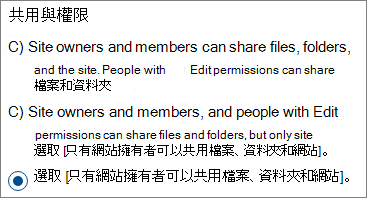

# <a name="limit-sharing-in-microsoft-365"></a><span data-ttu-id="855b6-103">在 Microsoft 365 中限制共用</span><span class="sxs-lookup"><span data-stu-id="855b6-103">Limit sharing in Microsoft 365</span></span>

<span data-ttu-id="855b6-104">雖然您無法完全將內部共用停用，或移除網站的 [共用] 按鈕，但您可以透過多種方式在 Microsoft 365 中限制共用，以符合貴組織的需求。</span><span class="sxs-lookup"><span data-stu-id="855b6-104">While you can't disable internal sharing entirely or remove the Share button from sites, there are a variety of ways that you can limit sharing in Microsoft 365 to meet the needs of your organization.</span></span>

<span data-ttu-id="855b6-105">下表列出共用檔案的方法。</span><span class="sxs-lookup"><span data-stu-id="855b6-105">The methods of sharing files are listed in the table below.</span></span> <span data-ttu-id="855b6-106">如需詳細資訊，請按一下 **[共用方法]** 欄中的連結。</span><span class="sxs-lookup"><span data-stu-id="855b6-106">Click the link in the **Sharing method** column for detailed information.</span></span>

|<span data-ttu-id="855b6-107">共用方法</span><span class="sxs-lookup"><span data-stu-id="855b6-107">Sharing method</span></span>|<span data-ttu-id="855b6-108">描述</span><span class="sxs-lookup"><span data-stu-id="855b6-108">Description</span></span>|<span data-ttu-id="855b6-109">限制選項</span><span class="sxs-lookup"><span data-stu-id="855b6-109">Limiting options</span></span>|
|:-------------|:----------|:-------------|
|[<span data-ttu-id="855b6-110">Microsoft 365 群組或團隊</span><span class="sxs-lookup"><span data-stu-id="855b6-110">Microsoft 365 group or team</span></span>](#microsoft-365-group-or-team)|<span data-ttu-id="855b6-111">獲授與 Microsoft Teams 團隊或 Microsoft 365 群組存取權的人員對於相關聯 SharePoint 網站中的檔案具有編輯存取權。</span><span class="sxs-lookup"><span data-stu-id="855b6-111">People granted access to a Microsoft Teams team or Microsoft 365 group have edit access to files in the associated SharePoint site.</span></span>|<span data-ttu-id="855b6-112">如果群組或團隊是私人的，加入團隊的共用邀請會送往擁有者以進行核准。</span><span class="sxs-lookup"><span data-stu-id="855b6-112">If the group or team is private, sharing invitations to join the team go to the owner for approval.</span></span> <span data-ttu-id="855b6-113">系統管理員可以停用來賓存取或使用敏感度標籤，以防止組織外部的人員存取。</span><span class="sxs-lookup"><span data-stu-id="855b6-113">Admins can disable guest access or use sensitivity labels to prevent access by people from outside the organization.</span></span>|
|[<span data-ttu-id="855b6-114">SharePoint 網站</span><span class="sxs-lookup"><span data-stu-id="855b6-114">SharePoint site</span></span>](#sharepoint-site)|<span data-ttu-id="855b6-115">人員可以獲授與擁有 SharePoint 網站的擁有者、成員或來賓存取，並將擁有網站中檔案的該層級存取權。</span><span class="sxs-lookup"><span data-stu-id="855b6-115">People can be granted Owner, Member, or Visitor access to a SharePoint site and will have that level of access to files in the site.</span></span>|<span data-ttu-id="855b6-116">您可以限制網站權限，以便只有網站擁有者可以共用網站。</span><span class="sxs-lookup"><span data-stu-id="855b6-116">Site permissions can be restricted so that only site owners can share the site.</span></span> <span data-ttu-id="855b6-117">系統管理員可以將網站設為唯讀或完全封鎖存取。</span><span class="sxs-lookup"><span data-stu-id="855b6-117">Admins can set a site to read-only or block access entirely.</span></span>|
|[<span data-ttu-id="855b6-118">與特定人員共用</span><span class="sxs-lookup"><span data-stu-id="855b6-118">Sharing with specific people</span></span>](#sharing-with-specific-people)|<span data-ttu-id="855b6-119">網站成員與擁有編輯權限的人員可以提供檔案和資料夾的直接權限，或使用 *[特定人員]* 連結來共用檔案和資料夾。</span><span class="sxs-lookup"><span data-stu-id="855b6-119">Site members and people with edit permissions can give direct permissions to files and folders or share them by using *Specific people* links.</span></span>|<span data-ttu-id="855b6-120">您可以限制網站權限，以便只有網站擁有者可以共用檔案和資料夾。</span><span class="sxs-lookup"><span data-stu-id="855b6-120">Site permissions can be restricted so that only site owners can share files and folders.</span></span> <span data-ttu-id="855b6-121">在此情況下，由網站成員共用的直接存取和 *[特定人員]* 連結會送往網站擁有者以進行核准。</span><span class="sxs-lookup"><span data-stu-id="855b6-121">In this case, direct access and *Specific people* link sharing by site members goes to site owner for approval.</span></span>|
|[<span data-ttu-id="855b6-122">SharePoint 和 OneDrive 來賓共用</span><span class="sxs-lookup"><span data-stu-id="855b6-122">SharePoint and OneDrive guest sharing</span></span>](#sharepoint-guest-sharing)|<span data-ttu-id="855b6-123">SharePoint 網站擁有者和成員與 OneDrive 擁有者可以與組織外部人員共用檔案和資料夾。</span><span class="sxs-lookup"><span data-stu-id="855b6-123">SharePoint site owners and members and OneDrive owners can share files and folders with people outside the organization.</span></span>|<span data-ttu-id="855b6-124">您可以為整個組織或個別網站停用來賓共用。</span><span class="sxs-lookup"><span data-stu-id="855b6-124">Guest sharing can be disabled for the entire organization or for individual sites.</span></span>|
|<span data-ttu-id="855b6-125">[[貴組織中的人員] 共用連結](#people-in-your-organization-sharing-links)</span><span class="sxs-lookup"><span data-stu-id="855b6-125">[*People in your organization* sharing links](#people-in-your-organization-sharing-links)</span></span>|<span data-ttu-id="855b6-126">SharePoint 網站擁有者和成員可以使用 *[貴組織中的人員]* 連結來共用檔案，此功能適用於組織內部的任何人。</span><span class="sxs-lookup"><span data-stu-id="855b6-126">SharePoint site owners and members can share files using *People in your organization* links, which will work for anyone inside the organization.</span></span>|<span data-ttu-id="855b6-127">可在網站層級停用 *[貴組織中的人員]* 連結。</span><span class="sxs-lookup"><span data-stu-id="855b6-127">*People in your organization* links can be disabled at the site level.</span></span>|
|[<span data-ttu-id="855b6-128">建立網站、群組和小組</span><span class="sxs-lookup"><span data-stu-id="855b6-128">Create sites, groups, and teams</span></span>](#create-sites-groups-and-teams)|<span data-ttu-id="855b6-129">根據預設，使用者可以建立新網站、群組和小組，從中可以共用內容。</span><span class="sxs-lookup"><span data-stu-id="855b6-129">By default, users can create new sites, groups, and teams from which they can share content.</span></span>|<span data-ttu-id="855b6-130">系統管理員可以限制可以建立網站、群組及小組的人員。</span><span class="sxs-lookup"><span data-stu-id="855b6-130">Admins can restrict who can create sites, groups, and teams.</span></span>|
|[<span data-ttu-id="855b6-131">電子郵件</span><span class="sxs-lookup"><span data-stu-id="855b6-131">Email</span></span>](#email)|<span data-ttu-id="855b6-132">具有檔案存取權的人員可以透過電子郵件將檔案傳送給其他人。</span><span class="sxs-lookup"><span data-stu-id="855b6-132">People with access to a file can send it to others via email.</span></span>|<span data-ttu-id="855b6-133">系統管理員可以使用敏感度標籤來加密檔案，以防止將檔案與未經授權的人員共用。</span><span class="sxs-lookup"><span data-stu-id="855b6-133">Admins can encrypt files by using sensitivity labels to prevent them being shared with unauthorized people.</span></span>|
|[<span data-ttu-id="855b6-134">下載或檔案複製</span><span class="sxs-lookup"><span data-stu-id="855b6-134">Download or file copy</span></span>](#download-or-file-copy)|<span data-ttu-id="855b6-135">具有檔案存取權的人員可以下載或複製檔案，並與 Microsoft 365 以外的其他人共用檔案。</span><span class="sxs-lookup"><span data-stu-id="855b6-135">People with access to a file can download or copy it and share it with others outside the scope of Microsoft 365.</span></span>|<span data-ttu-id="855b6-136">系統管理員可以使用敏感度標籤來加密檔案，以防止將檔案與未經授權的人員共用。</span><span class="sxs-lookup"><span data-stu-id="855b6-136">Admins can encrypt files by using sensitivity labels to prevent them being shared with unauthorized people.</span></span>|

<span data-ttu-id="855b6-137">您也可以限制人員存取共用內容的條件。</span><span class="sxs-lookup"><span data-stu-id="855b6-137">You can also restrict the conditions under which people access shared content.</span></span> <span data-ttu-id="855b6-138">如需詳細資訊，請參閱本文後面的 [條件式存取](#conditional-access)。</span><span class="sxs-lookup"><span data-stu-id="855b6-138">See [conditional access](#conditional-access) later in this article for more information.</span></span>

<span data-ttu-id="855b6-139">雖然您可以使用本文所述的系統管理控制項來限制貴組織中的共用，我們高度建議您考慮使用 Microsoft 365 中提供的安全性與合規性功能，以建立安全的共用環境。</span><span class="sxs-lookup"><span data-stu-id="855b6-139">While you can use the admin controls described in this article to limit sharing in your organization, we highly recommend that you consider using the security and compliance features available in Microsoft 365 to create a secure sharing environment.</span></span> <span data-ttu-id="855b6-140">如需詳細資訊，請參閱[在 SharePoint 中使用 Microsoft 365 進行檔案共同作業](/sharepoint/deploy-file-collaboration)和[設定具有安全隔離的團隊](secure-teams-security-isolation.md)。</span><span class="sxs-lookup"><span data-stu-id="855b6-140">See [File collaboration in SharePoint with Microsoft 365](/sharepoint/deploy-file-collaboration) and [Configure a team with security isolation](secure-teams-security-isolation.md) for information.</span></span>

<span data-ttu-id="855b6-141">若要了解貴組織使用共用功能的方式，請[執行有關檔案和資料夾共用的報告](/sharepoint/sharing-reports)。</span><span class="sxs-lookup"><span data-stu-id="855b6-141">To understand how sharing is being used in your organization, [run a report on file and folder sharing](/sharepoint/sharing-reports).</span></span>

## <a name="microsoft-365-group-or-team"></a><span data-ttu-id="855b6-142">Microsoft 365 群組或團隊</span><span class="sxs-lookup"><span data-stu-id="855b6-142">Microsoft 365 group or team</span></span>

<span data-ttu-id="855b6-143">如果想要限制 Microsoft 365 群組或 Microsoft Teams 團隊中的共用，請務必將群組或團隊設為私人。</span><span class="sxs-lookup"><span data-stu-id="855b6-143">If you want to limit sharing in a Microsoft 365 group or Microsoft Teams team, it's important to make the group or team private.</span></span> <span data-ttu-id="855b6-144">貴組織內部的人員可以隨時加入公開群組或團隊。</span><span class="sxs-lookup"><span data-stu-id="855b6-144">People inside your organization can join a public group or team anytime.</span></span> <span data-ttu-id="855b6-145">除非群組或團隊是私人的，否則無法限制在組織內共用團隊或其檔案。</span><span class="sxs-lookup"><span data-stu-id="855b6-145">Unless the group or team is private, there's no way to limit sharing of the team or its files within the organization.</span></span>

### <a name="guest-sharing"></a><span data-ttu-id="855b6-146">來賓共用</span><span class="sxs-lookup"><span data-stu-id="855b6-146">Guest sharing</span></span>

<span data-ttu-id="855b6-147">如果想要在 Teams 中防止來賓存取，您可以在 Teams 系統管理中心中關閉來賓共用。</span><span class="sxs-lookup"><span data-stu-id="855b6-147">If you want to prevent guest access in Teams, you can turn off guest sharing in the Teams admin center.</span></span>

<span data-ttu-id="855b6-148">關閉 Teams 的來賓共用</span><span class="sxs-lookup"><span data-stu-id="855b6-148">To turn off guest sharing for Teams</span></span>
1. <span data-ttu-id="855b6-149">在 Teams 系統管理中心中，展開 **[全組織設定]**，然後按一下 **[來賓存取]**。</span><span class="sxs-lookup"><span data-stu-id="855b6-149">In the Teams admin center, expand **Org-wide settings**, and then click **Guest access**.</span></span>
2. <span data-ttu-id="855b6-150">關閉 **[在 Teams 中允許來賓存取]**。</span><span class="sxs-lookup"><span data-stu-id="855b6-150">Turn off **Allow guest access in Teams**.</span></span>
3. <span data-ttu-id="855b6-151">按一下 [儲存]。</span><span class="sxs-lookup"><span data-stu-id="855b6-151">Click **Save**.</span></span>

<span data-ttu-id="855b6-152">如果想要在 Microsoft 365 群組中防止來賓存取，您可以在 Microsoft 365 系統管理中心中關閉群組來賓存取設定。</span><span class="sxs-lookup"><span data-stu-id="855b6-152">If you want to prevent guest access in Microsoft 365 Groups, you can turn off the groups guest access settings in the Microsoft 365 admin center.</span></span>

<span data-ttu-id="855b6-153">若要關閉 Microsoft 365 群組中的來賓共用</span><span class="sxs-lookup"><span data-stu-id="855b6-153">To turn off guest sharing in Microsoft 365 Groups</span></span>
1. <span data-ttu-id="855b6-154">在 Microsoft 365 系統管理中心中，按一下 **[設定]**，然後按一下 **[組織設定]**。</span><span class="sxs-lookup"><span data-stu-id="855b6-154">In the Microsoft 365 admin center, click **Settings**, and then click **Org Settings**.</span></span>
2. <span data-ttu-id="855b6-155">在 [服務] 索引標籤上，按一下 [Microsoft 365 群組]。</span><span class="sxs-lookup"><span data-stu-id="855b6-155">On the **Services** tab, click **Microsoft 365 Groups**.</span></span>
3. <span data-ttu-id="855b6-156">清除 **[讓貴組織外部的群組成員存取群組內容]** 和 **[讓群組擁有者將貴組織外部的人員新增到群組]** 核取方塊。</span><span class="sxs-lookup"><span data-stu-id="855b6-156">Clear the **Let group members outside your organization access group content** and **Let group owners add people outside your organization to groups** check boxes.</span></span>
4. <span data-ttu-id="855b6-157">按一下 [儲存變更]。</span><span class="sxs-lookup"><span data-stu-id="855b6-157">Click **Save changes**.</span></span>

    

> [!NOTE]
> <span data-ttu-id="855b6-159">如果想要防止特定群組或團隊的來賓共用，您可以使用 [Microsoft PowerShell](per-group-guest-access.md) 和[敏感度標籤](../compliance/sensitivity-labels-teams-groups-sites.md) 來執行此動作。</span><span class="sxs-lookup"><span data-stu-id="855b6-159">If you want to prevent guest sharing for a particular group or team, you can do so by using [Microsoft PowerShell](per-group-guest-access.md) or [sensitivity labels](../compliance/sensitivity-labels-teams-groups-sites.md).</span></span>

<span data-ttu-id="855b6-160">在 Azure Active Directory 中允許或封鎖網域，即可限制對來自特定網域的使用者進行來賓共用。</span><span class="sxs-lookup"><span data-stu-id="855b6-160">You can limit guest sharing to users from specific domains by allowing or blocking domains in Azure Active Directory.</span></span> <span data-ttu-id="855b6-161">如果您已啟用 [SharePoint 和 OneDrive 與 Azure AD B2B 整合](/sharepoint/sharepoint-azureb2b-integration-preview)，則這也會影響 SharePoint 中的來賓共用。</span><span class="sxs-lookup"><span data-stu-id="855b6-161">This will also affect guest sharing in SharePoint if you have enabled [SharePoint and OneDrive integration with Azure AD B2B](/sharepoint/sharepoint-azureb2b-integration-preview).</span></span>

<span data-ttu-id="855b6-162">僅允許從指定網域共用邀請</span><span class="sxs-lookup"><span data-stu-id="855b6-162">To allow sharing invitations only from specified domains</span></span>
1. <span data-ttu-id="855b6-163">在 Azure Active Directory 的 [概觀] 頁面上，按一下 **[組織關聯]**。</span><span class="sxs-lookup"><span data-stu-id="855b6-163">In Azure Active Directory, on the Overview page, click **Organizational relationships**.</span></span>
2. <span data-ttu-id="855b6-164">按一下 **[設定]**。</span><span class="sxs-lookup"><span data-stu-id="855b6-164">Click **Settings**.</span></span>
3. <span data-ttu-id="855b6-165">在 **[共同作業限制]** 底下，選取 **[拒絕指定網域的邀請]** 或 **[僅對指定的網域允許邀請]**，然後輸入您要使用的網域。</span><span class="sxs-lookup"><span data-stu-id="855b6-165">Under **Collaboration restrictions**, select **Deny invitations to the specified domains** or **Allow invitations only to the specified domains**, and then type the domains that you want to use.</span></span>
4. <span data-ttu-id="855b6-166">按一下 [儲存]。</span><span class="sxs-lookup"><span data-stu-id="855b6-166">Click **Save**.</span></span>

    

## <a name="sharepoint-site"></a><span data-ttu-id="855b6-168">SharePoint 網站</span><span class="sxs-lookup"><span data-stu-id="855b6-168">SharePoint site</span></span>

<span data-ttu-id="855b6-169">您可以將 SharePoint 網站共用限制於僅限網站擁有者。</span><span class="sxs-lookup"><span data-stu-id="855b6-169">You can limit SharePoint site sharing to site owners only.</span></span> <span data-ttu-id="855b6-170">這麼做會防止網站成員共用網站。</span><span class="sxs-lookup"><span data-stu-id="855b6-170">This prevents site members from sharing the site.</span></span> <span data-ttu-id="855b6-171">請記住，如果網站連接至 Microsoft 365 群組，群組成員可以邀請其他人加入群組，而這些使用者將擁有網站存取權。</span><span class="sxs-lookup"><span data-stu-id="855b6-171">Keep in mind that if the site is connected to a Microsoft 365 group, group members can invite others to the group and those users will have site access.</span></span>

<span data-ttu-id="855b6-172">限制擁有者的網站共用</span><span class="sxs-lookup"><span data-stu-id="855b6-172">To limit site sharing to owners</span></span>
1. <span data-ttu-id="855b6-173">在網站中，按一下齒輪圖示，然後按一下 **[網站權限]**。</span><span class="sxs-lookup"><span data-stu-id="855b6-173">In the site, click the gear icon, and then click **Site permissions**.</span></span>
2. <span data-ttu-id="855b6-174">按一下 **[共用設定]** 下的 **[變更共用設定]**。</span><span class="sxs-lookup"><span data-stu-id="855b6-174">Under **Sharing settings**, click **Change sharing settings**.</span></span>
3. <span data-ttu-id="855b6-175">選取 **[網站擁有者和成員，以及擁有編輯權限的人員可以共用檔案與資料夾，但只有網站擁有者可以共用網站]**。</span><span class="sxs-lookup"><span data-stu-id="855b6-175">Select **Site owners and members, and people with Edit permissions can share files and folders, but only site owners can share the site**.</span></span>
4. <span data-ttu-id="855b6-176">按一下 [儲存]。</span><span class="sxs-lookup"><span data-stu-id="855b6-176">Click **Save**.</span></span>

    

<span data-ttu-id="855b6-178">您可以關閉存取要求，以防止不是網站成員的使用者要求存取權。</span><span class="sxs-lookup"><span data-stu-id="855b6-178">You can prevent users who are not members of the site from requesting access by turning off access requests.</span></span>

<span data-ttu-id="855b6-179">關閉存取要求</span><span class="sxs-lookup"><span data-stu-id="855b6-179">To turn off access requests</span></span>
1. <span data-ttu-id="855b6-180">在網站中，按一下齒輪圖示，然後按一下 **[網站權限]**。</span><span class="sxs-lookup"><span data-stu-id="855b6-180">In the site, click the gear icon, and then click **Site permissions**.</span></span>
2. <span data-ttu-id="855b6-181">按一下 **[共用設定]** 下的 **[變更共用設定]**。</span><span class="sxs-lookup"><span data-stu-id="855b6-181">Under **Sharing settings**, click **Change sharing settings**.</span></span>
3. <span data-ttu-id="855b6-182">關閉 **[允許存取要求]**，然後按一下 **[儲存]**。</span><span class="sxs-lookup"><span data-stu-id="855b6-182">Turn off **Allow access requests**, and then click **Save**.</span></span>

<span data-ttu-id="855b6-183">您可以允許或封鎖網站的網域，以限制對特定網域的網站共用。</span><span class="sxs-lookup"><span data-stu-id="855b6-183">You can limit site sharing to specific domains by allowing or blocking domains for the site.</span></span>

<span data-ttu-id="855b6-184">依網域限制網站共用</span><span class="sxs-lookup"><span data-stu-id="855b6-184">To limit site sharing by domain</span></span>
1. <span data-ttu-id="855b6-185">在 SharePoint 系統管理中心的 **[網站]** 底下，按一下 **[使用中網站]**。</span><span class="sxs-lookup"><span data-stu-id="855b6-185">In the SharePoint admin center, under **Sites**, click **Active sites**.</span></span>
2. <span data-ttu-id="855b6-186">按一下您要設定的網站。</span><span class="sxs-lookup"><span data-stu-id="855b6-186">Click the site that you want to configure.</span></span>
3. <span data-ttu-id="855b6-187">在 **[原則]** 索引標籤的 **[外部共用]** 底下，按一下 **[編輯]**。</span><span class="sxs-lookup"><span data-stu-id="855b6-187">On the **Policies** tab, under **External sharing** click **Edit**.</span></span>
4. <span data-ttu-id="855b6-188">在 **[外部共用的進階設定]** 底下，選取 **[依網域限制共用]**。</span><span class="sxs-lookup"><span data-stu-id="855b6-188">Under **Advanced settings for external sharing**, select the **Limit sharing by domain**.</span></span>
5. <span data-ttu-id="855b6-189">新增您想要允許或封鎖的網域，然後按一下 **[儲存]**。</span><span class="sxs-lookup"><span data-stu-id="855b6-189">Add the domains that you want to allow or block, and then click **Save**.</span></span>
6. <span data-ttu-id="855b6-190">按一下 [儲存]。</span><span class="sxs-lookup"><span data-stu-id="855b6-190">Click **Save**.</span></span>

    

### <a name="block-access-to-a-site"></a><span data-ttu-id="855b6-192">封鎖網站的存取權</span><span class="sxs-lookup"><span data-stu-id="855b6-192">Block access to a site</span></span>

<span data-ttu-id="855b6-193">您可以變更網站的鎖定狀態來封鎖網站的存取權，或讓網站變成唯讀。</span><span class="sxs-lookup"><span data-stu-id="855b6-193">You can block access to a site or make a site read-only by changing the lock state of the site.</span></span> <span data-ttu-id="855b6-194">如需詳細資訊，請參閱 [鎖定和解除封鎖網站](/sharepoint/manage-lock-status)。</span><span class="sxs-lookup"><span data-stu-id="855b6-194">For details, see [Lock and unlock sites](/sharepoint/manage-lock-status).</span></span>

### <a name="permissions-inheritance"></a><span data-ttu-id="855b6-195">權限繼承</span><span class="sxs-lookup"><span data-stu-id="855b6-195">Permissions inheritance</span></span>

<span data-ttu-id="855b6-196">儘管不建議使用，但您可以使用 [SharePoint 權限繼承](/sharepoint/what-is-permissions-inheritance) 自訂網站和子網站的存取等級。</span><span class="sxs-lookup"><span data-stu-id="855b6-196">While not recommended, you can use [SharePoint permissions inheritance](/sharepoint/what-is-permissions-inheritance) to customize access levels to sites and subsites.</span></span>

## <a name="sharing-with-specific-people"></a><span data-ttu-id="855b6-197">與特定人員共用</span><span class="sxs-lookup"><span data-stu-id="855b6-197">Sharing with specific people</span></span>

<span data-ttu-id="855b6-198">如果想要限制網站或其內容的共用，可以將網站設定為僅允許網站擁有者共用檔案、資料夾和網站。</span><span class="sxs-lookup"><span data-stu-id="855b6-198">if you want to limit the sharing of a site or its contents, you can configure the site to only allow site owners to share files, folders, and the site.</span></span> <span data-ttu-id="855b6-199">設定此設定之後，網站成員若嘗試使用 *[特定人員]* 連結共用檔案或資料夾，即會送往網站擁有者以進行核准。</span><span class="sxs-lookup"><span data-stu-id="855b6-199">When this is configured, site members' attempts to share files or folders by using *Specific people* links will go to the site owner for approval.</span></span>

<span data-ttu-id="855b6-200">將網站、檔案和資料夾共用限制在擁有者</span><span class="sxs-lookup"><span data-stu-id="855b6-200">To limit site, file, and folder sharing to owners</span></span>
1. <span data-ttu-id="855b6-201">在網站中，按一下齒輪圖示，然後按一下 **[網站權限]**。</span><span class="sxs-lookup"><span data-stu-id="855b6-201">In the site, click the gear icon, and then click **Site permissions**.</span></span>
2. <span data-ttu-id="855b6-202">按一下 **[共用設定]** 下的 **[變更共用設定]**。</span><span class="sxs-lookup"><span data-stu-id="855b6-202">Under **Sharing settings**, click **Change sharing settings**.</span></span>
3. <span data-ttu-id="855b6-203">選取 **[只有網站擁有者可以共用檔案、資料夾和網站]**。</span><span class="sxs-lookup"><span data-stu-id="855b6-203">Select **Only site owners can share files, folders, and the site**.</span></span>
4. <span data-ttu-id="855b6-204">按一下 **[儲存]**。</span><span class="sxs-lookup"><span data-stu-id="855b6-204">Click **Save**.</span></span>

    

## <a name="sharepoint-guest-sharing"></a><span data-ttu-id="855b6-206">SharePoint 來賓共用</span><span class="sxs-lookup"><span data-stu-id="855b6-206">SharePoint guest sharing</span></span>

<span data-ttu-id="855b6-207">如果想要防止與組織外部人員共用 SharePoint 或 OneDrive 檔案和資料夾，您可以關閉整個組織或個別網站的來賓共用。</span><span class="sxs-lookup"><span data-stu-id="855b6-207">If you want to prevent sharing SharePoint or OneDrive files and folders with people outside your organization, you can turn off guest sharing for the entire organization or for an individual site.</span></span>

<span data-ttu-id="855b6-208">關閉組織的 SharePoint 來賓共用</span><span class="sxs-lookup"><span data-stu-id="855b6-208">To turn off SharePoint guest sharing for your organization</span></span>
1. <span data-ttu-id="855b6-209">在 SharePoint 系統管理中心的 **[原則]** 底下，按一下 **[共用]**。</span><span class="sxs-lookup"><span data-stu-id="855b6-209">In the SharePoint admin center, under **Policies**, click **Sharing**.</span></span>
2. <span data-ttu-id="855b6-210">在 **[外部共用]** 底下，將 SharePoint 滑桿向下拖曳到 **[只有貴組織中的人員]**。</span><span class="sxs-lookup"><span data-stu-id="855b6-210">Under **External sharing**, drag the SharePoint slider down to **Only people in your organization**.</span></span>
3. <span data-ttu-id="855b6-211">按一下 **[儲存]**。</span><span class="sxs-lookup"><span data-stu-id="855b6-211">Click **Save**.</span></span>

    ![設定為 [任何人] 的 SharePoint 組織層級共用設定的螢幕擷取畫面](../media/sharepoint-tenant-sharing-off.png)


<span data-ttu-id="855b6-213">關閉網站的來賓共用</span><span class="sxs-lookup"><span data-stu-id="855b6-213">To turn off guest sharing for a site</span></span>
1. <span data-ttu-id="855b6-214">在 SharePoint 系統管理中心的 **[網站]** 底下，按一下 **[使用中網站]**。</span><span class="sxs-lookup"><span data-stu-id="855b6-214">In the SharePoint admin center, under **Sites**, click **Active sites**.</span></span>
2. <span data-ttu-id="855b6-215">按一下您要設定的網站。</span><span class="sxs-lookup"><span data-stu-id="855b6-215">Click the site that you want to configure.</span></span>
3. <span data-ttu-id="855b6-216">在 **[原則]** 索引標籤的 **[外部共用]** 底下，按一下 **[編輯]**。</span><span class="sxs-lookup"><span data-stu-id="855b6-216">On the **Policies** tab, under **External sharing** click **Edit**.</span></span>
4. <span data-ttu-id="855b6-217">在 **[外部共用]** 底下，選擇 **[只有貴組織中的人員]**，然後按一下 **[儲存]**。</span><span class="sxs-lookup"><span data-stu-id="855b6-217">Under **External sharing**, choose **Only people in your organization**, and then click **Save**.</span></span>

    ![設定為 [只有組織中的人員] 的 SharePoint 網站層級共用設定的螢幕截取畫面](../media/sharepoint-site-external-sharing-settings-off.png)

<span data-ttu-id="855b6-219">您可以按一下 Microsoft 365 系統管理中心中的使用者，然後在 [OneDrive **]** 索引標籤上選取 [管理外部共用 **]**，以關閉個別 OneDrive 的來賓共用功能。</span><span class="sxs-lookup"><span data-stu-id="855b6-219">You can turn off guest sharing for an individual OneDrive by clicking the user in the Microsoft 365 admin center and selecting **Manage external sharing** on the **OneDrive** tab.</span></span>

<span data-ttu-id="855b6-220">如果想要與組織外部人員共用，但想要確保每個人都能驗證，您可以停用整個組織或個別網站的 *[任何人]* (匿名共用) 連結。</span><span class="sxs-lookup"><span data-stu-id="855b6-220">If you would like to allow sharing with people outside your organization but you want to make sure that everyone authenticates, you can disable *Anyone* (anonymous sharing) links for the entire organization or for an individual site.</span></span>

<span data-ttu-id="855b6-221">關閉組織層級的 *[任何人]* 連結</span><span class="sxs-lookup"><span data-stu-id="855b6-221">To turn off *Anyone* links at the organization level</span></span>
1. <span data-ttu-id="855b6-222">在 SharePoint 系統管理中心的 **[原則]** 底下，按一下 **[共用]**。</span><span class="sxs-lookup"><span data-stu-id="855b6-222">In the SharePoint admin center, under **Policies**, click **Sharing**.</span></span>
2. <span data-ttu-id="855b6-223">在 **[外部共用]** 底下，將 SharePoint 滑桿向下拖曳至 **[新的及現有的來賓]**。</span><span class="sxs-lookup"><span data-stu-id="855b6-223">Under **External sharing**, drag the SharePoint slider down to **New and existing guests**.</span></span>
3. <span data-ttu-id="855b6-224">按一下 **[儲存]**。</span><span class="sxs-lookup"><span data-stu-id="855b6-224">Click **Save**.</span></span>

    ![設定為 [新的及現有來賓] 的 SharePoint 組織層級共用設定的螢幕擷取畫面](../media/sharepoint-guest-sharing-new-existing-guests.png)

<span data-ttu-id="855b6-226">若要關閉網站的 [任何人] 連結</span><span class="sxs-lookup"><span data-stu-id="855b6-226">To turn off *Anyone* links for a site</span></span>
1. <span data-ttu-id="855b6-227">在 SharePoint 系統管理中心的 **[網站]** 底下，按一下 **[使用中網站]**。</span><span class="sxs-lookup"><span data-stu-id="855b6-227">In the SharePoint admin center, under **Sites**, click **Active sites**.</span></span>
2. <span data-ttu-id="855b6-228">按一下您要設定的網站。</span><span class="sxs-lookup"><span data-stu-id="855b6-228">Click the site that you want to configure.</span></span>
3. <span data-ttu-id="855b6-229">在 **[原則]** 索引標籤的 **[外部共用]** 底下，按一下 **[編輯]**。</span><span class="sxs-lookup"><span data-stu-id="855b6-229">On the **Policies** tab, under **External sharing** click **Edit**.</span></span>
4. <span data-ttu-id="855b6-230">在 **[外部共用]** 底下，選擇 **[新的及現有的來賓]**，然後按一下 **[儲存]**。</span><span class="sxs-lookup"><span data-stu-id="855b6-230">Under **External sharing**, choose **New and existing guests**, and then click **Save**.</span></span>

    ![設定為 [新的及現有]設定的 SharePoint 網站層級共用設定的螢幕擷取畫面](../media/sharepoint-site-external-sharing-settings-new-existing-guests.png)

## <a name="people-in-your-organization-sharing-links"></a><span data-ttu-id="855b6-232">*[貴組織中的人員]* 共用連結</span><span class="sxs-lookup"><span data-stu-id="855b6-232">*People in your organization* sharing links</span></span>

<span data-ttu-id="855b6-233">根據預設，網站的成員可以使用 *[貴組織中的人員]* 連結來與組織中的其他人員共用檔案和資料夾。</span><span class="sxs-lookup"><span data-stu-id="855b6-233">By default, members of a site can share files and folders with other people in your organization by using a *People in your organization* link.</span></span> <span data-ttu-id="855b6-234">您可以使用 PowerShell 停用 *[貴組織中的人員]* 連結：</span><span class="sxs-lookup"><span data-stu-id="855b6-234">You can disable *People in your organization* links by using PowerShell:</span></span>

```powershell
Set-SPOSite -Identity <site> -DisableCompanyWideSharingLinks
```

<span data-ttu-id="855b6-235">例如：</span><span class="sxs-lookup"><span data-stu-id="855b6-235">For example:</span></span>

```powershell
Set-SPOSite -Identity https://contoso.sharepoint.com -DisableCompanyWideSharingLinks
```

## <a name="create-sites-groups-and-teams"></a><span data-ttu-id="855b6-236">建立網站、群組和小組</span><span class="sxs-lookup"><span data-stu-id="855b6-236">Create sites, groups, and teams</span></span>

<span data-ttu-id="855b6-237">根據預設，使用者可以建立新網站、群組和小組，從中可能可以共用內容（取決於您的共用設定）。</span><span class="sxs-lookup"><span data-stu-id="855b6-237">By default, users can create new sites, groups, and teams from which they may be able to share content (depending on your sharing settings).</span></span> <span data-ttu-id="855b6-238">您可以限制可以建立網站、群組及小組的人員。</span><span class="sxs-lookup"><span data-stu-id="855b6-238">You can restrict who can create sites, groups, and teams.</span></span> <span data-ttu-id="855b6-239">請參閱下列參照：</span><span class="sxs-lookup"><span data-stu-id="855b6-239">See the following references:</span></span>

- [<span data-ttu-id="855b6-240">在 SharePoint 中管理網站建立</span><span class="sxs-lookup"><span data-stu-id="855b6-240">Manage site creation in SharePoint</span></span>](/sharepoint/manage-site-creation)
- [<span data-ttu-id="855b6-241">管理能建立 Microsoft 365 群組的使用者</span><span class="sxs-lookup"><span data-stu-id="855b6-241">Manage who can create Microsoft 365 Groups</span></span>](./manage-creation-of-groups.md)

> [!NOTE]
> <span data-ttu-id="855b6-242">限制群組建立會限制小組建立。</span><span class="sxs-lookup"><span data-stu-id="855b6-242">Restricting group creation restricts team creation.</span></span>

## <a name="email"></a><span data-ttu-id="855b6-243">電子郵件</span><span class="sxs-lookup"><span data-stu-id="855b6-243">Email</span></span>

<span data-ttu-id="855b6-244">您可以使用加密來防止非必要地共用電子郵件。</span><span class="sxs-lookup"><span data-stu-id="855b6-244">You can prevent unwanted sharing of emails by using encryption.</span></span> <span data-ttu-id="855b6-245">這麼做會防止將電子郵件轉寄或以其他方式與未經授權的使用者共用。</span><span class="sxs-lookup"><span data-stu-id="855b6-245">This prevents emails being forwarded or otherwise shared with unauthorized users.</span></span> <span data-ttu-id="855b6-246">您可以使用敏感度標籤來啟用電子郵件加密。</span><span class="sxs-lookup"><span data-stu-id="855b6-246">Email encryption can be enabled by using sensitivity labels.</span></span> <span data-ttu-id="855b6-247">如需詳細資料，請參閱[使用敏感度標籤中的加密來限制內容的存取](../compliance/encryption-sensitivity-labels.md)。</span><span class="sxs-lookup"><span data-stu-id="855b6-247">See [Restrict access to content by using encryption in sensitivity labels](../compliance/encryption-sensitivity-labels.md) for details.</span></span>

## <a name="download-or-file-copy"></a><span data-ttu-id="855b6-248">下載或檔案複製</span><span class="sxs-lookup"><span data-stu-id="855b6-248">Download or file copy</span></span>

<span data-ttu-id="855b6-249">擁有 Microsoft 365 中檔案和資料夾存取權的使用者可以下載檔案，並將檔案複製到外部媒體。</span><span class="sxs-lookup"><span data-stu-id="855b6-249">Users who have access to files and folders in Microsoft 365 can download files and copy them to external media.</span></span> <span data-ttu-id="855b6-250">若要降低非必要檔案共用的風險，您可以使用敏感度標籤來加密內容。</span><span class="sxs-lookup"><span data-stu-id="855b6-250">To reduce the risk of unwanted file sharing, you can encrypt the content by using sensitivity labels.</span></span>

## <a name="conditional-access"></a><span data-ttu-id="855b6-251">條件式存取</span><span class="sxs-lookup"><span data-stu-id="855b6-251">Conditional access</span></span>

<span data-ttu-id="855b6-252">Azure Active Directory 條件式存取提供可根據網路位置、裝置健康情況、登入風險及其他因素來限制或防止與人員共用的選項。</span><span class="sxs-lookup"><span data-stu-id="855b6-252">Azure Active Directory conditional access provides options to limit or prevent sharing with people based on network location, device health, sign-in risk, and other factors.</span></span> <span data-ttu-id="855b6-253">請參閲[何謂條件式存取？](/azure/active-directory/conditional-access/overview)。</span><span class="sxs-lookup"><span data-stu-id="855b6-253">See [What is Conditional Access?](/azure/active-directory/conditional-access/overview).</span></span>

<span data-ttu-id="855b6-p117">SharePoint 為未受管理的裝置和網路位置提供與 Azure AD 條件式存取的直接整合。請參閱下列參照以取得詳細資料：</span><span class="sxs-lookup"><span data-stu-id="855b6-p117">SharePoint provides direct integration with Azure AD conditional access for both unmanaged devices and network location. See the following references for details:</span></span>

- [<span data-ttu-id="855b6-256">從未受管理的裝置控制存取</span><span class="sxs-lookup"><span data-stu-id="855b6-256">Control access from unmanaged devices</span></span>](/sharepoint/control-access-from-unmanaged-devices)
- [<span data-ttu-id="855b6-257">根據網路位置控制對 SharePoint 和 OneDrive 資料的存取</span><span class="sxs-lookup"><span data-stu-id="855b6-257">Control access to SharePoint and OneDrive data based on network location</span></span>](/sharepoint/control-access-based-on-network-location)

## <a name="see-also"></a><span data-ttu-id="855b6-258">請參閱</span><span class="sxs-lookup"><span data-stu-id="855b6-258">See also</span></span>

[<span data-ttu-id="855b6-259">Microsoft 365 來賓共用設定參考</span><span class="sxs-lookup"><span data-stu-id="855b6-259">Microsoft 365 guest sharing settings reference</span></span>](microsoft-365-guest-settings.md)