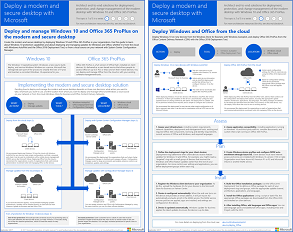

# Microsoft 365 生產力圖例Microsoft 365 productivity illustrations

Microsoft 365 企業解決方案系列提供實作 Microsoft 365 功能的指引，尤其是跨多項技術的功能。The Microsoft 365 enterprise solution series provides guidance for implementing Microsoft 365 capabilities, especially where capabilities cross technologies.

### 適用於 IT 結構設計師的 Microsoft 365 中的Microsoft Teams 和相關生產力服務Microsoft Teams and related productivity services in Microsoft 365 for IT architects
使用 Microsoft Teams 領導，Microsoft 365 中生產力服務的邏輯架構。The logical architecture of productivity services in Microsoft 365, leading with Microsoft Teams.

|**項目****Item**|**描述****Description**|
|:-----|:-----|
|   [PDF](https://github.com/MicrosoftDocs/microsoft-365-docs/raw/public/microsoft-365/downloads/msft-m365-teams-logical-architecture.pdf) \| [Visio](https://github.com/MicrosoftDocs/OfficeDocs-Enterprise/raw/live/Enterprise/downloads/msft-m365-teams-logical-architecture.vsdx)[PDF](https://github.com/MicrosoftDocs/microsoft-365-docs/raw/public/microsoft-365/downloads/msft-m365-teams-logical-architecture.pdf) \| [Visio](https://github.com/MicrosoftDocs/OfficeDocs-Enterprise/raw/live/Enterprise/downloads/msft-m365-teams-logical-architecture.vsdx)   2019年4月更新Updated April 2019   |Microsoft 提供一套生產力服務，共同合作來提供資料管理、安全性和法規遵循功能的共同作業體驗。Microsoft provides a suite of productivity services that work together to provide collaboration experiences with data governance, security, and compliance capabilities.    這系列的圖例可為企業結構設計師提供生產力服務邏輯架構使用 Microsoft Teams 引導的檢視。This series of illustrations provides a view into the logical architecture of productivity services for enterprise architects, leading with Microsoft Teams.|

### 適用於 IT 結構設計師的 Microsoft 365 中的群組Groups in Microsoft 365 for IT Architects
對於 Microsoft 365 中的群組，IT 結構設計師需要知道的事項What IT architects need to know about groups in Microsoft 365

|**項目****Item**|**描述****Description**|
|:-----|:-----|
|   [PDF](https://github.com/MicrosoftDocs/microsoft-365-docs/raw/public/microsoft-365/downloads/msft-m365-groups.pdf) \| [Visio](https://github.com/MicrosoftDocs/OfficeDocs-Enterprise/raw/live/Enterprise/downloads/msft-m365-groups.vsdx)[PDF](https://github.com/MicrosoftDocs/microsoft-365-docs/raw/public/microsoft-365/downloads/msft-m365-groups.pdf) \| [Visio](https://github.com/MicrosoftDocs/OfficeDocs-Enterprise/raw/live/Enterprise/downloads/msft-m365-groups.vsdx)   2019年6月更新Updated June 2019|這些圖例會詳細說明不同類型的群組、如何建立及管理群組，以及一些控管建議。These illustrations detail the different types of groups, how these are created and managed, and a few governance recommendations.|

### 適用於多區域組織的安全性與資訊保護Security and Information Protection for Multi-Region Organizations
適用於多區域組織，且具有單一 Microsoft 365 租用戶的安全性與資訊保護Security and information protection for multi-region organizations with a single microsoft 365 tenant

|**項目****Item**|**描述****Description**|
|:-----|:-----|
|   [PDF](https://github.com/MicrosoftDocs/microsoft-365-docs/raw/public/microsoft-365/downloads/msft-security-info-protect-multi-region.pdf) \| [Visio](https://github.com/MicrosoftDocs/microsoft-365-docs/raw/public/microsoft-365/downloads/msft-security-info-protect-multi-region.vsdx)[PDF](https://github.com/MicrosoftDocs/microsoft-365-docs/raw/public/microsoft-365/downloads/msft-security-info-protect-multi-region.pdf) \| [Visio](https://github.com/MicrosoftDocs/microsoft-365-docs/raw/public/microsoft-365/downloads/msft-security-info-protect-multi-region.vsdx) 2020年3月更新Updated March 2020 |基於多種原因，為您的全球組織使用單一 Microsoft 365 租用戶是最佳選擇和最佳體驗。Using a single Microsoft 365 tenant for your global organization is the best choice and experience for many reasons. 不過，許多架構設計人員為達到不同地區的安全性與資訊保護目標，面臨許多掙扎。However, many architects wrestle with how to meet security and information protection objectives across different regions. 本主題提供許多建議。This set of topics provides recommendations. |

### Microsoft Defender ATP 部署策略Microsoft Defender ATP deployment strategy

根據您的環境而定，一些工具更適合某些架構。Depending on your environment, some tools are better suited for certain architectures.

|**項目****Item**|**描述****Description**|
|:-----|:-----|
|  [PDF](https://github.com/MicrosoftDocs/windows-itpro-docs/raw/public/windows/security/threat-protection/microsoft-defender-atp/downloads/mdatp-deployment-strategy.pdf)  \| [Visio](https://github.com/MicrosoftDocs/windows-itpro-docs/raw/public/windows/security/threat-protection/microsoft-defender-atp/downloads/mdatp-deployment-strategy.vsdx)[PDF](https://github.com/MicrosoftDocs/windows-itpro-docs/raw/public/windows/security/threat-protection/microsoft-defender-atp/downloads/mdatp-deployment-strategy.pdf)  \| [Visio](https://github.com/MicrosoftDocs/windows-itpro-docs/raw/public/windows/security/threat-protection/microsoft-defender-atp/downloads/mdatp-deployment-strategy.vsdx)  2020年2月更新Updated February 2020| 架構材料可協助您規劃部署，以進行下列架構：The architectural material helps you plan your deployment for the following architectures: <ul><li> 雲端-原生Cloud-native </li><li> 共同管理Co-management </li><li> 內部部署On-premise</li><li>評估和本機上架Evaluation and local onboarding</li>

### Microsoft 365 企業版底層基礎結構Microsoft 365 Enterprise Foundation Infrastructure

快速檢視 Microsoft 365 企業版的[底層基礎結構](https://docs.microsoft.com/microsoft-365/enterprise/deploy-foundation-infrastructure)以開始部署。Get an at-a-glance view of the [foundation infrastructure](https://docs.microsoft.com/microsoft-365/enterprise/deploy-foundation-infrastructure) for Microsoft 365 Enterprise to begin your deployment.
  
|**Item****Item**|**描述****Description**|
|:-----|:-----|
|   [線上檢視](https://aka.ms/m365efoundinfraposter) \| [PDF](https://github.com/MicrosoftDocs/microsoft-365-docs/raw/public/microsoft-365/downloads/Microsoft365EnterpriseFoundInfra.pdf)[View online](https://aka.ms/m365efoundinfraposter) \| [PDF](https://github.com/MicrosoftDocs/microsoft-365-docs/raw/public/microsoft-365/downloads/Microsoft365EnterpriseFoundInfra.pdf)   2019年12月更新Updated December 2019| 此海報針對目標、功能和工具、設計決策、設定結果、上架，以及持續監視和更新，摘要說明底層基礎結構的每個階段。This poster summarizes each phase of the foundation infrastructure in terms of goals, features and tools, design decisions, configuration results, onboarding, and ongoing monitoring and updates.  | 

   

### Office 365 的身分識別與裝置保護Identity and device protection for Office 365

推薦可用於保護身分識別和裝置的功能，其可存取 Office 365、其他 SaaS 服務，以及與 Azure AD 應用程式 Proxy 一起發佈的內部部署應用程式。Recommended capabilities for protecting identities and devices that access Office 365, other SaaS services, and on-premises applications published with Azure AD Application Proxy.

|**項目****Item**|**描述****Description**|
|:-----|:-----|
|[          ](https://www.microsoft.com/download/details.aspx?id=55032)[          ](https://www.microsoft.com/download/details.aspx?id=55032)   [PDF](https://go.microsoft.com/fwlink/p/?linkid=841656)  \| [Visio](https://go.microsoft.com/fwlink/p/?linkid=841657)  \| [更多語言](https://www.microsoft.com/download/details.aspx?id=55032)[PDF](https://go.microsoft.com/fwlink/p/?linkid=841656)  \| [Visio](https://go.microsoft.com/fwlink/p/?linkid=841657)  \| [More languages](https://www.microsoft.com/download/details.aspx?id=55032)   2018年11月更新Updated November 2018|請務必在您的資料、身分識別和裝置之間，使用一致層級的保護。這份文件會顯示哪些功能在保護身分識別和裝置上有相當功能的詳細資訊。It's important to use consistent levels of protection across your data, identities, and devices. This document shows you which capabilities are comparable with more information on capabilities to protect identities and devices.    |
   
<!--

### File protection solutions in Office 365

Recommended capabilities for protecting files in Office 365 based on three different sensitivity levels.
  
|**Item**|**Description**|
|:-----|:-----|
|[          ](https://www.microsoft.com/download/details.aspx?id=55523)   [PDF](https://go.microsoft.com/fwlink/?linkid=2004320)  \| [Visio](https://download.microsoft.com/download/7/8/9/789645A5-BD10-4541-BC33-F8D1EFF5E911/MSFT_cloud_architecture_O365%20file%20protection.vsdx)   |It's important to use consistent levels of protection across your data, identities, and devices. This document shows you which capabilities are comparable with more information on capabilities to protect files in Office 365.    |
   

### Office 365 Information Protection for GDPR

Prescriptive recommendations for discovering, classifying, protecting, and monitoring personal data. This solution uses General Data Protection Regulation (GDPR) as an example, but you can apply the same process to achieve compliance with many other regulations.

|**Item**|**Description**|
|:-----|:-----|
|    [PDF](https://download.microsoft.com/download/E/C/D/ECD5A339-EF10-4420-B3A9-99098884D716/MSFT_Cloud_architecture_information%20protection%20for%20GDPR.pdf) \| [Visio](https://download.microsoft.com/download/E/C/D/ECD5A339-EF10-4420-B3A9-99098884D716/MSFT_Cloud_architecture_information%20protection%20for%20GDPR.vsdx)    |To see this content in article format, see [Office 365 Information Protection for GDPR](https://docs.microsoft.com/Office365/SecurityCompliance/office-365-information-protection-for-gdpr).      |

### Microsoft Security Guidance for Political Campaigns, Nonprofits, and Other Agile Organizations 

This guidance describes how to implement a secure cloud environment. The solution guidance can be used by any organization. It includes extra help for agile organizations with BYOD access and guest accounts. You can use this guidance as a starting-point for designing your own environment.

|**Item**|**Description**|
|:-----|:-----|
|**Microsoft Security Guidance for Political Campaigns**   [          ](https://download.microsoft.com/download/B/4/D/B4D520C3-4D0C-4B4D-BFB9-09F0651C2775/MSFT_Cloud_architecture_security%20for%20political%20campaigns.pdf)   [PDF](https://download.microsoft.com/download/B/4/D/B4D520C3-4D0C-4B4D-BFB9-09F0651C2775/MSFT_Cloud_architecture_security%20for%20political%20campaigns.pdf)  \| [Visio](https://download.microsoft.com/download/B/4/D/B4D520C3-4D0C-4B4D-BFB9-09F0651C2775/MSFT_Cloud_architecture_security%20for%20political%20campaigns.vsdx)   |This guidance uses a political campaign organization as an example. Use this guidance as a starting point for any environment.    |
|**Microsoft Security Guidance for Nonprofits**   [          ](https://download.microsoft.com/download/9/4/3/94389612-C679-4061-8DF2-D9A15D72B65F/Microsoft_Cloud%20Architecture_Security%20for%20Nonprofits.pdf)   [PDF](https://download.microsoft.com/download/9/4/3/94389612-C679-4061-8DF2-D9A15D72B65F/Microsoft_Cloud%20Architecture_Security%20for%20Nonprofits.pdf)  \| [Visio](https://download.microsoft.com/download/9/4/3/94389612-C679-4061-8DF2-D9A15D72B65F/Microsoft_Cloud%20Architecture_Security%20for%20Nonprofits.vsdx)   |This guide is slightly revised for nonprofit organizations. For example, it references Office 365 Nonprofit plans. The technical guidance is the same as the political campaign solution guide.    |

This guidance includes Test Lab Guides. For more information, see [Microsoft Security Guidance for Political Campaigns, Nonprofits, and Other Agile Organizations](https://docs.microsoft.com/Office365/SecurityCompliance/microsoft-security-guidance-for-political-campaigns-nonprofits-and-other-agile-o).

-->

### Microsoft 電話語音解決方案Microsoft Telephony Solutions

當您開始加入 Microsoft 雲端中的 Teams，Microsoft 支援數個選項。此海報協助您決定哪個 Microsoft 電話語音解決方案 (雲端的電話系統或內部部署的 Enterprise Voice) 適合您組織中的使用者，以及您的組織如何連線至公用交換電話網路 (PSTN)。Microsoft supports several options as you begin your journey to Teams in the Microsoft cloud. This poster helps you decide which Microsoft telephony solution (Phone System in the cloud or Enterprise Voice on-premises) is right for users in your organization, and how your organization can connect to the Public Switched Telephone Network (PSTN).

  
[PDF](https://github.com/MicrosoftDocs/OfficeDocs-SkypeForBusiness/raw/live/Teams/downloads/telephony-solutions/microsoft-telephony-solutions-12-19.pdf) | [Visio](https://github.com/MicrosoftDocs/OfficeDocs-SkypeForBusiness/raw/live/Teams/downloads/telephony-solutions/microsoft-telephony-solutions-12-18.vsdx)[PDF](https://github.com/MicrosoftDocs/OfficeDocs-SkypeForBusiness/raw/live/Teams/downloads/telephony-solutions/microsoft-telephony-solutions-12-19.pdf) | [Visio](https://github.com/MicrosoftDocs/OfficeDocs-SkypeForBusiness/raw/live/Teams/downloads/telephony-solutions/microsoft-telephony-solutions-12-18.vsdx)  
2019年1月更新Updated January 2019

如需詳細資訊，請參閱此海報的文章：[Microsoft 電話語音解決方案](https://docs.microsoft.com/SkypeForBusiness/hybrid/msft-telephony-solutions)。For more information, see the article for this poster: [Microsoft Telephony Solutions](https://docs.microsoft.com/SkypeForBusiness/hybrid/msft-telephony-solutions).
  

### 使用 Microsoft 部署現代和安全的桌面Deploy a modern and secure desktop with Microsoft

IT 結構設計師需要了解的關於在 Windows 10 上部署和管理 Office 365 專業增強版的更新。What IT architects need to know about deploying and managing updates for Office 365 ProPlus on Windows 10.
  

|**項目****Item**|**描述****Description**|
|:-----|:-----|
|   [PDF](https://download.microsoft.com/download/4/E/9/4E90E227-770A-41D1-99FE-925A64D81A55/MSFT_modern_secure_desktop.pdf)  \| [Visio](https://download.microsoft.com/download/4/E/9/4E90E227-770A-41D1-99FE-925A64D81A55/MSFT_modern_secure_desktop.vsdx)[PDF](https://download.microsoft.com/download/4/E/9/4E90E227-770A-41D1-99FE-925A64D81A55/MSFT_modern_secure_desktop.pdf)  \| [Visio](https://download.microsoft.com/download/4/E/9/4E90E227-770A-41D1-99FE-925A64D81A55/MSFT_modern_secure_desktop.vsdx)  2017年9月更新Updated September 2017 | 此模型包含：This model contains: <ul><li>  從 Microsoft Cloud 部署 Windows 10 和 Office ProPlusDeploying Windows 10 and Office ProPlus from the Microsoft cloud </li><li>  使用 Microsoft Endpoint Configuration Manager 部署 Windows 10 和 Office ProPlus 專業增強版Deploying Windows 10 and Office ProPlus with Microsoft Endpoint Configuration Manager </li><li>  從 Microsoft Cloud 管理 Windows 10 和 Office ProPlus 的更新Managing updates for Windows 10 and Office ProPlus from the Microsoft cloud </li><li>  使用 Microsoft Endpoint Configuration Manager 管理 Windows 10 和 Office 專業增強版的更新Managing updates for Windows 10 and Office ProPlus with Microsoft Endpoint Configuration Manager </li><li>  Windows 10 立即可用和額外的保護功能Out-of-the-box and additional protection capabilities of Windows 10 </li></ul>  |
   
## 另請參閱See Also

[適用於 SharePoint、Exchange、商務用 Skype 和 Lync 的架構模型Architectural models for SharePoint, Exchange, Skype for Business, and Lync](https://docs.microsoft.com/office365/enterprise/architectural-models-for-sharepoint-exchange-skype-for-business-and-lync)
  
[雲端採用測試實驗室指南 (TLG)Cloud adoption Test Lab Guides (TLGs)](https://docs.microsoft.com/office365/enterprise/cloud-adoption-test-lab-guides-tlgs)
