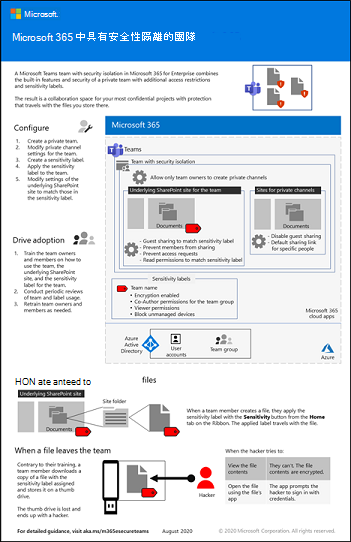

# Microsoft 365 生產力圖例

Microsoft 365 企業版解決方案系列提供實施 Microsoft 365 功能的指導方針，尤其是跨技術功能（包括小組架構圖表）。

### 適用於 IT 結構設計師的 Microsoft 365 中的Microsoft Teams 和相關生產力服務
使用 Microsoft Teams 領導，Microsoft 365 中生產力服務的邏輯架構。

| 項目 | 描述 |
|:-----|:-----|
|   [PDF](https://github.com/MicrosoftDocs/microsoft-365-docs/raw/public/microsoft-365/downloads/msft-m365-teams-logical-architecture.pdf) \| [Visio](https://github.com/MicrosoftDocs/microsoft-365-docs/raw/public/microsoft-365/downloads/msft-m365-teams-logical-architecture.vsdx)   2021年1月更新   |Microsoft 提供一套生產力服務，共同合作來提供資料管理、安全性和法規遵循功能的共同作業體驗。    這系列的圖例可為企業結構設計師提供生產力服務邏輯架構使用 Microsoft Teams 引導的檢視。|

### 適用於 IT 結構設計師的 Microsoft 365 中的群組
此圖例包含有關 Microsoft 365 群組的 IT 架構師資訊。 若要瞭解如何設定及管理組織中共同作業的 Microsoft 365 群組和小組，請參閱 [設定與 Microsoft 365 的安全](/microsoft-365/solutions/setup-secure-collaboration-with-teams) 共同作業，以及 [什麼是協同作業](/microsoft-365/solutions/collaboration-governance-overview)控管？。

| 項目 | 描述 |
|:-----|:-----|
|   [PDF](https://github.com/MicrosoftDocs/microsoft-365-docs/raw/public/microsoft-365/downloads/msft-m365-groups.pdf) \| [Visio](https://github.com/MicrosoftDocs/OfficeDocs-Enterprise/raw/live/Enterprise/downloads/msft-m365-groups.vsdx)   更新可能的2020|這些圖例會詳細說明不同類型的群組、如何建立及管理群組，以及一些控管建議。|

### Microsoft 365 資訊保護和合規性功能

Microsoft 365 包括一組廣泛的資訊保護和合規性功能。 這些功能搭配 Microsoft 的生產力工具，可協助組織即時協同合作，同時遵循嚴格的法規遵從性框架。 

這組插圖使用最受管制的行業（財務服務）之一，示範如何套用這些功能以滿足一般法規需求。 您可以隨意使用這些圖。 

| 項目 | 描述 |
|:-----|:-----|
|   英文：[下載為 PDF](https://download.microsoft.com/download/3/a/6/3a6ab1a3-feb0-4ee2-8e77-62415a772e53/m365-compliance-illustrations.pdf)\| [下載為 Visio](https://download.microsoft.com/download/3/a/6/3a6ab1a3-feb0-4ee2-8e77-62415a772e53/m365-compliance-illustrations.vsdx)   日文：[下載為 PDF](https://download.microsoft.com/download/6/f/1/6f1a7d0e-dd8e-442e-b073-8e94327ae4f8/m365-compliance-illustrations.pdf)\| [下載為 Visio](https://download.microsoft.com/download/6/f/1/6f1a7d0e-dd8e-442e-b073-8e94327ae4f8/m365-compliance-illustrations.vsdx)   更新日期：2020 年 11 月|包含： <ul><li>  Microsoft 資訊保護和資料外洩防護</li><li>保留原則和保留標籤 </li><li>資訊屏障</li><li>通訊合規性</li><li>測試人員風險</li><li>協力廠商資料攝取</li>|

### 適用於多區域組織的安全性與資訊保護
具有單一 Microsoft 365 租使用者之多地區組織的安全性和資訊保護

| 項目 | 描述 |
|:-----|:-----|
|   [PDF](https://github.com/MicrosoftDocs/microsoft-365-docs/raw/public/microsoft-365/downloads/msft-security-info-protect-multi-region.pdf) \| [Visio](https://github.com/MicrosoftDocs/microsoft-365-docs/raw/public/microsoft-365/downloads/msft-security-info-protect-multi-region.vsdx) 更新日期：2020 年 3 月 |基於多種原因，為您的全球組織使用單一 Microsoft 365 租用戶是最佳選擇和最佳體驗。 不過，許多架構設計人員為達到不同地區的安全性與資訊保護目標，面臨許多掙扎。 本主題提供許多建議。 |

### Microsoft Defender for Endpoint 部署策略

根據您的環境而定，有些工具更適合特定架構。

| 項目 | 描述 |
|:-----|:-----|
|  [PDF](https://github.com/MicrosoftDocs/microsoft-365-docs/raw/public/microsoft-365/security/defender-endpoint/downloads/mdatp-deployment-strategy.pdf)  \| [Visio](https://github.com/MicrosoftDocs/microsoft-365-docs/raw/public/microsoft-365/security/defender-endpoint/downloads/mdatp-deployment-strategy.vsdx)  更新日期：2020 年 2 月| 架構材料可協助您規劃下列架構的部署： <ul><li> 雲端-原生 </li><li> 共同管理 </li><li> 內部部署</li><li>評估與本機上架</li>

### Microsoft 365 的身分識別與裝置保護

針對使用 Azure AD 應用程式 Proxy 所發佈的 Microsoft 365、其他 SaaS 服務和內部部署應用程式，來保護身分識別和裝置的建議功能。

| 項目 | 描述 |
|:-----|:-----|
|    [以 PDF 格式查看](../downloads/MSFT_cloud_architecture_identity&device_protection.pdf) \|[以 PDF 格式下載](https://github.com/MicrosoftDocs/microsoft-365-docs/raw/public/microsoft-365/downloads/MSFT_cloud_architecture_identity&device_protection.pdf) \|[下載為 Visio](https://github.com/MicrosoftDocs/microsoft-365-docs/raw/public/microsoft-365/downloads/MSFT_cloud_architecture_identity&device_protection.vsdx)     2020年9月更新|請務必在您的資料、身分識別和裝置之間，使用一致層級的保護。 此模型顯示哪些功能可比對身分識別和裝置的功能的相關資訊。    |
 

### Microsoft 365 中的高級 eDiscovery 架構

高級 eDiscovery 端對端工作流程與資料流程，包含在 Microsoft 365 多地理位置環境中。 

| 項目 | 描述 |
|:-----|:-----|
|   [以影像](../media/solutions-architecture-center/m365-advanced-ediscovery-architecture.png) \| 形式查看[以 PDF 格式下載](https://download.microsoft.com/download/d/1/c/d1ce536d-9bcf-4d31-b75b-fcf0dc560665/m365-advanced-ediscovery-architecture.pdf) \|[下載為 Visio](https://download.microsoft.com/download/d/1/c/d1ce536d-9bcf-4d31-b75b-fcf0dc560665/m365-advanced-ediscovery-architecture.vsdx)     2020年10月更新|包含： <ul><li>  單一環境中的端對端工作流程</li><li>Microsoft 365 多地理位置環境中的端對端工作流程 </li><li>支援 EDRM 工作流程的端對端資料流程程</li> |
  

### Microsoft 電話語音解決方案

當您開始加入 Microsoft 雲端中的 Teams，Microsoft 支援數個選項。此海報協助您決定哪個 Microsoft 電話語音解決方案 (雲端的電話系統或內部部署的 Enterprise Voice) 適合您組織中的使用者，以及您的組織如何連線至公用交換電話網路 (PSTN)。

  
[PDF](https://download.microsoft.com/download/4/3/5/435cd4e9-ca56-4fd1-acb6-d1fda7952320/microsoft-voice-solutions.pdf) | [Visio](https://download.microsoft.com/download/7/5/c/75c13012-e20c-48bd-a6dd-ea49d1a3420d/microsoft-voice-solutions.vsdx)  
更新日期：2019 年 1 月

如需詳細資訊，請參閱此海報的文章：[Microsoft 電話語音解決方案](/SkypeForBusiness/hybrid/msft-telephony-solutions)。

### 強化遠端工作人員

使用 Microsoft 365 和其他 Microsoft 雲端技術，您可以為員工提供來自其住宅中組織內部部署和雲端架構資訊、工具及資源的安全存取權。 

  
[PDF](https://github.com/MicrosoftDocs/microsoft-365-docs/raw/public/microsoft-365/downloads/empower-remote-workers.pdf)  | [PowerPoint](https://download.microsoft.com/download/5/1/1/511b77a9-a34c-4ea7-af2a-32b07f20b780/empower-remote-workers.pptx)  
2020年7月更新

如需詳細資訊，請參閱本文的海報：讓 [遠端工作者使用 Microsoft 365](empower-people-to-work-remotely.md)。

### 具有安全性隔離的 Microsoft 團隊

使用 Microsoft 365，您可以在 Microsoft 小組中設定私人團隊，並使用 SharePoint 網站安全性設定和獨特的靈敏度標籤，以加密檔案，只有小組成員才能解密。

  
[PDF](https://github.com/MicrosoftDocs/microsoft-365-docs/raw/public/microsoft-365/downloads/team-security-isolation-poster.pdf)  | [PowerPoint](https://download.microsoft.com/download/8/0/5/8057fc16-c044-40b6-a652-7ed555ba2895/team-security-isolation-poster.pptx)   2020年8月更新

如需詳細資訊，請參閱此標牌的文章： [設定具有安全性隔離的團隊](secure-teams-security-isolation.md)。

  
## 另請參閱

[適用於 SharePoint、Exchange、商務用 Skype 和 Lync 的架構模型](../enterprise/architectural-models-for-sharepoint-exchange-skype-for-business-and-lync.md)
  
[雲端採用測試實驗室指南 (TLG)](../enterprise/cloud-adoption-test-lab-guides-tlgs.md)
