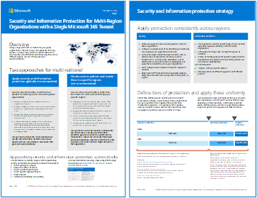
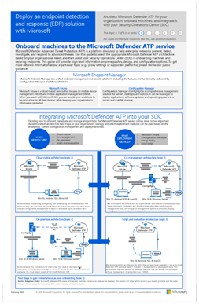
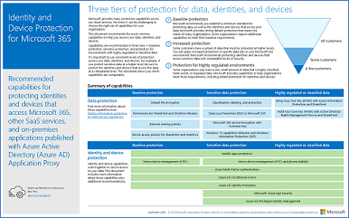

# Microsoft 365 生產力圖例Microsoft 365 productivity illustrations

Microsoft 365 企業解決方案系列提供執行 Microsoft 365 功能的指導方針，尤其是跨技術功能（包括 Teams 架構圖表）。The Microsoft 365 enterprise solution series provides guidance for implementing Microsoft 365 capabilities, especially where capabilities cross technologies, including Teams architecture diagrams.

## 適用於 IT 結構設計師的 Microsoft 365 中的Microsoft Teams 和相關生產力服務Microsoft Teams and related productivity services in Microsoft 365 for IT architects
使用 Microsoft Teams 領導，Microsoft 365 中生產力服務的邏輯架構。The logical architecture of productivity services in Microsoft 365, leading with Microsoft Teams.

| 項目Item | 描述Description |
|:-----|:-----|
|   [PDF](https://github.com/MicrosoftDocs/microsoft-365-docs/raw/public/microsoft-365/downloads/msft-m365-teams-logical-architecture.pdf) \| [Visio](https://github.com/MicrosoftDocs/microsoft-365-docs/raw/public/microsoft-365/downloads/msft-m365-teams-logical-architecture.vsdx)[PDF](https://github.com/MicrosoftDocs/microsoft-365-docs/raw/public/microsoft-365/downloads/msft-m365-teams-logical-architecture.pdf) \| [Visio](https://github.com/MicrosoftDocs/microsoft-365-docs/raw/public/microsoft-365/downloads/msft-m365-teams-logical-architecture.vsdx)   2021年1月更新Updated January 2021   |Microsoft 提供一套生產力服務，共同合作來提供資料管理、安全性和法規遵循功能的共同作業體驗。Microsoft provides a suite of productivity services that work together to provide collaboration experiences with data governance, security, and compliance capabilities.    這系列的圖例可為企業結構設計師提供生產力服務邏輯架構使用 Microsoft Teams 引導的檢視。This series of illustrations provides a view into the logical architecture of productivity services for enterprise architects, leading with Microsoft Teams.|

## 適用於 IT 結構設計師的 Microsoft 365 中的群組Groups in Microsoft 365 for IT Architects
此圖例包含有關 Microsoft 365 群組之 IT 架構師的資訊。This illustration includes information for IT architects about Microsoft 365 Groups. 若要瞭解如何設定和管理組織中共同作業的 Microsoft 365 群組和團隊，請參閱[設定與 Microsoft 365 的安全](/microsoft-365/solutions/setup-secure-collaboration-with-teams)共同作業，以及[什麼是共同作業](/microsoft-365/solutions/collaboration-governance-overview)控管？。To learn about configuring and administering Microsoft 365 Groups and teams for collaboration in your organization, see [Set up secure collaboration with Microsoft 365](/microsoft-365/solutions/setup-secure-collaboration-with-teams) and [What is collaboration governance?](/microsoft-365/solutions/collaboration-governance-overview).

| 項目Item | 描述Description |
|:-----|:-----|
|   [PDF](https://github.com/MicrosoftDocs/microsoft-365-docs/raw/public/microsoft-365/downloads/msft-m365-groups.pdf) \| [Visio](https://github.com/MicrosoftDocs/OfficeDocs-Enterprise/raw/live/Enterprise/downloads/msft-m365-groups.vsdx)[PDF](https://github.com/MicrosoftDocs/microsoft-365-docs/raw/public/microsoft-365/downloads/msft-m365-groups.pdf) \| [Visio](https://github.com/MicrosoftDocs/OfficeDocs-Enterprise/raw/live/Enterprise/downloads/msft-m365-groups.vsdx)   更新可能的2020Updated May 2020|這些圖例會詳細說明不同類型的群組、如何建立及管理群組，以及一些控管建議。These illustrations detail the different types of groups, how these are created and managed, and a few governance recommendations.|

## 移轉至 Microsoft 365Migrate to Microsoft 365

Microsoft 提供的工具可以將您的內部部署網路檔案共用和 SharePoint 伺服器網站，Microsoft 365 以強調如何在遷移期間保護和確保內容的安全性。Microsoft provides tools to migrate your on-premises network file shares and SharePoint Server sites to Microsoft 365 with an emphasis on protecting and ensuring your content's security during migration. 這組圖例示範可將內容移至 SharePoint、Teams 及 OneDrive 的各種方法，以及您的資料在程式中的流動方式。This set of illustrations demonstrates the various methods available to move your content to SharePoint, Teams, and OneDrive and how your data flows through the process. 

| 項目Item | 描述Description |
|:-----|:-----|
|  [PDF](https://download.microsoft.com/download/0/5/b/05b7fb7c-1557-4ebb-9036-c5fc3a4cd94c/m365-migration-posters-mm-spmt.pdf)\|[Visio](https://download.microsoft.com/download/0/5/b/05b7fb7c-1557-4ebb-9036-c5fc3a4cd94c/m-365-migration-posters-mm-spmt.vsdx)[PDF](https://download.microsoft.com/download/0/5/b/05b7fb7c-1557-4ebb-9036-c5fc3a4cd94c/m365-migration-posters-mm-spmt.pdf)\|[Visio](https://download.microsoft.com/download/0/5/b/05b7fb7c-1557-4ebb-9036-c5fc3a4cd94c/m-365-migration-posters-mm-spmt.vsdx)   2021年3月更新Updated March 2021 |包含：Includes: <ul><li>  檔案共用移轉File share migration</li><li>SharePoint 伺服器移轉SharePoint Server migration </li> </ul>  如需詳細資訊，請參閱將[您的內容遷移至 Microsoft 365](/sharepointmigration/migrate-to-sharepoint-online)。For more information, see [Migrate your content to Microsoft 365](/sharepointmigration/migrate-to-sharepoint-online).|

## Microsoft 365 資訊保護和合規性功能Microsoft 365 information protection and compliance capabilities

Microsoft 365 包括一組廣泛的資訊保護和合規性功能。Microsoft 365 includes a broad set of information protection and compliance capabilities. 這些功能搭配 Microsoft 的生產力工具，可協助組織即時協同合作，同時遵循嚴格的法規遵從性框架。Together with Microsoft’s productivity tools, these capabilities are designed to help organizations collaborate in real time while adhering to stringent regulatory compliance frameworks. 

這組插圖使用最受管制的行業（財務服務）之一，示範如何套用這些功能以滿足一般法規需求。This set of illustrations uses one of the most regulated industries, financial services, to demonstrate how these capabilities can be applied to address common regulatory requirements. 您可以隨意使用這些圖例。Feel free to adapt these illustrations for your own use. 

| 項目Item | 描述Description |
|:-----|:-----|
|   英文：[下載為 PDF](https://download.microsoft.com/download/3/a/6/3a6ab1a3-feb0-4ee2-8e77-62415a772e53/m365-compliance-illustrations.pdf)\| [下載為 Visio](https://download.microsoft.com/download/3/a/6/3a6ab1a3-feb0-4ee2-8e77-62415a772e53/m365-compliance-illustrations.vsdx)English: [Download as a PDF](https://download.microsoft.com/download/3/a/6/3a6ab1a3-feb0-4ee2-8e77-62415a772e53/m365-compliance-illustrations.pdf)  \| [Download as a Visio](https://download.microsoft.com/download/3/a/6/3a6ab1a3-feb0-4ee2-8e77-62415a772e53/m365-compliance-illustrations.vsdx)   日文：[下載為 PDF](https://download.microsoft.com/download/6/f/1/6f1a7d0e-dd8e-442e-b073-8e94327ae4f8/m365-compliance-illustrations.pdf)\| [下載為 Visio](https://download.microsoft.com/download/6/f/1/6f1a7d0e-dd8e-442e-b073-8e94327ae4f8/m365-compliance-illustrations.vsdx)Japanese: [Download as a PDF](https://download.microsoft.com/download/6/f/1/6f1a7d0e-dd8e-442e-b073-8e94327ae4f8/m365-compliance-illustrations.pdf)  \| [Download as a Visio](https://download.microsoft.com/download/6/f/1/6f1a7d0e-dd8e-442e-b073-8e94327ae4f8/m365-compliance-illustrations.vsdx)   更新日期：2020 年 11 月Updated November 2020|包含：Includes: <ul><li>  Microsoft 資訊保護和資料外洩防護Microsoft information protection and data loss prevention</li><li>保留原則和保留標籤Retention policies and retention labels </li><li>資訊屏障Information barriers</li><li>通訊合規性Communication compliance</li><li>測試人員風險Insider risk</li><li>協力廠商資料攝取Third-party data ingestion</li>|

## 適用於多區域組織的安全性與資訊保護Security and Information Protection for Multi-Region Organizations
具有單一 Microsoft 365 租使用者之多地區組織的安全性和資訊保護Security and information protection for multi-region organizations with a single Microsoft 365 tenant

| 項目Item | 描述Description |
|:-----|:-----|
|   [PDF](https://github.com/MicrosoftDocs/microsoft-365-docs/raw/public/microsoft-365/downloads/msft-security-info-protect-multi-region.pdf) \| [Visio](https://github.com/MicrosoftDocs/microsoft-365-docs/raw/public/microsoft-365/downloads/msft-security-info-protect-multi-region.vsdx)[PDF](https://github.com/MicrosoftDocs/microsoft-365-docs/raw/public/microsoft-365/downloads/msft-security-info-protect-multi-region.pdf) \| [Visio](https://github.com/MicrosoftDocs/microsoft-365-docs/raw/public/microsoft-365/downloads/msft-security-info-protect-multi-region.vsdx) 更新日期：2020 年 3 月Updated March 2020 |基於多種原因，為您的全球組織使用單一 Microsoft 365 租用戶是最佳選擇和最佳體驗。Using a single Microsoft 365 tenant for your global organization is the best choice and experience for many reasons. 不過，許多架構設計人員為達到不同地區的安全性與資訊保護目標，面臨許多掙扎。However, many architects wrestle with how to meet security and information protection objectives across different regions. 本主題提供許多建議。This set of topics provides recommendations. |

## Microsoft Defender for Endpoint 部署策略Microsoft Defender for Endpoint deployment strategy

根據您的環境而定，有些工具更適合特定架構。Depending on your environment, some tools are better suited for certain architectures.

| 項目Item | 描述Description |
|:-----|:-----|
|  [PDF](https://github.com/MicrosoftDocs/microsoft-365-docs/raw/public/microsoft-365/security/defender-endpoint/downloads/mdatp-deployment-strategy.pdf)  \| [Visio](https://github.com/MicrosoftDocs/microsoft-365-docs/raw/public/microsoft-365/security/defender-endpoint/downloads/mdatp-deployment-strategy.vsdx)[PDF](https://github.com/MicrosoftDocs/microsoft-365-docs/raw/public/microsoft-365/security/defender-endpoint/downloads/mdatp-deployment-strategy.pdf)  \| [Visio](https://github.com/MicrosoftDocs/microsoft-365-docs/raw/public/microsoft-365/security/defender-endpoint/downloads/mdatp-deployment-strategy.vsdx)  更新日期：2020 年 2 月Updated February 2020| 架構材料可協助您規劃下列架構的部署：The architectural material helps you plan your deployment for the following architectures: <ul><li> 雲端-原生Cloud-native </li><li> 共同管理Co-management </li><li> 內部部署On-premise</li><li>評估與本機上架Evaluation and local onboarding</li>

## Microsoft 365 的身分識別與裝置保護Identity and device protection for Microsoft 365

建議的功能，用來保護使用 Azure AD 應用程式 Proxy 發行的 Microsoft 365、其他 SaaS 服務和內部部署應用程式所存取的身分識別和裝置。Recommended capabilities for protecting identities and devices that access Microsoft 365, other SaaS services, and on-premises applications published with Azure AD Application Proxy.

| 項目Item | 描述Description |
|:-----|:-----|
|    [以 PDF 格式查看](../downloads/MSFT_cloud_architecture_identity&device_protection.pdf) \|[以 PDF 格式下載](https://github.com/MicrosoftDocs/microsoft-365-docs/raw/public/microsoft-365/downloads/MSFT_cloud_architecture_identity&device_protection.pdf) \|[下載成 Visio](https://github.com/MicrosoftDocs/microsoft-365-docs/raw/public/microsoft-365/downloads/MSFT_cloud_architecture_identity&device_protection.vsdx)  [View as a PDF](../downloads/MSFT_cloud_architecture_identity&device_protection.pdf) \| [Download as a PDF](https://github.com/MicrosoftDocs/microsoft-365-docs/raw/public/microsoft-365/downloads/MSFT_cloud_architecture_identity&device_protection.pdf)  \| [Download as a Visio](https://github.com/MicrosoftDocs/microsoft-365-docs/raw/public/microsoft-365/downloads/MSFT_cloud_architecture_identity&device_protection.vsdx)   2020年9月更新Updated September 2020|請務必在您的資料、身分識別和裝置之間，使用一致層級的保護。It's important to use consistent levels of protection across your data, identities, and devices. 此模型顯示哪些功能可比對身分識別和裝置的功能的相關資訊。This model shows you which capabilities are comparable with more information on capabilities to protect identities and devices.    |
 

## Microsoft 365 中的 Advanced eDiscovery 架構Advanced eDiscovery architecture in Microsoft 365

Advanced eDiscovery 端對端工作流程與資料流程，包含在 Microsoft 365 多地理位置環境中。Advanced eDiscovery end-to-end workflow and data flow, including within Microsoft 365 Multi-Geo environments. 

| 項目Item | 描述Description |
|:-----|:-----|
|   [以影像](../media/solutions-architecture-center/m365-advanced-ediscovery-architecture.png) \| 形式查看[以 PDF 格式下載](https://download.microsoft.com/download/d/1/c/d1ce536d-9bcf-4d31-b75b-fcf0dc560665/m365-advanced-ediscovery-architecture.pdf) \|[下載成 Visio](https://download.microsoft.com/download/d/1/c/d1ce536d-9bcf-4d31-b75b-fcf0dc560665/m365-advanced-ediscovery-architecture.vsdx)  [View as an image](../media/solutions-architecture-center/m365-advanced-ediscovery-architecture.png) \| [Download as a PDF](https://download.microsoft.com/download/d/1/c/d1ce536d-9bcf-4d31-b75b-fcf0dc560665/m365-advanced-ediscovery-architecture.pdf)  \| [Download as a Visio](https://download.microsoft.com/download/d/1/c/d1ce536d-9bcf-4d31-b75b-fcf0dc560665/m365-advanced-ediscovery-architecture.vsdx)   2020 年 10 月更新Updated October 2020|包含：Includes: <ul><li>  單一環境中的端對端工作流程End-to-end workflow in a single environment</li><li>Microsoft 365 多地理位置環境中的端對端工作流程End-to-end workflow in a Microsoft 365 Multi-Geo environment </li><li>支援 EDRM 工作流程的端對端資料流程程End-to-end data flow supporting the EDRM workflow</li> |
  

## Microsoft 電話語音解決方案Microsoft Telephony Solutions

當您開始加入 Microsoft 雲端中的 Teams，Microsoft 支援數個選項。此海報協助您決定哪個 Microsoft 電話語音解決方案 (雲端的電話系統或內部部署的 Enterprise Voice) 適合您組織中的使用者，以及您的組織如何連線至公用交換電話網路 (PSTN)。Microsoft supports several options as you begin your journey to Teams in the Microsoft cloud. This poster helps you decide which Microsoft telephony solution (Phone System in the cloud or Enterprise Voice on-premises) is right for users in your organization, and how your organization can connect to the Public Switched Telephone Network (PSTN).

| 項目Item | 描述Description |
|:-----|:-----|
|   [PDF](https://download.microsoft.com/download/4/3/5/435cd4e9-ca56-4fd1-acb6-d1fda7952320/microsoft-voice-solutions.pdf) \| [Visio](https://download.microsoft.com/download/7/5/c/75c13012-e20c-48bd-a6dd-ea49d1a3420d/microsoft-voice-solutions.vsdx)[PDF](https://download.microsoft.com/download/4/3/5/435cd4e9-ca56-4fd1-acb6-d1fda7952320/microsoft-voice-solutions.pdf) \| [Visio](https://download.microsoft.com/download/7/5/c/75c13012-e20c-48bd-a6dd-ea49d1a3420d/microsoft-voice-solutions.vsdx)  2021年3月更新Updated March 2021 | 如需詳細資訊，請參閱[規劃您的 Teams 語音解決方案](/microsoftteams/cloud-voice-landing-page)。For more information, see [Plan your Teams voice solution](/microsoftteams/cloud-voice-landing-page).|

## 設定混合式工作的基礎結構Set up your infrastructure for hybrid work

透過 Microsoft 365 和其他 Microsoft 雲端技術，您可以為員工提供來自其住宅中組織內部部署和雲端架構資訊、工具及資源的安全存取權。With Microsoft 365 and other Microsoft cloud technologies, you can provide your workers with secure access to your organization's on-premises and cloud-based information, tools, and resources from their homes. 

  
[PDF](https://download.microsoft.com/download/9/b/b/9bb5fa79-74e9-497b-87c5-4021e53d9fc2/hybrid-worker-infrastructure.pdf)  | [PowerPoint](https://download.microsoft.com/download/9/b/b/9bb5fa79-74e9-497b-87c5-4021e53d9fc2/hybrid-worker-infrastructure.pptx)[PDF](https://download.microsoft.com/download/9/b/b/9bb5fa79-74e9-497b-87c5-4021e53d9fc2/hybrid-worker-infrastructure.pdf) | [PowerPoint](https://download.microsoft.com/download/9/b/b/9bb5fa79-74e9-497b-87c5-4021e53d9fc2/hybrid-worker-infrastructure.pptx)  
2021年6月更新Updated June 2021

如需詳細資訊，請參閱此標牌的文章：[設定混合式作品搭配 Microsoft 365 的基礎結構](empower-people-to-work-remotely.md)。For more information, see the article for this poster: [Set up your infrastructure for hybrid work with Microsoft 365](empower-people-to-work-remotely.md).

## 使用安全性隔離 Microsoft TeamsMicrosoft Teams with security isolation

透過 Microsoft 365，您可以在 Microsoft Teams 中設定私人團隊，並使用 SharePoint 網站安全性設定和唯一的靈敏度標籤，以加密檔案，只有小組成員才能解密。With Microsoft 365, you can configure a private team in Microsoft Teams and use SharePoint site security settings and a unique sensitivity label to encrypt files so that only team members can decrypt them.

  
[PDF](https://github.com/MicrosoftDocs/microsoft-365-docs/raw/public/microsoft-365/downloads/team-security-isolation-poster.pdf)  | [PowerPoint](https://download.microsoft.com/download/8/0/5/8057fc16-c044-40b6-a652-7ed555ba2895/team-security-isolation-poster.pptx)[PDF](https://github.com/MicrosoftDocs/microsoft-365-docs/raw/public/microsoft-365/downloads/team-security-isolation-poster.pdf) | [PowerPoint](https://download.microsoft.com/download/8/0/5/8057fc16-c044-40b6-a652-7ed555ba2895/team-security-isolation-poster.pptx)   2020年8月更新Updated August 2020

如需詳細資訊，請參閱此標牌的文章： [設定具有安全性隔離的團隊](secure-teams-security-isolation.md)。For more information, see the article for this poster: [Configure a team with security isolation](secure-teams-security-isolation.md).

  
## 另請參閱See Also

[適用於 SharePoint、Exchange、商務用 Skype 和 Lync 的架構模型Architectural models for SharePoint, Exchange, Skype for Business, and Lync](../enterprise/architectural-models-for-sharepoint-exchange-skype-for-business-and-lync.md)
  
[雲端採用測試實驗室指南 (TLG)Cloud adoption Test Lab Guides (TLGs)](../enterprise/cloud-adoption-test-lab-guides-tlgs.md)
