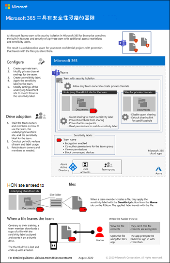

# 為小組設定安全性隔離

本文會為您提供一些建議和步驟，讓您在 Microsoft Teams 設定私人小組，並使用唯一的敏感度標籤來加密檔案，以便只有小組成員可以解密檔案。

除了私人存取外，本文還說明如何設定相關聯的 SharePoint 網站 (可從小組頻道的 **[檔案]** 區段來存取)，以獲得所需的額外安全性進而能夠儲存受到高度管制的資料。

具有安全性隔離小組的設定元素如下：

- 私人小組
- 小組的相關聯 SharePoint 網站需要的額外安全性有：
  - 防止網站成員與其他人共用網站。
  - 避免非網站成員要求網站的存取權。
- 專門用於此小組的敏感度標籤：
    - 防止從未受管理的裝置存取 SharePoint 內容
    - 視您的需求而定，允許或拒絕來賓存取小組
    - 加密已套用此標籤的文件

> [!IMPORTANT]
> 請先確定您已啟用[敏感度標籤以保護 Microsoft Teams、Office 365 群組和 SharePoint 網站中的內容](../compliance/sensitivity-labels-teams-groups-sites.md)，然後再繼續進行本文中的步驟。

觀看這段影片以獲取部署程序概觀。
 
 
> [!VIDEO https://www.microsoft.com/videoplayer/embed/RE4mGHf]

 如需此案例的 1 頁式摘要，請參閱[具有安全性隔離的 Microsoft Teams 海報](../downloads/team-security-isolation-poster.pdf)。

您也可以用 [PDF](https://github.com/MicrosoftDocs/microsoft-365-docs/raw/public/microsoft-365/downloads/team-security-isolation-poster.pdf) 或 [PowerPoint](https://download.microsoft.com/download/8/0/5/8057fc16-c044-40b6-a652-7ed555ba2895/team-security-isolation-poster.pptx) 格式下載此海報，以及用 Letter、Legal 或 Tabloid (11 x 17) 大小的紙張列印此海報。

使用 [這些指示](team-security-isolation-dev-test.md) 您自己的測試實驗室環境中嘗試此設定。

查看 Contoso Corporation 如何使用獨立的小組進行 [此案例研究](contoso-team-for-top-secret-project.md) 中的機密專案。

## 初始保護

為了協助保護對於小組及其基礎 SharePoint 網站的存取，請檢閱下列最佳做法：
- [身分識別與裝置存取原則](../security/defender-365-security/identity-access-policies.md)
- [SharePoint Online 存取原則](../security/defender-365-security/sharepoint-file-access-policies.md)
- [為小組部署基準保護](configure-teams-baseline-protection.md)

## 來賓共用

視貴公司的性質而定，您不一定會想要為此小組啟用來賓共用。 如果您打算與小組內的非組織內部人員共同作業，請啟用來賓共用。 

如需如何安全地與來賓共用的詳細資訊，請參閱下列資源：

- [在與組織外的人員共用檔案時，限制資訊意外暴露](./share-limit-accidental-exposure.md)
- [建立安全的來賓共用環境](./create-secure-guest-sharing-environment.md)

為了允許或封鎖來賓共用，我們會使用敏感度標籤 (適用於小組) 和網站層級共用控制 (適用於相關聯的 SharePoint 網站) 的組合，後面會有這兩種機制的討論。

## 建立私人小組

由於我們要建立專門用於此小組的敏感度標籤，所以下一步要建立該小組。 如果您擁有現有的小組，則可以使用該小組。

為敏感資訊建立小組
1. 在 Teams 中，按一下應用程式左側的 **[團隊]**，然後按一下團隊清單底部的 **[加入或建立團隊]**。
2. 按一下 **[建立團隊]** (左上角的第一張卡片)。
3. 選擇 **[從頭建置小組]**。
4. 在 **[敏感度]** 清單中，保留預設值。
5. 在 **[隱私權]** 底下，按一下 **[私人]**。
6. 為與敏感專案相關的小組輸入其名稱。 例如，**土星專案**。
7. 按一下 **[建立]**。
8. 將使用者新增至小組，然後按一下 **[關閉]**。

## 私人頻道設定

建議您限制只有小組擁有者能夠建立私人頻道。

限制私人頻道的建立
1. 在該團隊中，按一下 **[更多選項]**，然後按一下 **[管理團隊]**。
2. 在 **[設定]** 索引標籤上展開 **[成員權限]**。
3. 清除 **[允許成員建立私人頻道]** 核取方塊。

您也可以使用[小組原則](/MicrosoftTeams/teams-policies)來控制可以建立私人頻道的人員。

## 建立敏感度標籤

為了為小組設定安全性隔離，我們會使用專為這個小組建立的敏感度標籤。 此標籤會在小組層級使用，以控制來賓共用並封鎖未受管理裝置的存取權。 其也可用來分類和加密小組中的個別檔案，以便只有小組擁有者和成員可以開啟這些檔案。

如果您有內部合作夥伴或專案關係人群組，而他們應該要能夠檢視加密的文件，但不能加以編輯，則可以將這些人新增至具有僅限檢視權限的標籤。 然後，您可以將這些人新增至具有讀者權限的小組 SharePoint 網站，這些人便會擁有文件保存所在網站的唯讀權限，而非擁有小組本身的唯讀權限。

建立敏感度標籤
1. 開啟 [Microsoft 365 合規性中心](https://compliance.microsoft.com)。
2. 在 **[解決方案]** 底下，按一下 **[資訊保護]**。
3. 按一下 **[建立標籤]**。
4. 為標籤命名。 我們建議您將其命名為將與您一起使用的小組。
5. 新增顯示名稱和描述，然後按 [下一步 **]**。
6. 在 [定義此標籤頁面的範圍 **]** 上，選取 [檔案和電子郵件 **]** 和 [群組和網站 **]**，然後按 [下一步 **]**。
7. 在 [選擇檔案和電子郵件的保護設定 **]** 頁面上，選取 [加密檔案和電子郵件 **]**，然後按 [下一步 **]**。
8. 在 [加密 **]** 頁面上，選擇 [設定加密設定 **]**。
9. 按一下 [新增使用者或群組 **]**，選取您所建立的小組，然後按一下 [新增 **]**
10. 按一下 [選擇權限 **]**。
11. 從下拉式清單中選擇 **[共同作者]**，然後按一下 **[儲存]**。
12. 對於具有此標籤的檔案，如果您想要將有其唯讀存取權的使用者或群組包含進來：
    1. 按一下 [指派權限 **]**。
    1. 按一下 [新增使用者或群組 **]**，選取您要新增的使用者或群組，然後按一下 [新增 **]**。
    1. 按一下 [選擇權限 **]**。
    1. 從下拉式清單中選擇 [檢視者 **]**，然後按一下 [儲存 **]**。
13.  按一下 [儲存 **]**，然後按 [下一步 **]**。
14. 在 [自動為檔案和電子郵件加上標籤 *]* 頁面上按 [下一步 **]**。
15. 在 [定義群組及網站的保護設定 **]** 頁面上，選取 [隱私權和外部使用者存取權設定 **]** 和 [裝置存取權和外部共用設定 **]**，然後按 [下一步 **]**。
16. 在 [定義隱私權和外部使用者存取權設定 **]** 頁面上，於 [隱私權 **]** 底下選取 [私人 **]** 選項。
17. 如果您想要允許來賓存取，請在 [外部使用者存取權 **]** 底下，選取 [讓 Microsoft 365 群組擁有者將貴組織外部人員新增到群組做為來賓 **]** 群組。
18. 按 [下一步 **]**。
19. 在 [定義外部共用和裝置存取權設定 **]** 頁面上，選取 [從已套用標籤的 SharePoint 網站控制外部共用 **]**。
20. 如果您要允許來賓存取，在 [內容可以與誰共用 **]** 底下，選擇 [新的及現有的來賓 **]**，或如果您不要允許來賓存取，則選擇 [僅限組織中的人員 **]**。
21. 在 [從未受控裝置存取 **]** 下，選擇 [封鎖存取 **]**。
22. 按 [下一步 **]**。
23. 在 [為資料庫資料行自動加上標籤 **]** 頁面上，按 [下一步 **]**。
24. 按一下 [建立標籤 **]**，然後按一下 [完成 **]**。

在建立好標籤後，您必須將標籤發佈給將使用該標籤的使用者。 在本案例中，我們只會將標籤提供給小組人員使用。

發佈敏感度標籤
1. 在 Microsoft 365 合規性中心的 **[資訊保護]** 頁面上，選擇 **[標籤原則]** 索引標籤。
2. 按一下 **[發佈標籤]**。
3. 在 **[選擇要發佈的敏感度標籤]** 頁面上，按一下 **[選擇要發佈的敏感度標籤]**。
4. 選取您所建立的標籤，然後按一下 **[新增]**。
5. 按 **[下一步]**。
6. 在 [發佈給使用者與群組] 頁面上，按一下 **[選擇使用者和群組]**。
7. 按一下 **[新增]**，然後選取您建立的小組。
8. 按一下 **[新增]**，然後按一下 **[完成]**。
9. 按 **[下一步]**。
10. 在 [原則設定] 頁面上，選取 **[使用者必須提供移除標籤或降低分類標籤的理由]** 核取方塊，然後按 **[下一步]**。
11. 輸入原則的名稱，然後按 **[下一步]**。
12. 按一下 **[提交]**，然後按一下 **[完成]**。

## 將標籤套用至小組

當標籤發佈之後，您必須將其套用至小組，才能讓來賓共用和受管理的裝置設定生效。 您可在 SharePoint 系統管理中心完成此操作。 請注意，標籤發佈後可能需要一些時間才能使用。

套用敏感度標籤
1. 開啟 [SharePoint 系統管理中心](https://admin.microsoft.com/sharepoint)。
2. 在 **[網站]** 底下，按一下 **[使用中網站]**。
3. 按一下與小組相關聯的網站。
4. 在 **[原則]** 索引標籤的 **[敏感度]** 底下，按一下 **[編輯]**。
5. 選取您所建立的標籤，然後按一下 **[儲存]**。

## SharePoint 設定

您必須在 SharePoint 中執行三個步驟：

- 在 SharePoint 系統管理中心內更新網站的來賓共用設定，使其符合您在建立標籤時所選擇的設定，並將預設的共用連結更新為 *擁有現有存取權的人員*。
- 更新網站本身的網站共用設定以防止成員共用檔案、資料夾或網站，並關閉存取要求。
- 如果您已將人員或群組新增至具有檢視者權限的標籤，則可以將其新增至具有讀取權限的 SharePoint 網站。

### SharePoint 來賓設定

您在建立標籤時所選擇的來賓共用設定 (這只會影響小組成員資格) 應符合相關聯 SharePoint 網站的來賓共用設定，如下所示：

|標籤設定|SharePoint 網站設定|
|:------------|:----------------------|
|**已選取 [讓 Office 365 群組擁有者將組織外部人員新增到群組]**|**[新的及現有的來賓]** (新團隊的預設值)|
|未選取 **[讓 Office 365 群組擁有者將組織外部人員新增到群組]**|**只有貴組織中的人員**|

我們也會更新預設的共用連結類型，以降低不小心將檔案和資料夾共用給更多非預期對象的風險。

更新網站設定
1. 開啟 [SharePoint 系統管理中心](https://admin.microsoft.com/sharepoint)。
2. 在 **[網站]** 底下，按一下 **[使用中網站]**。
3. 按一下與小組相關聯的網站。
4. 在 **[原則]** 索引標籤的 **[外部共用]** 下，按一下 **[編輯]**。
5. 如果您在建立敏感度標籤時允許來賓共用，請確定您已選取 **[新的及現有的來賓]**。 如果您在建立標籤時未允許共用，請選擇 **[只有貴組織中的人員]**。
6. 在 **[預設的共用連結類型] 底下，清除 [與組織層級設定相同]** 核取方塊，然後選取 **[擁有現有存取權的人員]**。
7. 按一下 **[儲存]**。

#### 私人頻道

如果您在小組中新增私人頻道，則每個私人頻道都會使用預設的共用設定建立一個新的 SharePoint 網站。 這些網站不會顯示在 SharePoint 系統管理中心內，因此您必須使用 [Set-SPOSite](/powershell/module/sharepoint-online/set-sposite) PowerShell Cmdlet 與下列參數來更新來賓共用設定：

- `-SharingCapability Disabled`，以關閉來賓共用 (預設為開啟)
- `-DefaultSharingLinkType Internal`，以將預設共用連結變更為 *[特定人員]*

如果您不打算讓小組使用私人頻道，請考慮在 [小組設定](https://support.microsoft.com/office/ce053b04-1b8e-4796-baa8-90dc427b3acc)中的 **[成員權限]** 底下，關閉可供小組成員建立私人頻道的功能。

### 網站共用設定

為了協助確保 SharePoint 網站不會與非小組成員的人員共用，我們將這種共用功能限制為只有擁有者能使用。 我們也會將檔案和資料夾的共用功能限制為只有小組擁有者能使用。 這可協助您確保每次有檔案與非小組人員共用時，擁有者都會知情。

設定僅限擁有者使用的網站共用功能
1. 在 Teams 中，瀏覽至所要更新團隊的 **[一般]** 索引標籤。
2. 在小組的工具列中，按一下 **[檔案]**。
3. 按一下省略符號，然後按一下 **[在 SharePoint 中開啟]**。
4. 在基礎 SharePoint 網站的工具列中，按一下設定圖示，然後按一下 **[網站權限]**。
5. 在 [網站權限] 窗格的 **[共用設定]** 之下，按一下 **[變更共用設定]**。
6. 在 **[共用權限]** 之下，選擇 **[只有網站擁有者可以共用檔案、資料夾及網站]**，然後按一下 **[儲存]**。

### 自訂網站權限

如果您已將具有檢視者權限的人員新增至敏感度標籤，則可以將其新增至具有讀取權限的 SharePoint 網站，讓這些人可以輕鬆存取檔案。

將使用者新增至網站
1. 在網站中，按一下 [設定] 圖示，然後按一下 **[網站權限]**。
2. 按一下 **[邀請人員]**，然後按一下 **[僅共用網站]**。
3. 輸入所要邀請使用者和群組的名稱。
4. 針對您新增的每個人員或群組，將其權限從 **[編輯]** 變更為 **[讀取]**。
5. 選擇是否要向其傳送含有網站連結的電子郵件。
6. 按一下 **[新增]**。

## 其他保護

Microsoft 365 提供了其他方法來保護您的內容。 請想想下列選項是否有助於改善貴組織的安全性。

- 讓您的來賓同意[使用規定](/azure/active-directory/conditional-access/terms-of-use)。
- 為來賓設定[工作階段逾時原則](/azure/active-directory/conditional-access/howto-conditional-access-session-lifetime)。
- 建立[敏感資訊類型](../compliance/sensitive-information-type-learn-about.md)，並使用[資料外洩防護](../compliance/data-loss-prevention-policies.md) 來設定關於存取敏感資訊的原則。
- 使用 [Azure Active Directory 存取權](/azure/active-directory/governance/access-reviews-overview)檢閱來定期檢閱小組的存取權和成員資格。

## 對小組成員推動使用者採用

小組成立後，您就可以開始對小組成員推動採用此小組及其額外的安全性。

### 訓練您的使用者

小組成員可以存取小組及其所有資源，包括聊天、會議及其他應用程式。 從頻道的 **[檔案]** 區段使用檔案時，小組成員應將敏感度標籤指派給其所建立的檔案。

當標籤套用到檔案時，其會進行加密。 小組成員可以開啟檔案並即時共同作業。 如果檔案離開網站並轉寄給惡意使用者，這些使用者必須提供小組成員的使用者帳戶認證，才能開啟檔案並檢視其內容。 

訓練您的小組成員：

- 了解使用新的小組進行聊天、會議、檔案和 SharePoint 網站上其他資源的重要性，以及高度管制資料外洩的後果，例如法律後果、法規罰款、勒索軟體或喪失競爭優勢。
- 如何存取小組。
- 如何在網站上建立新檔案，以及上傳儲存在本機的新檔案。
- 如何使用適合小組的正確敏感度標籤為檔案加上標籤。
- 標籤如何保護檔案，即使檔案從網站外洩。

此訓練應該包含實際操作練習，讓您的小組成員可以體驗這些功能及其結果。

### 舉辦定期的使用狀況檢閱和處理小組成員的意見反應

在訓練後的幾週內：

- 快速處理小組成員的意見反應，並微調原則和設定。
- 分析小組的使用方式，並且與預期使用方式進行比較。
- 確認高度管制檔案已正確地標示敏感度標籤。 (您可以在 SharePoint 檢視資料夾，然後透過 **[新增欄]** 的 **[顯示/隱藏欄]** 選項新增 **[敏感度]** 欄，查看哪些檔案有被指派標籤。

視需要重新訓練您的使用者。

## 另請參閱

[Azure AD Privileged Identity Management](/azure/active-directory/privileged-identity-management/pim-configure)