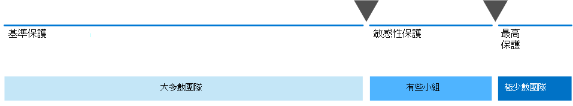
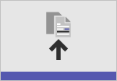

# 使用 Microsoft 365 設定安全的共同作業Set up secure collaboration with Microsoft 365

能夠輕易與適當的人員分享資訊，同時避免 oversharing 是組織成功的關鍵。Being able to easily share information with the right people while preventing oversharing is key to an organization's success. 這包括可以安全地與只有應有存取權的使用者共用機密資料。This includes being able to share sensitive data safely with only those who should have access to it. 視專案而定，這可能包括與組織外部人員共用機密資料。Depending on the project, this might include sharing sensitive data with people outside your organization.

> [!VIDEO https://www.microsoft.com/videoplayer/embed/RWxMmL?autoplay=false]

這個共同作業方案指南包含兩個元件，可協助您：This collaboration solution guidance includes two components to help you:
- 以適當的保護層級，為每個專案部署 Microsoft 團隊Deploy Microsoft Teams with the right level of protection for each project
- 針對每個專案設定具有適當安全性設定的外部共用Configure external sharing with appropriate security settings for each project

如果您無法使用多功能和便於使用的內容共同作業工具，使用者通常會透過電子郵件檔進行共同作業。If versatile and easy-to-use content collaboration tools aren't available, users will often collaborate by emailing documents. 這是一種單調乏味且容易出錯的共同作業方法，可增加不適當共用資訊的風險。This is a tedious and error-prone method of collaboration, and can increase the risk of inappropriate sharing of information. 如果人員發現共用資訊過於困難，他們可能會回復為使用不受 IT 管理的消費產品。If people find sharing information too difficult, they could revert to using consumer products that are not governed by IT. 這可能會帶來更大的風險。This can pose an even greater risk.

使用 Microsoft 365，您可以使用各種設定來部署小組，以協助：With Microsoft 365, you can deploy Teams with a variety of configurations that help:

- 保護您的智慧財產權Protect your intellectual property
- 啟用輕鬆合作Enable easy collaboration
- 建立安全性和可用性之間的平衡，以提升使用者滿意度並降低陰影的風險Create a balance between security and usability that increases user satisfaction and reduces the risk of shadow IT

如果資訊未適當共用，大部分的組織都有各種資訊，但敏感度程度不同，而且業務影響程度也會不同。Most organizations have a variety of information, with varying degrees of sensitivity and varying degrees of business impact if the information is inappropriately shared. 根據特定資訊的敏感度，您可能想要允許與共享：Depending on the sensitivity of a given piece of information, you may want to allow sharing with:

- 任何人 (未驗證) Anyone (unauthenticated)
- 組織內的人員People inside the organization
- 組織內的特定人員Specific people inside the organization
- 組織內部和外部的特定人員Specific people inside and outside the organization

「行銷手冊」等資訊是要在組織外廣泛共用。Information such as marketing brochures are meant for sharing broadly outside the organization. 諸如諸如自助共用之外的資訊（例如，自助）可能不會影響任何業務，如果是外部共用。Information such as cafeteria menus aren't meant for external sharing, but would have no business impact if they were shared externally. 這些類型的資訊需要很少或沒有防護。These types of information need little or no protection.

在開發時，這些相同的行銷手冊只會在組織內共用。Those same marketing brochures, while under development, might only be shared inside the organization. 在此情況下，小組中的預設共用設定可能已足夠。In this case, the default sharing settings in Teams may be sufficient.

在開發中的新產品資訊可能被視為敏感，甚至是在組織內。Information about a new product that is under development might be considered sensitive, even within the organization. 在此情況下，可能會有較大程度的保護。A greater degree of protection might be appropriate in this case. 例如，您可以限制對此資訊的存取權給特定小組的成員。You could restrict access to this information to members of a specific team, for example. 視專案而定，您可能需要與組織外部的人員（例如廠商或夥伴組織）進行共同作業。Depending on the project, you may need to collaborate with people outside your organization, such as a vendor or partner organization.

對貴組織成功與否重要的資訊，或具有嚴格的安全性或規範需求可能需要更高的保護等級。Information that is critical to your organization's success, or has stringent security or compliance requirements might require even greater levels of protection.

針對上述所有案例，您可以使用 Microsoft 團隊中的團隊來儲存、共用及共同作業資訊。For all the scenarios noted above, you can use teams in Microsoft Teams to store, share, and collaborate on the information. 

若要設定安全共同作業，您可以使用這些 Microsoft 365 功能和功能。To configure secure collaboration, you use these Microsoft 365 capabilities and features.

| 產品或元件Product or component | 功能Capability or feature | 授權Licensing |
|:-------|:-----|:-------|
| 適用於 Office 365 的 Microsoft DefenderMicrosoft Defender for Office 365 | SPO、OneDrive 及小組的安全附件;安全檔;小組的安全連結Safe Attachments for SPO, OneDrive and Teams; Safe Documents; Safe Links for Teams    | Microsoft 365 E1，E3 和 E5Microsoft 365 E1, E3 and E5 |
| SharePointSharePoint    | 網站與檔案共用原則、網站共用許可權、共用連結、存取要求、網站來賓共用設定Site and file sharing policies, Site sharing permissions, Sharing links, Access requests, Site guest sharing settings | Microsoft 365 E1，E3 和 E5Microsoft 365 E1, E3 and E5 |
| Microsoft TeamsMicrosoft Teams   | 來賓存取、私人團隊、專用通道Guest access, private teams, private channels | Microsoft 365 E1，E3 和 E5Microsoft 365 E1, E3 and E5 |
| Microsoft 365 合規性Microsoft 365 Compliance  | 敏感度標籤Sensitivity labels    | Microsoft 365 E3 和 E5Microsoft 365 E3 and E5 |

### 共同作業控管Collaboration governance

Microsoft 365 提供許多選項來管理您的共同作業解決方案。Microsoft 365 provides many options for governing your collaboration solution. 我們建議您使用此部署內容與共同作業控管 [內容](collaboration-governance-overview.md) ，為您的組織建立最佳的共同作業解決方案。We recommend you use this deployment content alongside the [collaboration governance content](collaboration-governance-overview.md) to create the best collaboration solution for your organization.

### 針對所有種類的資料使用團隊Using Teams for all kinds of data

若要使用不同的 sensitivities 管理資訊存取，我們 [為小組開發了三個不同的保護層級](configure-teams-three-tiers-protection.md)。To manage access to information with different sensitivities, we've developed [three different tiers of protection for Teams](configure-teams-three-tiers-protection.md). 您可以自訂這些層級，以更好地解決需求或您的業務。You can customize any of these tiers to better address the needs or your business. 

這些層級- *基準*、 *敏感* 和 *高敏感度* -逐步增加保護，協助避免 oversharing 和潛在的資訊洩漏，如下表所示。These tiers - *baseline*, *sensitive*, and *highly sensitive* - gradually increase the protections that help prevent oversharing and potential information leakage, as shown in the following table.

|-|**基準層****Baseline tier**|**機密層****Sensitive tier**|**高度機密層****Highly sensitive tier**|
|:--|:-----------|:------------|:-------------------|
|公用或私人團隊Public or private team|兩者之一Either|PrivatePrivate|PrivatePrivate|
|未經驗證的共用Unauthenticated sharing|已封鎖Blocked|已封鎖Blocked|已封鎖Blocked|
|檔案共用File sharing|允許Allowed|允許Allowed|只有小組擁有者可以共用。Only team owners can share.|
|小組成員資格Team membership|任何人都可以加入 public 團隊。Anyone can join public teams. 加入私人團隊所需的小組擁有者核准。Team owner approval required to join private teams.|加入所需的小組擁有者核准。Team owner approval required to join.|加入所需的小組擁有者核准。Team owner approval required to join.|
|檔加密Document encryption|||可用於敏感度標籤Available with sensitivity label|
|來賓共用Guest sharing|允許Allowed|可以允許或封鎖Can be allowed or blocked|可以允許或封鎖Can be allowed or blocked|
|非管理裝置Unmanaged devices|無限制No restriction|僅限網頁存取Web-only access|已封鎖Blocked|

設定這些層級包括：Configuring these tiers involves:

- 為來賓存取和專用通道設定小組中的設定Configuring settings in Teams for guest access and private channels
- 為內部及來賓共用、存取要求和共用連結設定小組相關 SharePoint 網站中的設定Configuring settings in a team's associated SharePoint site for internal and guest sharing, access requests, and sharing links
- 針對 *敏感* 和 *高敏感度* 的層級，設定敏感度標籤來分類小組，以及控制來賓共用和非管理裝置的存取For the *sensitive* and *highly sensitive* tiers, configuring sensitivity labels to classify the teams, and control guest sharing and access from unmanaged devices
- 針對 *高度敏感* 的層級，設定靈敏度標籤以加密其所套用的檔For the *highly sensitive* tier, configuring a sensitivity label to encrypt the documents to which it is applied

從基準層開始，然後根據需要新增使用 *敏感* 和 *高度機密* 階層的團隊，以協助保護組織中的資訊。Start with the baseline tier, and then add teams that use the *sensitive* and *highly sensitive* tiers as needed to help protect the information in your organization. 請參閱下列資源以開始執行：See these resources to get started:

- [為小組設定基準保護Configure teams with baseline protection](configure-teams-baseline-protection.md)
- [為團隊設定高敏感性資料保護Configure teams with protection for sensitive data](configure-teams-sensitive-protection.md)
- [為小組設定高敏感度資料保護Configure teams with protection for highly sensitive data](configure-teams-highly-sensitive-protection.md)

如果您有高度機密的專案需要在組織內共用額外的保護，您可以設定一個小組，該小組使用自己的敏感度標籤來加密檔案，只有小組成員可以讀取這些檔案。If you have a highly sensitive project that requires additional protection from sharing even within your organization, you can configure a team that uses its own sensitivity label to encrypt files so that only team members can read them. 如需詳細資訊，請參閱 [Configure a team with security 隔離](secure-teams-security-isolation.md) 。See [Configure a team with security isolation](secure-teams-security-isolation.md) for details.

### 與組織外部的人員共用Sharing with people outside your organization

您可能需要 [與組織外部的人員共用任何敏感度的資訊](collaborate-with-people-outside-your-organization.md)。You may need to [share information of any sensitivity with people outside your organization](collaborate-with-people-outside-your-organization.md). 這可能包括與單一人員共用單一檔，以從世界各地的大型夥伴組織或兼職處理主要專案。This could range from sharing a single document with a single person to collaborating on a major project with a large partner organization or freelancers from around the world. 在 Microsoft 365 中，您可以輕鬆執行這種外部共用，並提供適當的防範措施，協助保護您的敏感資訊。In Microsoft 365, this range of external sharing can be done easily and with the appropriate safeguards to help protect your sensitive information.

這些資源會協助您開始設定您的環境，以與組織外部的人員進行合作：These resources will help you get started with setting up your environment for collaborating with people outside your organization:

- [在檔上共同](collaborate-on-documents.md) 作業，以共用個別的資料夾檔案。[Collaborate on documents](collaborate-on-documents.md) for sharing individual files of folders.
- [在網站中共同](collaborate-in-site.md) 作業，以與在 SharePoint 網站中的客人進行合作。[Collaborate in a site](collaborate-in-site.md) for collaborating with guests in a SharePoint site.
- [以](collaborate-as-team.md) 團隊方式共同作業，以與小組中的客人合作。[Collaborate as a team](collaborate-as-team.md) for collaborating with guests in a team.

根據所共用資訊的敏感度，您可以新增安全保護，以協助防止 oversharing。Depending on the sensitivity of the information being shared, you can add safeguards to help prevent oversharing. 這些資源將協助您設定組織所需的保護：These resources will help you set up the protections that you need for your organization:

- [與未驗證使用者共用檔案和資料夾的最佳做法Best practices for sharing files and folders with unauthenticated users](best-practices-anonymous-sharing.md)
- [在與組織外的人員共用檔案時，限制資訊意外暴露Limit accidental exposure to files when sharing with people outside your organization](share-limit-accidental-exposure.md)
- [建立安全的來賓共用環境Create a secure guest sharing environment](create-secure-guest-sharing-environment.md)

如果您有一個主要專案與一個夥伴組織，您可以使用 Azure 權利管理，在您為專案設定的小組中管理該組織的客人。If you have a major project with a partner organization, you can use Azure Entitlement Management to manage the guests from that organization in a team that you set up for the project. 如需詳細資訊，請參閱 [Create a B2B extranet with managed guests](b2b-extranet.md) 。See [Create a B2B extranet with managed guests](b2b-extranet.md) for details.

## 系統管理員訓練Training for administrators

Microsoft 學習的這些訓練模組可協助您瞭解小組和 SharePoint 中的共同作業、控管和身分識別功能。These training modules from Microsoft Learn can help you learn the collaboration, governance, and identity features in Teams and SharePoint.

#### TeamsTeams

|培訓：Training:|使用 Microsoft Teams 管理團隊共同作業Manage team collaboration with Microsoft Teams|
|:---|:---|
||使用 Microsoft Teams 管理團隊共同作業會為您介紹 Microsoft Teams 的功能，Microsoft Teams 是 Microsoft 365 中的團隊共同作業中心。Manage team collaboration with Microsoft Teams introduces you to the features and capabilities of Microsoft Teams, the central hub for team collaboration in Microsoft 365. 您將了解如何使用 Teams 來促進組織內部和外部的團隊合作和溝通，包括從桌面、平板電腦和手機等各種設備，同時利用 Office 365 應用程式的所有豐富功能。You’ll learn how you can use Teams to facilitate teamwork and communication within your organization, both on and off premises, on a wide range of devices—from desktops to tablets to phones—while taking advantage of all the rich functionality of Office 365 applications. 您將了解 Teams 如何提供全面且靈活的環境，以便在各個應用程式和裝置上共同作業。You’ll gain an understanding of how Teams provides a comprehensive and flexible environment for collaboration across applications and devices. 這個學習路徑可協助您準備 Microsoft 365 認證：Teams 系統管理員關聯認證。This learning path can help you prepare for the Microsoft 365 Certified: Teams Administrator Associate certification.  2個 hr 17 min-教學路徑-5 模組2 hr 17 min - Learning Path - 5 Modules|

> [!div class="nextstepaction"]
> [開始 >Start >](/learn/modules/m365-teams-collab-prepare-deployment/introduction/)

#### SharePointSharePoint

|培訓：Training:|在 Microsoft 365 中使用 SharePoint 共同作業Collaborate with SharePoint in Microsoft 365|
|:---|:---|
||使用 Microsoft SharePoint 管理共用內容，為您提供 SharePoint 的各項功能，以及它如何與 Microsoft 365 搭配使用。Manage shared content with Microsoft SharePoint introduces you to the features and capabilities of SharePoint, and how it works with Microsoft 365. 您將了解不同類型的 SharePoint 網站，包括中樞網站，以及資訊保護、報告及監視。You'll learn about the different types of SharePoint sites, including hub sites, as well as information protection, reporting, and monitoring. 您也將了解如何使用 SharePoint 檔案和資料夾共用，以最佳化共同作業、如何在外部共用檔案，以及如何在 SharePoint 系統管理中心管理 SharePoint 網站。You'll also learn how to use SharePoint file and folder sharing to optimize collaboration, how to share files externally, and how to manage SharePoint sites in the SharePoint admin center. 這個學習路徑可協助您準備 Microsoft 365 認證：團隊工作系統管理員關聯認證。This learning path can help you prepare for the Microsoft 365 Certified: Teamwork Administrator Associate certification.  1 hr 14 min-教學路徑-4 模組1 hr 14 min - Learning Path - 4 Modules|

> [!div class="nextstepaction"]
> [開始 >Start >](/learn/modules/m365-teams-sharepoint-plan-sharepoint/introduction/)

#### 資訊保護Information protection

|培訓：Training:|使用 Microsoft 365 保護企業資訊Protect enterprise information with Microsoft 365|
|:---|:---|
||保護您組織資訊的方式比以往更具挑戰性。Protecting and securing your organization's information is more challenging than ever. 使用 Microsoft 365 保護企業資訊學習路徑將討論如何防止您的敏感資訊意外地過度分享或誤用、如何探索和分類資料、如何使用敏感度標籤保護資料，以及如何監視和分析您的敏感資訊以避免資料遺失。The Protect enterprise information with Microsoft 365 learning path discusses how to protect your sensitive information from accidental oversharing or misuse, how to discover and classify data, how to protect it with sensitivity labels, and how to both monitor and analyze your sensitive information to protect against its loss. 這種教學途徑可協助您準備 Microsoft 365 認證：安全性管理員關聯和 Microsoft 365 認證：企業系統管理專家認證。This learning path can help you prepare for the Microsoft 365 Certified: Security Administrator Associate and Microsoft 365 Certified: Enterprise Administration Expert certifications..  1 hr 教學路徑-5 模組1 hr - Learning Path - 5 Modules|

> [!div class="nextstepaction"]
> [開始 >Start >](/learn/modules/m365-security-info-overview/introduction/)

#### 身分識別和存取Identity and access

|培訓：Training:|使用 Azure Active Directory 保護身分識別和存取Protect identity and access with Azure Active Directory|
|:---|:---|
||身分識別和存取學習路徑涵蓋最新的身分識別和存取技術、強化驗證所需的工具，以及組織內部身分識別保護的指導方針。The Identity and Access learning path covers the latest identity and access technologies, tools for strengthening authentication, and guidance on identity protection within your organization. Microsoft 存取和身分識別技術可讓您保護組織的身分識別 (無論是內部部署或雲端)，還能讓您的使用者從任何位置安全地工作。Microsoft access and identity technologies enable you to secure your organization’s identity, whether it is on-premises or in the cloud, and empower your users to work securely from any location. 這個學習路徑可協助您準備 Microsoft 365 認證：安全性系統管理員助理和 Microsoft 365 認證：企業管理員專家認證。This learning path can help you prepare for the Microsoft 365 Certified: Security Administrator Associate and Microsoft 365 Certified: Enterprise Administration Expert certifications.  2小時 52 min-教學路徑-6 模組2 hr 52 min - Learning Path - 6 Modules|

> [!div class="nextstepaction"]
> [開始 >Start >](/learn/modules/m365-identity-overview/introduction/)

## 適用於終端使用者的訓練Training for end users

這些訓練模組可協助您的使用者使用團隊、群組和 SharePoint，以在 Microsoft 365 中共同作業。These training modules can help your users use Teams, groups, and SharePoint for collaboration in Microsoft 365.

|TeamsTeams|SharePointSharePoint|
|:---|:---|
| **[設定和自訂您的小組](https://support.microsoft.com/office/702a2977-e662-4038-bef5-bdf8ee47b17b)****[Set up and customize your team](https://support.microsoft.com/office/702a2977-e662-4038-bef5-bdf8ee47b17b)**| **[共用及同步處理](https://support.microsoft.com/office/98cb2ff2-c27e-42ea-b055-c2d895f8a5de)****[Share and sync](https://support.microsoft.com/office/98cb2ff2-c27e-42ea-b055-c2d895f8a5de)**|
| **[上傳及尋找檔案](https://support.microsoft.com/office/57b669db-678e-424e-b0a0-15d19215cb12)****[Upload and find files](https://support.microsoft.com/office/57b669db-678e-424e-b0a0-15d19215cb12)**||
| **[小組和頻道共同作業](https://support.microsoft.com/office/c3d63c10-77d5-4204-a566-53ddcf723b46)****[Collaborate in teams and channels](https://support.microsoft.com/office/c3d63c10-77d5-4204-a566-53ddcf723b46)**|||

## 插圖Illustrations

這些圖例可協助您瞭解群組和團隊如何與 Microsoft 365 中的其他服務互動，以及可協助您在組織中管理這些服務的控管和合規性功能。These illustrations will help you understand how groups and teams interact with other services in Microsoft 365 and what governance and compliance features are available to help you manage these services in your organization.

### 適用於 IT 結構設計師的 Microsoft 365 中的群組Groups in Microsoft 365 for IT Architects
對於 Microsoft 365 中的群組，IT 結構設計師需要知道的事項What IT architects need to know about groups in Microsoft 365

|**項目****Item**|**描述****Description**|
|:-----|:-----|
|   [PDF](https://github.com/MicrosoftDocs/microsoft-365-docs/raw/public/microsoft-365/downloads/msft-m365-groups.pdf) \| [Visio](https://github.com/MicrosoftDocs/OfficeDocs-Enterprise/raw/live/Enterprise/downloads/msft-m365-groups.vsdx)[PDF](https://github.com/MicrosoftDocs/microsoft-365-docs/raw/public/microsoft-365/downloads/msft-m365-groups.pdf) \| [Visio](https://github.com/MicrosoftDocs/OfficeDocs-Enterprise/raw/live/Enterprise/downloads/msft-m365-groups.vsdx)   更新日期：2019 年 6 月Updated June 2019|這些圖例會詳細說明不同類型的群組、如何建立及管理群組，以及一些控管建議。These illustrations detail the different types of groups, how these are created and managed, and a few governance recommendations.|

### 適用於 IT 結構設計師的 Microsoft 365 中的Microsoft Teams 和相關生產力服務Microsoft Teams and related productivity services in Microsoft 365 for IT architects
使用 Microsoft Teams 領導，Microsoft 365 中生產力服務的邏輯架構。The logical architecture of productivity services in Microsoft 365, leading with Microsoft Teams.

|**項目****Item**|**描述****Description**|
|:-----|:-----|
|   [PDF](https://github.com/MicrosoftDocs/microsoft-365-docs/raw/public/microsoft-365/downloads/msft-m365-teams-logical-architecture.pdf) \| [Visio](https://github.com/MicrosoftDocs/OfficeDocs-Enterprise/raw/live/Enterprise/downloads/msft-m365-teams-logical-architecture.vsdx)[PDF](https://github.com/MicrosoftDocs/microsoft-365-docs/raw/public/microsoft-365/downloads/msft-m365-teams-logical-architecture.pdf) \| [Visio](https://github.com/MicrosoftDocs/OfficeDocs-Enterprise/raw/live/Enterprise/downloads/msft-m365-teams-logical-architecture.vsdx)   更新日期：2019 年 4 月Updated April 2019   |Microsoft 提供一套生產力服務，共同合作來提供資料管理、安全性和法規遵循功能的共同作業體驗。Microsoft provides a suite of productivity services that work together to provide collaboration experiences with data governance, security, and compliance capabilities.    這系列的圖例可為企業結構設計師提供生產力服務邏輯架構使用 Microsoft Teams 引導的檢視。This series of illustrations provides a view into the logical architecture of productivity services for enterprise architects, leading with Microsoft Teams.|

## 部署安全的共同作業解決方案Deploy the secure collaboration solution

當您準備好部署此方案時，請繼續執行下列步驟：When you're ready to deploy this solution, continue with these steps:
1. [為小組設定三種不同的保護層級](configure-teams-three-tiers-protection.md)。Configure the [three different tiers of protection for Teams](configure-teams-three-tiers-protection.md).
2. 設定 [與組織外部人員共用任何敏感度資訊的](collaborate-with-people-outside-your-organization.md)設定。Configure settings for [sharing information of any sensitivity with people outside your organization](collaborate-with-people-outside-your-organization.md).

## 另請參閱See also

[Microsoft 365 安全性文件Microsoft 365 security documentation](../security/index.yml)

[Microsoft 365 合規性文件Microsoft 365 compliance documentation](../compliance/index.yml)

[歡迎使用 Microsoft TeamsWelcome to Microsoft Teams](/MicrosoftTeams/Teams-overview)