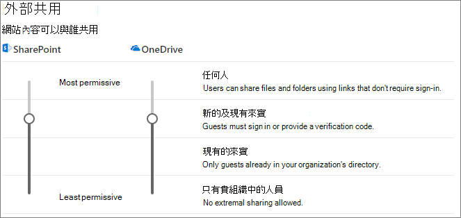

# 在與組織外的人員共用檔案時，限制資訊意外暴露。

當與組織外的人員共用檔案和資料夾時，有許多選項可以降低意外共用敏感性資訊的機會。 您可以從本文中選擇最符合貴組織需求的選項。

## 使用適用於 [任何人] 連結的最佳做法

如果組織的人員需要進行未驗證共用，但是您擔心未驗證的人員修改內容，請參閱[未驗證共用的最佳做法](best-practices-anonymous-sharing.md)，以取得如何在組織中使用未驗證共用的指導方針。

## 關閉 [任何人] 連結

我們建議針對適當的內容讓 [任何人] 連結啟用，因為這是最簡單的共用方式，而且可以協助減少使用者尋求您的 IT 部門掌握外其他解決方案的風險。 [任何人] 連結可以轉寄給其他人，但是檔案存取權僅限擁有連結的人員使用。

如果您要組織外的人員一律在存取 SharePoint、群組或 Teams 中的內容時經過驗證，您可以關閉 [任何人] 共用。 這會防止使用者未經驗證而共用內容。

如果您停用 [任何人] 連結，使用者仍然可以使用 [特定人員] 連結，輕易地與來賓共用。 在此情況下，所有組織外的人員都必須先經過驗證，才能存取共用的內容。

視您的需求而定，您可以針對特定網站或整個組織停用 [任何人] 連結。

若要關閉貴組織的 [任何人] 連結
1. 在 SharePoint 管理中心中，按一下左側導覽窗格中的 [共用]。
2. 將 SharePoint 外部共用設定設為 [新的及現有來賓]。

   

3. 按一下 [儲存]。

若要關閉網站的 [任何人] 連結
1. 在 SharePoint 管理中心中，在左側導覽窗格中展開 [網站]，然後按一下 [使用中網站]。
2. 選取您要設定的網站。
3. 在功能區中，按一下 [共用]。
4. 請確認共用設為 [新的及現有來賓]。

   

5. 如果您做了任何變更，請按一下 [儲存]。

## 網域篩選

您可以使用網域來允許或拒絕清單，以指定您的使用者在與組織外的人員共用時，可以使用哪些網域。

使用允許清單，您可以指定網域清單，而該網域內的組織使用者可以與組織外的人員共用。 已封鎖與其他網域共用。 如貴組織只會與來自特定網域清單的人員共同作業，您可以使用此功能來防止與其他網域共用。

使用拒絕清單，您可以指定網域清單，而該網域內的組織使用者不能與組織外的人員共用。 已封鎖與清單中的網域共用。 如果您有競爭對手，例如您想要避免某人存取組織中的內容，這個功能很有用。

允許和拒絕清單只會影響與來賓的共用。 如果您未停用 [任何人] 連結，使用者仍然可以使用這個連結，與來自禁止網域的人員共用。 若要達到使用網域允許和拒絕清單的最佳結果，請考量停用 [任何人] 連結，如上所述。

若要設定網域允許或拒絕清單
1. 在 SharePoint 管理中心中，按一下左側導覽窗格中的 [共用]。
2. 在 [外部共用的進階設定]底下，選取 [依網域限制外部共用] 核取方塊。
3. 按一下 [新增網域]。
4. 選取您是否想要封鎖網域，輸入網域，然後按一下 [確定]。

   

5. 按一下 [儲存]。

如果您想要依據比 SharePoint 和 OneDrive 還要高層級的網域限制共用，您可以在 Azure Active Directory 中[允許或封鎖對特定組織的 B2B 使用者的邀請](/azure/active-directory/b2b/allow-deny-list)。 (您必須設定 [SharePoint 和 OneDrive 與 Azure AD B2B 整合 (預覽版)](/sharepoint/sharepoint-azureb2b-integration-preview)，讓這些設定影響 SharePoint 和 OneDrive。)

## 將與組織外的人員共用的檔案、資料夾和網站限制為指定的安全性群組

您可以將與組織外的人員共用的檔案、資料夾和網站限制為指定的安全性群組的成員。 如果您想要啟用外部共用，但是有核准工作流程或要求程序，這個選項相當有用。 或者，您可能會要求您的使用者在加入安全性群組並允許外部人員共用之前，先完成訓練課程。

將外部共用限制為安全性群組的成員
1. 在 [SharePoint 系統管理中心](https://admin.microsoft.com/sharepoint) 中，在左側導覽窗格中， **[政策]** 的下方，按一下 **[共用]**。
2. 在 **[外部共用]** 底下，展開 **更多外部共用設定**。

3. 選取 **[只允許特定安全性群組中的使用者對外共用]**，然後選取 **[管理安全性群組]**。

    

4. 在 **[新增安全性群組]** 方塊中，輸入安全性群組的名稱。 [安全性群組] 方塊會隨即顯示。

5. 在安全性群組名稱旁邊，自 **[可以共用的對象]** 下拉式功能表，請選取下列其中一項：

    - **僅限已驗證的來賓**(預設)
    - **任何人**

6. 選取 **[儲存]**。

請注意，這會影響檔案、資料夾和網站，但是不會影響 Microsoft 365 群組或 Teams。 當成員邀請來賓加入私人 Microsoft 365 群組或 Microsoft Teams 中的私人小組時，邀請會傳送給群組或小組擁有者進行核准。

## 另請參閱

[建立安全的來賓共用環境](create-secure-guest-sharing-environment.md)

[與匿名使用者共用檔案和資料夾的最佳做法](best-practices-anonymous-sharing.md)
