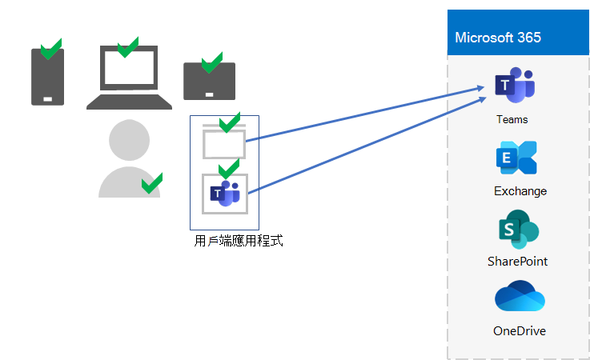
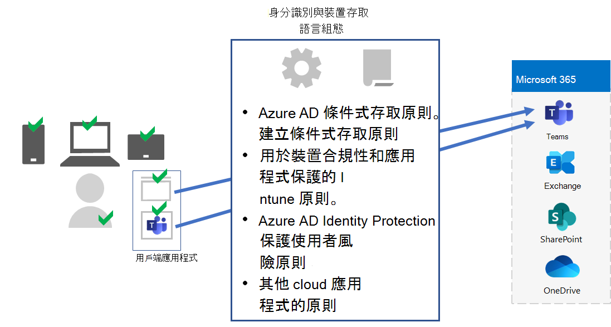
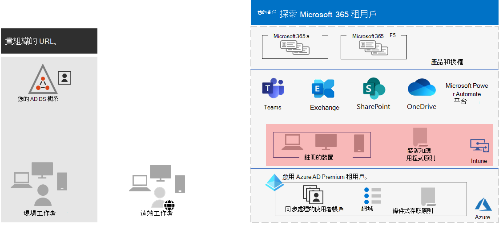

# 步驟 5. 適用于企業承租人的 Microsoft 365 裝置和應用程式管理

Microsoft 365 for enterprise 包含一些功能，可協助您管理裝置，並在組織內使用行動裝置管理 (MDM) 和行動應用程式管理 (MAM) 來管理裝置及使用這些裝置上的應用程式。 您可以管理 iOS、Android、macOS 和 Windows 裝置，以保護您組織的資源（包括您的資料）的存取。 例如，您可以防止將電子郵件傳送給組織外部的人員，或從工作者個人裝置上的個人資料隔離組織資料。

以下是使用者、其裝置的驗證和管理，以及其使用本機和雲端生產力應用程式（如 Microsoft 團隊）的範例。

為了協助您保護組織的資源，Microsoft 365 for enterprise 包含協助管理裝置及其存取應用程式的功能。 裝置管理有兩個選項：

- Microsoft Intune，是企業的綜合裝置和應用程式管理解決方案。
- 基本行動性和安全性，這是包括所有 Microsoft 365 產品的 Intune 服務的子集，用來管理組織中的裝置。 如需詳細資訊，請參閱 [基本行動性和安全性的功能](../admin/basic-mobility-security/capabilities.md)。

如果您有 Microsoft 365 E3 或 E5，您應該使用 Intune。

## Microsoft Intune

您可以使用 [Microsoft Intune](/mem/intune/fundamentals/planning-guide) 管理使用 MDM 或 MAM 對您組織的存取。 MDM 是使用者在 Intune 中「註冊」其裝置的時間。 裝置註冊後，它就是受管理的裝置，而且可以接收您組織的原則、規則和設定。 例如，您可以安裝特定的應用程式、建立密碼原則、安裝 VPN 連線等等。

具有自己個人裝置的使用者可能不想要註冊其裝置，或由 Intune 和您組織的原則進行管理。 不過，您仍然需要保護組織的資源和資料。 在此案例中，您可以使用 MAM 來保護您的應用程式。 例如，您可以使用需要使用者在存取裝置上的 SharePoint 時輸入 PIN 碼的 MAM 原則。

您也會決定要如何管理個人裝置和組織所擁有的裝置。 您可能想要視裝置的用途而異。

## 身分識別與裝置存取設定

Microsoft 提供一組身分 [識別與裝置存取](../security/defender-365-security/microsoft-365-policies-configurations.md) 設定，以確保安全且生產力的工作力。 這些設定包括使用：

- Azure AD 條件式存取原則
- Microsoft Intune 裝置合規性和應用程式保護原則
- Azure AD 身分識別保護使用者風險原則
- 其他 cloud 應用程式的原則

以下是應用這些設定和原則的範例，以驗證及限制使用者、其裝置，以及其使用本機和雲端生產力應用程式（如 Microsoft 團隊）。

如需裝置存取和應用程式管理，請使用下列文章中的設定：

- [必要條件](../security/defender-365-security/identity-access-prerequisites.md)
- [一般身分識別與裝置存取原則](../security/defender-365-security/identity-access-policies.md)

## 步驟 5 的結果

針對 Microsoft 365 租使用者的裝置和應用程式管理，您已決定 Intune 設定和原則，以驗證及限制使用者、其裝置，以及其使用本機和 cloud 生產工具的應用程式。

以下是具有 Intune 裝置和應用程式管理的承租人範例，新的元素會反白顯示。

在此圖中，租使用者有：

- 在 Intune 中註冊的組織擁有的裝置。
- 已登記和個人裝置的 Intune 裝置和應用程式原則。

## 裝置和應用程式管理的持續維護

您可能需要進行下列作業： 

- 管理裝置註冊。
- 修改其他應用程式、裝置及安全性需求的設定和原則。