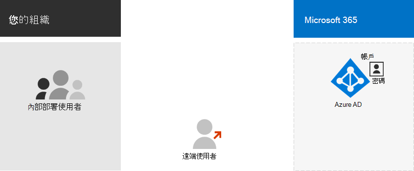
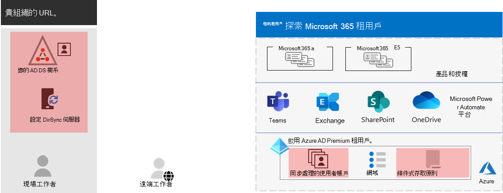
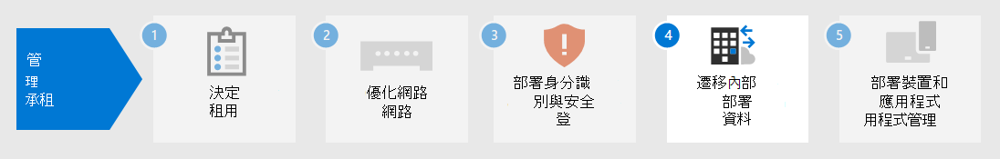

# 步驟 3.Step 3. Microsoft 365 for enterprise 承租人的身分識別Identity for your Microsoft 365 for enterprise tenants

您的 Microsoft 365 租使用者包含 Azure Active Directory (Azure AD) 租使用者管理登入的身分識別和驗證。正確設定您的身分識別基礎結構，對管理組織的 Microsoft 365 使用者存取和許可權而言是很重要的。Your Microsoft 365 tenant includes an Azure Active Directory (Azure AD) tenant to manage identities and authentication for sign-ins. Getting your identity infrastructure configured correctly is vital to managing Microsoft 365 user access and permissions for your organization.

## 僅限雲端與混合Cloud-only vs. hybrid

以下是這兩種類型的身分識別模型及其最大和優點。Here are the two types of identity models and their best fit and benefits.

| ModelModel | 說明Description | Microsoft 365 如何驗證使用者認證How Microsoft 365 authenticates user credentials | 適用Best for | 最大好處Greatest benefit |
|:-------|:-----|:-----|:-----|:-----|
| 僅雲端Cloud-only | 使用者帳戶只存在於 Microsoft 365 租使用者的 Azure AD 租使用者中。User account only exists in the Azure AD tenant for your Microsoft 365 tenant. | Microsoft 365 租使用者的 Azure AD 租使用者使用雲端身分識別帳戶執行驗證。The Azure AD tenant for your Microsoft 365 tenant performs the authentication with the cloud identity account. | 不需要內部部署 AD DS 的組織。Organizations that do not have or need an on-premises AD DS. | 便於使用。Simple to use. 不需要額外的目錄工具或伺服器。No extra directory tools or servers required. |
| 混合式Hybrid |  使用者帳戶存在於內部部署 Active Directory 網域服務中 (AD DS) 而且副本也位於您的 Microsoft 365 租使用者的 Azure AD 租使用者中。User account exists in your on-premises Active Directory Domain Services (AD DS) and a copy is also in the Azure AD tenant for your Microsoft 365 tenant. Azure AD Connect 會在內部部署伺服器上執行，以將 AD DS 變更同步處理至您的 Azure AD 租使用者。Azure AD Connect runs on an on-premises server to synchronize AD DS changes to your Azure AD tenant. Azure AD 中的使用者帳戶可能也包含已雜湊的 AD DS 使用者帳戶密碼的雜湊版本。The user account in Azure AD might also include a hashed version of the already hashed AD DS user account password. | Microsoft 365 租使用者的 Azure AD 租使用者可以處理驗證程式，或將使用者重新導向至另一個身分識別提供者。The Azure AD tenant for your Microsoft 365 tenant either handles the authentication process or redirects the user to another identity provider. | 使用 AD DS 或其他身分識別提供者的組織。Organizations using AD DS or another identity provider. | 當存取內部部署或雲端式資源時，使用者可以使用相同的認證。Users can use the same credentials when accessing on-premises or cloud-based resources. |
||||||

以下是僅限雲端身分識別的基本元件。Here are the basic components of cloud-only identity.
 

在此圖中，內部部署和遠端使用者在其 Microsoft 365 租使用者的 Azure AD 租使用者中，以帳戶登入。In this illustration, on-premises and remote users sign in with accounts in the Azure AD tenant of their Microsoft 365 tenant.

以下是混合式身分識別的基本元件。Here are the basic components of hybrid identity.

在此圖中，內部部署和遠端使用者登入其 Microsoft 365 租使用者，並在 Azure AD 租使用者中使用已從其內部部署 AD DS 複製的帳戶。In this illustration, on-premises and remote users sign in to their Microsoft 365 tenant with accounts in the Azure AD tenant that have been copied from their on-premises AD DS.

## 同步處理您的內部部署 AD DSSynchronizing your on-premises AD DS

根據您的業務需求和技術需求，混合式身分識別模型及目錄同步處理對於採用 Microsoft 365 的企業客戶而言是最常見的選擇。Depending on your business needs and technical requirements, the hybrid identity model and directory synchronization is the most common choice for enterprise customers who are adopting Microsoft 365. 目錄同步處理可讓您在 AD DS 中管理身分識別，並且將使用者帳戶、群組和連絡人的所有更新，同步處理至您的 Microsoft 365 租使用者的 Azure AD 租使用者。Directory synchronization allows you to manage identities in your AD DS and all updates to user accounts, groups, and contacts are synchronized to the Azure AD tenant of your Microsoft 365 tenant.

>[!Note]
>當 AD DS 使用者帳戶第一次同步處理時，不會自動將其指派給 Microsoft 365 許可證，而且無法存取 Microsoft 365 服務，例如電子郵件。When AD DS user accounts are synchronized for the first time, they are not automatically assigned a Microsoft 365 license and cannot access Microsoft 365 services, such as email. 您必須先將其指派為使用位置。You must first assign them a usage location. 然後，透過群組成員資格個別或動態指派授權給這些使用者帳戶。Then, assign a license to these user accounts, either individually or dynamically through group membership.
>

以下是使用混合式識別模型時的兩種驗證類型。Here are the two types of authentication when using the hybrid identity model.

| 驗證類型Authentication type | 說明Description |
|:-------|:-----|
| 管理的驗證Managed authentication | Azure AD 會使用本機儲存的雜湊版本的密碼，或將認證傳送至內部部署 AD DS 來驗證內部部署軟體代理程式，以處理驗證程式。Azure AD handles the authentication process by using a locally-stored hashed version of the password or sends the credentials to an on-premises software agent to be authenticated by the on-premises AD DS.      受管理的驗證類型有兩種：密碼雜湊同步處理 (PHS) 以及透過驗證 (PTA) 。There are two types of managed authentication: Password hash synchronization (PHS) and Pass-through authentication (PTA). 使用 PHS 時，Azure AD 會自行執行驗證。With PHS, Azure AD performs the authentication itself. 使用 PTA 時，Azure AD 具有 AD DS 執行驗證。With PTA, Azure AD has AD DS perform the authentication. |
| 同盟驗證Federated authentication | Azure AD 會將要求驗證的用戶端電腦重新導向至另一個身分識別提供者。Azure AD redirects the client computer requesting authentication to another identity provider. |
|  |  |

若要深入瞭解，請參閱 [選擇正確的驗證方法](https://docs.microsoft.com/azure/active-directory/hybrid/choose-ad-authn) 。See [choosing the right authentication method](https://docs.microsoft.com/azure/active-directory/hybrid/choose-ad-authn) to learn more.

## 強制執行強式登入Enforcing strong sign-ins

若要提高使用者登入的安全性，請使用下表中的功能和功能。To increase the security of user sign-ins, use the features and capabilities in the following table.

| 功能Capability | 描述Description | 其他資訊More information | 授權需求Licensing requirements |
|:-------|:-----|:-----|:-----|:-----|
| Windows Hello 企業版Windows Hello for Business | 在 Windows 裝置上進行簽署時，取代具有強雙因素驗證的密碼。Replaces passwords with strong two-factor authentication when signing on a Windows device. 雙因素是一種新的使用者認證類型，可與裝置和生物特徵或 PIN 相繫結。The two factors are a new type of user credential that is tied to a device and a biometric or PIN. | [Windows Hello 企業版概觀Windows Hello for Business Overview](https://docs.microsoft.com/windows/security/identity-protection/hello-for-business/hello-overview) | Microsoft 365 E3 或 E5Microsoft 365 E3 or E5 |
| Azure AD 密碼保護Azure AD Password Protection | 偵測並封鎖已知的弱密碼和其變種，也可以封鎖您組織特有的其他弱字詞。Detects and blocks known weak passwords and their variants and can also block additional weak terms that are specific to your organization. | [設定 Azure AD 密碼保護Configure Azure AD password protection](https://docs.microsoft.com/azure/active-directory/authentication/concept-password-ban-bad) | Microsoft 365 E3 或 E5Microsoft 365 E3 or E5 |
| 使用多重要素驗證 (MFA)Use multi-factor authentication (MFA) | MFA 要求使用者登入除了使用者帳戶密碼以外的其他驗證，例如使用 smartphone 應用程式的驗證或傳送至 smartphone 的文字訊息。MFA requires that user sign-ins be subject to an additional verification beyond the user account password, such as verification with a smartphone app or a text message sent to a smartphone. 如需使用者如何設定 MFA 的指示，請參閱 [這段影片](https://support.microsoft.com/office/set-up-multi-factor-authentication-in-microsoft-365-business-a32541df-079c-420d-9395-9d59354f7225) 。See [this video](https://support.microsoft.com/office/set-up-multi-factor-authentication-in-microsoft-365-business-a32541df-079c-420d-9395-9d59354f7225) for instructions on how users set up MFA. | [適用于企業的 Microsoft 365 MFAMFA for Microsoft 365 for enterprise](../enterprise/microsoft-365-secure-sign-in.md#mfa) | Microsoft 365 E3 或 E5Microsoft 365 E3 or E5 |
| 身分識別與裝置存取設定Identity and device access configurations | 設定和原則，包含建議的必要條件功能及其設定，其結合了條件式存取、Intune 和 Azure AD 身分識別保護原則，可決定是否應該授與指定的存取要求，以及在哪些條件下。Settings and policies that consist of recommended prerequisite features and their settings combined with Conditional Access, Intune, and Azure AD Identity Protection policies that determine whether a given access request should be granted and under what conditions.  | [身分識別與裝置存取設定Identity and device access configurations](../security/office-365-security/microsoft-365-policies-configurations.md) | Microsoft 365 E3 或 E5Microsoft 365 E3 or E5 |
| Azure AD Identity ProtectionAzure AD Identity Protection | 防護認證洩露，攻擊者會決定使用者的帳戶名稱和密碼，以取得對組織的雲端服務和資料的存取權。Protect against credential compromise, where an attacker determines a user’s account name and password to gain access to an organization’s cloud services and data. | [Azure AD Identity ProtectionAzure AD Identity Protection](https://docs.microsoft.com/azure/active-directory/active-directory-identityprotection) | Microsoft 365 E5 或 Microsoft 365 E3，具有身分識別 & 威脅防護附加元件Microsoft 365 E5 or Microsoft 365 E3 with the Identity & Threat Protection add-on |
|  |  |  |

## 步驟 3 的結果Results of Step 3

為了識別您的 Microsoft 365 租使用者，您已決定：For identity for your Microsoft 365 tenant, you have determined:

- 使用哪個身分識別模型。Which identity model to use.
- 您將如何強制執行強使用者和裝置存取。How you will enforce strong user and device access.

以下是一個範例，其中包含新的混合身分識別元素的承租人。Here is an example a tenant with the new hybrid identity elements highlighted.

在此圖中，租使用者有：In this illustration, the tenant has:

- 使用 DirSync server 和 Azure AD Connect 與 Azure AD 租使用者同步處理的 AD DS 樹系。An AD DS forest that is being synchronized with the Azure AD tenant using a DirSync server and Azure AD Connect.
- Ad ds 使用者帳戶和其他物件從 AD DS 樹系的複本。A copy of the AD DS user accounts and other objects from the AD DS forest.
- 一組條件式存取原則，可強制執行安全使用者登入，並根據使用者帳戶進行存取。A set of Conditional Access policies to enforce secure user sign-ins and access based on the user account. 

## 進行識別的持續維護Ongoing maintenance for identity

您可能需要進行下列作業：On an ongoing basis, you might need to:

- 新增或修改使用者帳戶和群組。Add or modify user accounts and groups. 針對僅限雲端的身分識別，您可以使用 Azure AD 工具（例如 Microsoft 365 系統管理中心或 PowerShell）來維護雲端式使用者和群組。For cloud-only identity, you maintain your cloud-based users and groups with Azure AD tools such as the Microsoft 365 admin center or PowerShell. 針對混合式身分識別，您可以使用 AD DS 工具維護內部部署使用者和群組。For hybrid identity, you maintain your on-premises users and groups with AD DS tools.
- 新增或修改身分識別與裝置存取設定，以強制登入安全性需求。Add or modify your identity and device access configuration to enforce sign-in security requirements.

## 後續步驟Next step

繼續 [遷移](tenant-management-migration.md) ，將您的內部部署 Office 伺服器及其資料移轉至 Microsoft 365。Continue with [migration](tenant-management-migration.md) to migrate your on-premises Office servers and their data to Microsoft 365.
