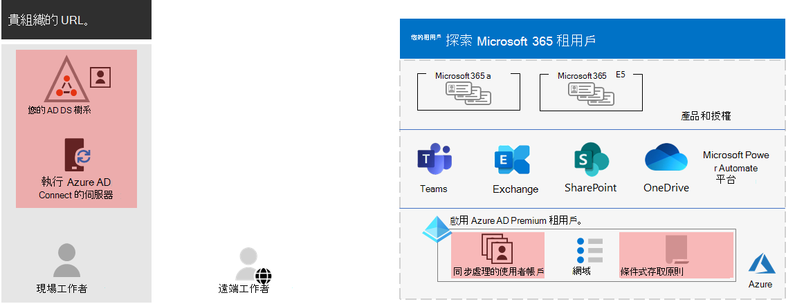

# 步驟 3. 適用于企業承租人的 Microsoft 365 身分識別

您的 Microsoft 365 租使用者包含 Azure Active Directory (Azure AD) 租使用者，以管理登入的身分識別和驗證。正確設定您的身分識別基礎結構，是管理組織 Microsoft 365 使用者存取和許可權的重要因素。

## 僅限雲端與混合

以下是這兩種類型的身分識別模型及其最大和優點。

| Model | 描述 | Microsoft 365 如何驗證使用者認證 | 適用 | 最大好處 |
|:-------|:-----|:-----|:-----|:-----|
| 僅雲端 | 使用者帳戶只存在於 Microsoft 365 租使用者的 Azure AD 租使用者中。 | 您 Microsoft 365 租使用者的 Azure AD 租使用者使用雲端身分識別帳戶執行驗證。 | 不需要內部部署 AD DS 的組織。 | 便於使用。 不需要額外的目錄工具或伺服器。 |
| 混合式 |  使用者帳戶存在於內部部署 Active Directory 網域服務中 (AD DS) 而且副本也位於 Microsoft 365 租使用者的 Azure AD 租使用者中。 Azure AD 連線會在內部部署伺服器上執行，以將 AD DS 變更同步處理至您的 Azure AD 租使用者。 Azure AD 中的使用者帳戶可能也包含已雜湊的 AD DS 使用者帳戶密碼的雜湊版本。 | 您 Microsoft 365 租使用者的 Azure AD 租使用者可以處理驗證程式，也可以將使用者重新導向至另一個身分識別提供者。 | 使用 AD DS 或其他身分識別提供者的組織。 | 當存取內部部署或雲端式資源時，使用者可以使用相同的認證。 |
||||||

以下是僅限雲端身分識別的基本元件。
 

在此圖中，內部部署和遠端使用者在其 Microsoft 365 租使用者的 Azure AD 租使用者中，以帳戶登入。

以下是混合式身分識別的基本元件。

在此圖中，內部部署和遠端使用者登入其 Microsoft 365 租使用者，該租使用者已從其內部部署 AD DS 複製之 Azure AD 租使用者中的帳戶。

## 同步處理您的內部部署 AD DS

根據您的業務需求和技術需求，混合式身分識別模型及目錄同步處理對於採用 Microsoft 365 的企業客戶而言是最常見的選擇。 目錄同步處理可讓您在 AD DS 中管理身分識別，並且將所有對使用者帳戶、群組和連絡人的更新同步處理至 Microsoft 365 租使用者的 Azure AD 租使用者。

>[!Note]
>當 AD DS 使用者帳戶第一次同步處理時，不會自動指派 Microsoft 365 授權，也無法存取 Microsoft 365 服務，例如電子郵件。 您必須先將其指派為使用位置。 然後，透過群組成員資格個別或動態指派授權給這些使用者帳戶。
>

以下是使用混合式識別模型時的兩種驗證類型。

| 驗證類型 | 描述 |
|:-------|:-----|
| 管理的驗證 | Azure AD 會使用本機儲存的雜湊版本的密碼，或將認證傳送至內部部署 AD DS 來驗證內部部署軟體代理程式，以處理驗證程式。      受管理的驗證類型有兩種：密碼雜湊同步處理 (PHS) 以及透過驗證 (PTA) 。 使用 PHS 時，Azure AD 會自行執行驗證。 使用 PTA 時，Azure AD 具有 AD DS 執行驗證。 |
| 同盟驗證 | Azure AD 會將要求驗證的用戶端電腦重新導向至另一個身分識別提供者。 |
|  |  |

若要深入瞭解，請參閱 [選擇正確的驗證方法](/azure/active-directory/hybrid/choose-ad-authn) 。

## 強制執行強式登入

若要提高使用者登入的安全性，請使用下表中的功能和功能。

| 功能 | 描述 | 其他資訊 | 授權需求 |
|:-------|:-----|:-----|:-----|:-----|
| Windows Hello 企業版 | 在 Windows 裝置上進行簽署時，取代具有強雙因素驗證的密碼。 雙因素是一種新的使用者認證類型，可與裝置和生物特徵或 PIN 相繫結。 | [Windows Hello 企業版概觀](/windows/security/identity-protection/hello-for-business/hello-overview) | Microsoft 365 E3 或 E5 |
| Azure AD 密碼保護 | 偵測並封鎖已知的弱密碼和其變種，也可以封鎖您組織特有的其他弱字詞。 | [設定 Azure AD 密碼保護](/azure/active-directory/authentication/concept-password-ban-bad) | Microsoft 365 E3 或 E5 |
| 使用多重要素驗證 (MFA) | MFA 要求使用者登入除了使用者帳戶密碼以外的其他驗證，例如使用 smartphone 應用程式的驗證或傳送至 smartphone 的文字訊息。 如需使用者如何設定 MFA 的指示，請參閱 [這段影片](https://support.microsoft.com/office/set-up-multi-factor-authentication-in-microsoft-365-business-a32541df-079c-420d-9395-9d59354f7225) 。 | [適用于企業的 Microsoft 365 MFA](../enterprise/microsoft-365-secure-sign-in.md#mfa) | Microsoft 365 E3 或 E5 |
| 身分識別與裝置存取設定 | 設定和原則，包含建議的必要條件功能及其設定結合了條件式存取、Intune 和 Azure AD 身分識別保護原則，可判斷是否應授與指定的存取要求，以及在哪些條件下。  | [身分識別與裝置存取設定](../security/defender-365-security/microsoft-365-policies-configurations.md) | Microsoft 365 E3 或 E5 |
| Azure AD Identity Protection | 防護認證洩露，攻擊者會決定使用者的帳戶名稱和密碼，以取得對組織的雲端服務和資料的存取權。 | [Azure AD Identity Protection](/azure/active-directory/active-directory-identityprotection) | 以身分識別 & 威脅防護附加元件 Microsoft 365 E5 或 Microsoft 365 E3 |
|  |  |  |

## 步驟 3 的結果

為 Microsoft 365 租使用者的身分識別，您已決定：

- 使用哪個身分識別模型。
- 您將如何強制執行強使用者和裝置存取。

以下是一個範例，其中包含新的混合身分識別元素的承租人。

在此圖中，租使用者有：

- 使用 DirSync server 和 Azure AD 連線與 Azure AD 租使用者同步處理的 AD DS 樹系。
- Ad ds 使用者帳戶和其他物件從 AD DS 樹系的複本。
- 一組條件式存取原則，可強制執行安全使用者登入，並根據使用者帳戶進行存取。 

## 進行識別的持續維護

您可能需要進行下列作業：

- 新增或修改使用者帳戶和群組。 針對僅限雲端的身分識別，您可以使用 Azure AD 工具（例如 Microsoft 365 系統管理中心] 或「PowerShell」）來維護雲端式使用者和群組。 針對混合式身分識別，您可以使用 AD DS 工具維護內部部署使用者和群組。
- 新增或修改身分識別與裝置存取設定，以強制登入安全性需求。

## 下一步

繼續[遷移](tenant-management-migration.md)，將您的內部部署 Office 伺服器及其資料移轉至 Microsoft 365。