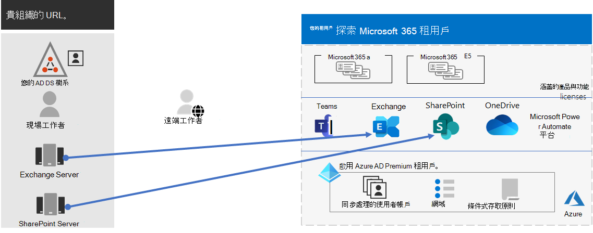
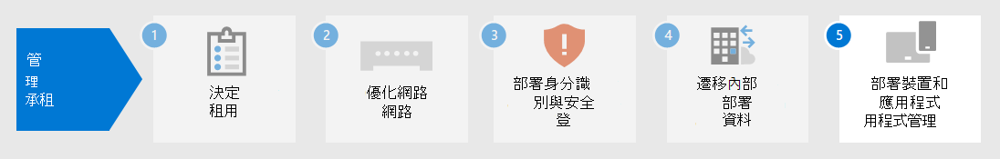

# 步驟 4.Step 4. Microsoft 365 for enterprise 承租人的遷移Migration for your Microsoft 365 for enterprise tenants

大多數的企業組織都有異構環境，包括多個版本的作業系統、用戶端軟體和伺服器軟體。Most enterprise organizations have a heterogeneous environment that includes multiple releases of operating systems, client software, and server software. 適用于企業的 Microsoft 365 包括 IT 基礎結構主要元件的最安全版本。Microsoft 365 for enterprise includes the most secure versions of the key components of your IT infrastructure. 此外，它也包含可讓您利用雲端技術的生產力功能。It also includes productivity features that are designed to take advantage of cloud technologies.

若要最大化 Microsoft 365 的企業整合套件的商業價值，請開始規劃及執行策略，以遷移這些版本：To maximize the business value of the Microsoft 365 for enterprise integrated suite of products, begin planning and implementing a strategy to migrate these releases:

| 寄件者From | 收件者To |
|:-------|:-----|
| Windows 7 和 Windows 8。1Windows 7 and Windows 8.1 | Windows 10 企業版Windows 10 Enterprise |
| 在您的工作人員裝置上安裝的 Office 用戶端產品Office client products installed on your worker's devices | Microsoft 365 Apps 企業版Microsoft 365 Apps for enterprise |
| 在內部部署伺服器上安裝的 Office server 產品Office server products installed on on-premises servers | Microsoft 365 中其對等雲端型服務Their equivalent cloud-based services in Microsoft 365 |
|  |  |

## 遷移至 Windows 10Migrating to Windows 10

每個 Microsoft 365 for enterprise license 都包含 Windows 10 企業版的授權。Each Microsoft 365 for enterprise license includes a license for Windows 10 Enterprise. 若要遷移執行 Windows 7 或 Windows 8.1 的裝置，您可以執行就地升級。To migrate your devices that run Windows 7 or Windows 8.1, you can do an in-place upgrade. Windows 7 在 *2020 年1月14日* 已結束支援。Support ended for Windows 7 on *January 14, 2020*. 

如需在就地升級之外安裝 Windows 10 企業版的其他方法，請參閱 [Windows 10 部署案例](/windows/deployment/windows-10-deployment-scenarios)。For additional methods of installing Windows 10 Enterprise beyond an in-place upgrade, see [Windows 10 deployment scenarios](/windows/deployment/windows-10-deployment-scenarios). 您也可以自行[規劃 Windows 10 部署](/windows/deployment/planning/)。You can also [plan for Windows 10 deployment](/windows/deployment/planning/) on your own.

## 遷移至適用于企業的 Microsoft 365 應用程式Migrating to Microsoft 365 Apps for enterprise

適用于企業的 microsoft 365 包括 Microsoft 365 應用程式的企業版、Office 用戶端產品的版本 (Word、PowerPoint、Excel 和 Outlook) 已從 Microsoft 雲端安裝及更新。Microsoft 365 for enterprise includes Microsoft 365 Apps for enterprise, a version of the Office client products (Word, PowerPoint, Excel, and Outlook) that is installed and updated from the Microsoft cloud. 如需詳細資訊，請參閱 [關於適用于企業的 Microsoft 365 應用程式](/deployoffice/about-microsoft-365-apps)。For more information, see [About Microsoft 365 Apps for enterprise](/deployoffice/about-microsoft-365-apps).

請執行下列步驟，而不是讓您的電腦成為 Office 2019 或舊版的最新版本：Rather than keeping your computers current for Office 2019 or older versions, take the following steps:

1. 為您的使用者取得並指派 Microsoft 365 授權。Get and assign a Microsoft 365 license for your users.
2. 卸載其電腦上的 Office 2013 或 Office 2016。Uninstall Office 2013 or Office 2016 on their computers.
3. 安裝 Microsoft 365 應用程式 for enterprise （不論是個別安裝或進行 IT 推廣）。Install Microsoft 365 Apps for enterprise, either individually or during an IT rollout. 如需詳細資訊，請參閱 [Microsoft 365 應用程式的部署指南](/deployoffice/deployment-guide-microsoft-365-apps)。For more information, see [Deployment guide for Microsoft 365 Apps](/deployoffice/deployment-guide-microsoft-365-apps).

Microsoft 365 應用程式的企業應用程式會自動安裝安全性更新和新功能，並可利用 Microsoft 365 中的雲端式服務，以獲得增強的安全性和生產力。Microsoft 365 Apps for enterprise installs both security updates and new feature updates automatically and can take advantage of cloud-based services in Microsoft 365 for enhanced security and productivity.

## 將內部部署伺服器和資料移轉至 Microsoft 365Migrating on-premises servers and data to Microsoft 365

Microsoft 365 for enterprise 包含雲端架構版本的 Office server 服務，其使用一些與 Office server 軟體內部部署版本（如網頁瀏覽器和 Outlook 用戶端）相同的工具。Microsoft 365 for enterprise includes cloud-based versions of Office server services that use some of the same tools as on-premises versions of Office server software, such as web browsers and the Outlook client. 這些雲端式服務會自動更新，以取得安全性和新功能。These cloud-based services are automatically updated for security and new features. 遷移後，您的 IT 部門可以節省維護和更新內部部署伺服器所需的時間。After migration, your IT department can save the time it takes to maintain and update on-premises servers.

請使用下列資源，以取得針對特定 Microsoft 365 工作負載的使用者和資料進行遷移的相關資訊：Use the following resources for information about migrating users and data for specific Microsoft 365 workloads:

- [將信箱從內部部署 Exchange Server 移至 Exchange OnlineMove mailboxes from on-premises Exchange Server to Exchange Online](/exchange/hybrid-deployment/move-mailboxes)
- [將 SharePoint 資料從 SharePoint 伺服器遷移至 SharePoint 線上Migrate SharePoint data from SharePoint Server to SharePoint Online](/sharepointmigration/migrate-to-sharepoint-online)
- [將商務用 Skype Online 遷移至 Microsoft 團隊Migrate Skype for Business Online to Microsoft Teams](/microsoftteams/migration-interop-guidance-for-teams-with-skype)

## 轉換整個組織Transition your entire organization

若要深入瞭解如何將整個組織移至 Microsoft 365 for enterprise 中的產品和服務，請下載此轉換海報：To get a better picture of how to move your entire organization to the products and services in Microsoft 365 for enterprise, download this transition poster:

這份雙頁海報是清查現有基礎結構的快速方式。This two-page poster is a quick way to inventory your existing infrastructure. 使用此功能，取得在 Microsoft 365 for enterprise 中移至產品或服務的指導方針。Use it to get guidance for moving to a product or service in Microsoft 365 for enterprise. 它會顯示 Windows 和 Office 產品及其他基礎結構及安全性元素，例如裝置管理、身分識別和威脅防護，以及資訊保護和符合性。It shows Windows and Office products and other infrastructure and security elements such as device management, identity and threat protection, and information protection and compliance.

## 步驟 4 的結果Results of Step 4

針對您的 Microsoft 365 承租人進行遷移，您已決定：For migration for your Microsoft 365 tenant, you have determined:

- 哪些裝置執行 Windows 7 或 Windows 8.1，以及將其更新至 Windows 10 企業版的計畫。Which devices are running Windows 7 or Windows 8.1 and the plan to update them to Windows 10 Enterprise.
- 哪些裝置執行 Office 用戶端應用程式，以及將其更新至 Microsoft 365 應用程式以進行企業版的計畫。Which devices are running the Office client apps and the plan to update them to Microsoft 365 apps for enterprise.
- 哪些內部部署 Office server 服務應遷移至其 Microsoft 365 對等專案，以及遷移其資料的計畫。Which on-premises Office server services should be migrated to their Microsoft 365 equivalent and the plan to migrate them and their data.

以下是承租人的範例，其中包含已完成的內部部署伺服器遷移。Here is an example of a tenant with a completed migration of on-premises servers.

在此圖中，組織的：In this illustration, the organization has:

- 已將其內部部署 Exchange 伺服器信箱遷移至 Exchange Online。Migrated its on-premises Exchange Server mailboxes to Exchange Online.
- 將其內部部署 SharePoint 伺服器網站和資料移轉至 Microsoft 365 中 SharePoint。Migrated its on-premises SharePoint Server sites and data to SharePoint in Microsoft 365.

## 進行遷移的持續維護Ongoing maintenance for migration

您可能需要進行下列作業：On an ongoing basis, you might need to:

- 請根據您的 Exchange 信箱遷移狀態，繼續在您的組織中滾動轉換至 Exchange。Depending on the state of your Exchange mailbox migration, continue rolling the transition to Exchange Online out to your organization.
- 請根據您的內部部署 SharePoint 網站遷移狀態，繼續將 Microsoft 365 中 SharePoint 轉換為您的組織。Depending on the state of your on-premises SharePoint site migration, continue rolling the transition to SharePoint in Microsoft 365 out to your organization.

## 後續步驟Next step

繼續進行 [裝置和應用程式管理](tenant-management-device-management.md) ，以部署裝置和應用程式管理。Continue with [device and app management](tenant-management-device-management.md) to deploy device and app management.