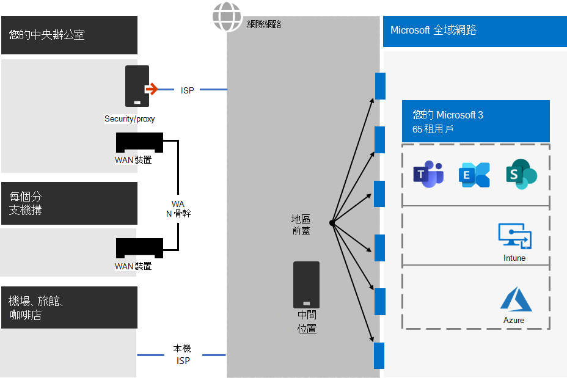
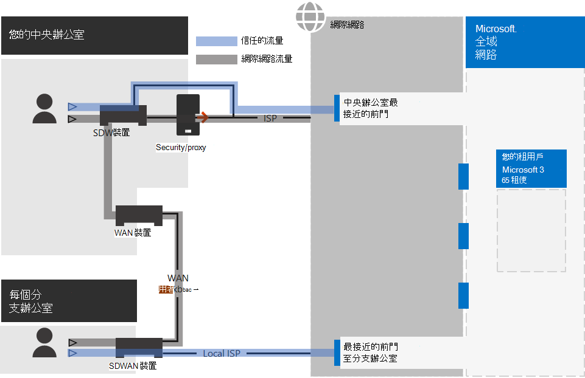
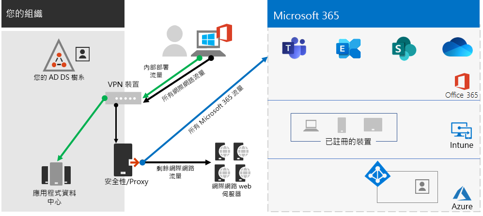
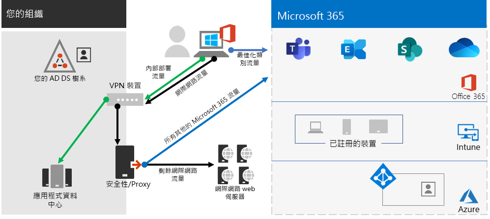
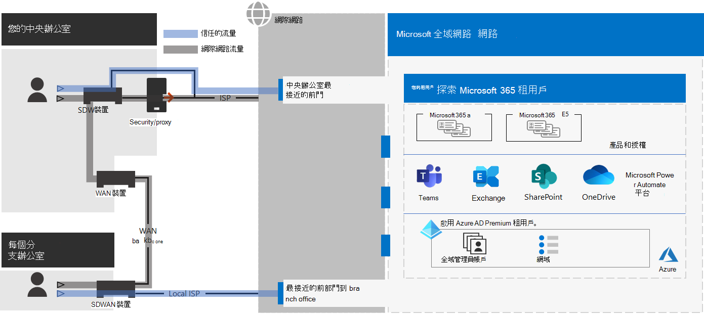

# 步驟 2. 適用于企業承租人 Microsoft 365 的最佳網路

適用于企業的 Microsoft 365 包括 Teams 和 Microsoft Intune Exchange Online 等雲端生產力應用程式，以及 Microsoft Azure 的許多身分識別及安全性服務。 所有這些雲端架構服務的安全性、效能和可靠性都取決於您的內部部署網路上的用戶端裝置和網際網路上的任何位置。 

若要優化租使用者的網路存取，您必須：

- 將您的內部部署使用者與最接近的位置之間的路徑優化至 Microsoft 全球網路。
- 針對使用遠端存取 VPN 解決方案的遠端使用者，優化對 Microsoft Global 網路的存取。
- 使用 [網路 Insights 設計您的辦公室位置的網路周邊。
- 使用 Office 365 CDN，優化 SharePoint 網站上主控的特定資產的存取權。
- 設定 proxy 和網路 edge 裝置，以略過使用端點清單的 Microsoft 365 信任流量的處理，並在進行變更時自動更新清單。

## Enterprise 內部部署工作者

針對商業網路，您應該在用戶端和最接近的 Microsoft 365 端點之間啟用最高的網路存取，以優化使用者的使用者體驗。 使用者經驗的品質與使用者所使用之應用程式的效能和回應能力直接相關。 例如，Microsoft Teams 取決於低延遲，讓使用者電話通話、會議和共用畫面共同作業都沒有任何無任何問題。

網路設計中的主要目標是將用戶端裝置中 (RTT) （從用戶端裝置互連至 Microsoft 全域網路）的來回行程時間減至最少，這是 Microsoft 的公用網路主幹，可將所有的 Microsoft 資料中心互連，以低延遲、高可用性 cloud application 進入點（稱為 front 門窗），以遍佈世界各地。

以下是傳統商業網路的範例。

在此圖中，分支機搆透過 (廣域網路) 裝置和 WAN 主幹來連線至總公司。 網際網路存取是透過中央辦公室網路 edge 的安全性或 proxy 裝置，以及網際網路服務提供者 (ISP) 。 在網際網路上，Microsoft 全球網路在世界各地有一系列的前端門。 組織也可以使用中間位置，以進行額外的封包處理及流量的安全性。 組織的 Microsoft 365 租使用者位於 Microsoft 全球網路內。

此設定 Microsoft 365 雲端服務的問題如下：

- 針對分公司中的使用者，流量會傳送至非本機前門，增加延遲。
- 傳送流量到中級位置建立網路 hairpin，以對信任的流量執行重複的封包處理，增加延遲。
- 網路 edge 裝置會在信任的流量上執行不必要和重複的封包處理，增加延遲。

優化 Microsoft 365 網路效能不需要很複雜。 您可以遵循一些重要的原則，盡可能取得最佳效能：

- 識別 Microsoft 365 網路流量，這是受信任的流量，也就是目的地至 Microsoft 雲端服務的流量。
- 從使用者連線到 Microsoft 365 的每個位置，允許從每個位置的 Microsoft 365 網路流量的本機分支出口。
- 避免網路 hairpin。
- 允許 Microsoft 365 流量略過 proxy 和封包檢查裝置。

如果您執行這些原則，則會取得針對 Microsoft 365 優化的商業網路。

在此圖中，分支機搆會透過軟體定義的 WAN 裝置 (SDWAN) 裝置，將信任的 Microsoft 365 流量傳送至最接近的前端，以進行自己的網際網路連線。 在總公司，受信任的 Microsoft 365 流量會略過安全性或 proxy 裝置和中級裝置不再使用。

以下是優化設定如何解決傳統 enterprise 網路的延遲問題：

- 受信任的 Microsoft 365 流量會跳過 WAN 主幹，並將其傳送給所有辦公室的本機前面的門，以減少延遲。
- 會略過執行重複封包處理的網路 hairpin，以減少 Microsoft 365 信任的流量，減少延遲。
- 會略過執行不必要和重複的封包處理的網路 edge 裝置，以 Microsoft 365 信任的流量，縮短延遲。

如需詳細資訊，請參閱[Microsoft 365 網路連通性一覽](../enterprise/microsoft-365-networking-overview.md)。

## 遠端工作者

如果您的遠端工作者使用傳統的 VPN 用戶端取得貴組織網路的遠端存取權，請確認 VPN 用戶端支援分割通道。 如果沒有分割通道，您所有的遠端工作流量都會透過 VPN 連線傳送，其中必須先將流量轉送給貴組織的邊緣裝置、進行處理，然後透過網際網路傳送。 範例如下。

在此圖中，Microsoft 365 流量必須透過您的組織採取間接的路由，這可以從 VPN 用戶端的物理位置移至遠的 Microsoft 全球網路前門。 這種間接路徑可增加網路流量的延遲，並降低整體效能。 

您可以利用分割通道設定 VPN 用戶端，以排除透過 VPN 連線傳送到組織網路的特定類型流量。

若要將 Microsoft 365 雲端資源的存取最佳化，請設定分割通道 VPN 用戶端，排除透過 VPN 連線到 **最佳化** 類別 Microsoft 365 端點的流量。 如需詳細資訊，請參閱[Office 365 端點類別](../enterprise/microsoft-365-network-connectivity-principles.md#new-office-365-endpoint-categories)和用於分割隧道的最優化類別端點[清單](../enterprise/microsoft-365-vpn-implement-split-tunnel.md#implement-vpn-split-tunneling)。

以下是分割隧道所產生的流量流量，其中大部分的流量 Microsoft 365 雲端應用程式會略過 VPN 連接。

在此圖中，VPN 用戶端直接透過網際網路傳送和接收重要的 Microsoft 365 雲端服務流量，並接收到 Microsoft 全球網路的最近的前門。

如需詳細資訊和指導方針，請參閱[使用 VPN 分割通道將遠端使用者的 Office 365 連線能力最佳化](../enterprise/microsoft-365-vpn-split-tunnel.md)。

## 使用網路 Insights (預覽) 

網路洞察力是從 Microsoft 365 租使用者收集的效能度量，可協助您為辦公室位置設計網路周邊。 每個真知灼見都會針對內部部署使用者存取您租使用者的位置，針對每個地理位置，提供有關特定問題之效能特性的實際詳細資料。

租使用者可能會顯示兩個租使用者層級的網路洞察力：

- [受連線問題影響的 Exchange 採樣連接](../enterprise/office-365-network-mac-perf-insights.md#exchange-sampled-connections-impacted-by-connectivity-issues)
- [受連線問題影響的 SharePoint 採樣連接](../enterprise/office-365-network-mac-perf-insights.md#sharepoint-sampled-connections-impacted-by-connectivity-issues)

以下是每個辦公室位置的特定網路洞察力：

- [Backhauled 網路出局](../enterprise/office-365-network-mac-perf-insights.md#backhauled-network-egress)
- [接近您的客戶，偵測到更佳效能](../enterprise/office-365-network-mac-perf-insights.md#better-performance-detected-for-customers-near-you)
- [使用非最佳的 Exchange Online 服務前端門](../enterprise/office-365-network-mac-perf-insights.md#use-of-a-non-optimal-exchange-online-service-front-door)
- [使用非最佳的 SharePoint 線上服務前門](../enterprise/office-365-network-mac-perf-insights.md#use-of-a-non-optimal-sharepoint-online-service-front-door)
- [從 SharePoint 前門開始的低下載速度](../enterprise/office-365-network-mac-perf-insights.md#low-download-speed-from-sharepoint-front-door)
- [中國使用者最佳網路出口](../enterprise/office-365-network-mac-perf-insights.md#china-user-optimal-network-egress)

> [!IMPORTANT]
> Microsoft 365 系統管理 Center 中的網路洞察力、效能建議和評估目前處於預覽狀態。 它只適用于已在功能預覽方案中登記 Microsoft 365 承租人。

如需詳細資訊，請參閱[Microsoft 365 網路 Insights](../enterprise/office-365-network-mac-perf-insights.md)。

## 使用 Office 365 SharePoint 效能 CDN

以雲端為基礎的內容傳遞網路 (CDN) 可讓您減少載入時間、節省頻寬和加快回應速度。 CDN 會將靜態資產（例如圖形或影片檔案）快取至瀏覽器所要求的位置，以提升效能，這有助於加速下載並減少延遲。 您可以使用內建的 Office 365 內容傳遞網路 (CDN) （包含 SharePoint 和 E5 中的 Microsoft 365 E3）以主控靜態資產，以提供更佳的 SharePoint 頁面效能。

Office 365 CDN 是由可讓您在多個位置或 _來源_ 主控靜態資產的多個 CDN 組成，並透過全球高速網路提供資產。 根據您想要在 Office 365 CDN 中主控的內容種類，您可以新增 **公用** 來源、**私人** 來源或兩者。

部署及設定時，Office 365 CDN 會從公用和私人來源上傳資產，並可讓使用者快速存取遍佈于網際網路的使用者。

如需詳細資訊，請參閱[Use the Office 365 CDN with SharePoint Online](../enterprise/use-microsoft-365-cdn-with-spo.md)。

## 自動化端點清單

若要讓您的內部部署用戶端、edge 裝置和雲端式資料包分析服務略過處理信任的 Microsoft 365 流量，您必須使用一組端點（ (IP 位址範圍和 DNS 名稱）進行設定，) 對應 Microsoft 365 服務。 這些端點可以手動設定防火牆和其他 edge security 裝置、用戶端電腦的 PAC 檔案，以略過 proxy，或在分支辦公室 SD-WAN 裝置。 不過，端點會隨著時間而變更，需要在這些位置進行手動維護端點清單。

若要在用戶端 PAC 檔案和網路裝置中自動執行 Microsoft 365 端點的清單和變更管理，請使用[Office 365 IP 位址和 URL REST 型 web 服務](../enterprise/microsoft-365-ip-web-service.md)。 這種服務可協助您更好地識別及區別 Microsoft 365 網路流量，讓您更容易評估、設定和保持最新的變更。

您可以使用 PowerShell、Python 或其他語言，依時間決定端點的變更，並設定您的 PAC 檔案和 edge 網路裝置。

基本過程如下：

1. 使用 Office 365 IP 位址和 URL web 服務，以及您選擇的設定機制，設定您的 PAC 檔案和網路裝置目前的一組 Microsoft 365 端點。
2. 執行每日週期性，檢查端點中的變更或使用通知方法。
3. 當偵測到變更時，請重新產生並重新發佈用戶端電腦的 PAC 檔案，並對您的網路裝置進行變更。

如需詳細資訊，請參閱[Office 365 IP 位址和 URL web 服務](../enterprise/microsoft-365-ip-web-service.md)。

## 步驟 2 的結果

針對具有最佳網路的 Microsoft 365 租使用者，您已決定：

- 如何透過將網際網路連線新增至所有分支辦公室並消除網路 hairpin，以最優化內部部署使用者的網路效能。
- 如何針對用戶端的 PAC 檔案和網路裝置及服務執行自動信任端點清單，包括 (最適合商業網路) 的持續更新。
- 如何支援對內部部署資源的遠端工作者存取。
- 如何使用網路 Insights
- 如何部署 Office 365 CDN。

以下是企業組織及其租使用者的最佳網路的範例。

[查看較大版本的此影像](https://github.com/MicrosoftDocs/microsoft-365-docs/raw/public/microsoft-365/media/tenant-management-overview/tenant-management-tenant-build-step2.png)

在此圖中，此 enterprise 組織的承租人具有：

- 使用 SDWAN 裝置，將信任的 Microsoft 365 流量轉送至本機前門的每個分支辦公室的本機網際網路存取。
- 無網路 hairpin。
- 中央辦公室安全性和 proxy edge 裝置，可將 Microsoft 365 信任的流量轉寄到本機的前門。

## 持續進行維護以取得最佳網路

您可能需要進行下列作業：

- 更新 edge 裝置，並為端點的變更部署 PAC 檔案，或確認您的自動化程式運作正常。
- 在 Office 365 CDN 中管理資產。
- 針對端點的變更，更新 VPN 用戶端中的分割隧道設定。

## 下一步

繼續身分 [識別](tenant-management-identity.md) ，以同步處理內部部署帳戶和群組，並強制執行安全使用者登入。
