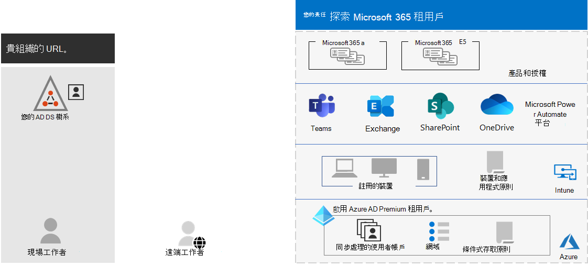
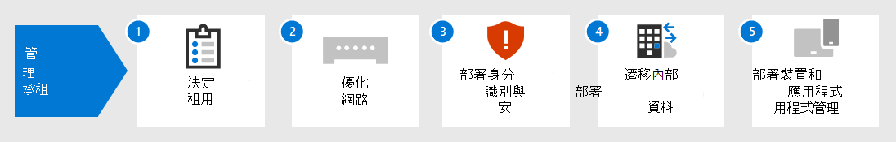

# 適用于企業的 Microsoft 365 租使用者管理Tenant management for Microsoft 365 for enterprise

若要建立您組織的數位轉換與雲端計算的路徑，需要一個可靠的基礎，讓您的工作人員可以以生產力、共同作業、效能、隱私權、合規性和安全性為基礎。Creating a path to your organization's digital transformation with cloud computing requires a firm foundation upon which your workers can rely for productivity, collaboration, performance, privacy, compliance, and security.

正確設定 Microsoft 365 租使用者可提供該基礎，讓您的工作人員致力於完成其工作，並讓您的 IT 部門專注于提供其他商業價值的端對端解決方案。Correct configuration of your Microsoft 365 tenants provides that foundation, leaving your workers to focus on getting their work done and your IT department to focus on end-to-end solutions that provide additional business value. 

此解決方案會透過下列步驟，透過該基礎進行設定：This solution takes you through the configuration of that foundation in these steps:

1. 決定您的承租人Determine your tenants
2. 優化網路Optimize your networking
3. 同步處理您的身分識別並強制執行安全登入Synchronize your identities and enforce secure sign-ins
4. 遷移您的 Windows 裝置、Office 用戶端，以及內部部署 Office 伺服器及資料Migrate your Windows devices, Office clients, and on-premises Office servers and data
5. 部署裝置和應用程式管理Deploy device and app management

不過，首先讓我們花一些時間來瞭解租使用者是什麼，以及提供公司基礎的承租人的外觀。But first, let's take a moment to understand what a tenant is and what a tenant that provides a firm foundation looks like.

## 定義的 Microsoft 365 租使用者A Microsoft 365 tenant defined

Microsoft 365 租使用者是 Microsoft 365 服務的專用實例，以及儲存在特定預設位置（例如歐洲或北美地區）的組織資料。A Microsoft 365 tenant is a dedicated instance of the services of Microsoft 365 and your organization data stored within a specific default location, such as Europe or North America. 當您為組織建立租使用者時，就會指定此位置。This location is specified when you create the tenant for your organization. 每個 Microsoft 365 租使用者都是獨特、獨特的，並與其他所有 Microsoft 365 承租人分開。Each Microsoft 365 tenant is distinct, unique, and separate from all other Microsoft 365 tenants. 當您購買一或多個 Microsoft 的產品，例如 Microsoft 365 E3 或 E5，以及每個產品的授權集時，您會建立 Microsoft 365 租使用者。You create a Microsoft 365 tenant when you purchase one or more products from Microsoft, such as Microsoft 365 E3 or E5, and a set of licenses for each.

您的 Microsoft 365 租使用者也包含 Azure Active Directory (azure ad) 租使用者，該租使用者帳戶、群組及其他物件的 azure ad 專用實例。Your Microsoft 365 tenant also includes an Azure Active Directory (Azure AD) tenant, which is a dedicated instance of Azure AD for user accounts, groups, and other objects. 每個 Azure AD 租使用者皆為 distinct，unique，與其他所有 Azure AD 租使用者分開。Each Azure AD tenant is distinct, unique, and separate from all other Azure AD tenants. 雖然您的組織可以有多個可使用 azure 訂閱設定的 azure ad 租使用者，Microsoft 365 租使用者才能使用單一 Azure ad 租使用者，這是您建立租使用者時所建立的承租人。While your organization can have multiple Azure AD tenants that you can set up with Azure subscriptions, Microsoft 365 tenants can only use a single Azure AD tenant, the one that was created when you created the tenant. 

範例如下：Here is an example:

*租使用者管理* 是 Microsoft 365 承租人的規劃、部署及日常運作。*Tenant management* is the planning, deployment, and ongoing operation of your Microsoft 365 tenants. 

## 設計完善且運作租使用者的屬性Attributes of a well-designed and operating tenant

除了正確的承租人名稱和位置以外，還有其他一些元素可用於規劃、部署和管理，以確保您的使用者體驗 &mdash; Microsoft Teams 和 Exchange Online 等雲端生產力應用程式 &mdash; 是有效、安全和高性能。Beyond the correct name and location for your tenant, there are additional elements to plan, deploy, and manage to ensure that your user experiences with cloud productivity apps&mdash;such as Microsoft Teams and Exchange Online&mdash;are effective, secure, and performant.

以下是元素：Here are the elements:

- 您有一組正確的產品 (訂閱) 和授權。You have the correct set of products (subscriptions) and licenses.
  - 產品集合符合您的業務、IT 及安全性需求。The set of products match your business, IT, and security needs.
  - 您的工作人員和人員的預期變更有適當數量的授權。There is an adequate number of licenses for your workers and anticipated changes in staffing.
- 若為網路：For networking:
  - 您已設定正確的 DNS 功能變數名稱。You have configured the correct DNS domain names.
  - 針對商業網路，您已針對現場工作者的 Microsoft 網路優化網路流量。For enterprise networks, you have optimized network traffic to the Microsoft network for onsite workers.
  - 您已針對使用 VPN 用戶端的遠端工作者優化網路流量。You have optimized network traffic for remote workers who are using a VPN client.
- 您已同步處理 Active Directory 網域服務 (AD DS) 帳戶、群組及其他物件。You have synchronized your Active Directory Domain Services (AD DS) accounts, groups, and other objects.
  - 您的 Azure AD 租使用者帳戶會對應至具有正確 DNS 網域之電子郵件地址的 Exchange Online 信箱。Your Azure AD tenant accounts are mapped to Exchange Online mailboxes with the correct DNS domains for email addresses.
  - 您的使用者帳戶已被指派正確購買產品 (例如 Microsoft 365 E3 或 E5) 的授權。Your user accounts have been assigned the correct licenses from the correct purchased products (such as Microsoft 365 E3 or E5).
- 您已設定強身分識別和存取管理。You have configured strong identity and access management.
  - 您需要使用 passwordless 或多重要素驗證 (MFA) 進行安全的使用者登入。You are requiring secure user sign-in with passwordless or multi-factor authentication (MFA).
  - 您有條件式存取原則，可強制登入需求和限制更高的安全性層級。You have Conditional Access policies that enforce sign-in requirements and restrictions for higher levels of security.
- 內部部署 Office 伺服器及其資料已遷移至雲端應用程式，或是混合式設定中使用。On-premises Office servers and their data have been migrated to cloud apps or are being used in a hybrid configuration.
- 您正在使用 Microsoft 365 內建的 Intune 或基本行動及安全性進行裝置管理。You are doing device management with Intune or Basic Mobility and Security built into Microsoft 365.
  - 組織擁有的裝置會註冊並管理。Your organization-owned devices are enrolled and managed.
  - 管理個人裝置的應用程式。The apps for personal devices are managed.

以下是具有所有這些元素的 Microsoft 365 承租人的範例。Here is an example of a Microsoft 365 tenant with all these elements in place.

在此圖中，Microsoft 365 承租人包括：In this illustration, the Microsoft 365 tenant includes:

- Microsoft 365 E3 和 E5 的產品及授權。Products and licenses for Microsoft 365 E3 and E5.
- Microsoft 365 生產力應用程式。Microsoft 365 productivity apps.
- 使用註冊裝置和裝置及應用程式原則的 Intune。Intune with enrolled devices and device and application policies.
- 具有同步處理使用者帳戶 (群組和其他目錄物件的 Azure AD 租使用者不會顯示) 、網域和條件式存取原則。An Azure AD tenant that has synchronized user account (groups and other directory objects are not shown), domains, and Conditional Access policies.

## 適用于企業的 Microsoft 365 租使用者功能Tenant capabilities for Microsoft 365 for enterprise

下列各節和表格列出此方案中步驟的主要功能及授權。The following sections and table list the key capabilities and licensing for the steps in this solution.

### 租用戶Tenant

| 功能Capability or feature | 描述Description | 授權Licensing |
|:-------|:-----|:-------|
| 多個租用戶Multiple tenants | 每個 Microsoft 365 租使用者都是獨特、獨特的，並與其他所有 Microsoft 365 承租人分開。Each Microsoft 365 tenant is distinct, unique, and separate from all other Microsoft 365 tenants. 使用多個承租人時，在管理及為使用者提供服務時會有一些限制與其他考慮。With multiple tenants, there are restrictions and additional considerations when managing them and providing services to your users. | Microsoft 365 E3 或 E5Microsoft 365 E3 or E5 | 
| 跨租用戶信箱移轉Cross-tenant mailbox migration | 租使用者管理員可以在承租人之間移動信箱，但其內部部署系統中的基礎結構相依性最低。Tenant administrators can move mailboxes between tenants with minimal infrastructure dependencies in their on-premises systems. 這樣就不再需要離線和上架信箱。This removes the need to off-board and onboard mailboxes. | Microsoft 365 E3 或 E5Microsoft 365 E3 or E5 | 
| 多地理位置Multi-Geo | 您的租使用者可以將靜態資料儲存在其他資料中心地理位置，您已選擇這些地理位置，以符合資料派駐要求。Your tenant can store data at rest in the other datacenter geo locations that you've chosen to meet data residency requirements. | Microsoft 365 E3 或 E5Microsoft 365 E3 or E5 | 
| 將核心資料移至新的資料中心地理位置Move core data to a new datacenter geo | 當 Microsoft 新增新的資料中心 geos 以取得額外的容量及計算資源時，您可以針對您的核心客戶資料要求針對地理位置的資料派駐服務，要求資料中心地理位置移動。As Microsoft adds new datacenter geos for additional capacity and compute resources, you can request a datacenter geo move for in-geo data residency for your core customer data. | Microsoft 365 E3 或 E5Microsoft 365 E3 or E5 | 
||||

### 網路功能Networking

| 功能Capability or feature | 描述Description | 授權Licensing |
|:-------|:-----|:-------|
| 網路洞察力Network Insights | 從 Microsoft 365 租使用者收集的網路效能度量，協助您為辦公室位置設計網路周邊。Network performance metrics collected from your Microsoft 365 tenant to help you design network perimeters for your office locations. | Microsoft 365 E3 或 E5Microsoft 365 E3 or E5 | 
| 自動化端點更新Automate endpoint updates | 為用戶端 PAC 檔案和網路裝置及服務中的 Microsoft 365 端點自動化設定和持續更新。Automate the configuration and ongoing updates for Microsoft 365 endpoints in your client PAC files and network devices and services. | Microsoft 365 E3 或 E5Microsoft 365 E3 or E5 | 
||||

### 身分識別Identity

| 功能Capability or feature | 描述Description | 授權Licensing |
|:-------|:-----|:-------|
| 使用您的 Azure AD 租使用者同步處理內部部署 Active Directory 網域服務 (AD DS) Synchronize on-premises Active Directory Domain Services (AD DS) with your Azure AD tenant    | 針對使用者帳戶、群組及其他物件，利用您的內部部署身分識別提供者。Leverage your on-premises identity provider for user accounts, groups, and other objects. | Microsoft 365 E3 或 E5Microsoft 365 E3 or E5 |
| 採用安全性預設值強制執行 MFAMFA enforced with security defaults   | 要求第二種形式的登入驗證，以防止身分識別和裝置遭到入侵。安全性預設值要求所有使用者帳戶使用 MFA。Protect against compromised identities and devices by requiring a second form of authentication for sign-ins. Security defaults requires MFA for all user accounts.   | Microsoft 365 E3 或 E5Microsoft 365 E3 or E5 |
| 使用條件式存取強制執行 MFAMFA enforced with Conditional Access| 根據具有條件式存取原則之登入的屬性，需要 MFA。Require MFA based on the attributes of the sign-in with Conditional Access policies.    | Microsoft 365 E3 或 E5Microsoft 365 E3 or E5 | 
| 使用風險型條件式存取強制執行 MFAMFA enforced with risk-based Conditional Access   | 根據使用適用於身分識別的 Microsoft Defender 的使用者登入的風險，要求使用 MFA。Require MFA based on the risk of the user sign-in with Microsoft Defender for Identity. | Microsoft 365 E5 或 E3 (含 Azure AD Premium P2 授權)Microsoft 365 E5 or E3 with Azure AD Premium P2 licenses | 
| 自助式密碼重設 (SSPR)Self-Service Password Reset (SSPR)    | 允許您的使用者重設或解除鎖定他們的密碼或帳戶。Allow your users to reset or unlock their passwords or accounts.  | Microsoft 365 E3 或 E5Microsoft 365 E3 or E5 |
||||

### 移轉Migration

| 功能Capability or feature | 描述Description | 授權Licensing |
|:-------|:-----|:-------|
| 移轉至 Windows 10Migrate to Windows 10 | 將執行 Windows 7 或 Windows 8.1 的裝置遷移至 Windows 10 企業版。Migrate your devices that run Windows 7 or Windows 8.1 to Windows 10 Enterprise. | Windows 10 企業版包含 Microsoft 365 E3 或 E5 的授權Windows 10 Enterprise licenses included with Microsoft 365 E3 or E5 | 
| 遷移至 Microsoft 365 Apps 企業版Migrate to Microsoft 365 Apps for enterprise | 將 Office 用戶端應用程式（如 Word）和 PowerPoint，遷移至以新功能更新的雲端版本。Migrate your Office client apps such as Word and PowerPoint to the versions installed from the cloud that are updated with new features. | Microsoft 365 E3 或 E5Microsoft 365 E3 or E5 | 
| 將內部部署伺服器和資料移轉至 Microsoft 365Migrate on-premises servers and data to Microsoft 365 | 將您的 Exchange 信箱、SharePoint 網站和商務用 Skype 線上遷移，以 Microsoft 365 雲端服務。Migrate your Exchange mailboxes, SharePoint sites, and Skype for Business Online to Microsoft 365 cloud services. | Microsoft 365 E3 或 E5Microsoft 365 E3 or E5 | 
||||

### 裝置和應用程式管理Device and app management

| 功能Capability or feature | 描述Description | 授權Licensing |
|:-------|:-----|:-------|
| Microsoft IntuneMicrosoft Intune | 提供行動裝置管理 (MDM) 和行動應用程式管理 (MAM) 的雲端式服務，可控制組織的應用程式和裝置的使用方式，包括行動電話、平板電腦和可擕式電腦。A cloud-based service that provides mobile device management (MDM) and mobile application management (MAM) to control how your organization’s application and the devices are used, including mobile phones, tablets, and laptops. | Microsoft 365 E3 或 E5Microsoft 365 E3 or E5 | 
| 設定基本行動與安全性Basic Mobility and Security | 使用此內建服務，保護和管理使用者的行動裝置，例如 iphone、ipad、Androids 和 Windows 電話。Secure and manage your users' mobile devices like iPhones, iPads, Androids, and Windows phones with this built-in service.  | Microsoft 365 E3 或 E5Microsoft 365 E3 or E5 | 
||||

## 後續步驟Next steps

使用這些步驟來設定和管理您的 Microsoft 365 承租人。Use these steps to set up and manage your Microsoft 365 tenants.

1. [決定您的承租人Determine your tenants](tenant-management-tenants.md)
2. [優化網路Optimize your networking](tenant-management-networking.md)
3. [同步處理您的身分識別並強制執行安全登入Synchronize your identities and enforce secure sign-ins](tenant-management-identity.md)
4. [遷移內部部署 Office 伺服器與資料Migrate your on-premises Office servers and data](tenant-management-migration.md)
5. [部署裝置和應用程式管理Deploy device and app management](tenant-management-device-management.md)

每個步驟都說明部署選項、摘要結果及日常維護工作。Each step describes deployment options, summarizes the results, and ongoing maintenance tasks.

若要瞭解虛構但具有代表性的跨國組織如何部署其 Microsoft 365 租使用者的元素，請參閱[Contoso 案例研究](../enterprise/contoso-case-study.md)。To understand how a fictional but representative multi-national organization deployed the elements of their Microsoft 365 tenant, see the [Contoso case study](../enterprise/contoso-case-study.md).
