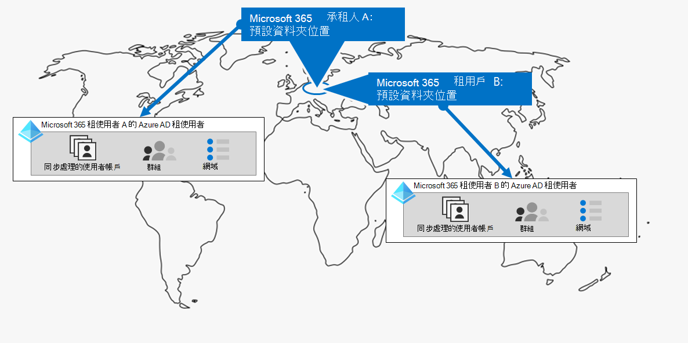
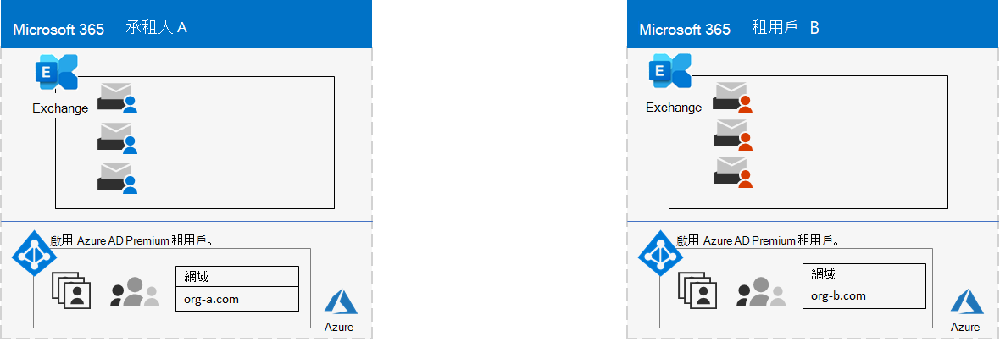
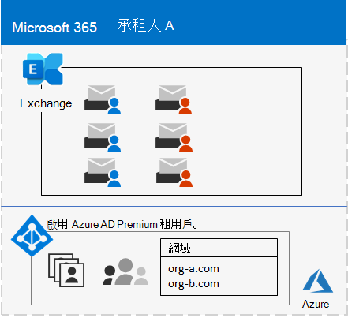
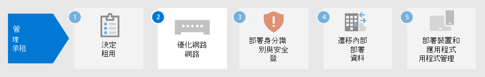

# 步驟 1.Step 1. 您的 Microsoft 365 for enterprise 承租人Your Microsoft 365 for enterprise tenants

您第一個承租人決策是多少。One of your first tenant decisions is how many to have. 每個 Microsoft 365 租使用者都是獨特且獨特的，並與所有其他 Microsoft 365 承租人分開。Each Microsoft 365 tenant is distinct, unique, and separate from all other Microsoft 365 tenants. 其對應的 Azure AD 租使用者也是獨特且獨特的，且與所有其他 Microsoft 365 承租人分開。It’s corresponding Azure AD tenant is also distinct, unique, and separate from all other Microsoft 365 tenants.

## 單一租使用者Single tenant
擁有單一租使用者可簡化貴組織的許多部分使用 Microsoft 365。Having a single tenant simplifies many aspects of your organization’s use of Microsoft 365. 單一租使用者代表單一 Azure AD 租使用者搭配一群組帳戶、群組和原則。A single tenant means a single Azure AD tenant with a single set of accounts, groups, and policies. 您整個組織中的資源許可權及共用均可透過此中央身分識別提供者進行。Permissions and sharing of resources across your organization can be done through this central identity provider.

單一承租人為您的使用者提供功能最豐富且簡化的共同作業和生產力體驗。A single tenant provides the most feature-rich and simplified collaboration and productivity experience for your users.

以下是一個範例，顯示 Microsoft 365 租使用者的預設位置和 Azure AD 租使用者。Here is an example showing the default location and Azure AD tenant of a Microsoft 365 tenant.

## 多個租用戶Multiple tenants

您的組織可能有多個承租人的原因有多種：There are many reasons why your organization could have multiple tenants:

- 系統管理隔離Administrative isolation
- 分散 ITDecentralized IT
- 歷史決策Historical decisions
- 合併、收購或 divestituresMergers, acquisitions, or divestitures
- 清除集團組織的品牌分隔Clear separation of branding for conglomerate organizations
- 預先生產、測試或沙箱承租人Pre-production, test, or sandbox tenants

以下是一個組織範例，其中有兩個承租人 (承租人 A 與租使用者 B) 相同的預設資料中心地理位置。Here is an example of an organization that has two tenants (Tenant A and Tenant B) in the same default datacenter geo. 每個租使用者都是個別 Azure AD 租使用者。Each tenant as a separate Azure AD tenant.

當您有多個承租人時，系統會有限制及其他考慮，以加以管理並為使用者提供服務。When you have multiple tenants, there are restrictions and additional considerations when managing them and providing services to your users.

### 租用戶間共同作業Inter-tenant collaboration

如果您想要讓您的使用者在安全的情況下更有效率地跨不同的 Microsoft 365 承租人進行共同作業，則租使用者共同作業選項包括使用中心位置來進行檔案與交談、共用行事曆、使用 IM、音訊/視頻通話進行通訊，以及保護資源和應用程式的存取。If you want your users to collaborate more effectively across different Microsoft 365 tenants in a secure manner, inter-tenant collaboration options include using a central location for files and conversations, sharing calendars, using IM, audio/video calls for communication, and securing access to resources and applications.

如需詳細資訊，請參閱 [Microsoft 365 內部租使用者共同](../enterprise/microsoft-365-inter-tenant-collaboration.md)作業。For more information, see [Microsoft 365 inter-tenant collaboration](../enterprise/microsoft-365-inter-tenant-collaboration.md).

### 跨承租人信箱遷移 (預覽) Cross-tenant mailbox migration (preview)

在 [) 預覽] 中的跨承租人信箱遷移 (之前，您必須在承租人之間移動 Exchange Online 信箱，以完全下架使用者信箱的目前租使用者， (來源租使用者) 至內部部署，然後再將其上架至新租使用者 (。Prior to cross-tenant mailbox migration (in preview), when moving Exchange Online mailboxes between tenants, you have to completely offboard a user mailbox from their current tenant (the source tenant) to on-premises and then onboard them to a new tenant (the target tenant). 使用新的跨租使用者信箱遷移功能，來源和目標承租人中的租使用者管理員可以在租使用者內部部署系統中的基礎結構相依性之間移動信箱。With the new cross-tenant mailbox migration feature, tenant administrators in both source and target tenants can move mailboxes between the tenants with minimal infrastructure dependencies in their on-premises systems. 這樣就不再需要離線和上架信箱。This removes the need to off-board and onboard mailboxes.

以下是跨租使用者信箱遷移之前的兩個範例承租人和其信箱。Here are two example tenants and their mailboxes before cross-tenant mailbox migration.

在此圖中，兩個不同的承租人具有自己的網域和 Exchange 信箱集。In this illustration, two separate tenants have their own domains and set of Exchange mailboxes.

以下是在跨租使用者信箱遷移之後， (租使用者) 的目標租使用者。Here is the target tenant (Tenant A) after cross-tenant mailbox migration.

在此圖中，單一租使用者同時有兩個網域和兩組 Exchange 信箱。In this illustration, a single tenant has both domains and both sets of Exchange mailboxes.

如需詳細資訊，請參閱 [跨租使用者信箱遷移](../enterprise/cross-tenant-mailbox-migration.md)。For more information, see [Cross-tenant mailbox migration](../enterprise/cross-tenant-mailbox-migration.md).

### 租用戶到租用戶的移轉Tenant-to-tenant migrations

合併、收購、divestitures 及其他案例有數種架構方法可能會讓您將現有的 Microsoft 365 租使用者遷移至新的租使用者。There are several architectural approaches for mergers, acquisitions, divestitures, and other scenarios that might lead you to migrate an existing Microsoft 365 tenant to a new tenant. 

如需詳細指示，請參閱 [Microsoft 365 租使用者對租使用者遷移](../enterprise/microsoft-365-tenant-to-tenant-migrations.md)。For detailed guidance, see [Microsoft 365 tenant-to-tenant migrations](../enterprise/microsoft-365-tenant-to-tenant-migrations.md).

## 承租人的多地理位置Multi-Geo for a tenant

使用 Microsoft 365 多地理位置，您可以在其他資料中心地理位置中布建和儲存資料，而這些地理位置是您已選擇符合資料派駐要求的位置，同時也會解除對您的工作人員進行現代生產力體驗的全域部署。With Microsoft 365 Multi-Geo, you can provision and store data at rest in the other datacenter geo locations that you've chosen to meet data residency requirements, and at the same time unlock your global rollout of modern productivity experiences to your workers.

在多地理位置環境中，您的 Microsoft 365 租使用者是由預設或中央位置所組成，您的 Microsoft 365 訂閱最初是建立所在的位置，以及一個或多個衛星位置。In a Multi-Geo environment, your Microsoft 365 tenant consists of a default or central location where your Microsoft 365 subscription was originally created and one or more satellite locations. 在多地理位置承租人中，地理位置、群組和使用者資訊的相關資訊，都是在全域 Azure AD 租使用者中使用。In a multi-geo tenant, the information about geo locations, groups, and user information is mastered in a global Azure AD tenant. 因為您的承租人資訊已集中集中並同步處理到每個地理位置，所以與您公司的任何人共同作業的共同作業體驗都會在各位置間共用。Because your tenant information is mastered centrally and synchronized into each geo location, collaboration experiences involving anyone from your company are shared across the locations.

以下是一個組織的範例，其預設位置在歐洲和北美的一個衛星位置。Here is an example of an organization that has its default location in Europe and a satellite location in North America. 這兩個位置都共用單一 Microsoft 365 租使用者的相同全域 Azure AD 租使用者。Both locations share the same global Azure AD tenant for the single Microsoft 365 tenant.

如需詳細資訊，請參閱 [Microsoft 365 多地理位置](../enterprise/microsoft-365-multi-geo.md)。For more information, see [Microsoft 365 Multi-Geo](../enterprise/microsoft-365-multi-geo.md).

## 將核心資料移至新的資料中心地理位置Moving core data to a new datacenter geo

Microsoft 繼續開啟新的資料中心 geos for Microsoft 365 服務。Microsoft continues to open new datacenter geos for Microsoft 365 services. 這些新的資料中心 geos 可增加容量及計算資源，以支援我們持續的客戶需求和使用量成長。These new datacenter geos add capacity and compute resources to support our ongoing customer demand and usage growth. 此外，新的資料中心 geos 提供核心客戶資料的地理位置資料派駐服務。Additionally, the new datacenter geos offer in-geo data residency for core customer data.

雖然開啟新的資料中心地理位置並不會影響您和您的核心資料儲存在現有的資料中心地理位置，但 Microsoft 可讓您要求將組織的核心客戶資料及早遷移至新的資料中心地理位置。Although opening a new datacenter geo does not impact you and your core data stored in an already existing datacenter geo, Microsoft allows you to request an early migration of your organization's core customer data at rest to a new datacenter geo.

以下是 Microsoft 365 租使用者從歐盟 (歐盟) 從歐盟地理位置移至英國 (UK) 的範例。Here is an example in which a Microsoft 365 tenant was moved from the European Union (EU) datacenter geo to the one located in the United Kingdom (UK).

如需詳細資訊，請參閱 [將核心資料移至新的 Microsoft 365 datacenter geos](../enterprise/moving-data-to-new-datacenter-geos.md)。For more information, see [Moving core data to new Microsoft 365 datacenter geos](../enterprise/moving-data-to-new-datacenter-geos.md).

## 租使用者的產品和授權Products and licenses for a tenant

當您購買第一種產品時（例如 Microsoft 365 E3），您的 Microsoft 365 租使用者即會建立。Your Microsoft 365 tenant gets created when you purchase your first product, such as Microsoft 365 E3. 除了產品之外，還會收取每月或每年費用的授權。Along with the product are licenses, which are charged a monthly or annual fee. 然後，系統管理員可以直接或透過群組成員資格，將其中一項產品的可用授權指派給使用者帳戶。An administrator then assigns an available license from one of your products to a user account, either directly or through group membership. 根據組織的業務需求，您可能有一組產品，每個產品都有自己的授權集區。Depending on your organization's business needs, you might have a set of products, each with their own pool of licenses. 

若要判斷一組產品以及每個產品的授權數目，必須進行下列規劃：Determining the set of products and the number of licenses for each requires some planning to:

- 確定您有足夠的授權，可供需要高級功能的使用者帳戶使用。Ensure you have enough licenses for the user accounts that need advanced features.
- 根據組織中人員的變更，防止您的授權不足或未指派授權的數目。Prevent you from running out of licenses or having too many unassigned licenses, based on changes in staffing at your organization.

## 步驟 1 的結果Results of Step 1

針對您的 Microsoft 365 for enterprise 承租人，您已決定：For your Microsoft 365 for enterprise tenants, you have determined:

- 您有多少租使用者或需要多少承租人。How many tenants you have or need.
- 每個租使用者必須購買的產品和授權。For each tenant, which products and licenses must be purchased.
- 承租人是否必須是多地理位置，以符合資料派駐要求。Whether a tenant needs to be Multi-Geo to comply with data residency requirements.
- 您是否需要設定承租人間共同作業。Whether you need to set up inter-tenant collaboration.
- 是否需要將一個承租人遷移至另一個承租人。Whether you need to migrate one tenant to another.
- 您是否需要將核心資料從一個資料中心地理位置移至新。Whether you need to move core data from one datacenter geo to new one.

以下是新租使用者的範例。Here is an example of a new tenant.

在此圖中，租使用者有：In this illustration, the tenant has:

- 與 Microsoft 365 資料中心地理位置相對應的預設位置。A default location corresponding to a Microsoft 365 datacenter geo.
- 一組產品和授權。A set of products and licenses.
- 雲端生產力應用程式的集合，有些專用於產品。The set of cloud productivity apps, some of which are specific to products.
- 包含全域管理員帳戶和初始 DNS 功能變數名稱的 Azure AD 租使用者。An Azure AD tenant that contains global administrator accounts and an initial DNS domain name.

當我們流覽此解決方案的其他步驟時，我們將會培養此圖。As we move through the additional steps of this solution, we will build out this figure.

## 承租人的持續維護Ongoing maintenance for tenants

您可能需要進行下列作業：On an ongoing basis, you might need to:

- 新增租使用者。Add a new tenant.
- 使用初始授權數目新增產品至租使用者。Add new products to a tenant with an initial number of licenses.
- 變更承租人中產品的授權集，以調整員工需求的變更。Change the set of licenses for a product in a tenant to adjust for changing staff requirements.
- 將核心資料從租使用者移至新的資料中心地理位置。Move your core data from a tenant to a new datacenter geo location.
- 針對資料派駐服務需求新增多地理位置。Add Multi-Geo for data residency requirements.
- 設定承租人間共同作業。Set up inter-tenant collaboration.

## 後續步驟Next step

繼續 [聯網](tenant-management-networking.md) ，以提供與您的工作人員的最佳網路與 Microsoft 365 雲端服務的連線。Continue with [networking](tenant-management-networking.md) to provide optimal networking from your workers to Microsoft 365 cloud services.
