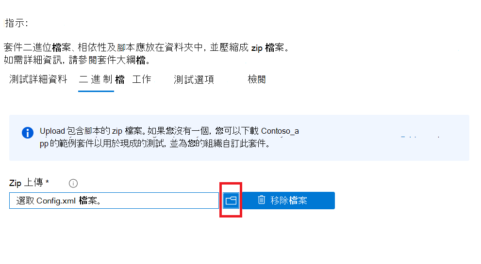

# <a name="step-3-upload-your-binaries-dependencies-and-scripts"></a><span data-ttu-id="6adc4-103">步驟3： Upload 二進位檔案、相依性及腳本</span><span class="sxs-lookup"><span data-stu-id="6adc4-103">Step 3: Upload your binaries, dependencies, and scripts</span></span>

<span data-ttu-id="6adc4-104">在此索引標籤上，您會上載單一的 zip 套件，其中包含您的二進位檔案、相依性及腳本，用來執行測試套件。</span><span class="sxs-lookup"><span data-stu-id="6adc4-104">On this tab, you will upload a single zip package containing your binaries, dependencies and scripts used to run your test suite.</span></span>

## <a name="upload-package-zip-file"></a><span data-ttu-id="6adc4-105">Upload 套件 zip 檔案</span><span class="sxs-lookup"><span data-stu-id="6adc4-105">Upload package zip file</span></span>



  - <span data-ttu-id="6adc4-107">上傳的相依性可以包含測試框架、腳本引擎或將存取以執行應用程式或測試案例的資料。</span><span class="sxs-lookup"><span data-stu-id="6adc4-107">Uploaded dependencies can include test frameworks, scripting engines or data that will be accessed to run your application or test cases.</span></span> <span data-ttu-id="6adc4-108">例如，您可以上傳 Selenium 及 webdriver 安裝程式，以協助執行瀏覽器型測試。</span><span class="sxs-lookup"><span data-stu-id="6adc4-108">For example, you can upload Selenium and a webdriver installer to help run browser-based tests.</span></span>
  - <span data-ttu-id="6adc4-109">最佳作法是確保您的腳本活動保持在模組式（亦即，）。</span><span class="sxs-lookup"><span data-stu-id="6adc4-109">It is best practice to ensure your script activities are kept modular i.e.</span></span> 
    - <span data-ttu-id="6adc4-110">```Install```腳本只會執行安裝作業。</span><span class="sxs-lookup"><span data-stu-id="6adc4-110">The ```Install``` script only performs install operations.</span></span>
    - <span data-ttu-id="6adc4-111">```Launch```腳本只會啟動應用程式。</span><span class="sxs-lookup"><span data-stu-id="6adc4-111">The ```Launch``` script only launches the application.</span></span>
    - <span data-ttu-id="6adc4-112">```Close```腳本只會關閉應用程式。</span><span class="sxs-lookup"><span data-stu-id="6adc4-112">The ```Close``` script only closes the application.</span></span>
    - <span data-ttu-id="6adc4-113">選用的 ```Uninstall``` 腳本只會卸載應用程式。</span><span class="sxs-lookup"><span data-stu-id="6adc4-113">The optional ```Uninstall``` script only uninstalls the application.</span></span>

<span data-ttu-id="6adc4-114">**目前，此入口網站只支援 PowerShell 腳本。**</span><span class="sxs-lookup"><span data-stu-id="6adc4-114">**Currently, the portal only supports PowerShell scripts.**</span></span>


## <a name="next-steps"></a><span data-ttu-id="6adc4-115">後續步驟</span><span class="sxs-lookup"><span data-stu-id="6adc4-115">Next steps</span></span> 

<span data-ttu-id="6adc4-116">繼續進行下一篇文章，移至步驟4： **設定測試工作**。</span><span class="sxs-lookup"><span data-stu-id="6adc4-116">Advance to the next article to go onto Step 4: **Set your Test Tasks**.</span></span>
> [!div class="nextstepaction"]
> [<span data-ttu-id="6adc4-117">回去</span><span class="sxs-lookup"><span data-stu-id="6adc4-117">Go back</span></span>](uploadApplication.md)
> [!div class="nextstepaction"]
> [<span data-ttu-id="6adc4-118">下一步</span><span class="sxs-lookup"><span data-stu-id="6adc4-118">Next step</span></span>](testtask.md)

