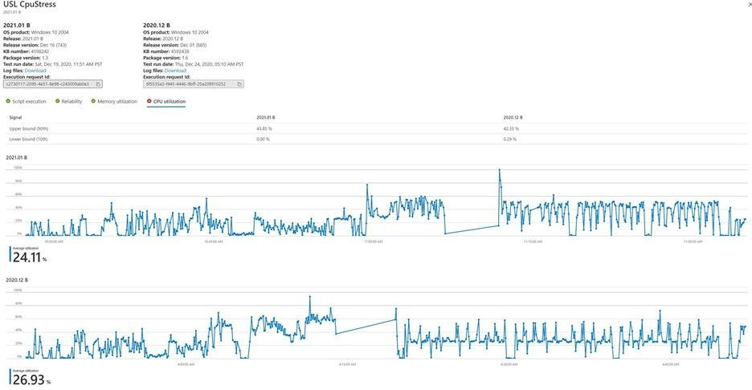

# 智慧 CPU 迴歸分析Intelligent CPU regression analysis

CPU 使用率可指出應用程式是否受到作業系統更新的影響。CPU utilization can indicate whether an application is affected by an operating system update. 

測試基底為 Microsoft 365 提供軟體發展人員深入瞭解 CPU 效能回歸，當其應用程式執行于不同版本的未來 Windows 作業系統 (作業系統) 更新時，就會發生此問題。Test Base for Microsoft 365 provides software developers with an insight into CPU performance regressions which occur when their application is running on different versions of an upcoming Windows Operating System (OS) update. 

這些 CPU 退化功能可讓開發人員偵測和解決應用程式問題，並在作業系統更新廣泛部署之前 (和潛在的失敗) ，這樣就能避免使用者遭受不良的體驗。These CPU regressions enable developers to detect and resolve application issues (and potential failures) before the OS update is deployed broadly, thus preventing a bad experience for the end user.

### CPU 迴歸分析的運作方式How CPU regression analysis works ###

做為測試基本使用者，您可以將應用程式的 (二進位檔案上傳至單一 .zip 檔) 中，以及相關聯的測試腳本，並選取您想要在 Azure 上的測試基底入口網站上測試應用程式的 Windows OS 版本。As a Test Base user, you can upload your application's binaries (in a single .zip file), along with associated test scripts and select the Windows OS version against which you would like to test your application on the Test Base portal on Azure. 

然後，測試基礎服務會執行測試腳本，並執行 **CPU 迴歸分析**。The Test Base service then runs the test scripts and performs the **CPU Regression Analysis**. 

服務會檢查目標 OS 之更新測試測試測試的 CPU 使用率是否已列在已發行版本本作業系統的 CPU 使用率內。The service checks if the CPU utilization for the application on the pre-release version of the update for the target OS is in line with the CPU utilization for the released version of the OS. 

CPU 使用率不是以類似的方式比較100%，因為在作業系統的兩個版本上執行的程式可能會完全符合，也可能不會完全符合，這是因為不同的作業系統版本;不過，測試基礎所執行的分析可以顯示應用程式的 CPU 使用率是否會受到即將進行的作業系統更新影響，並特別是哪些程式從先前的測試執行 regressed。CPU utilization is not a 100% like-for-like comparison because the processes running on the two versions of the OS may or may not be an exact match due to differing OS versions; however, the analysis performed by Test Base can show you whether CPU utilization for your application is impacted by an upcoming OS update and specifically which processes have regressed from previous test runs.

在下列快照中，相同的應用程式有兩個作業系統版本比較 CPU 使用率。In the snapshot below, there are two OS releases against which the CPU utilizations are compared for the same application. 
-   [CPU 使用率] 索引標籤分別顯示第90及第10百分位數的兩個版本的上限與下限。The CPU utilization tab shows the upper and lower bounds of utilization for both releases at 90th and 10th percentiles respectively. 
-   圖形會顯示 CPU 使用率的時序和平均使用率。The graphs show the time series of CPU utilization along with the average utilization. 

客戶現在可以使用該功能來判斷其應用程式的 CPU 使用率是否受到作業系統更新的影響，並特別明確哪些程式從先前執行 regressed。Customers can now use the functionality to determine if their application's CPU utilization is impacted by OS updates and specifically which processes have regressed from their previous execution.

### 相關的進程識別Relevant Process Identification ###

在這裡，我們將討論如何識別應用程式中的 regressed 處理常式。Here, we discuss how to identify regressed processes in the application. 

分析效能回歸需要追蹤測試執行期間虛擬機器上執行的每個進程的不同種類的效能計數器。Analyzing performance regression requires tracking different kinds of performance counters for every process running on a virtual machine during the test run. 

這類分析會為指定的應用程式捕獲許多程式的變數。Such analysis captures a lot of variables for a lot of processes for a given application. 並非所有進程都與執行或應用程式相關聯。Not all processes are associated with a run or application. 若要解決此問題，使用 probability 和資訊理論的相互資訊排名演算法，可判斷哪些程式對特定的應用程式最為相關。To work around this challenge, a mutual information ranking algorithm using probability and information theory is applied to figure out which processes are most relevant for a given application. 

在處理常式被視為另一種離散隨機變數的情況下，可以將應用程式視為一種離散隨機變數。An application can be considered one type of discrete random variable while a process is considered another kind of discrete random variable. 這兩個隨機變數的關聯是使用相關條件概率測定。The association of the two random variables is measured using conditional probabilities for relevance. 

然後，處理常式會以每個應用程式的相關性順序來顯示。Processes are then displayed in the order of their relevance for each application. 您也可以根據預設，將可監控之程式的子集，以及 CPU 迴歸分析相關的處理常式。You can also favorite a subset of processes that can be monitored, by default, along with relevant processes for CPU regression analysis. 偵測到回歸時，您可以下載 Windows 效能分析器工具組，並分析 CPU 效能退化的原因。Once a regression is detected, you can download the Windows Performance Analyzer toolkit and analyze reasons for CPU performance regressions. 

Windows 效能分析器會採用事件追蹤記錄檔 (ETL) 作為輸入，而這些 .etl 檔案可用於入口網站上的測試執行的記錄檔中。The Windows Performance Analyzer takes event trace log (ETL) as inputs and these .etl files are available in the log files downloadable for test runs on the portal. 如果您想要瞭解有關調試 CPU 效能的詳細資訊，請參閱 Windows 效能分析器檔。If you would like to know more about debugging CPU performance, see the Windows Performance Analyzer documentation.

