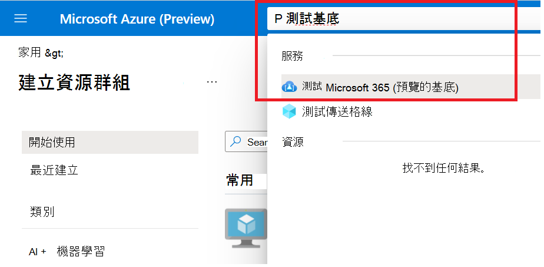
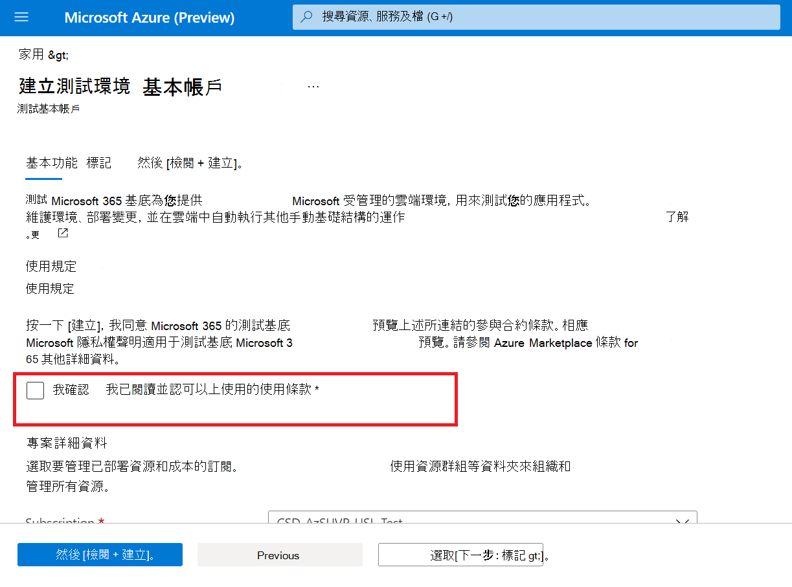

# <a name="step-1-create-a-test-base-account"></a><span data-ttu-id="5715a-103">步驟1：建立測試基底帳戶</span><span class="sxs-lookup"><span data-stu-id="5715a-103">Step 1: Create a Test Base account</span></span>

<span data-ttu-id="5715a-104">如果您沒有 Azure 訂閱，請先建立 [免費帳戶](https://azure.microsoft.com/en-us/free/) ，再開始。</span><span class="sxs-lookup"><span data-stu-id="5715a-104">If you don't have an Azure subscription, create a [free account](https://azure.microsoft.com/en-us/free/) before you begin.</span></span>

## <a name="enter-details-for-test-base-account"></a><span data-ttu-id="5715a-105">輸入測試基本帳戶的詳細資料</span><span class="sxs-lookup"><span data-stu-id="5715a-105">Enter details for test base account</span></span>
 
1. <span data-ttu-id="5715a-106">在 Azure 入口網站中搜尋「 **測試基礎** 」。</span><span class="sxs-lookup"><span data-stu-id="5715a-106">Search for **'Test Base'** in the Azure portal.</span></span>



2. <span data-ttu-id="5715a-108">按一下 [ **新增** ] 以建立測試基底帳戶。</span><span class="sxs-lookup"><span data-stu-id="5715a-108">Click **'Add'** to create a Test Base account.</span></span>

![按一下 [新增] 以建立帳戶](Media/CreateTestAccount2.png)

3.  <span data-ttu-id="5715a-110">通讀 [ ```Terms of Use``` 選取] 核取方塊，以確認您對的滿意度 ```Terms of Use``` 。</span><span class="sxs-lookup"><span data-stu-id="5715a-110">Read through the ```Terms of Use``` then select the checkbox to confirm your satisfaction with the ```Terms of Use```.</span></span>



4.  <span data-ttu-id="5715a-112">在下列需求下填入正確資訊：</span><span class="sxs-lookup"><span data-stu-id="5715a-112">Fill in the correct information under the following requirements:</span></span> 
    -   <span data-ttu-id="5715a-113">訂閱：資源群組</span><span class="sxs-lookup"><span data-stu-id="5715a-113">Subscription: Resource Group</span></span>
    -   <span data-ttu-id="5715a-114">實例詳細資料： Name。</span><span class="sxs-lookup"><span data-stu-id="5715a-114">Instance Details: Name.</span></span>

<span data-ttu-id="5715a-115">**目前，測試基底只支援標準的定價層。**</span><span class="sxs-lookup"><span data-stu-id="5715a-115">**Currently, Test Base only supports Standard Pricing tier.**</span></span>

![選取詳細資料中的 [訂閱]、[資源群組] 及 [輸入]](Media/CreateTestAccount4.png)

5.  <span data-ttu-id="5715a-117">最後，按一下 ```Review + Create``` 以驗證及啟用新建立的帳戶。</span><span class="sxs-lookup"><span data-stu-id="5715a-117">Finally, click on ```Review + Create``` to validate and enable your newly created account.</span></span>

## <a name="next-steps"></a><span data-ttu-id="5715a-118">後續步驟</span><span class="sxs-lookup"><span data-stu-id="5715a-118">Next steps</span></span>

<span data-ttu-id="5715a-119">若要開始使用，請參閱下一篇步驟2： **瞭解上傳套件的方式。**</span><span class="sxs-lookup"><span data-stu-id="5715a-119">Advance to the next article to get started with Step 2: **Learn how upload your package.**</span></span>
> [!div class="nextstepaction"]
> [<span data-ttu-id="5715a-120">下一步</span><span class="sxs-lookup"><span data-stu-id="5715a-120">Next step</span></span>](uploadApplication.md)

<!---
Add button for next page
-->
