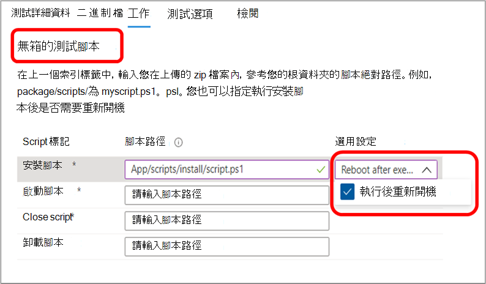
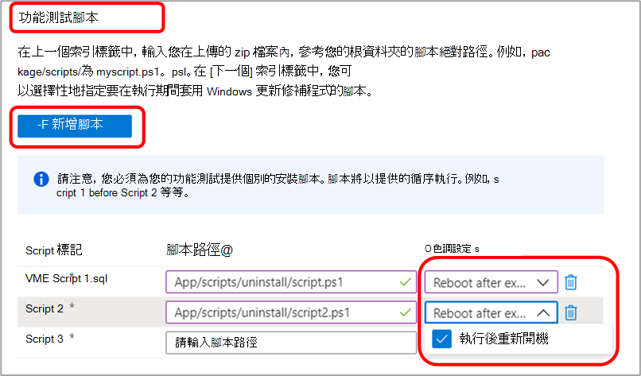

# 測試基底常見問題Test Base FAQ

**問：如何提交套件以測試基本團隊？****Q: How do we submit our packages to Test Base team?**

**A：** 使用我們自助的入口網站，將套件直接提交至測試基底環境。**A:** Submit your packages directly to the Test Base environment using our self-serve portal.

若要提交應用程式套件，請流覽至 [Azure 入口網站](https://www.aka.ms/testbaseportal "測試基底首頁") ，並透過自助的測試基本入口網站儀表板，上載包含應用程式二進位檔案、相依性及測試腳本的壓縮資料夾。To submit your application package, navigate to the [Azure Portal](https://www.aka.ms/testbaseportal "Test Base Homepage") and upload a zipped folder containing your application's binaries, dependencies, and test scripts via the self-serve Test Base portal dashboard. 

如需詳細資訊，請參閱上架使用者指南，或聯繫我們 <testbasepreview@microsoft.com> 的小組以取得協助及詳細資訊。Please see the onboarding user guide for more information or contact our team at <testbasepreview@microsoft.com> for assistance and more information.

**問：什麼是現成的 (OOB) 測試？****Q: What are Out-of-box (OOB) tests?**

**A：** 現成 (OOB) 測試為標準化、安裝應用程式套件的預設測試執行、啟動和關閉三十 (30) 時間，然後再將其卸載。**A:** Out-of-box (OOB) tests are standardized, default test runs where application packages are installed, launched and closed thirty (30) times, and then uninstalled. 

為測試基底建立的套件會有下列測試腳本：安裝、啟動、關閉和選擇性卸載腳本。The packages created for Test Base will have the following test scripts: install, launch, close, and optionally the uninstall script. 

現成 (OOB) 測試為您提供應用程式上的標準化遙測，以在不同的 Windows 建立間進行比較。The Out-of-box (OOB) tests provide you with standardized telemetry on your application to compare across Windows builds.

**問：我們是否可以在現成的測試之外提交測試 (安裝、啟動、關閉、卸載測試腳本) ？****Q: Can we submit tests outside of the Out-of-box tests (install, launch, close, uninstall test scripts)?**

**A：** 是的，客戶也可以透過自助入口網站儀表板上傳 **功能測試** 的應用程式套件。**A:** Yes, customers can also upload application packages for **functional tests** via the self-serve portal dashboard.
**功能測試** 是一種測試，可讓客戶執行其腳本，以在其應用程式上執行自訂功能。**Functional tests** are tests that enable customers execute their scripts to run custom functionality on their application.

## 測試Testing

**問：您是否支援功能測試？****Q: Do you support functional tests?**

**A：** 是的，測試基底支援功能測試。**A:** Yes, Test Base supports functional tests. 功能測試是一些測試，可讓客戶執行其腳本，以在其應用程式上執行自訂功能。Functional tests are tests that enable our customers execute their scripts to run custom functionality on their application. 

若要提交應用程式套件以進行功能測試，只需透過我們的自行服務入口網站儀表板，上載包含應用程式二進位檔案、相依性及測試腳本的壓縮資料夾。To submit your application package for functional testing, simply upload the zipped folder containing your application's binaries, dependencies, and test scripts via our self-serve portal dashboard. 

如需詳細資訊，請參閱上架使用者指南，或聯繫我們 <testbasepreview@microsoft.com> 的小組以取得協助及詳細資訊。Please see the onboarding user guide for more information or contact our team at <testbasepreview@microsoft.com> for assistance and more information.

**問：測試基礎如何處理我們的測試資料？****Q: How does Test Base handle our test data?**

**A：** 測試基礎會在 Azure 環境上安全地收集和管理測試資料。**A:** Test Base securely collects and manages your test data on the Azure environment. 

**問：可以測試我們自動測試的基本支援嗎？****Q: Can Test Base support our automated tests?**

是的，測試基底支援自動測試但由於服務功能，我們不支援在此時間進行手動測試。Yes, Test Base supports automated tests however, we do not support manual tests at this time due to service capabilities.

**問：自動測試的語言和架構是否支援？****Q: What languages and frameworks of automated tests do you support?**

**A：** 我們支援所有語言及框架。**A:** We support all languages and frameworks. 我們會透過 PowerShell 來呼叫所有腳本。We invoke all scripts through PowerShell. 

您也需要提供 (上傳) 所需之架構的相依二進位檔。You will also need to provide (upload) the dependent binaries of the required framework.

**問：測試基礎提供測試結果的速度多久？****Q: How soon does Test Base provide test results?**

**A：** 針對我們針對發佈前版本執行的每個測試，我們會在 [Azure 入口](https://www.aka.ms/testbaseportal "測試基底首頁") 網站儀表板的48小時內提供結果。**A:** For each test that we run against the pre-release builds, we will provide results within 48 hours on your [Azure Portal](https://www.aka.ms/testbaseportal "Test Base Homepage") dashboard.

**問：您是否可以在安裝之後重新開機？****Q: Can you reboot after install?**

**A：** 是的，我們的處理常式支援在安裝之後重新開機。**A:** Yes, our process supports rebooting after installation. **在上架** 入口網站上設定工作時，請務必從「選用的設定」下拉式清單中選取此選項。Be sure to select this option from the “Optional settings” drop list when setting your **Tasks** on the onboarding portal.

針對現成 (OOB) 測試，您可以指定 _安裝腳本_ 是否需要重新開機。For Out-of-box (OOB) tests, you can specify whether a reboot is needed for the _Install script._

針對功能測試，您可以指定每個新增的腳本是否需要重新開機。While for functional tests, you can specify whether a reboot is required for each script that is added.

**問：您支援哪些 Windows 版本？****Q: What Windows versions do you support?**

**A：** 目前我們支援 Windows 10 用戶端、Windows Server 2016、Windows Server 2016 核心版本、Windows server 2019 和 Windows server 2019 核心版本。**A:** We currently support Windows 10 clients, Windows Server 2016, Windows Server 2016 Core version, Windows Server 2019, and Windows Server 2019 Core version.

**問：安全性更新測試與功能更新測試之間的差異為何？****Q: What is the difference between Security Update tests and Feature Update tests?**

**A：** 為了進行安全性更新測試，我們會針對 Windows 上的 **<ins>每月預先發行安全性更新</ins>** 進行測試，其重點是讓使用者永遠安全且受到保護。**A:** For Security update tests, we test against the **<ins>monthly pre-release security updates</ins>** on Windows which are focused on keeping our users always secure and protected. 針對功能更新測試，我們會針對在 Windows 推出新功能的 **<ins>更新</ins>** 進行測試。For the Feature update tests, we test against the **<ins>bi-annual pre-release feature updates</ins>** which introduces new features and capabilities on Windows.

## 調試選項Debugging options

**問：如果發生失敗，我們是否可以存取虛擬機器 (Vm) ？測試基本份額為何？****Q: Do we get access to the Virtual Machines (VMs) in case of failures? What does Test Base share?**

**A：** 為保證服務的相容性和發行前的更新是安全的，只有 Microsoft 可以存取 Vm。**A:** For the service to be compliant and the pre-release updates be secure, only Microsoft has access to the VMs. 不過，客戶可以在其入口網站儀表板上查看測試結果和其他測試度量，包括崩潰和懸掛信號、可靠性度量、記憶體和 CPU 使用率等。我們也會產生並提供儀表板上的測試執行記錄，以供下載及進一步分析。However, customers can view test results and other test metrics on their portal dashboard, including crash and hang signals, reliability metrics, memory and CPU utilization etc. We also generate and provide logs of test runs on the dashboard for download and further analysis. 

我們也可以視需要提供用於崩潰調試的記憶體傾印。We can also provide memory dumps for crash debugging as needed.

**問：如果在測試期間發現問題，解決這些問題的後續步驟為何？****Q: If there are issues found during the testing, what are the next steps to resolve these issues?**

**A：** 測試基底小組會執行初始的診斷程式，以判斷錯誤的根本原因，然後根據我們的結果，我們會在 Microsoft 中路由傳送至客戶或內部小組，以進行調試。**A:** The Test Base team will perform an initial triage process to determine the root cause of the error, and then depending on our findings, we will route to the customer or internal teams within Microsoft for debugging. 

我們永遠與我們的客戶合作，以解決任何問題。We always work closely with our customers in joint remediation to resolve any issues. 

**問： Microsoft 是否會在解決問題之前，保留安全性修補程式的發行？有哪些替代解決方案可供使用？****Q: Does Microsoft hold the release of the security patch until the issue is resolved? What alternate resolutions are available?**

**A：** 測試基礎的目標在於確定我們的共同客戶不會面臨任何問題。**A:** The goal of Test Base is to ensure our joint end customers do not face any issues. 在發行之前，我們將努力處理軟體廠商的任何問題，但如果不可行，我們就會有其他的解決方法，例如填充程式和區塊。We will work hard with Software Vendors to address any issues before the release, but in case the fix is not feasible we have other resolutions such as shims and blocks.

## 雜項Miscellaneous

**問：服務如何與部署伺服器搭配運作？****Q: How will the service work with an on-prem server?**

**A：** 目前我們並未提供對部署伺服器的支援。**A:** We currently do not provide support for on-prem servers. 不過，如果伺服器正在公開 HTTP 端點，我們可以透過網際網路連線。However, if the server is exposing HTTP endpoint, we can connect to it over the internet.

**問：神秘主控 Vm？****Q: Who hosts the VMs?**

**A：** Microsoft 為此項服務布建 VM，讓客戶進行這樣的負載。**A:** Microsoft provisions the VM for this service, taking the load of doing so from the customer.

**問：這種服務是否支援網頁、行動裝置或桌面應用程式？****Q: Does this service support web, mobile, or desktop applications?**

**A：** 目前，我們的重點是在桌面應用程式上，不過，我們已計畫在未來使用板載 web 應用程式，但目前我們並不支援行動應用程式。**A:** Currently, our focus is on desktop applications, however, we have plans to onboard web applications in the future, but we do not support mobile applications at this time.

**問：測試基礎和 SUVP 之間的差異為何？****Q: What is the difference between Test Base and SUVP?**

**A：** 測試基礎和 SUVP 之間最大的差異在於，我們的合作夥伴將其應用程式的應用程式，放在測試基 Azure 環境中，以進行驗證，而不是執行測試本身。**A:** The biggest difference between Test Base and SUVP is that our partners onboard their applications onto the Test Base Azure environment for validation runs against pre-release updates instead of carrying out the tests themselves. 

除了預先發行的安全性更新測試之外，我們還支援平臺上的發行前功能更新測試。In addition to pre-release security updates testing, we support pre-release feature updates testing on our platform. 在我們的藍圖上，我們有許多其他類型的更新和作業系統測試。We have many other types of updates and OS testing on our roadmap.

**問：服務是否有相關成本？****Q: Is there a cost associated with the service?**

**A：** 測試基底服務可供使用者自由，直到公開 (正式發行) 為止。**A:** The Test Base service will be free to users until General Availability (GA). 在這個階段，我們會宣佈會對所有客戶產生作用的成本結構。At that time, we will announce a cost structure that will be in effect for all customers. 

**問：我該如何提供有關測試基底的意見反應？****Q: How can I provide feedback about Test Base?**

**A：** 若要共用您對測試基底的意見反應，請選取入口網站左下方的 **意見** 反應圖示。**A:** To share your feedback about Test Base, select the **Feedback** icon at the bottom left of the portal. 加入您提交的螢幕擷取畫面，以協助 Microsoft 更深入瞭解您的意見反應。Include a screenshot with your submission to help Microsoft better understand your feedback. 

您也可以在中提交產品建議並 upvote 其他觀點 <testbasepreview@microsoft.com> 。You can also submit product suggestions and upvote other ideas at <testbasepreview@microsoft.com>.
