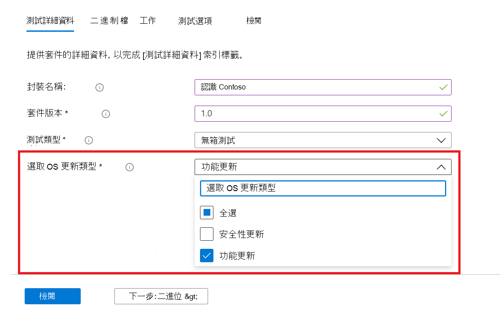
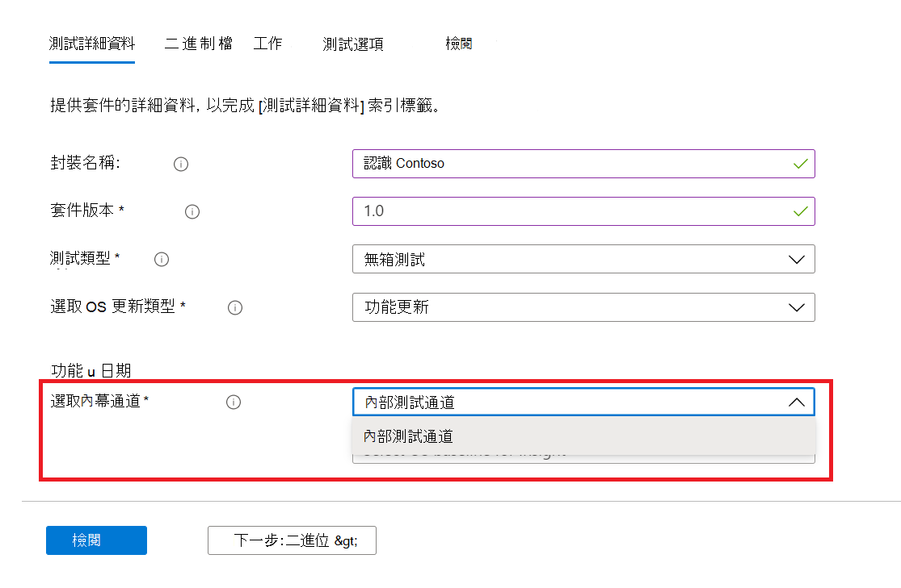
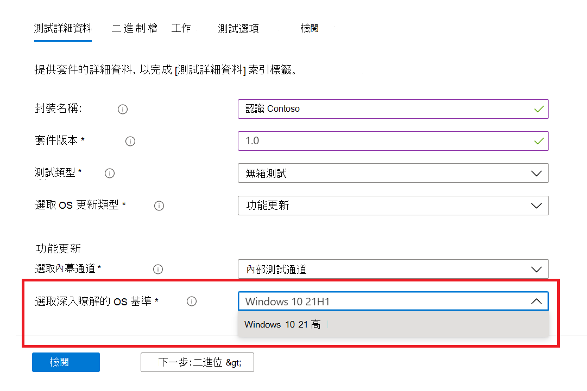

# <a name="windows-feature-update-validation"></a>Windows功能更新驗證

您需要深入瞭解應用程式如何在下一版的 Windows 10 或 Windows 11 中執行，而不需要維護環境來驗證新的 Windows 功能？ 

您是否要針對 Azure 環境中 Windows 的內幕程式組建執行驗證測試？

M365 測試基底的 **功能更新** 驗證可協助您取得所有這些和更多！

請參閱下列逐步概述，以瞭解如何在 M365 服務的測試基底存取這項新功能。

若要開始使用 ```Feature update validation``` M365 的測試基底，請透過自助上架入口網站，將您的應用程式) 上傳 (和相關檔案。 

下列已反白顯示 **測試詳細資料** 時所需採取的步驟：

1. 選取 [ **功能更新** ] 做為您的作業系統更新類型：



2. 選擇您要驗證應用程式的 Windows 有問必答通道。  



3. 選取 Windows 10 或 Windows 11 的內部發行版本本，做為測試 (和產生的真知灼見！ ) 的基準，並提供成功上架所需的其他詳細資料。



4. 若要查看您的應用程式驗證是否符合預先發行 Windows 10 功能更新的結果，請造訪 ```Feature Updates Test Results``` 。


## <a name="next-steps"></a>後續步驟

繼續進行下一篇文章，開始瞭解記憶體迴歸分析。
> [!div class="nextstepaction"]
> [下一步](memory.md)

<!---
Add button for next page
-->
