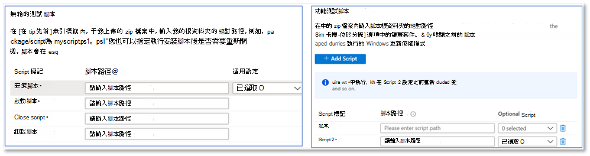
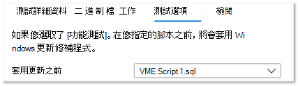

# <a name="functional-testing"></a><span data-ttu-id="5b209-103">功能測試</span><span class="sxs-lookup"><span data-stu-id="5b209-103">Functional testing</span></span>

<span data-ttu-id="5b209-104">就像是軟體廠商，您現在可以使用您選擇的測試架構（透過 M365 入口網站的自助測試基底）來執行自訂功能測試。</span><span class="sxs-lookup"><span data-stu-id="5b209-104">As a software vendor, you can now perform custom functional tests, using the test framework of your choice - via the self-serve Test Base for M365 portal.</span></span> 

<span data-ttu-id="5b209-105">當我們初次啟動服務時，我們提供了現成的測試，也就是透過標準化腳本驅動的預先定義的測試集。</span><span class="sxs-lookup"><span data-stu-id="5b209-105">When we initially launched the service, we offered the Out-of-box tests, which is a pre-defined set of tests driven through standardized scripting.</span></span> <span data-ttu-id="5b209-106">不過，您無法在許多獨立軟體廠商 (Isv) 上達成完整的測試範圍。</span><span class="sxs-lookup"><span data-stu-id="5b209-106">This, however, could not achieve full test coverage for many Independent Software Vendors (ISVs).</span></span> 

<span data-ttu-id="5b209-107">因此，為了回應您的意見反應，我們提供的 Isv 具有上傳自動功能測試的能力。</span><span class="sxs-lookup"><span data-stu-id="5b209-107">Hence, in response to your feedback, we are providing our ISVs with the ability to upload automated functional tests.</span></span>

<span data-ttu-id="5b209-108">若要使用此功能，請遵循下列步驟：</span><span class="sxs-lookup"><span data-stu-id="5b209-108">To use this feature, follow the steps below:</span></span>

1. <span data-ttu-id="5b209-109">Upload 檔案 (二進位檔案、相依性及腳本) 為單一 .zip 套件。</span><span class="sxs-lookup"><span data-stu-id="5b209-109">Upload your files (binaries, dependencies and scripts) as a single .zip package.</span></span>
2. <span data-ttu-id="5b209-110">選擇是否要在執行的各個執行點重新開機測試虛擬機器 (Vm) 。</span><span class="sxs-lookup"><span data-stu-id="5b209-110">Choose if you want to reboot the test Virtual Machines (VMs) at various points of execution.</span></span>
3. <span data-ttu-id="5b209-111">管理腳本的可用選項。</span><span class="sxs-lookup"><span data-stu-id="5b209-111">Manage available options for your scripts.</span></span>
4. <span data-ttu-id="5b209-112">選擇要在執行期間何時套用 VM 上的 Windows 更新。</span><span class="sxs-lookup"><span data-stu-id="5b209-112">Choose when to apply the Windows update on the VM during execution.</span></span>

<span data-ttu-id="5b209-113">下列步驟的詳細描述如下所示：</span><span class="sxs-lookup"><span data-stu-id="5b209-113">Detailed descriptions of the above steps are highlighted below:</span></span>

<span data-ttu-id="5b209-114">**Upload 功能測試套件**</span><span class="sxs-lookup"><span data-stu-id="5b209-114">**Upload a functional test package**</span></span>

<span data-ttu-id="5b209-115">若要開始，請流覽至 [Upload] 頁面，在 Azure 中的 M365 入口網站的左側流覽功能表上，選取 [應用程式目錄] 中的 [Upload 新的應用程式]。</span><span class="sxs-lookup"><span data-stu-id="5b209-115">To get started, navigate to the Upload page, select Upload new application under Application catalog on the left-side navigation menu of the Test Base for M365 portal in Azure.</span></span> <span data-ttu-id="5b209-116">來源：</span><span class="sxs-lookup"><span data-stu-id="5b209-116">From there:</span></span>

<span data-ttu-id="5b209-117">Tab 鍵 1-輸入基本資訊。</span><span class="sxs-lookup"><span data-stu-id="5b209-117">Tab 1 - Enter basic information.</span></span> <span data-ttu-id="5b209-118">提供應用程式的名稱和版本。</span><span class="sxs-lookup"><span data-stu-id="5b209-118">Provide the name and version of your application.</span></span> <span data-ttu-id="5b209-119">在 [測試類型] 選項中，選取 ```Functional tests``` 。</span><span class="sxs-lookup"><span data-stu-id="5b209-119">In the Type of test option, select ```Functional tests```.</span></span> 

<span data-ttu-id="5b209-120">*請注意，default Out-of-Box (OOB) 選項是預設必要的。*</span><span class="sxs-lookup"><span data-stu-id="5b209-120">*Note that the Out-of-Box (OOB) option is required by default.*</span></span>


![選取 [功能測試] 索引標籤](Media/functional_testing_tab1.png)

<span data-ttu-id="5b209-122">索引標籤 2-透過將 zip 檔案上傳至整個測試 (二進位檔案、相依性、腳本等) 來 Upload 套件的元件。</span><span class="sxs-lookup"><span data-stu-id="5b209-122">Tab 2 - Upload the components of your package by uploading a zip file with your entire test (binaries, dependencies, scripts etc).</span></span> 

<span data-ttu-id="5b209-123">如需詳細資訊，請參閱 aka.ms/usl-package-outline。</span><span class="sxs-lookup"><span data-stu-id="5b209-123">See aka.ms/usl-package-outline for details.</span></span> <span data-ttu-id="5b209-124"> (注意： Out-of-Box 測試腳本和功能測試內容都應該置於相同的 zip 檔案) 中。</span><span class="sxs-lookup"><span data-stu-id="5b209-124">(Note: Both the Out-of-Box test scripts and the Functional test contents should be placed into the same zip file).</span></span> <span data-ttu-id="5b209-125">目前檔案大小限制為2GB。</span><span class="sxs-lookup"><span data-stu-id="5b209-125">Currently, the file size is limited to 2GB.</span></span>

<span data-ttu-id="5b209-126">索引標籤 3-設定 Out-of-Box 和功能測試工作。</span><span class="sxs-lookup"><span data-stu-id="5b209-126">Tab 3 - Configure the Out-of-Box and Functional test tasks.</span></span> <span data-ttu-id="5b209-127">在這裡，選擇 (s) 的路徑，以安裝、啟動、關閉和卸載應用程式 (Out-of-Box) 以及您的所有自訂腳本執行您的功能測試的 () 的 PowerShell 腳本。</span><span class="sxs-lookup"><span data-stu-id="5b209-127">Here, choose the path(s) to the PowerShell scripts that will install, launch, close, and uninstall your application (for Out-of-Box) as well as the path(s) to all your custom scripts to perform your functional test.</span></span> <span data-ttu-id="5b209-128">**(注意：卸載應用程式的腳本是選用的) 。**</span><span class="sxs-lookup"><span data-stu-id="5b209-128">**(Note: A script to uninstall your application is optional).**</span></span>

<span data-ttu-id="5b209-129">目前，您可以上傳1到8個腳本，以進行功能測試。</span><span class="sxs-lookup"><span data-stu-id="5b209-129">Currently, you can upload between 1 and 8 scripts for your functional tests.</span></span> <span data-ttu-id="5b209-130">如果您需要更多腳本， (請貼上批註！ ) </span><span class="sxs-lookup"><span data-stu-id="5b209-130">(Kindly comment on this post if you need more scripts!)</span></span>



<span data-ttu-id="5b209-132"> (選用) 設定安裝後的重新開機。</span><span class="sxs-lookup"><span data-stu-id="5b209-132">(Optional) Configure a restart after installation.</span></span> <span data-ttu-id="5b209-133">某些應用程式需要在安裝之後重新開機。</span><span class="sxs-lookup"><span data-stu-id="5b209-133">Some applications require a restart after installation.</span></span> 

<span data-ttu-id="5b209-134">```Reboot After Execution```如果您想要在執行該腳本之後重新開機，請選取 [任務] 索引標籤中的特定腳本。</span><span class="sxs-lookup"><span data-stu-id="5b209-134">Select ```Reboot After Execution``` for the specific Script in the Tasks tab if you would like a restart to be conducted after the execution of that script.</span></span>

<span data-ttu-id="5b209-135">索引標籤 4-選擇何時安裝 Windows 更新： Windows 更新修補程式的應用程式會在您選擇的任何腳本之前完成。</span><span class="sxs-lookup"><span data-stu-id="5b209-135">Tab 4 - Choose when the Windows update gets installed: The application of the Windows Update patch is done before any script of your choice.</span></span> <span data-ttu-id="5b209-136">建議您在應用程式安裝之後安裝 Windows 更新，以密切模仿實際應用程式使用案例。</span><span class="sxs-lookup"><span data-stu-id="5b209-136">It is recommended that you install a Windows update after the application's installation to closely mimic your real-world application use scenarios.</span></span>



<span data-ttu-id="5b209-138">Tab 5-檢查並建立套件。</span><span class="sxs-lookup"><span data-stu-id="5b209-138">Tab 5 - Review and create the package.</span></span> <span data-ttu-id="5b209-139">完成上述步驟之後，請選取 ```Create``` [完成上傳程式]。</span><span class="sxs-lookup"><span data-stu-id="5b209-139">Once you have completed the steps listed above, select ```Create``` to finish the uploading process.</span></span>

<span data-ttu-id="5b209-140">建立套件之後，您可以檢查套件的驗證狀態。</span><span class="sxs-lookup"><span data-stu-id="5b209-140">Once your package has been created, you can check the verification status of your package.</span></span>

<span data-ttu-id="5b209-141">我們會執行初始測試，以安裝、啟動、關閉和卸載應用程式。</span><span class="sxs-lookup"><span data-stu-id="5b209-141">We run an initial test to install, launch, close, and uninstall your application.</span></span> <span data-ttu-id="5b209-142">這可讓我們驗證套件是否可以在服務上安裝錯誤。</span><span class="sxs-lookup"><span data-stu-id="5b209-142">This allows us to verify that your package can install on our service error-free.</span></span>

<span data-ttu-id="5b209-143">驗證程式最多可能需要24小時。</span><span class="sxs-lookup"><span data-stu-id="5b209-143">The verification process could take up to 24 hours.</span></span> <span data-ttu-id="5b209-144">驗證完成後，您可以在功能表上看到 [狀態] ```Manage packages``` ，這是兩個專案之一：</span><span class="sxs-lookup"><span data-stu-id="5b209-144">Once verification is complete, you can see the status in the ```Manage packages``` menu, which would be one of two entries:</span></span>

1. <span data-ttu-id="5b209-145">驗證成功：套件將會針對您選取的 OS 組建，自動測試發行 Windows。</span><span class="sxs-lookup"><span data-stu-id="5b209-145">Verification succeeds: The package will be automatically tested against pre-release Windows updates for the OS builds you selected.</span></span>
<span data-ttu-id="5b209-146">或</span><span class="sxs-lookup"><span data-stu-id="5b209-146">or</span></span>
2. <span data-ttu-id="5b209-147">驗證失敗：您將需要調查失敗的原因，修正問題，然後重新上傳您的套件。</span><span class="sxs-lookup"><span data-stu-id="5b209-147">Verification fails: You will need to investigate the reasons for the failure, fix the issue, and re-upload your package.</span></span>

<span data-ttu-id="5b209-148">您也會透過 Azure 入口網站中的通知圖示，通知您結果。</span><span class="sxs-lookup"><span data-stu-id="5b209-148">You will also be notified of either outcome via the notification icon in the Azure portal.</span></span>
