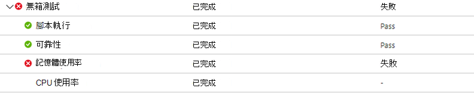
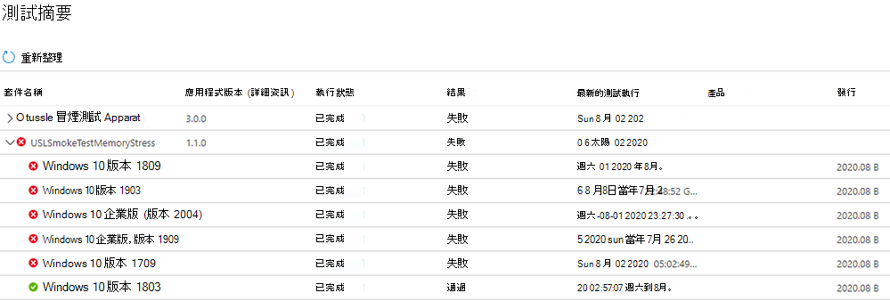
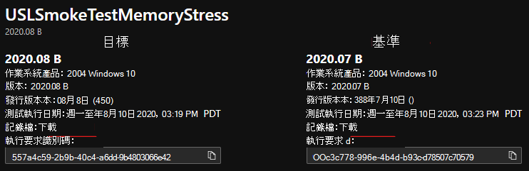

# <a name="memory-regression-analysis"></a>記憶體迴歸分析

測試基礎可協助您更清楚地發現執行應用程式之測試 Vm 中的嚴重記憶體使用量增加。 效能度量（如記憶體使用量）可以表示整體應用程式健康情況，我們相信這項新增會極大地協助讓您的應用程式以最佳效能執行。

請繼續閱讀以取得更多詳細資料或觀看這段影片，快速流覽最新的增強功能。 

如需 M365's 的測試基礎，以協助迴歸分析的詳細資訊，請參閱根據進程可靠性的回歸結果。

<b>深入查看記憶體回歸</b>

M365 儀表板的測試基底會顯示應用程式在新的預先發行的 Windows 更新上使用的記憶體，並與上次發行 Windows 更新所使用的記憶體進行比較。 

使用此月份的增強功能時，記憶體迴歸分析現在會集中在您的 favorited 處理常式中。 應用程式可以包含多個進程，您可以透過 [可靠性] 索引標籤手動選取您最喜歡的處理常式。我們的服務會在這些 favorited 處理常式中識別記憶體回歸，同時將測試執行與不同的 Windows 更新版本進行比較。 如果偵測到回歸，便可輕鬆使用回歸的詳細資料。

現在，讓我們詳細瞭解這項功能，並討論如何使用 Windows 效能分析器來疑難排解記憶體回歸。

記憶體回歸所引發的失敗信號會顯示在 [記憶體使用量] 底下的 [測試結果] 頁面的 [M365] 儀表板的 [測試基底] 中。




因記憶體使用量較高導致應用程式失敗，也會顯示 ```Fail``` 在 [測試摘要] 頁面上：



透過提供這些失敗信號，我們的目標是明確標示可能會中斷和影響應用程式使用者體驗的潛在問題。 

然後，您可以下載記錄檔，並使用 Windows 效能分析器（或您慣用的工具箱）進行進一步調查。 您也可以與 M365 小組的測試基底合作，以修正問題，並協助避免影響使用者的問題。

在 M365 service 之測試基底的 [記憶體使用量] 索引標籤中，會捕獲所有測試執行的記憶體信號。 下列範例顯示的是最近的測試執行，針對《發行前8月2020安全性更新」的架應用程式「冒煙測試記憶體壓力」。  (這個應用程式是由小組編寫，用以說明記憶體回歸。 ) 


在此範例中，最愛使用的處理常式 "USLTestMemoryStress.exe" 處理常式會在發行的7月更新中平均使用大約 100 MB，因此 M365 的測試基底會識別回歸。 

其他進程（如這裡所示）是「USLTestMemoryStress_Aux1.exe」和「USLTestMemoryStress_Aux2.exe」，也屬於同一個應用程式，但在兩個版本中佔用的記憶體量大致相同，所以它們已被視為「已傳遞」，且被視為狀況良好。

主要程式的退化決定是「統計重要」，所以服務會進行通訊並反白顯示此與使用者的差異。 如果比較的統計不重要，將不會反白顯示。 記憶體使用量可能會有噪音，所以我們使用統計模型來區分各組建和發行，與 inconsequential 差異有意義的差異。 

當 (誤報) 沒有真正差異時，比較可能很少會被標記，但這是必要的折衷，以提升正確識別回歸 (或 true 正值的可能性。 ) 

下一步是瞭解導致記憶體回歸的原因。 您可以從 [下載記錄檔] 選項下載這兩個執行的 zip 檔案，如下所示。 

這些 zip 檔案包含測試執行的結果，其中包括 ETL 檔案中所包含的腳本結果和記憶體及 CPU 效能資料。



您可以下載和解壓縮兩個測試執行的記錄檔，然後找出每個資料夾中的 ETL 檔案，並將其重新命名為 target (。測試執行的測試執行) 和基線)  (上的測試執行，以簡化勘探及導覽。
 
## <a name="next-steps"></a>後續步驟

若要開始深入瞭解智慧 CPU 迴歸分析，請繼續進行下一篇文章。
> [!div class="nextstepaction"]
> [下一步](cpu.md)

<!---
Add button for next page
-->
