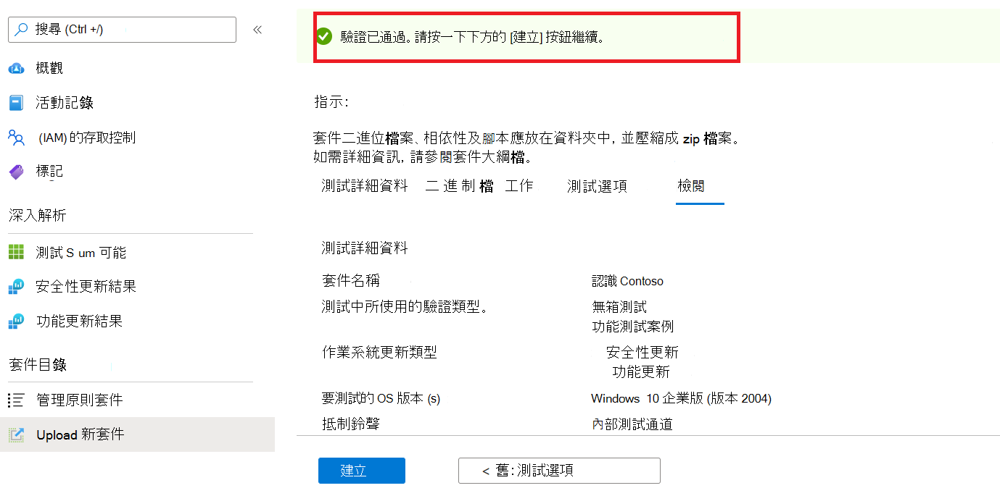
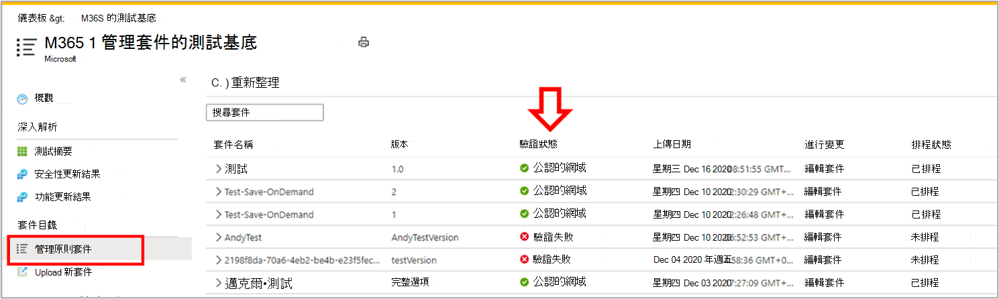

# <a name="step-6-review-your-selections-to-create-your-package"></a><span data-ttu-id="89346-103">步驟6：檢查您的選擇以建立套件。</span><span class="sxs-lookup"><span data-stu-id="89346-103">Step 6: Review your selections to create your package.</span></span>

1.  <span data-ttu-id="89346-104">在此索引標籤上，服務會顯示您的測試詳細資料，並執行快速完整性檢查。</span><span class="sxs-lookup"><span data-stu-id="89346-104">On this tab, the service displays your test details and runs a quick completeness check.</span></span> 

    <span data-ttu-id="89346-105">A ```Validation passed``` 或 ```Validation failed``` message 顯示是否可以繼續進行下一個步驟。</span><span class="sxs-lookup"><span data-stu-id="89346-105">A ```Validation passed``` or ```Validation failed``` message shows whether you can proceed to next steps or not.</span></span>

2.  <span data-ttu-id="89346-106">請複查您的測試詳細資料，如果滿意，請按一下 ```Create``` 按鈕。</span><span class="sxs-lookup"><span data-stu-id="89346-106">Review your test details and if satisfied, click on the ```Create``` button.</span></span> 



3.  <span data-ttu-id="89346-108">這會將套件上架到測試基底環境。</span><span class="sxs-lookup"><span data-stu-id="89346-108">This will onboard your package to the Test Base environment.</span></span> <span data-ttu-id="89346-109">如果您已成功建立套件，則會觸發 verifys 您套件是否可以在 Azure 上成功執行的自動測試。</span><span class="sxs-lookup"><span data-stu-id="89346-109">If your package is successfully created, an automated test which verifys whether your package can be successfully executed on Azure will be triggered.</span></span>


> [!Note]
> <span data-ttu-id="89346-111">您將會收到 Azure 入口網站的通知，以在套件驗證成功或失敗時通知您。</span><span class="sxs-lookup"><span data-stu-id="89346-111">You will get a notification from the Azure portal to notify you on the success or failure of the package verification.</span></span> 
>
> <span data-ttu-id="89346-112">請注意，此程式最多可能需要24小時，因此如果您的網頁不在使用中，則您的網頁很可能會超時，但通知將不會通知您已完成該隨選即用。</span><span class="sxs-lookup"><span data-stu-id="89346-112">Please note that the process can take up to 24 hours, so it is likely your webpage will timeout if you are not active on it and hence, the notification will not inform you of the completion of this on-demand run.</span></span> 

  - <span data-ttu-id="89346-113">Peradventure 在這種情況下，您可以在索引標籤上查看套件的狀態 ```Manage packages``` 。</span><span class="sxs-lookup"><span data-stu-id="89346-113">Peradventure this happens, you can view the status of your package on the ```Manage packages``` tab.</span></span>



  - <span data-ttu-id="89346-115">若要取得成功的測試，其結果可以透過及排程的間隔來查看，您可以在 ```Test Summary``` ```Security Updates Results``` ```Feature Updates Results``` 上傳的幾天之後經常開始。</span><span class="sxs-lookup"><span data-stu-id="89346-115">For succesful tests, their results can be seen via the ```Test Summary```, ```Security Updates Results``` and ```Feature Updates Results``` pages at scheduled intervals, often starting a few days after your upload.</span></span>
  
  - <span data-ttu-id="89346-116">測試失敗時，需要您上傳新的套件。</span><span class="sxs-lookup"><span data-stu-id="89346-116">While failed tests, require you to upload a new package.</span></span> 
  
    <span data-ttu-id="89346-117">您可以從「 ```test logs``` 和頁面下載進行進一步的 ```Security update results``` 分析 ```Feature updates results``` 。</span><span class="sxs-lookup"><span data-stu-id="89346-117">You can download the ```test logs``` for further analysis from the ‘```Security update results``` and ```Feature updates results``` pages.</span></span>

  - <span data-ttu-id="89346-118">如果您經歷重複的測試失敗，請與您的錯誤詳細資料聯繫 testbasepreview@microsoft.com。</span><span class="sxs-lookup"><span data-stu-id="89346-118">If you experience repeated test failures, please reach out to testbasepreview@microsoft.com with details of your error.</span></span> 

## <a name="next-steps"></a><span data-ttu-id="89346-119">後續步驟</span><span class="sxs-lookup"><span data-stu-id="89346-119">Next steps</span></span>

<span data-ttu-id="89346-120">透過下列連結探索我們的內容指導方針。</span><span class="sxs-lookup"><span data-stu-id="89346-120">Discover our Content Guidelines via the link below.</span></span>
> [!div class="nextstepaction"]
> [<span data-ttu-id="89346-121">下一步</span><span class="sxs-lookup"><span data-stu-id="89346-121">Next step</span></span>](contentguideline.md)
