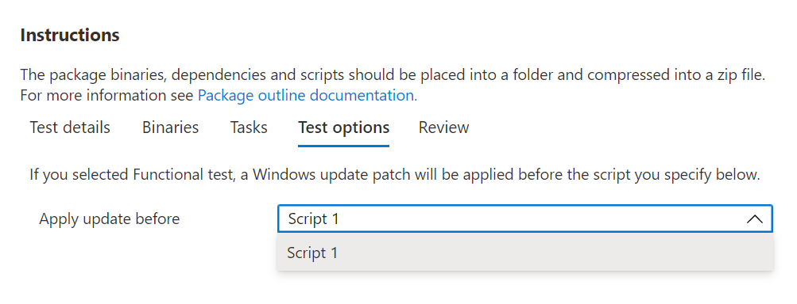

# <a name="step-5-choose-your-test-options"></a><span data-ttu-id="e6d4b-103">步驟5：選擇您的測試選項。</span><span class="sxs-lookup"><span data-stu-id="e6d4b-103">Step 5: Choose your test options.</span></span> 

<span data-ttu-id="e6d4b-104">此索引卷 ```Test Options``` 標供想要執行功能測試的使用者，用來指出何時應依序套用執行其功能測試腳本的順序來執行 Windows 更新修補程式。</span><span class="sxs-lookup"><span data-stu-id="e6d4b-104">The ```Test Options``` tab is for users who wish to perform functional tests to indicate when the Windows Update patch should be applied in the sequence of executing their functional test scripts.</span></span>



<span data-ttu-id="e6d4b-107">選取 [ _**檢查**_ ] 以流覽至下一個索引標籤，並複查選取的測試選項。</span><span class="sxs-lookup"><span data-stu-id="e6d4b-107">Select _**Review**_ to navigate to the next tab and review your selected test options.</span></span>

## <a name="next-steps"></a><span data-ttu-id="e6d4b-108">後續步驟</span><span class="sxs-lookup"><span data-stu-id="e6d4b-108">Next steps</span></span>

<span data-ttu-id="e6d4b-109">您可以從下列連結的下一篇文章中看到的「嵌套」步驟的詳細資料：</span><span class="sxs-lookup"><span data-stu-id="e6d4b-109">Details of the nest step can be seen in the next article via the link below:</span></span>
> [!div class="nextstepaction"]
> [<span data-ttu-id="e6d4b-110">下一步</span><span class="sxs-lookup"><span data-stu-id="e6d4b-110">Next step</span></span>](review.md)
