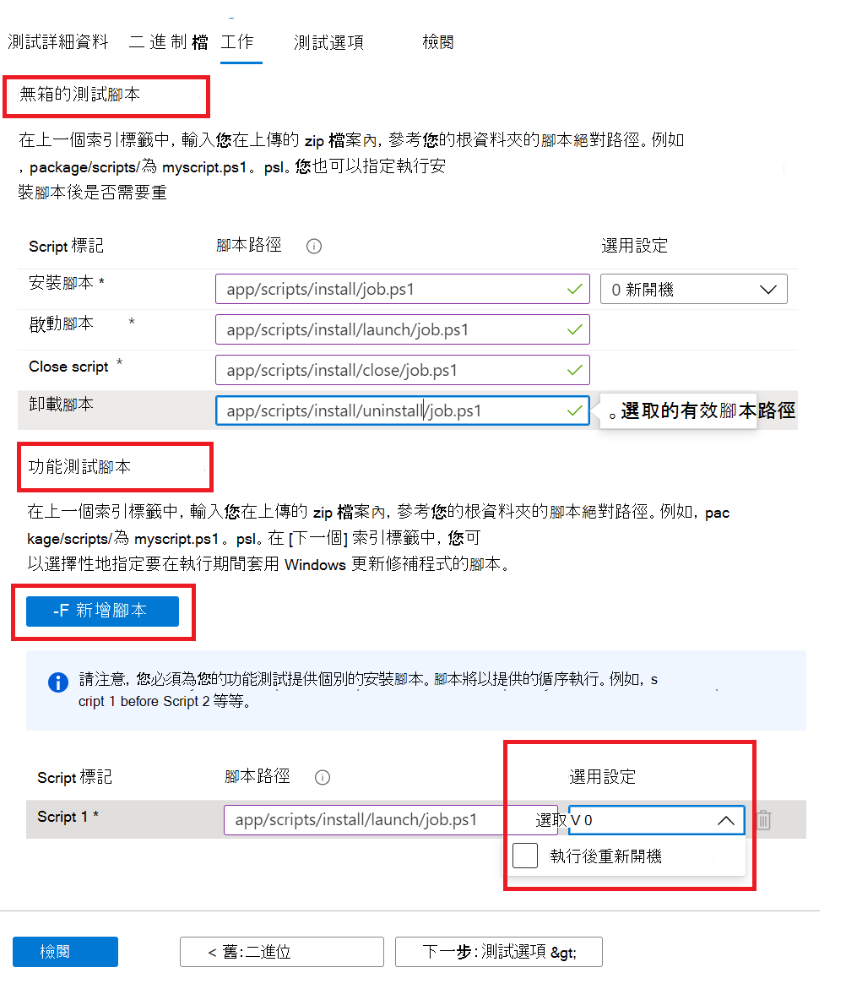

# <a name="step-4-the-tasks-tab"></a><span data-ttu-id="62d33-103">步驟4： [任務] 索引標籤</span><span class="sxs-lookup"><span data-stu-id="62d33-103">Step 4: The tasks tab</span></span>

<span data-ttu-id="62d33-104">在 [任務] 索引標籤上，您會在 [二進位] 索引標籤底下的 [zip] 資料夾中，提供您測試腳本的路徑。</span><span class="sxs-lookup"><span data-stu-id="62d33-104">On the tasks tab, you are expected to provide the paths to your test scripts which are in the zip folder you uploaded under the binaries tab.</span></span>

  - <span data-ttu-id="62d33-105">無 **箱的測試腳本：** 輸入您安裝、啟動、關閉及卸載腳本的相對路徑。</span><span class="sxs-lookup"><span data-stu-id="62d33-105">**Out of Box Test Scripts:** Type in the relative paths to your install, launch, close and uninstall scripts.</span></span> <span data-ttu-id="62d33-106">您也可以選擇安裝腳本的其他設定。</span><span class="sxs-lookup"><span data-stu-id="62d33-106">You also have the option to select additional settings for the install script.</span></span>
  - <span data-ttu-id="62d33-107">**功能測試腳本：** 輸入每個已上傳的功能測試腳本的相對路徑。</span><span class="sxs-lookup"><span data-stu-id="62d33-107">**Functional Test Scripts:** Type in the relative path to each functional test script uploaded.</span></span> <span data-ttu-id="62d33-108">您可以使用按鈕新增其他功能測試腳本 ```Add Script``` 。</span><span class="sxs-lookup"><span data-stu-id="62d33-108">Additional functional test scripts can be added using the ```Add Script``` button.</span></span> <span data-ttu-id="62d33-109">您至少需要一個 (1) 腳本，最多可以新增八個 (8) 功能測試腳本。</span><span class="sxs-lookup"><span data-stu-id="62d33-109">You need a minimum of one (1) script and can add up to eight (8) functional test scripts.</span></span> 
  
    <span data-ttu-id="62d33-110">腳本會在上傳順序中執行，在特定腳本中的失敗將會停止執行後續的腳本。</span><span class="sxs-lookup"><span data-stu-id="62d33-110">The scripts are run in upload sequence and a failure in a particular script will stop subsequent scripts from executing.</span></span>
    <span data-ttu-id="62d33-111">您也可以選擇為每個提供的腳本選取其他設定。</span><span class="sxs-lookup"><span data-stu-id="62d33-111">You also have the option of selecting additional settings for each script provided.</span></span>

## <a name="set-script-path"></a><span data-ttu-id="62d33-112">設定腳本路徑</span><span class="sxs-lookup"><span data-stu-id="62d33-112">Set script path</span></span>



<span data-ttu-id="62d33-114">如何在下列位置提供資料夾結構的相對路徑的範例：</span><span class="sxs-lookup"><span data-stu-id="62d33-114">Sample of how to provide the relative path on a folder structure is below:</span></span>

<span data-ttu-id="62d33-115">_**Zip_file_uploaded**_</span><span class="sxs-lookup"><span data-stu-id="62d33-115">_**Zip_file_uploaded**_</span></span>
~~~
├── file1.exe

├── ScriptX.ps1

├── folder1

│   ├── file3.exe

│   ├── script.ps1
~~~
  - <span data-ttu-id="62d33-116">**ScriptX.ps1** 會有。</span><span class="sxs-lookup"><span data-stu-id="62d33-116">**ScriptX.ps1** would have.</span></span> <span data-ttu-id="62d33-117">_ScriptX.ps1_ 做為相對路徑。</span><span class="sxs-lookup"><span data-stu-id="62d33-117">_ScriptX.ps1_ as the relative path.</span></span>
  - <span data-ttu-id="62d33-118">**Script.ps1** 會將 _folder1/script.ps1_ 當做相對路徑。</span><span class="sxs-lookup"><span data-stu-id="62d33-118">**Script.ps1** would have _folder1/script.ps1_ as the relative path.</span></span>


## <a name="next-steps"></a><span data-ttu-id="62d33-119">後續步驟</span><span class="sxs-lookup"><span data-stu-id="62d33-119">Next steps</span></span>

<span data-ttu-id="62d33-120">查看下一篇文章中 [測試選項] 索引標籤的詳細資料</span><span class="sxs-lookup"><span data-stu-id="62d33-120">View details of the Test Options tab in the next article</span></span> 
> [!div class="nextstepaction"]
> [<span data-ttu-id="62d33-121">下一步</span><span class="sxs-lookup"><span data-stu-id="62d33-121">Next step</span></span>](testoptions.md)
