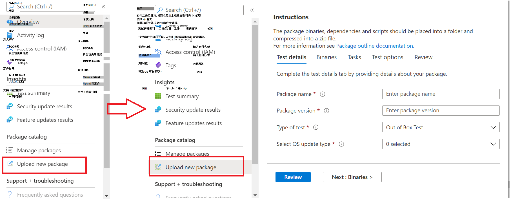
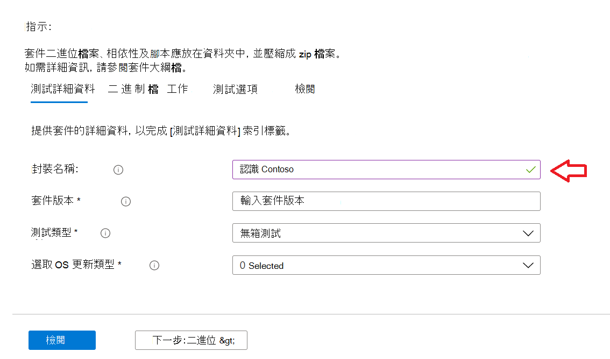
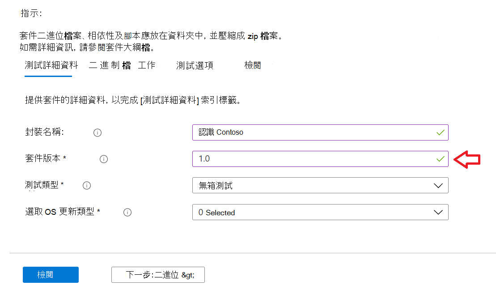
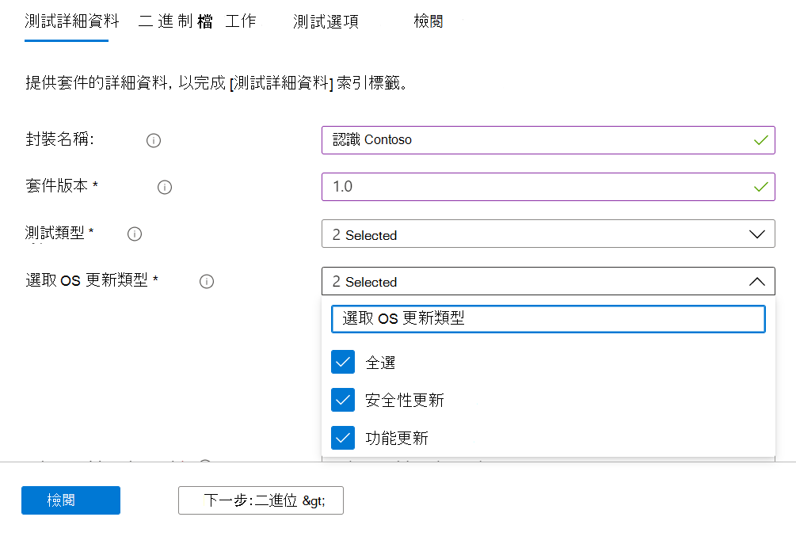
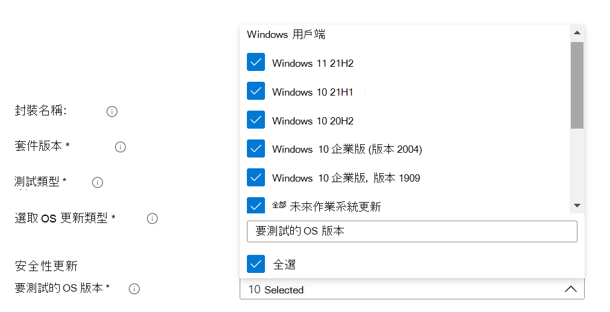
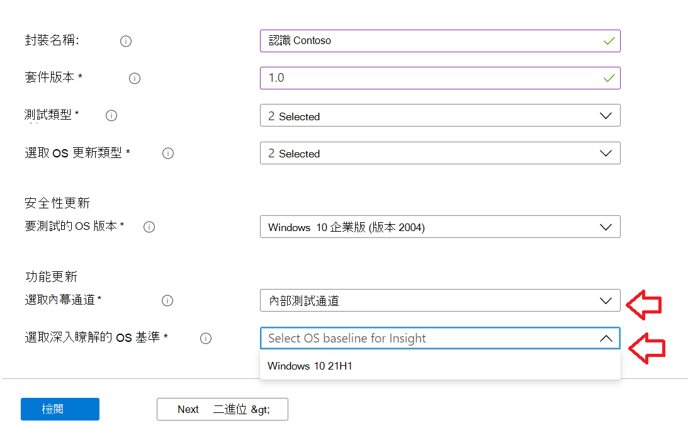
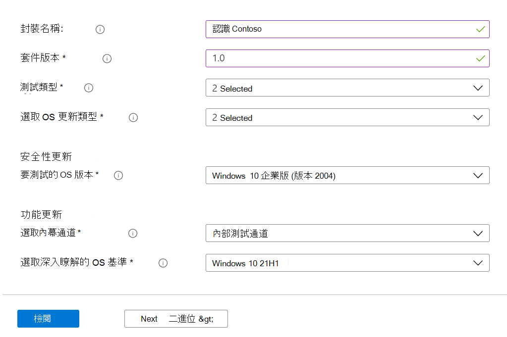

# <a name="step-2-uploading-a-package"></a><span data-ttu-id="b13bb-103">步驟2：上傳套件</span><span class="sxs-lookup"><span data-stu-id="b13bb-103">Step 2: Uploading a Package</span></span>

<span data-ttu-id="b13bb-104">在 [測試基本入口網站] 頁面上，流覽至左導覽列中的「Upload 新套件選項」，如下所示： </span><span class="sxs-lookup"><span data-stu-id="b13bb-104">On the Test Base portal page, navigate to the ‘Upload new package option on the left navigation bar as shown below: </span></span>

<span data-ttu-id="b13bb-105">請遵循下列步驟，上傳新的套件。</span><span class="sxs-lookup"><span data-stu-id="b13bb-105">Once there, follow the steps below to upload a new package.</span></span>

## <a name="enter-details-for-your-package"></a><span data-ttu-id="b13bb-106">輸入套件的詳細資料</span><span class="sxs-lookup"><span data-stu-id="b13bb-106">Enter details for your package</span></span>

<span data-ttu-id="b13bb-107">在 [測試詳細資料] 索引標籤上，輸入您的套裝軟體名稱、版本及其他詳細資料（如有要求）。</span><span class="sxs-lookup"><span data-stu-id="b13bb-107">On the Test details tab, type in your package's name, version and other details as requested.</span></span> 

<span data-ttu-id="b13bb-108">您可以透過此儀表板執行 **Out-of-Box** 和 **功能測試**。</span><span class="sxs-lookup"><span data-stu-id="b13bb-108">**Out-of-Box** and **Functional testing** can be done via this dashboard.</span></span>

<span data-ttu-id="b13bb-109">下列步驟提供如何填寫封裝詳細資料的指南：</span><span class="sxs-lookup"><span data-stu-id="b13bb-109">The steps below provides a guide on how to fill out your package details:</span></span>

1.  <span data-ttu-id="b13bb-110">**在欄位中輸入要為您的套件提供的名稱 ```“Package name``` 。**</span><span class="sxs-lookup"><span data-stu-id="b13bb-110">**Enter the name to be given your package in the ```“Package name``` field.**</span></span>

> [!Note]  
> <span data-ttu-id="b13bb-111">輸入的套件名稱及版本組合在您的組織中必須是唯一的。</span><span class="sxs-lookup"><span data-stu-id="b13bb-111">The package name and version combination entered must be unique within your organization.</span></span> <span data-ttu-id="b13bb-112">這會透過如下所示的勾選標記加以驗證。</span><span class="sxs-lookup"><span data-stu-id="b13bb-112">This is validated by the checkmark as shown below.</span></span>
  
  - <span data-ttu-id="b13bb-113">如果您選擇重複使用套件的名稱，則其版本號碼必須是唯一的 (亦即，決不會搭配具有該特定名稱) 的套裝軟體一起使用。</span><span class="sxs-lookup"><span data-stu-id="b13bb-113">If you choose to re-use an package's name, then the version number must be unique (i.e. never been used with an package bearing that particular name).</span></span>
  - <span data-ttu-id="b13bb-114">如果套件名稱 + 版本的組合不會通過唯一性檢查，您將會看到錯誤訊息，其為 *"package with the package version"*。</span><span class="sxs-lookup"><span data-stu-id="b13bb-114">If the combination of the package name + version does not pass the uniqueness check, you will see an error message which reads, *“Package with this package version already exists”*.</span></span> 



2. <span data-ttu-id="b13bb-116">**在 [套件版本] 欄位中輸入版本。**</span><span class="sxs-lookup"><span data-stu-id="b13bb-116">**Enter a version in the “Package version” field.**</span></span>



3.  <span data-ttu-id="b13bb-118">**選取您要在此套件上執行的測試類型**</span><span class="sxs-lookup"><span data-stu-id="b13bb-118">**Select the type of test you want to run on this package**</span></span>

    <span data-ttu-id="b13bb-119">**Out-of-Box (OOB)** 測試會執行 *安裝*、*啟動*、*關閉* 和 *卸載* 套件。</span><span class="sxs-lookup"><span data-stu-id="b13bb-119">An **Out-of-Box (OOB)** test performs an *install*, *launch*, *close* and *uninstall* of your package.</span></span> <span data-ttu-id="b13bb-120">安裝之後，在執行單次卸載之前，會重複30次啟動關閉常式。</span><span class="sxs-lookup"><span data-stu-id="b13bb-120">After the install, the launch-close routine is repeated 30 times before a single uninstall is run.</span></span> 
    
    <span data-ttu-id="b13bb-121">這種 OOB 測試為您提供套件上的標準化遙測，以與各 Windows 建立進行比較。</span><span class="sxs-lookup"><span data-stu-id="b13bb-121">This OOB test provides you with standardized telemetry on your package to compare across Windows builds.</span></span>

    <span data-ttu-id="b13bb-122">**功能測試** 會執行您上傳的測試腳本 (s) 套件。</span><span class="sxs-lookup"><span data-stu-id="b13bb-122">A **Functional test** would execute your uploaded test script(s) on your package.</span></span> <span data-ttu-id="b13bb-123">腳本會在上傳順序中執行，在特定腳本中的失敗將會停止執行後續的腳本。</span><span class="sxs-lookup"><span data-stu-id="b13bb-123">The scripts are run in upload sequence and a failure in a particular script will stop subsequent scripts from executing.</span></span>

> [!Note]
> <span data-ttu-id="b13bb-124">**所有** 腳本最多執行80分鐘。</span><span class="sxs-lookup"><span data-stu-id="b13bb-124">**All** scripts run for 80 minutes at the most.</span></span> 
    
4.  <span data-ttu-id="b13bb-125">**選取作業系統更新類型**</span><span class="sxs-lookup"><span data-stu-id="b13bb-125">**Select the OS update type**</span></span>

   - <span data-ttu-id="b13bb-126">「安全性更新」可讓您的套件針對 Windows 發行每月的每月安全性更新的增量 churns 進行測試。</span><span class="sxs-lookup"><span data-stu-id="b13bb-126">The ‘Security updates’ enables your package to be tested against incremental churns of Windows pre-release monthly security updates.</span></span> 
   - <span data-ttu-id="b13bb-127">「功能更新」可讓您的套件隨 Windows Windows 的預覽體驗計畫一起更新的測試版本。</span><span class="sxs-lookup"><span data-stu-id="b13bb-127">The ‘Feature updates’ enables your package to be tested against Windows pre-release bi-annual feature updates builds from the Windows Insider Program.</span></span>
<!---
Change to the correct picture
-->


5.  <span data-ttu-id="b13bb-129">**選取作業系統版本 (s) 以進行安全性更新測試。**</span><span class="sxs-lookup"><span data-stu-id="b13bb-129">**Select the OS version(s) for Security update tests.**</span></span>

<span data-ttu-id="b13bb-130">在 [多重選取] 下拉式清單中，選取安裝套件的作業系統版本 (s) Windows。</span><span class="sxs-lookup"><span data-stu-id="b13bb-130">In the multi-select dropdown, select the OS version(s) of Windows your package will be installed on.</span></span> 

  - <span data-ttu-id="b13bb-131">若要測試您的套裝軟體只 Windows 用戶端作業系統，請從功能表清單中選取適用的 Windows 11 作業系統版本。</span><span class="sxs-lookup"><span data-stu-id="b13bb-131">To test your package against Windows Client OSes only, select the applicable Windows 11 OS versions from the menu list.</span></span>
  - <span data-ttu-id="b13bb-132">若要測試您的套裝軟體僅限 Windows Server os，請從功能表清單中選取適用的 Windows 伺服器作業系統版本。</span><span class="sxs-lookup"><span data-stu-id="b13bb-132">To test your package against Windows Server OSes only, select the applicable Windows Server OS versions from the menu list.</span></span>
  - <span data-ttu-id="b13bb-133">若要在 Windows 用戶端和伺服器作業系統上測試套件，請從功能表清單中選取 [所有適用的 os]。</span><span class="sxs-lookup"><span data-stu-id="b13bb-133">To test your package against Windows Client and Server OSes, select all applicable OSes from the menu list.</span></span> 

> [!Note]
> <span data-ttu-id="b13bb-134">如果您選擇針對伺服器和用戶端作業系統來測試您的套件，請確定套件是相容的，而且可以在這兩個作業系統上同時執行。</span><span class="sxs-lookup"><span data-stu-id="b13bb-134">If you select to test your package against both Server and Client OSes, please make sure that the package is compatible and can run on both OSes</span></span>



<!---
Change to the correct picture
-->
6.  <span data-ttu-id="b13bb-136">**選取功能更新測試的選項：**</span><span class="sxs-lookup"><span data-stu-id="b13bb-136">**Select options for Feature update tests:**</span></span>

  - <span data-ttu-id="b13bb-137">在 [選取會員通道] 選項上，選取 ```Windows Insider Program Channel``` 作為套件應測試的組建。</span><span class="sxs-lookup"><span data-stu-id="b13bb-137">On the option to “Select Insider Channel”, select the ```Windows Insider Program Channel``` as the build which your packages should be tested against.</span></span>
  
    <span data-ttu-id="b13bb-138">我們目前使用內部版本 flighted 中的組建。</span><span class="sxs-lookup"><span data-stu-id="b13bb-138">We currently use builds flighted in the Insider Beta Channel.</span></span>

  - <span data-ttu-id="b13bb-139">在 [選取要洞察的作業系統基準] 選項上，選取要用來比較測試結果的基準 Windows OS 版本。</span><span class="sxs-lookup"><span data-stu-id="b13bb-139">On the option to “Select OS baseline for Insight”, select the Windows OS version to be used as a baseline in comparing your test results.</span></span> 

> [!Note]
> <span data-ttu-id="b13bb-140">目前不支援伺服器作業系統的功能更新測試</span><span class="sxs-lookup"><span data-stu-id="b13bb-140">We DO NOT support Feature update testing for Server OSes at this time</span></span>
<!---
Note to actual note format for markdown
-->
<!---
Change to the correct picture
-->


7.  <span data-ttu-id="b13bb-142">已完成的測試詳細資料頁面應該如下所示：</span><span class="sxs-lookup"><span data-stu-id="b13bb-142">A completed Test details page should look like this:</span></span> 


## <a name="next-steps"></a><span data-ttu-id="b13bb-144">後續步驟</span><span class="sxs-lookup"><span data-stu-id="b13bb-144">Next steps</span></span>

<span data-ttu-id="b13bb-145">我們接下來的文章將把您的二進位檔案上傳至我們的提供者。</span><span class="sxs-lookup"><span data-stu-id="b13bb-145">Our next article covers Uploading your Binaries to our serivce.</span></span>
> [!div class="nextstepaction"]
> [<span data-ttu-id="b13bb-146">下一步</span><span class="sxs-lookup"><span data-stu-id="b13bb-146">Next step</span></span>](binaries.md)

<!---
Add button for next page
-->

